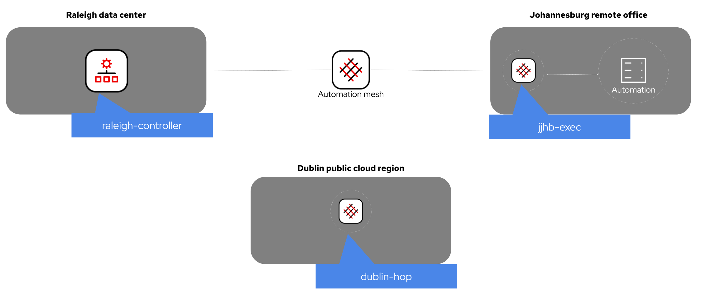

# Images for Instruqt

Instruqt will use GCP images tied to your GCP account.  For the MBU our account is named "Red Hat MBU" (slug is `red-hat-mbu`).

To figure out the name of images check out this link:
[GCP Images](https://cloud.google.com/compute/docs/images#list_of_public_images_available_on)

Under **GCP Console -> Compute Engine -> Storage -> Images**


## Image details

Image name | Description | connection | machine type | usage in challenge
--- | --- | --- | --- | ---
`red-hat-mbu/ansible` | cli Ansible on RHEL 8 | Root ssh keys already there<br>Able to SSH as user/pass: <br> `rhel` / `ansible123!` | `n1-standard-1` | `type: terminal`
`red-hat-mbu/automation-controller` [](https://github.com/ansible/instruqt/actions/workflows/controller-build.yml) | Automation controller on RHEL8 | `admin/ansible123!`<br>`student/learn_ansible` | n1-standard-4 | **Controller**: `type: service`, `port: 443`
`red-hat-mbu/arista-eos` | Arista EOS virtual switch | user / pass <br> `ansible` / `ansible123!` | `n1-standard-4` | *Terminal not supported yet. SSH from a linux node* |
`red-hat-mbu/cisco-ios-csr-1731` | Cisco IOS-XE virtual router | user / pass <br> `ansible` / `ansible123!` | `n1-standard-1` | *Terminal not supported yet. SSH from a linux node* |
`red-hat-mbu/windows` | Windows 2016 | SSH user/pass: `admin/Password123!` | `n1-standard-2` | *Terminal not supported yet. SSH from a linux node*
`red-hat-mbu/rhel8` [](https://github.com/ansible/instruqt/actions/workflows/rhel8-build.yml)  | RHEL 8 latest | none | `n1-standard-2` | none. Proposed to be used as up2date base image.
`red-hat-mbu/mesh-node` | Mesh worker base image | SSH user/pass: `rhel/ansible123!` | n1-standard-2 | none
`red-hat-mbu/dublin-hop-image` | Mesh hop node | SSH user/pass: `rhel/ansible123!` | n1-standard-2 | none
`red-hat-mbu/jhb-exec-image` | Mesh execution node | SSH user/pass: `rhel/ansible123!` | n1-standard-2 | none
`red-hat-mbu/raleigh-controller` | Mesh controller node | SSH user/pass: `rhel/ansible123!` | n1-standard-4 | `type: service, port: 443`

## Containers

Upstream container images can also be used. Please refer to the [Containers for Instruqt page](../containers/README.md)for examples.

## Setup-scripts

Everything contained in `ansible/setup-scripts` will be copied to the tmp dir on Tower when the image is built. These scripts are used to configure Tower for that particular exercise (e.g. remove all non windows modules from the adhoc drop down for windows tracks). Unfortunately, just dropping the playbooks into the challenge directory for that track and then running `ansible-playbook` from the bash script doesn't do it. This is temporary until figuring out something more elegant.

The idea here is that we can cut down on image configuration by configuring the instance for each track using ansible. The downside, if there's a lot of instance configuration needed, the startup time will suffer.

## Building images

The cloud of choice for Instruqt is GCP. Images are currently built on GCP using Packer. Install packer and gcloud on your workstation. You should now be able to login to gcloud using something like `gcloud auth application-default login`. [More info on GCP auth](https://cloud.google.com/sdk/gcloud/reference/auth/application-default).

Take a look at the packer files `*.pkr.hcl` for current images to get an idea of what is going on. Once your build file has been customized for your use case run `packer build your-image.pkr.hcl`. If your image already exists within the GCP project specified in the packer file, you can force the refresh of the image like so: `packer build --force your-image.pkr.hcl`

When creating a new track, you should be able to specify the path the new image using `project-name/image-name`

**High Level Diagram**:


## Extra vars file

Use the `ansible_vars_file` Packer variable enables you to use Ansible variable files outside the repo. Using external variable files helps prevent committing sensitive information into the repo. This variable is available in the  `automation-controller.pkr.hcl`, `ansible.pkr.hcl` and `mesh-node.pkr.hcl` packer build files. For example:

```packer build --force automation-controller.pkr.hcl -var ansible_vars_file="@<your_vars_file>"```

>**Note**<p>
> Your `extra_vars.yml` file contains sensitive information.<p>
> Ensure it's safe and excluded from repository pull requests and commits.<p>

### Example `extra_vars.yml` file

```yaml
# Extra vars example file for Instruqt automation mesh images

# Red Hat customer portal credentials
redhat_username: 'Your Red hat username'
redhat_password: 'Your Red Hat password'

# registry.redhat.io credentials
registry_username: 'Your registry username'
registry_password: 'Your registry password'

# access.redhat.com offline token. You can retrieve your token from https://access.redhat.com/management/api
offline_token: 'dswrfw8743rliuhfwiu444hweffw.....'
```

## Building automation controller

You are going to need two files in `instruqt/images/ansible`:

1. `offline_token.txt`

which is an offline token to download AAP from access.redhat.com.  This uses the `aap_download` role from the `ansible.workshops` collection.  You can retrieve the offline token from here: [https://access.redhat.com/management/api
](https://access.redhat.com/management/api)

2. `manifest.zip`

This is a license file to apply to AAP.  Please refer to this video by Colin McNaughton [https://www.youtube.com/watch?v=FYtilnsk7sM](https://www.youtube.com/watch?v=FYtilnsk7sM) to figure out how to get your manifest.zip

Place the `manifest.zip` in the `images\ansible` folder.

To execute packer run the following command->

```packer build --force automation-controller.pkr.hcl```

## Building automation mesh images

Automation mesh worker nodes are installed and configured during the automation controller installation. Due to this, building Instruqt images requires additional steps.



### Mesh file and directory structure

```text
.
├── images/
│   ├── ansible/
│   │   ├── templates/
│   │   │   └── "{{ track_slug }}"_inv.yml
│   │   └── vars/
│   │       └── "{{ track_slug }}"_vars.yml     # Vars file included in mesh lab playbooks.
│   └── "{{ track_slug }}"_node_setup.yml       # Playbook used in mesh-node.pkr.hcl Packer file.
└── packer/
    └── mesh-node.pkr.hcl                       # Builds mesh node base image with "{{ track_slug }}"_node_setup.yml.
```

#### The track_slug variable

File lookups and naming conventions use `track_slug` variable. Configure `track_slug` using the following methods. We'll use the `getting-started-edge-lab` slug as an example.

##### Set the `TRACK_SLUG` environment variable

Packer `mesh-node.pkr.hcl` and Ansible playbook `mesh-lab-install` uses the `TRACK_SLUG` environment variable.

```bash
export TRACK_SLUG='getting-started-edge-lab'
```

##### Add it as an extra variable in `ansible-playbook` command

```bash
ansible-playbook mesh-lab-install -e track_slug='getting-started-edge-lab'
```

##### Add it as an extra variable in `packer` command

```bash
packer build -force -var track_slug='getting-started-edge-lab' images/packer/mesh-node.pkr.hcl
```

### Mesh extra variables

Mesh node builds require additional variables to work and you can add them in multiple ways.

- `images/ansible/vars/"{{ track_slug }}_vars.yml` variables file. This file is imported in to mesh node Playbooks and Packer files.
- Packer `ansible_vars_file=@<your_vars_file>` variable. Useful to point variable files outside the repo
- Ansible playbook `-e @<your_vars_file>` argument. Useful to point variable files outside the repo.

You can set certain variables using optional environment variables. Useful to keep sensitive information out of the repo.

| **Ansible var**          | **Environment var**      |
|--------------------------|--------------------------|
| offline_token            | REDHAT_OFFLINE_TOKEN     |
| redhat_username          | REDHAT_USERNAME          |
| redhat_password          | REDHAT_PASSWORD          |
| gcp_service_account      | GCP_SERVICE_ACCOUNT      |
| gcp_service_account_file | GCP_SERVICE_ACCOUNT_FILE |
| gcp_project              | GCP_PROJECT              |

Mesh build playbooks check for certain mandatory variables before executing.

| **Variable**             | **Description**                                                                                                                            |
|--------------------------|--------------------------------------------------------------------------------------------------------------------------------------------|
| track_slug               | Instruqt track slug - e.g. getting-started-mesh-lab.                                                                                       |
| redhat_username          | Red Hat Customer Portal username.                                                                                                          |
| redhat_password          | Red Hat Customer Portal password.                                                                                                          |
| gcp_project              | GCP project to use. Defaults to `red-hat-mbu`.                                                                                             |
| offline_token            | Red Hat Customer Portal offline token. <br> <https://access.redhat.com/management/api>                                                            |
| gcp_service_account_file | Location of GCP service account file on local machine. <br> <https://cloud.google.com/iam/docs/creating-managing-service-account-keys>            |
| gcp_service_account      | GCP service account file - e.g. 234203-compute@developer.gserviceaccount.com <br> <https://cloud.google.com/compute/docs/access/service-accounts> |

The example below from [getting-started-edge-lab_vars.yml](./ansible/vars/getting-started-edge-lab_vars.yml) provides a guide to set up your variable file.

```yaml
# Ansible config vars - the need for speed
ansible_ssh_pipelining: true
ansible_ssh_extra_args: '-o StrictHostKeyChecking=no -o ControlMaster=auto -o ControlPersist=60s'

# GCP vars
gcp_zone: us-central1-a
gcp_project: "{{ lookup('ansible.builtin.env', 'GCP_PROJECT', default='red-hat-mbu') }}"
# https://cloud.google.com/iam/docs/creating-managing-service-account-keys
gcp_service_account_file: "{{ lookup('ansible.builtin.env', 'GCP_SERVICE_ACCOUNT_FILE', default='') }}"
# Example: 73252323203-compute@developer.gserviceaccount.com
gcp_service_account: "{{ lookup('ansible.builtin.env', 'GCP_SERVICE_ACCOUNT', default='') }}"
gcp_instances:
  - instance_name: dublin-edge-lab       # Temp GCE instance name
    instance_image: edge-lab-node        # Instruqt image name
    instance_labels:
      role: "{{ track_slug }}"
      mesh-type: execution               # Mesh node type. Used in {{ track_slug }}_inv.j2
      location: dublin                   # Mesh region. Used in {{ track_slug }}_inv.j2
    instance_machine_type: n2-standard-2 # GCE instance type
  - instance_name: jhb-edge-lab
    instance_image: edge-lab-node
    instance_labels:
      role: "{{ track_slug }}"
      mesh-type: execution
      location: jhb
    instance_machine_type: n2-standard-2
  - instance_name: controller-edge-lab
    instance_image: automation-controller
    instance_labels:
      role: "{{ track_slug }}"
      mesh-type: controller
      location: raleigh
    instance_machine_type: n2-standard-4
gcp_inventory_host_vars:
  ansible_user: "rhel"
  ansible_ssh_pass: "ansible123!"
  ansible_host_key_checking: false
  ansible_python_interpreter: "/usr/bin/python3"

# Base mesh lab setup vars
aap_dir: "/home/{{ ansible_user }}/aap_install"
admin_password: "{{ controller_password }}" # legacy for roles
username: "{{ ansible_user }}"
controller_install_command: "ANSIBLE_BECOME_METHOD='sudo' ANSIBLE_BECOME=True ./setup.sh -e registry_username='{{ registry_username }}' -e registry_password='{{ registry_password }}'" # noqa yaml[line-length]
offline_token: "{{ lookup('ansible.builtin.env', 'REDHAT_OFFLINE_TOKEN', default='') }}"
redhat_username: "{{ lookup('ansible.builtin.env', 'REDHAT_USERNAME', default='') }}"
redhat_password: "{{ lookup('ansible.builtin.env', 'REDHAT_PASSWORD', default='') }}"
registry_username: "{{ redhat_username }}"
registry_password: "{{ redhat_password }}"
# AAP 2.2.1 SHA
provided_sha_value: 878c2c2705e5f50e734f27fc7c50b39ddf4b2ace2d40290477d19477b82f9904
```

### Mesh node building steps

#### Step 1 - Create the mesh worker node base image using Packer

The mesh worker node base image is used to create mesh worker nodes during the controller install.

Run the following command from root repository folder. Optionally, point to external variable files using `-var mesh_extra_vars=@<your_vars_file>` option and set the `track_slug` variable using `-var track_slug=<your_track_slug>`.

```bash
packer build --force -var image_name=<worker_node_base_image> mesh-node.pkr.hcl
```

Here's an example used to create worker node base images for `getting-started-edge-lab`.

```bash
packer build --force -var image_name='edge-lab-node' -var track_slug='getting-started-edge-lab' mesh-node.pkr.hcl
```

#### Step 2 - Run the mesh lab installer using Ansible

The `mesh-lab-install.yml` Ansible playbook runs the AAP installer and configures mesh. The playbook performs the following tasks:

1. Creates GCP instances from their respective base images based on `gcp_instances` variable.
2. Installs automation controller and associated mesh worker nodes using `images/ansible/templates/{{ track_slug }}_inv.j2` inventory - e.g. `getting-started-edge-lab_inv.j2`
3. Creates new images based on `instance_image` variable in `gcp_instances`. Using the example in Step. 1, this would be `edge-lab-node`.
4. list and appends `-image` to the completed image name.
5. Deletes unused instances
6. Makes a cup of coffee if you ask nicely.

Execute the following command in the `images\ansible` folder to build the base mesh worker node images. Optionally, point to external variable files using `-e  @<your_vars_file>` option and set the `track_slug` variable using `-e track_slug=<your_track_slug>`.

Let's continue with the example in Step 1 used to create worker node base images for `getting-started-edge-lab`.

```bash
ansible-playbook mesh-generic-lab-install.yml -e track_slug='getting-started-edge-lab'
```

<br>

# Words of wisdom from Colin & Craig

As a developer, I want to interact with GCP via gcloud, so I `gcloud auth login`

As a developer, I want my code to interact with GCP via SDK, so I `gcloud auth application-default login`

As a developer, I want to change my GCP project, so I `gcloud config set project <project_name>`

When generating windows images from macos, there's an env var that needs to be set in your active shell: `export OBJC_DISABLE_INITIALIZE_FORK_SAFETY=YES`

Want to open code-server with a specific working directory? In the tabs configuration of your challenge, use something like `/editor/?folder=vscode-remote%3A%2F%2F%2fhome%2Frhel` which would open code-server at with a CWD of `/home/rhel/`
