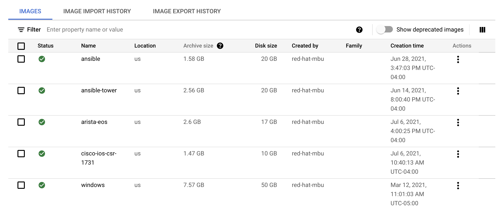
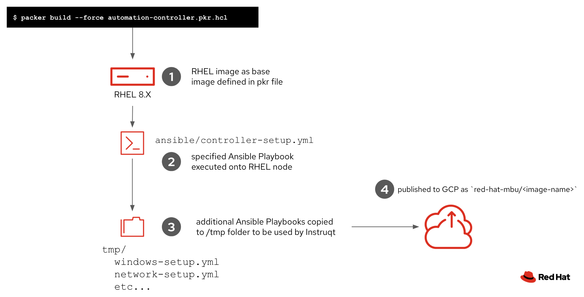

# Images for Instruqt

Instruqt will use GCP images tied to your GCP account.  For the MBU our account is named "Red Hat MBU" (slug is `red-hat-mbu`).

To figure out the name of images check out this link:
[GCP Images](https://cloud.google.com/compute/docs/images#list_of_public_images_available_on)

Under **GCP Console -> Compute Engine -> Storage -> Images**



## Image details

Image name | Description | connection | machine type | usage in challenge
--- | --- | --- | --- | ---
`red-hat-mbu/ansible` | cli Ansible on RHEL 8 | Root ssh keys already there<br>Able to SSH as user/pass: <br> `rhel` / `ansible123!` | `n1-standard-1` | `type: terminal`
`red-hat-mbu/ansible-tower` | Ansible Tower on RHEL 8<br>VS Code included | **Tower** user/pass: <br> `admin` / `ansible123!`| `n1-standard-2` |  **Tower** `type: service`,  `path: `,  `port: 443` <br> **VS Code** `type: service`,  `path: /editor/`,  `port: 443`
`red-hat-mbu/automation-controller` | Automation controller on RHEL8 | `admin/ansible123!` | n1-standard-2 | **Controller**: `type: service`, `port: 443`
`red-hat-mbu/arista-eos` | Arista EOS virtual switch | user / pass <br> `ansible` / `ansible123!` | `n1-standard-4` | *Terminal not supported yet. SSH from a linux node* |
`red-hat-mbu/cisco-ios-csr-1731` | Cisco IOS-XE virtual router | user / pass <br> `ansible` / `ansible123!` | `n1-standard-1` | *Terminal not supported yet. SSH from a linux node* |
`red-hat-mbu/windows` | Windows 2016 | SSH user/pass: `admin/Password123` | `n1-standard-2` | *Terminal not supported yet. SSH from a linux node* 
`red-hat-mbu/automation-mesh` | Automation mesh lab | user/pass <br> `admin`/default: `ansible123!` | `n1-standard-2` | **Mesh**: `type: service,port: 443`

**Packer recipe for Ansible Tower image**

This needs a `ansible/tower_license.json` file, which is excluded from this repo.

## Setup-scripts

Everything contained in `ansible/setup-scripts` will be copied to the tmp dir on Tower when the image is built. These scripts are used to configure Tower for that particular exercise (e.g. remove all non windows modules from the adhoc drop down for windows tracks). Unfortunately, just dropping the playbooks into the challenge directory for that track and then running `ansible-playbook` from the bash script doesn't do it. This is temporary until figuring out something more elegant.

The idea here is that we can cut down on image configuration by configuring the instance for each track using ansible. The downside, if there's a lot of instance configuration needed, the startup time will suffer.

## Building images

The cloud of choice for Instruqt is GCP. Images are currently built on GCP using Packer. Install packer and gcloud on your workstation. You should now be able to login to gcloud using something like `gcloud auth application-default login`. [More info on GCP auth](https://cloud.google.com/sdk/gcloud/reference/auth/application-default).

Take a look at the packer files `*.pkr.hcl` for current images to get an idea of what is going on. Once your build file has been customized for your use case run `packer build your-image.pkr.hcl`. If your image already exists within the GCP project specified in the packer file, you can force the refresh of the image like so: `packer build --force your-image.pkr.hcl`

When creating a new track, you should be able to specify the path the new image using `project-name/image-name`

**High Level Diagram**:


## Building the automation-controller and automation-mesh images

You are going to need two files in `instruqt/images/ansible`:

1. `extra_vars.yml`

This file contains all the required and optional variables needed to create images. These variables are used in the `control_node`, `aap_download`, `aap_repo`, and `ansible.workhops.code_server` roles. Here's a summary of the variables and what they're used for.

> **Note**
> 
> Here's an `extra_vars.yml` [template](docs/extra_vars.md) to get you started.

**Image build variables**:
| Var name 	| Required? 	| Default value 	| Example 	|  	|
|---	|---	|---	|---	|---	|
| redhat_username 	| Yes 	| None 	| redhat_username: seanmcvanought@redhat.com 	| Your Red Hat account username to download AAP installer and EE images 	|
| redhat_password 	| Yes 	| None 	| redhat_password: ILikeColin 	| Your Red Hat account password to download AAP installer and EE images 	|
| offline_token 	| Yes 	| None 	| offline_token: sdfsdfskh9809s8dj..... 	| access.redhat.com offline token<br>You can retrieve your token from https://access.redhat.com/management/api 	|
| aap_download_url 	| No 	| Latest stable controller bundle version 	| aap_download_url: https://"uri"/aap_bundle_setup.tar.gz 	| AAP setup bundle download path. <br>If left blank, the latest stable release will be used<br>NOTE: It must the bundle installer 	|
| controller_install_command 	| No 	| ./setup.sh -e gpgcheck=0 	| controller_install_command: './setup.sh -e gpgcheck=1 	| Automation controller install setup command 	|
| admin_password 	| No 	| ansible123! 	| admin_password: "ansible123!" 	| Password for automation controller admin user 	|
| rhel_user_password 	| No 	| ansible123! 	| rhel_user_password: "ansible123!" 	| Password for `rhel` user 	|
| code_server_password 	| No 	| ansible123! 	| code_server_password: "ansible123!" 	| Password for code server. Currently not in use 	|
| controllerinstall 	| No 	| true 	| controllerinstall: true 	| Install automation controller instead of Tower.<br><br>NOTE: Recommended to use `true` 	|
| mesh_lab 	| No 	| false 	| mesh_lab: false 	| Install automation mesh lab.<br>NOTE: This requires `controllerinstall: true` 	|
| ee_registry_name 	| No 	| registry.redhat.io 	| ee_registry_name: registry.redhat.io 	| The location to download execution environments 	|
| ee_images 	| No 	| AAP 2 pre-release images in a yaml list 	| ee_images:<br>  - ee_image_1<br>  - ee_image_N 	| EEs to download and cache on controller 	|

1. `manifest.zip`

This is a license file to apply to AAP.  Please refer to this video by Colin McNaughton [https://www.youtube.com/watch?v=FYtilnsk7sM](https://www.youtube.com/watch?v=FYtilnsk7sM) to figure out how to get your manifest.zip

To build the automation-controller image, run the following command->

```packer build --force automation-controller.pkr.hcl```

To build the automation-mesh image, run the following command->

```packer build --force automation-mesh.pkr.hcl```


## Notes:
When generating windows images from macos, there's an env var that needs to be set in your active shell: `export OBJC_DISABLE_INITIALIZE_FORK_SAFETY=YES`

Want to open code-server with a specific working directory? In the tabs configuration of your challenge, use something like `/editor/?folder=vscode-remote%3A%2F%2F%2fhome%2Frhel` which would open code-server at with a CWD of `/home/rhel/`
