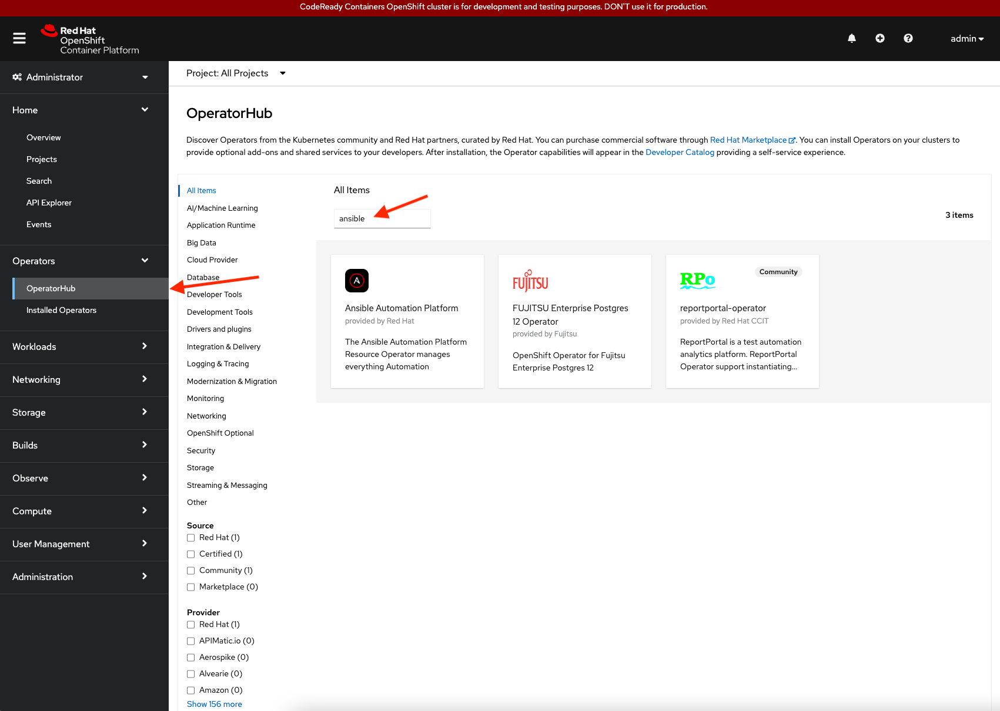
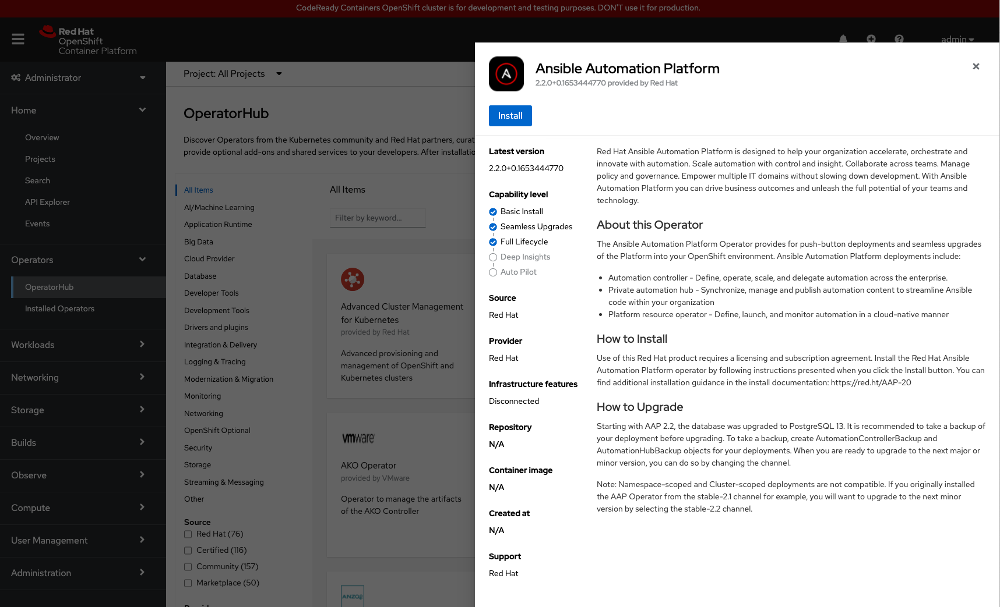
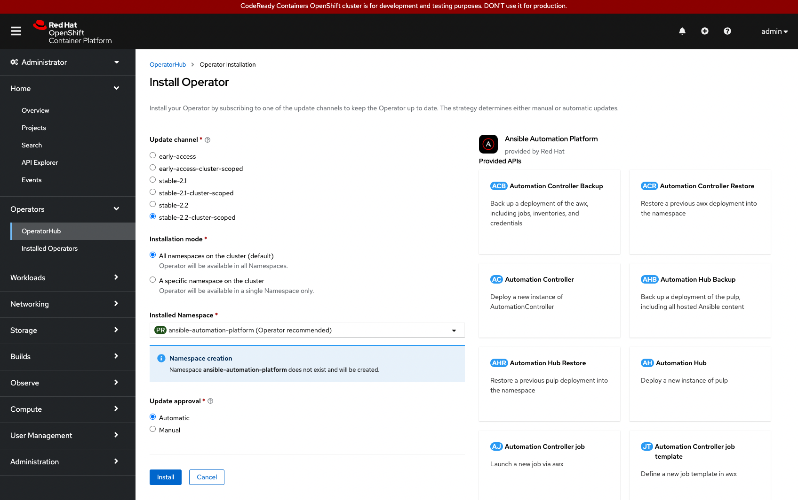

In this challenge, we will login to the OpenShift cluster dashboard and install the Ansible Automation Platform Operator.

Installing the Ansible Automation Platform Operator provides us the ability to deploy and manage Ansible Automation Platform components on Red Hat OpenShift.

## Logging in to the Cluster via Dashboard

To log into the web console, click the *Web Console* tab near the top of your screen.

You can login as `admin` user using the following credentials:

* Username:
```
admin
```
* Password:
```
admin
```


Once logged into the dashboard, select `Operators -> OperatorHub`.

Within the OperatorHub search bar, type `ansible` to find Ansible Automation Platform Operator.



Select the Ansible Automation Platform Operator and select `Install`.


Within the `Install Operator` window, ensure the `stable-2.2-cluster-scoped` radio button within `Update channel` is selected and the `Installation mode` is set to `All namespaces on the cluster (default)`.

> **_NOTE:_** By default, the namespace `ansible-automation-platform` is created if it does not exist, however, a different namespace can be created or used if desired. Lastly, select `Automatic` for `Update approval` and click `Install`.



> **_NOTE:_**  The installation of the Ansible Automation Platform Operator takes a few minutes to complete.

Once `Installed operator - ready for use` is displayed, select the `View Operator` button.

Congratulations! This completes the installation of the Ansible Automation Platform Operator.

In the next challenge, we will focus on deploying one of the components from the Operator, specifically `Automation Controller`.

> **_WARNING:_** Prior to accessing the next challenge, the pods deployed by the Ansible Automation Platform Operator must be up and running. Otherwise, the check will fail.
