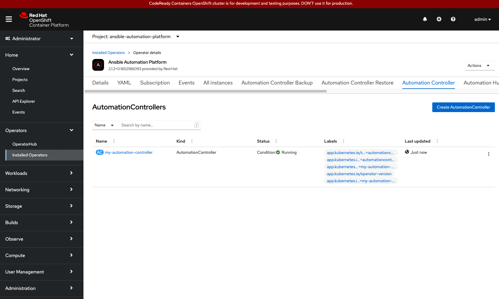

In the previous challenge, we installed the Ansible Automation Platform (AAP) Operator. With the installation complete, we continue now to install the Automation Controller component from within the AAP Operator details window.

## Installing Automation Controller

* Within the Operator details window, select the tab labeled `Automation Controller`.


* Once selected, select the blue button labeled `Create AutomationController`.
* Within the `Create AutomationController` window, provide a name for your Automation Controller. e.g. `my-automation-controller`
* At the bottom of the Form view, click the blue `Create` button.


> **_NOTE:_**  This demo lab uses the defaults for installation of automation controller. Aside from configuring automation controller via Form view, you can customize via YAML view, as well as, setup advanced configurations via the `Advanced configuration` tab within the Form view.

* With the creation taking place, many of the OpenShift resources are being created for the new installation of the `my-automation-controller`.



> **_NOTE:_** This may take a few minutes to complete.

Congratulations! You've successfully installed automation controller.

> **_WARNING:_** Prior to accessing the next challenge, the pods that deployed automation controller must be up and running. Attempting to access the next challenge, prior to the pods being up will prevent access. You can view the pod status via the Red Hat OpenShift dashboard, select `Pods` under the `Workloads` dropdown. A view of all the running pods can be seen. Explicitly we are looking to see that `my-automation-controller-<id>-<id>` finishes creating the pods. These pods are part of the installation process of Ansible Automation Platform.


If you would like to view this on the terminal, select the `Terminal 1` tab, and run the following command:

```
watch -n 1 oc get pods -n ansible-automation-platform
```

NOTE: CrashLoopBackOff is a possible status for certain pods while the installation of automation controller is being completed.

Aside from watching the pods you may also check if the deployment has fully rolled out via:

```
oc rollout status deployment my-automation-controller -n ansible-automation-platform
```


In the next challenge, you will access the automation controller dashboard.
