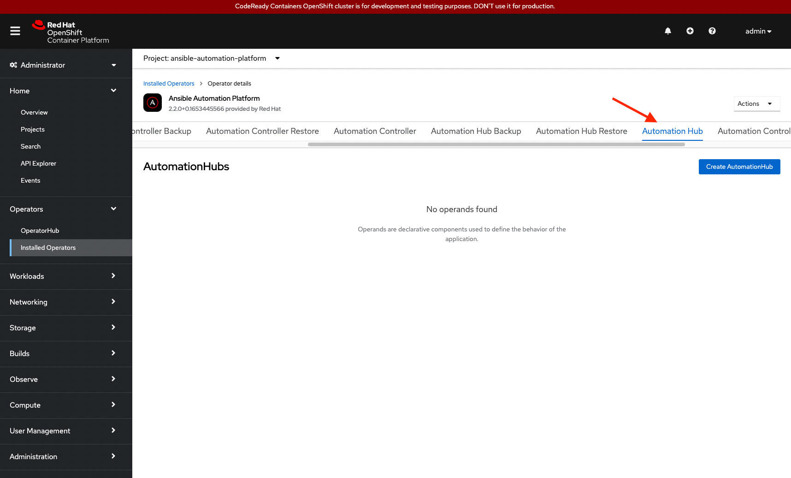
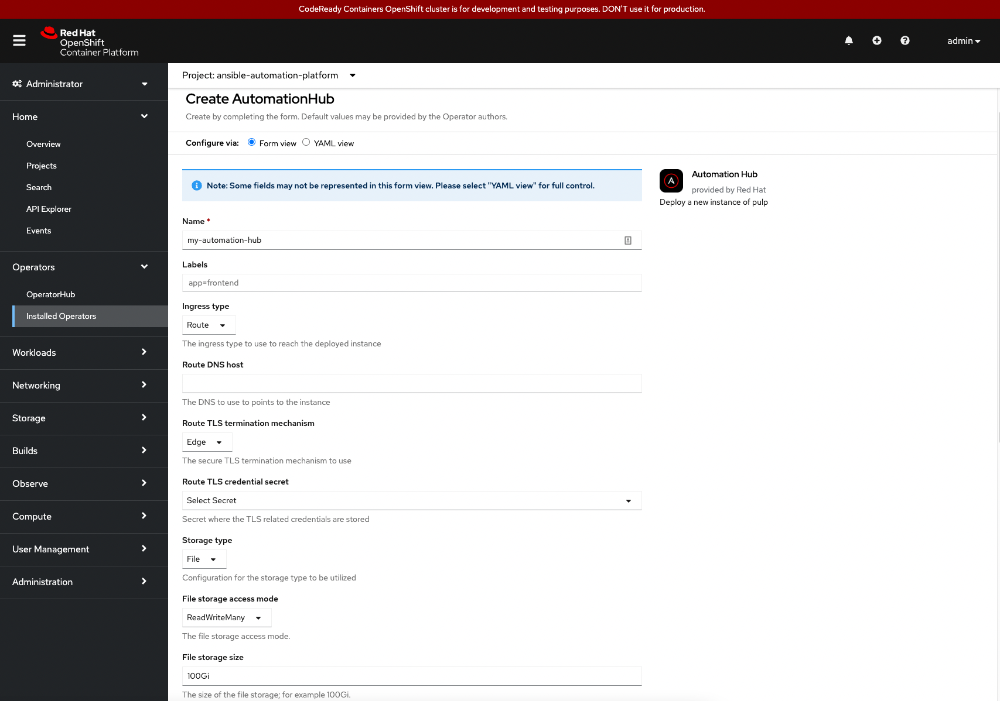
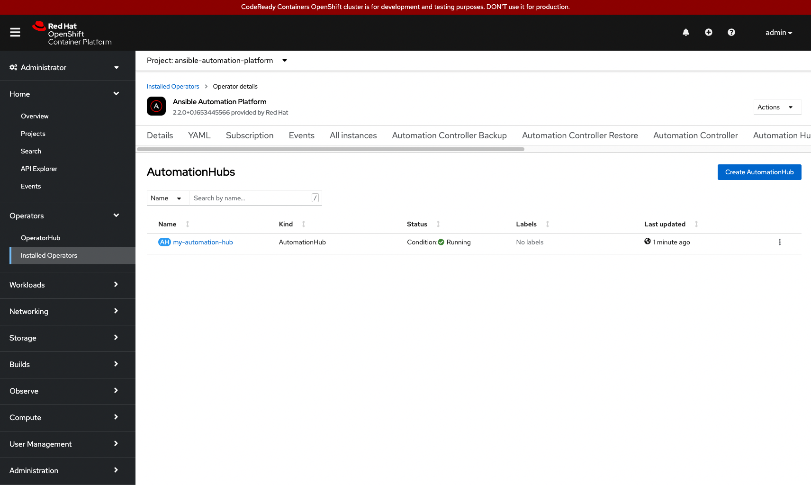
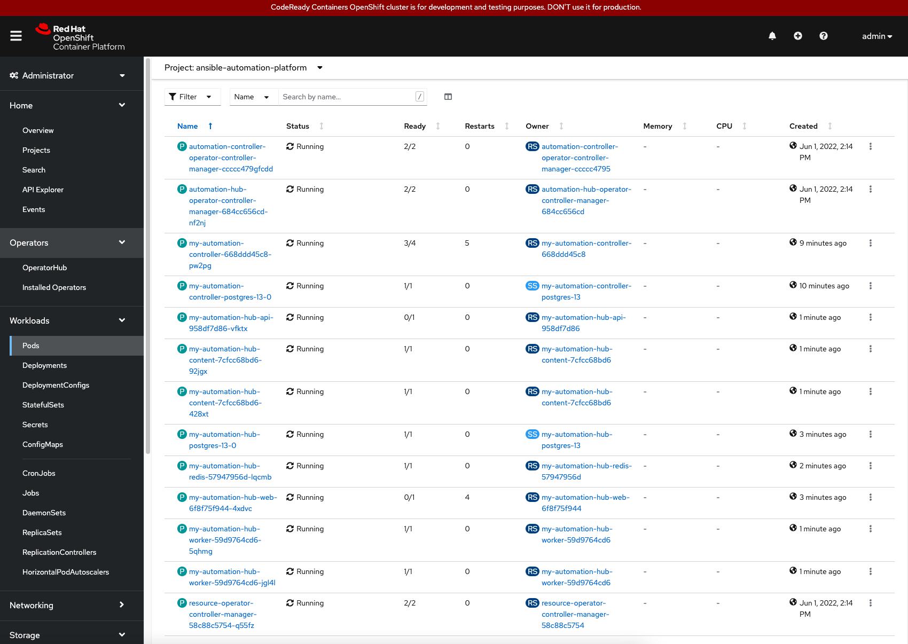

In the previous challenge, we installed the automation controller component from AAP. With the installation complete, we continue now to install the private Automation Hub component from within the AAP Operator details window.

## Installing Automation Hub

* Within the `Operators-> Installed Operators-> Ansible Automation Platform` Operator details window, select the tab labeled `Automation Hub`.



* Once selected, select the blue button labeled `Create AutomationHub`.
* Within the `Create AutomationHub` window, provide a name for your private Automation Hub. e.g. `my-automation-hub`. Within the `Storage Type` dropdown select `File`.

> **_NOTE:_** Other options for `Storage Type` are available such as `S3` and `Azure`.

* At the bottom of the Form view, click the blue `Create` button.



> **_NOTE:_**  This demo lab uses the defaults for installation of private Automation Hub. Aside from configuring private Automation Hub via Form view, you can customize via YAML view, as well as, setup advanced configurations via the `Advanced configuration` tab within the Form view.

* With the creation taking place, many of the OpenShift resources are being created for the new installation of the `my-automation-hub`.



> **_NOTE:_** This may take a few minutes to complete.

Congratulations! You've successfully installed Automation Hub.

> **_WARNING:_** Prior to accessing the next challenge, the pods that deployed private Automation Hub must be up and running. Attempting to access the next challenge, prior to the pods being up will prevent access. You can view the pod status via the Red Hat OpenShift dashboard, select `Pods` under the `Workloads` dropdown. A view of all the running pods can be seen. These pods are part of the installation process of Ansible Automation Platform.



If you would like to view this on the terminal, select the Terminal 1 tab, and run the following command:

```
watch -n 1 oc get pods -n ansible-automation-platform
```

> **_NOTE:_** CrashLoopBackOff is a possible status for certain pods while the installation of private Automation Hub is being completed.

Aside from watching the pods you may also check if the deployment has fully rolled out via:

```
oc rollout status deployment my-automation-hub-web -n ansible-automation-platform
```

In the next challenge, you will access the automation controller & Automation Hub dashboards.
