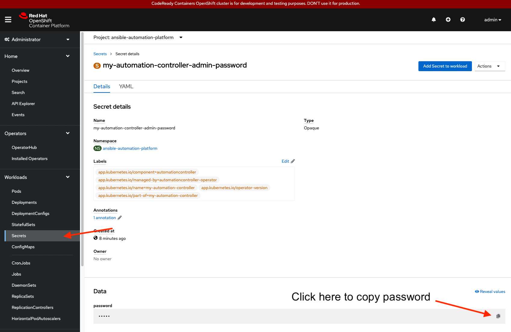
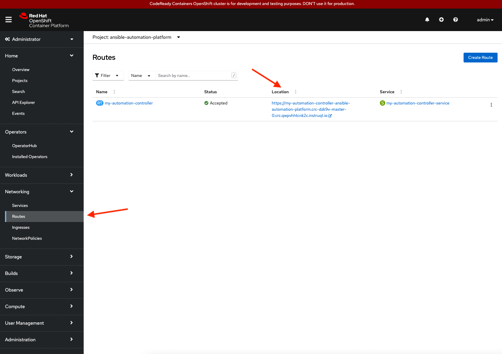
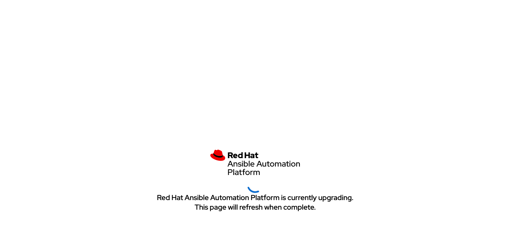
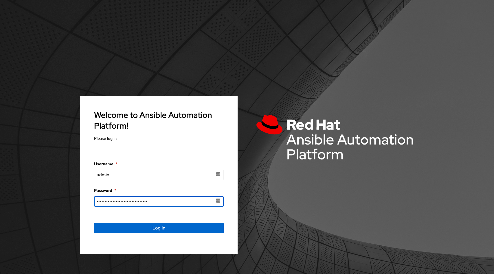

In this challenge, you will access the newly installed automation controller environment.

## Access Automation Controller

To access the automation controller dashboard, acquire the password for the `admin` user.

To access the `admin` user's password, select `Secrets` under the `Workloads` dropdown.

* Within `Secrets`, select the secret labeled `my-automation-controller-admin-password`.

* Within the `Secret details` page, copy the password to your clipboard in order to paste it into the Automation Controller sign in page.

* In order to get the automation controller dashboard URL, select `Routes` within the `Networking` drop down.

* Within `Routes`, under the project `ansible-automation-platform`, a location starting with `https://my-automation-controller-ansible-automation-platform....` is provided for the service labeled `my-automation-controller-service`.

> **_NOTE:_** The URL location takes you to the automation controller sign in page.

If the automation controller sign in page is not loaded, this means the installation process is still in progress. An example of the screen showing Ansible Automation Platform not complete is shown below.

* Login to the automation controller dashboard using user `admin` and the password copied to your clipboard.

Congratulations! You have successfully:

* Installed Ansible Automation Platform via an Operator
* Installed automation controller
* Accessed the automation controller dashboard.
