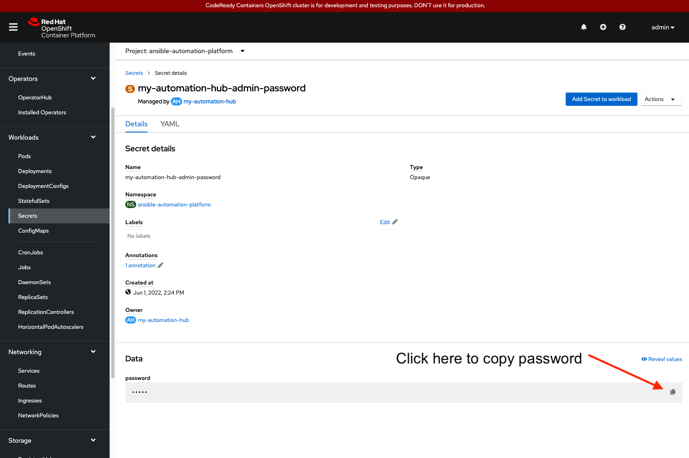
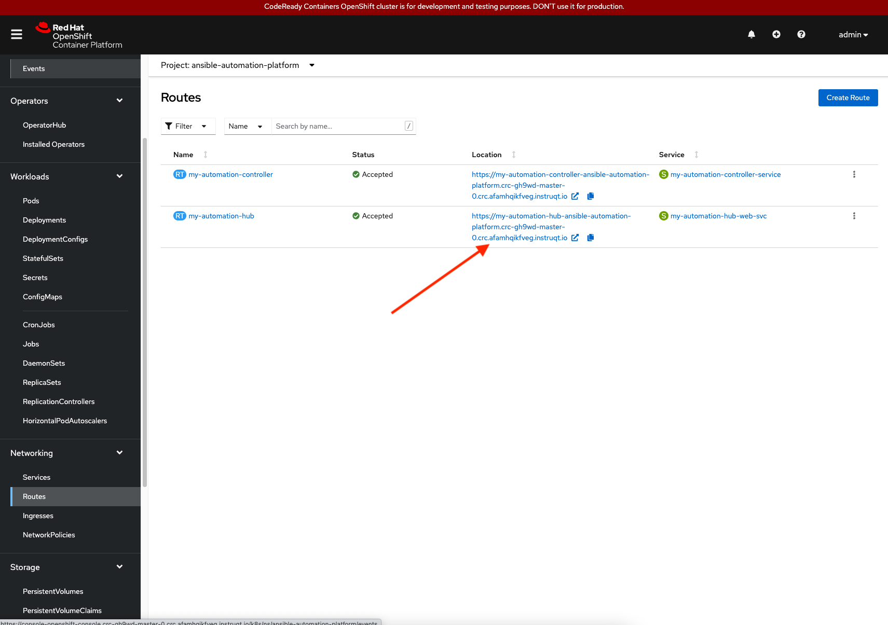
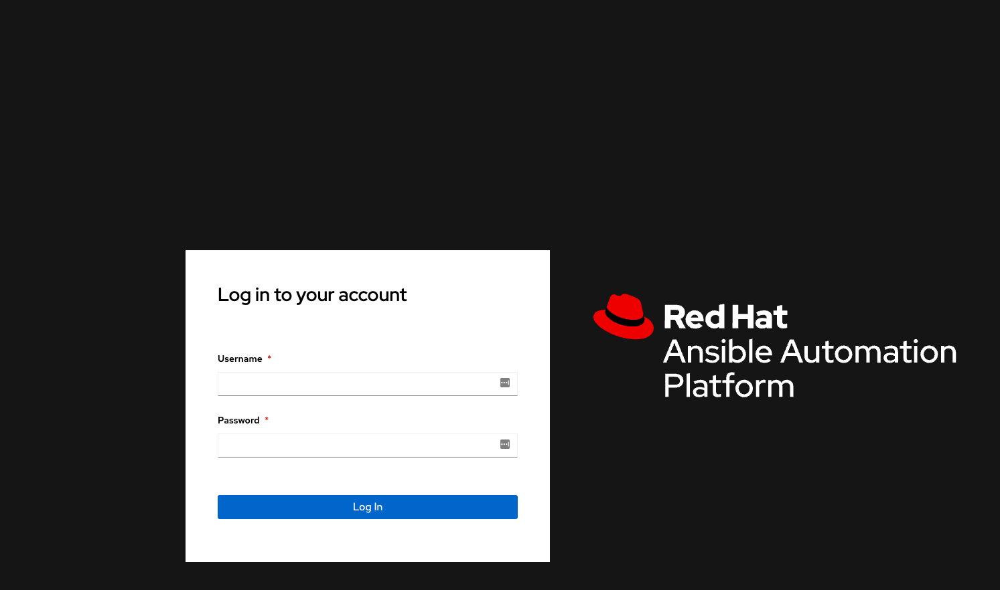

In this challenge, you will access the newly installed Automation Hub environment.

## Access Automation Hub

To access the Automation Hub dashboard, acquire the password for the `admin` user.

To access the `admin` user's password, select `Secrets` under the `Workloads` dropdown.

* Within `Secrets`, select the secret labeled `my-automation-hub-admin-password`.

* Within the `Secret details` page, copy the password to your clipboard in order to paste it into the Automation Controller sign in page.

* In order to get the Automation Hub dashboard URL, select `Routes` within the `Networking` drop down.

* Within `Routes`, under the project `ansible-automation-platform`, a location starting with `https://my-automation-hub-ansible-automation-platform....` is provided for the service labeled `my-automation-hub-web-svc`.

> **_NOTE:_** The URL location takes you to the Automation Hub sign in page.

* Login to the Automation Hub dashboard using user `admin` and the password copied to your clipboard.

Congratulations! You have successfully:

* Installed Automation Hub
* Accessed the Automation Hub dashboard.
