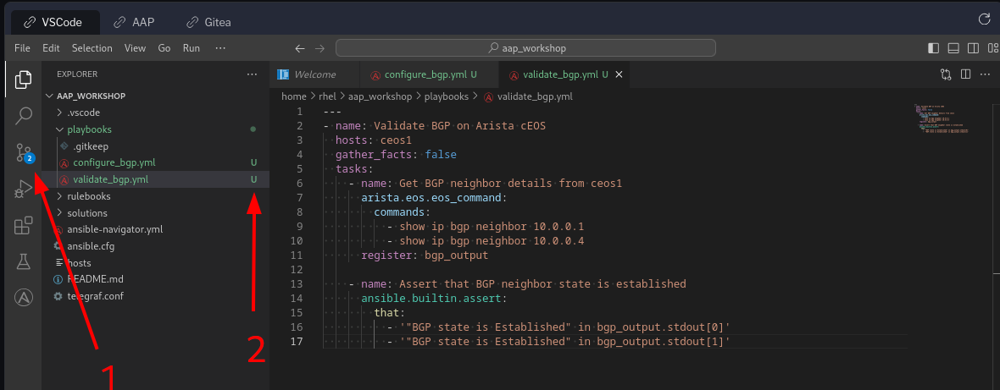
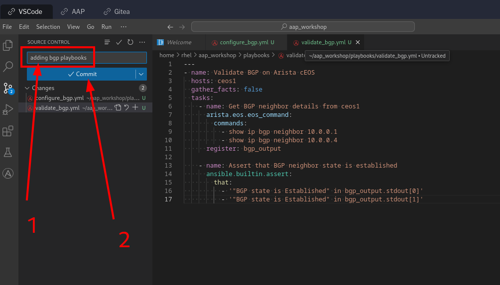
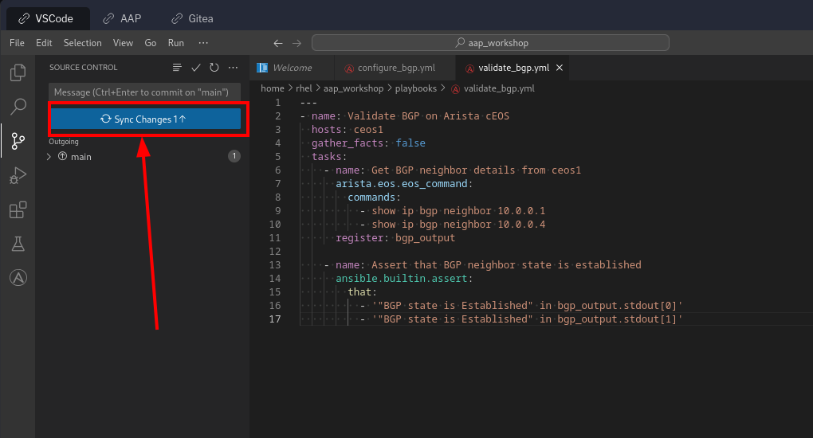

📑 Creating some playbooks
===

In this challenge, we are going to write playbooks that configure BGP among the three Arista cEOS routers in our **NetOps Inventory** and validate that by creating and running some more **Job Templates**. We will first create the new playbooks that we need for this task, in VS Code and publish those to the `aap_workshop` repository in Git. Once the playbooks are pushed, in the next exercise, we will re-sync the previously created **NetOps Playbooks** project and create the desired **Job Templates** from the newly added playbooks.

☑️ Task 1 - Creating the Configure BGP playbook
===

1. Switch to [button label="VS Code"](tab-0) tab.

2. In the **Explorer** section inside VS Code's sidebar, right click on the `playbooks` directory and click on `New File`. Name the file `configure_bgp.yml` and press **Enter**.

3. Populate the `configure_bgp.yml` file with the following content and save it.

> [!IMPORTANT]
> Please **do not** run this playbook now.

  ```yaml
  ---
  - name: Configure BGP on Arista ceos1
    hosts: ceos1
    gather_facts: false
    tasks:
      - name: Configure BGP on ceos1
        arista.eos.eos_bgp_global:
          state: overridden
          config:
            as_number: 64496
            router_id: 1.1.1.1
            neighbors:
              - neighbor_address: "10.0.0.1"
                remote_as: 64497
              - neighbor_address: "10.0.0.4"
                remote_as: 64498
            redistribute:
              - protocol: connected

  - name: Configure BGP on Arista ceos2
    hosts: ceos2
    gather_facts: false
    tasks:
      - name: Configure BGP on ceos2
        arista.eos.eos_bgp_global:
          state: overridden
          config:
            as_number: 64497
            router_id: 2.2.2.2
            neighbors:
              - neighbor_address: "10.0.0.0"
                remote_as: 64496
              - neighbor_address: "10.0.0.3"
                remote_as: 64498
            redistribute:
              - protocol: connected

  - name: Configure BGP on Arista ceos3
    hosts: ceos3
    gather_facts: false
    tasks:
      - name: Configure BGP on ceos3
        arista.eos.eos_bgp_global:
          state: overridden
          config:
            as_number: 64498
            router_id: 3.3.3.3
            neighbors:
              - neighbor_address: "10.0.0.2"
                remote_as: 64497
              - neighbor_address: "10.0.0.5"
                remote_as: 64496
            redistribute:
              - protocol: connected
  ```

To summarize, we are setting up BGP on these three Arista cEOS routers with ASN `64496`, `64497` and `64498` respectively and redistributing the `connected` routes.

☑️ Task 2 - Creating the validate BGP playbook
===

In the next playbook, we will use `arista.eos.eos_command` module to get the output of `show ip bgp summary` from `ceos1` node and inspect the output to confirm that BGP is established.

1. In the **Explorer** section in VS Code, right click on the `playbooks` directory and click on `New File`. Name the file `validate_bgp.yml` and press **Enter**.

2. Populate the file with the following content and save it.

> [!IMPORTANT]
> Please **do not** run this playbook now.

  ```yaml
  ---
  - name: Validate BGP on Arista cEOS
    hosts: ceos1
    gather_facts: false
    tasks:
      - name: Get BGP neighbor details from ceos1
        arista.eos.eos_command:
          commands:
            - show ip bgp neighbor 10.0.0.1
            - show ip bgp neighbor 10.0.0.4
        register: bgp_output

      - name: Assert that BGP neighbor state is established
        ansible.builtin.assert:
          that:
            - '"BGP state is Established" in bgp_output.stdout[0]'
            - '"BGP state is Established" in bgp_output.stdout[1]'
  ```

☑️ Task 4 - Publish new playbooks to the Git repository
===

1. In this step, we will push the newly added BGP playbooks to the `aap_workshop` repository in Gitea using the VS Code git features.
2. In VS Code you will notice a number appeared in the third icon of the left side bar (image reference 1 below) and our file has a sign next to it (image reference 2 below)
  
3. This means we have changes to commit to our Git repository. Click the third icon on the sidebar (1)
> [!IMPORTANT]
> You need to add a description to the commit message. Otherwise VS Code will open a new file and ask you to add the message there before you can sync.
4. **Fill the text box** with descriptive message of what you are changing (1) and click the blue **Commit** button (2)
  
5. You will notice the same button changed and now says **Sync changes**, click on it.
  


> [!IMPORTANT]
> If you haven't been able to successfully complete these task, reach out to your instructor! As a fallback all the playbooks needed for this workshop are available in the `solutions` directory in VS Code

✅ Next Challenge
===
Press the `Next` button below to go to the next challenge once you’ve completed the task.

🐛 Encountered an issue?
====

If you have encountered an issue or have noticed something not quite right, please [open an issue](https://github.com/ansible/instruqt/issues/new?labels=netops-aap25&title=Issue+with+netops-aap25&assignees=leogallego)

<style type="text/css" rel="stylesheet">
  .lightbox {
    display: none;
    position: fixed;
    justify-content: center;
    align-items: center;
    z-index: 999;
    top: 0;
    left: 0;
    right: 0;
    bottom: 0;
    padding: 1rem;
    background: rgba(0, 0, 0, 0.8);
    margin-left: auto;
    margin-right: auto;
    margin-top: auto;
    margin-bottom: auto;
  }
  .lightbox:target {
    display: flex;
  }
  .lightbox img {
    /* max-height: 100% */
    max-width: 60%;
    max-height: 60%;
  }
  img {
    display: block;
    margin-left: auto;
    margin-right: auto;
  }
  h1 {
    font-size: 18px;
  }
    h2 {
    font-size: 16px;
    font-weight: 600
  }
    h3 {
    font-size: 14px;
    font-weight: 600
  }
  p span {
    font-size: 14px;
  }
  ul li span {
    font-size: 14px
  }
</style>
