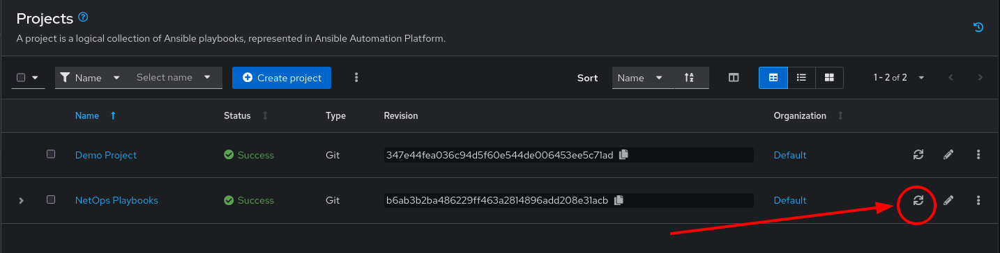
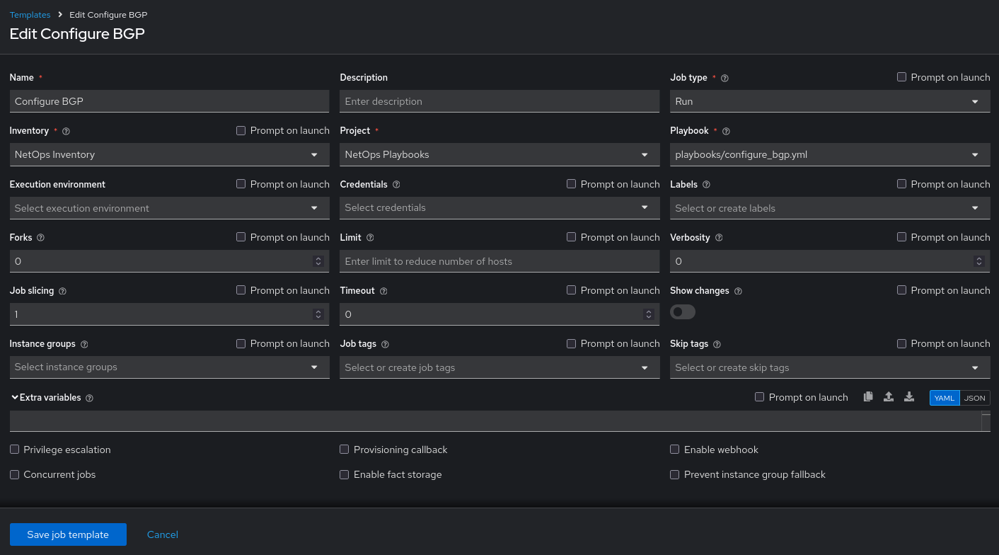
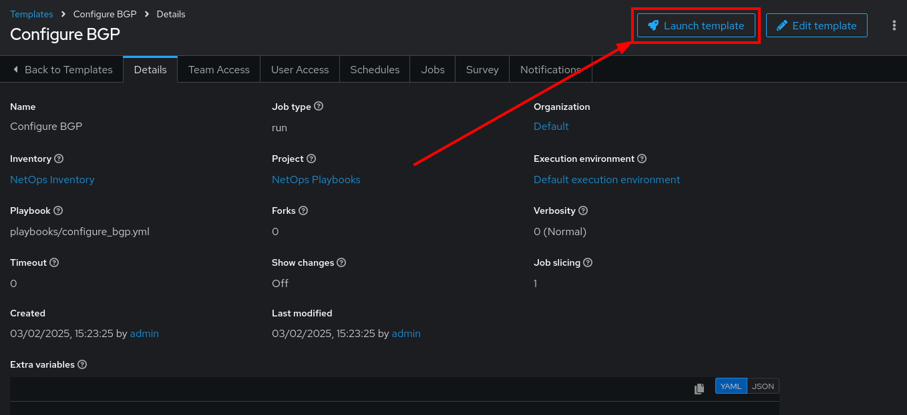
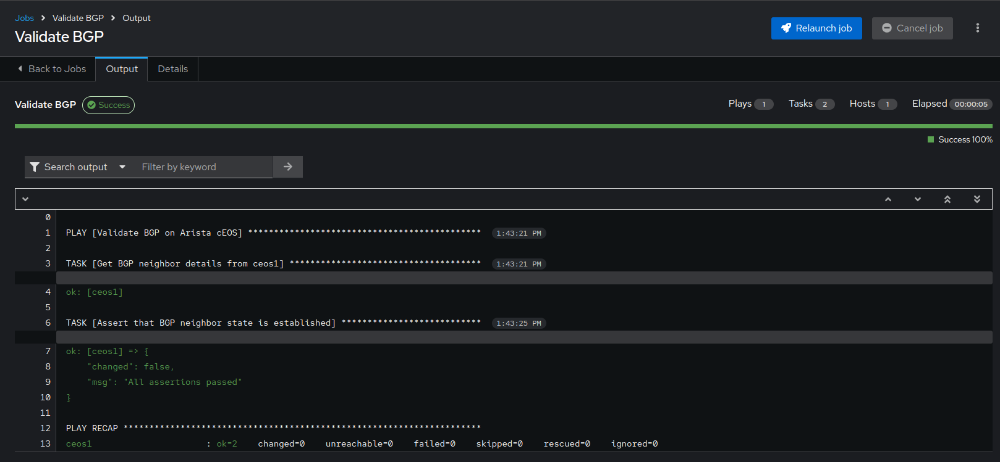

📑 Creating more Job Templates
===

In this challenge, we are going to create two new **Job Templates** in the Ansible Automation Platform interface using the BGP playbooks we created in VS Code in the previous exercise.

☑️ Task 1 - Update/re-sync NetOps Playbooks Project
===

1. Switch back to the [button label="AAP"](tab-1)  tab. Login again with provided credentials, if needed.

> [!NOTE]
> * Username: admin
> * Password: ansible123!

2. Expand the **Automation Execution** section in the sidebar menu.

3. Click the **Projects** link in the menu.

4. The `NetOps Playbooks` project was already created and should be present. Click on the **Sync** button to get the latest changes from the Github repository.

  

5. Wait for the sync operation to complete. Once successfully done, you should see a new `Revision` value.

☑️ Task 2 - Create and execute Configure BGP Job Template
===

1. Click on the **Templates** link in the **Automation Execution** section in the sidebar menu.

2. Click the **Create template** dropdown button and select **Create job template**.

3. **Name** the Job Template as `Configure BGP`.
4. For the **Job Type** field, leave the default: `Run`.
5. For the **Inventory** field, click and and select `NetOps Inventory` from the dropdown.
6. For the **Project** field, click and select `NetOps Playbooks` from the dropdown.
7. For the **Playbook** field, choose the `playbooks/configure_bgp.yml`.

> [!IMPORTANT]
> Make sure to use the `playbooks/configure_bgp.yml` and not the `solutions` path for the playbook!

  

8. Click on **Create job template**.

9. In the Details view of the Job Template you just created
10. Click on the  **Launch template** button on the top right
  

11. The execution of this Job Template should result in BGP being configured across all the cEOS nodes!

☑️ Task 3 - Create and execute Validate BGP Job Template
===

1. Now we are going to validate our BGP configuration,  let's add a **Job Template** for the `validate_bgp.yml` playbook we wrote.
2. Go to **Templates**, click on **Create template** and select **Create job template**.
3. **Name** the Job Template as `Validate BGP`.
4. For the **Job Type** field, leave the default: `Run`.
5. For the **Inventory** field, click and and select `NetOps Inventory` from the dropdown.
6. For the **Project** field, click and select `NetOps Playbooks` from the dropdown.
7. For the **Playbook** field, choose the `playbooks/validate_bgp.yml`.
8. Click on **Create job template**.
9. Go back to the **Templates** link in the **Automation Execution** section in the sidebar menu and launch the `Validate BGP` job template using the 🚀 **Rocket** icon.

  

10. If all the BGP configurations were pushed successfully in the previous task, this `Validate BGP` Job Template should successfully execute and show an "All assertions passed" message.

✅ Next Challenge
===

Woohoo! 🎉 You have now successfully configured _and_ validated BGP on Arista cEOS routes using the power of Ansible Automation Platform!

Press the `Next` button below to go to the next challenge once you’ve completed the task.

🐛 Encountered an issue?
====

If you have encountered an issue or have noticed something not quite right, please [open an issue](https://github.com/ansible/instruqt/issues/new?labels=netops-aap25&title=Issue+with+netops-aap25&assignees=leogallego)

