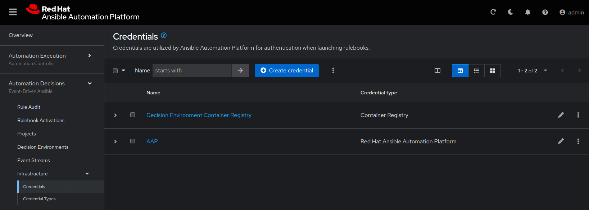

11 - Event-Driven Ansible: Automation Decisions
==

## Automation Decisions

Event-Driven Ansible allows you to rip out more pages of your hardcopy runbook. While `Automation Controller` (through `playbooks`) may automate your response to particular events, Event-Driven Ansible (through `rulebooks`) codifies the symptoms that you have to recognize from an event before being able to respond. If you're able to describe the conditions for action and specify the response to those conditions, you're automation will become more resilient and allow your organization to respond with automation much quicker.

With Ansible Automation Platform 2.5, components of the platform are co-located under a new unified user experience.

Switch to the [button label="AAP"](tab-0) tab, and login with the following credentials:

> [!NOTE]
> * **Username**: `admin`
> * **Password**: `ansible123!`

**Automation Decisions** defines resources needed for the execution of *Rulebooks*, just like Automation Execution (Automation controller) has resources needed for the execution of *Playbooks*.
There are three main resource types that have to be defined before creating a **Rulebook activation**  that will listen for incoming events.

Decision Environments
===

If you're already familiar with Ansible and Automation controller, **Decision Environments** are a lot like **Execution Environments**.

The main differences between the two are that **Decision Environments** contain tools to execute rulebooks whereas **Execution Environments** are built to contain tools to execute playbooks. Both are container images that contain all the resources needed to execute rulebooks/playbooks.

**Decision Environments** are also built with collections that contain the `source plugins` for any source you want to receive events from. This means that if you'd like to receive events from `Dynatrace`, for example, you would have to install the collection `dynatrace.event_driven_ansible` in order to leverage the source plugin for `Dynatrace`.

Take a look at the `Decision Environments` tab under **Automation Decisions** on the left-hand sidebar menu in AAP.

You'll notice that there is already a **Decision Environment** added to our AAP instance called `Default Decision Environment`. This was added at installation time and is distributed by Red Hat as `de-supported-rhel8:latest`. There is also another **Decision Environment** called `NetOps Decision Environment` which was pre-loaded into the AAP instance for this workshop. These Decision Environments contains the collection `ansible.eda` which ships plugins for several event sources.

EDA Credentials
===

Credentials can be leveraged for pull operations for both Decision Environments and Projects, used to connect to external event sources and to secure inbound webhook endpoints via Event Streams. If you have private repositories for either Decision Environments or Projects, you can create a credential from **Automation Decisions > Infrastructure > Credentials** on the left-hand side of the **AAP** tab. By default, a `Decision Environment Container Registry` credential is added at installation time. There is also another credential called `AAP` which was pre-loaded into the AAP instance for this workshop. This credential will be used at the for **Rulebook Activations** in upcoming exercises.

EDA Projects
===

**Automation Decision Projects** are source control repositories that contain your **Rulebooks**. Just like Automation Execution Projects contain your Playbooks.

✅ Next Challenge
===
Press the `Next` button below to go to the next challenge once you’ve completed the task.
