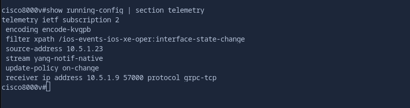
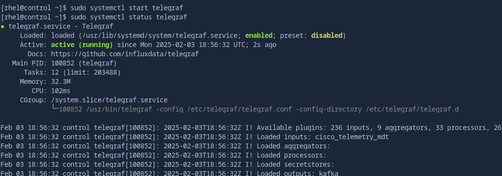

12. Event-Driven Ansible Controller - setting up Telemetry
===

Event-Driven Ansible has opened many possibilities in automation and the possibility of working from events or telemetry within the network is just one of those use cases. This exercise and the next one covers one such use case specific to networking!

☑️ Task 1 - Creating a new topic in Kafka
===

First thing we are going to do is configure our event `source`. This is what `Event-Driven Ansible` will listen to for event payloads.

1. Navigate the to [button label="kafka"](tab-1) tab, which we used in our previous `ansible-rulebook` exercise. We want to create our Kafka topic called `network`, type the following:

  ```bash
  /bin/kafka-topics --bootstrap-server localhost:9092 --topic network --create --partitions 3 --replication-factor 1
  ```
 2. Once the `Kafka` topic `network` has been created, let's enable telemetry in our network devices.

☑️ Task 2 - Configure Model-Driven Telemetry on the cisco device
===

1. Switch to the [button label="cisco"](tab-3)  tab and SSH to the `cisco` device.

  ```bash
  ssh admin@cisco
  ```

2. Ensure that no telemetry configuration is present in the device and it does not have any active telemetry connections.

  ```bash
  show running-config | section telemetry
  ```

  ```bash
  show telemetry connection all
  ```

You will receive an output that indicates telemetry has not yet been configured.

  ```
  The process for the command is not responding or is otherwise unavailable
  ```

No problem! We will configure the switch to enable telemetry and to stream data to our telemetry collector.

3. Switch to the [button label="VS Code"](tab-5) tab.

4. In the **Explorer** sidebar, right click on the `playbooks` directory and click on `New File`. Name the file `configure_telemetry.yml` and press **Enter**.

5. Populate the `configure_telemetry.yml` file with the following content and save it.

```yaml
---
- name: Configure Cisco device with NETCONF/YANG and telemetry
  hosts: cisco
  gather_facts: false
  tasks:
    - name: Get IP of Cisco     ## Gather IP Address of Cisco
      set_fact:
        source: "{{ lookup('community.general.dig', 'cisco') }}"

    - name: Show IP address of the Cisco device
      debug:
        msg: "{{ source }}"

    - name: Get IP of Telegraf   ## Gather IP Address of Collector
      set_fact:
        telegraf_node: "{{ lookup('community.general.dig', 'control') }}"

    - name: Show IP address of Telegraf
      debug:
        msg: "{{ telegraf_node }}"

    - name: Configure Telemetry   ## Apply configuration to cisco
      cisco.ios.ios_config:
        lines:
          - "netconf-yang"
          - "telemetry ietf subscription 2"
          - "encoding encode-kvgpb"
          - "filter xpath /ios-events-ios-xe-oper:interface-state-change"
          - "source-address {{ source }}"
          - "stream yang-notif-native"
          - "update-policy on-change"
          - "receiver ip address {{ telegraf_node }} 57000 protocol grpc-tcp"
```
###  What does this playbook do?

- In this playbook, we first grab and then display the IP address of the `cat8000v` device in our workshop.
- We repeat the same for the `control` VM which runs the `Telegraf` service.
- In the final task, we configure telemetry on the `cat8000v`.
  - We enable the `Netconf/YANG` management interface and create a new telemetry subscription with id `2`.
  - We then set the encoding type to `Key-Value GPB` (refers to Key-Value Google Protocol Buffers).
  - Then, we define a filter to determine which data is sent in the telemetry stream to `Telegraf`. The `/ios-events-ios-xe-oper:interface-state-change` is an XPath expression identifying the YANG path to data related to interface state changes (e.g., up or down events).
  - Set the source-address of outgoing telemetry data to the `cat8000v` node's IP that we gathered in the first task.
  - The type of stream to be sent is set as `yang-notif-native`.
  - We also configure when telemetry updates should be sent, which in this case is "on-change".
  - Finally, we set the receiver IP address to the `telegraf_node` variable which contains the IP address of the `control` VM, set the receiver port to `57000` and protocol to `grpc-tcp`.

### Let's continue with the exercise:

6. Switch to the [button label="Terminal"](tab-4) tab. We will execute the playbook using the `ansible-navigator run` command. Since there is just one task we can use the `--mode stdout`.

> [!IMPORTANT]
> Make sure you are in the `/home/rhel/aap_workshop` directory

  ```bash
  ansible-navigator run playbooks/configure_telemetry.yml --mode stdout
  ```

7. Switch to the  [button label="cisco"](tab-3)  tab, connect with `ssh admin@cisco`  if you are not in the device already and execute the following command to verify that telemetry configurations have been pushed.

  ```bash
  show running-config | section telemetry
  ```

8. The output of the above command should look like this (IP address and other details might vary):

  

☑️ Task 3 - Verify telegraf configuration and start the service
===

1. Switch to the [button label="telegraf"](tab-2) tab and verify the `telegraf` configuration.

> [!NOTE]
> Telegraf is already installed for this lab, but not started.

  ```bash
  cat /etc/telegraf/telegraf.conf
  ```

  You should see the following collector and output configuration for `telegraf`:

  ```bash
  ##### CISCO 8000V  #####
  [[inputs.cisco_telemetry_mdt]]
  #  ## Telemetry transport can be "tcp" or "grpc".  TLS is only supported when
  #  ## using the grpc transport.
    transport = "grpc"
  #
  #  ## Address and port to host telemetry listener
    service_address = ":57000"

  ##### OUTPUTS  #####
  [outputs.kafka]
  # URLs of kafka brokers
    brokers = ["broker:9092"] # EDIT THIS LINE
  # Kafka topic for producer messages
    topic = "network"
    data_format = "json"
  ```

  This configuration file has been setup to allow streaming telemetry via port `57000` and for telegraf to format and output the data to the Kafka `network` topic you created earlier.

2. Start the `telegraf` service and make sure its all running!

  ```bash
  sudo systemctl start telegraf
  ```

  ```bash
  sudo systemctl status telegraf
  ```

Your telegraf service should be reporting an output similar to this:



☑️ Task 4 - Verify that the cisco device is connected to the Telegraf collector
===

1. Switch to the [button label="cisco"](tab-3) tab,  connect with `ssh admin@cisco` to the device if you are not logged in
2. Execute the following command to verify that telemetry configuration is active now.

  ```bash
  show telemetry connection all
  ```
The output should look like this:

> [!WARNING]
>  If you do not see any output, wait for a minute and re-run the command above

  ```bash
  cisco8000v#show telemetry connection all
  Telemetry connections

  Index Peer Address               Port  VRF Source Address             State      State Description
  ----- -------------------------- ----- --- -------------------------- ---------- --------------------
      0 10.5.0.130                 57000 0   10.5.0.4                   Active     Connection up

  cisco8000v#
  ```

Great! We are now connected!

☑️ Task 5 - Are we getting messages?
===

1. Navigate to the [button label="kafka"](tab-1) tab where we created the Kafka topic - `network`.
2. We want to make sure the messages that are going to be generated are being forwarded to Kafka. Type the following to observe the message queue:

  ```bash
  /bin/kafka-console-consumer --bootstrap-server localhost:9092 --topic network --from-beginning
  ```

3. Switch to the [button label="cisco"](tab-3) tab, `ssh admin@cisco`  if needed.
4. Since this is a lab environment and we have virtual switches, let us create a sample `loopback` interface to work with and see if the message arrives at our event-source.
5. Follow the commands below in the interactive terminal of the cat8000v device

> [!IMPORTANT]
> Only type what's after the #

  ```bash
  cisco8000v#configure terminal
  Enter configuration commands, one per line.  End with CNTL/Z.
  cisco8000v(config)#interface loopback 100
  cisco8000v(config-if)#no shutdown
  cisco8000v(config-if)#ip address 192.168.0.100 255.255.255.0
  ```

6.  We just added a loopback interface, which we will use to simulate changes.
7. Switch to the [button label="kafka"](tab-1)  tab to see if we have any event in the queue.
8. Below is a message that should have been generated and forwarded to our event source.  This is an event payload from telemetry.

  ```json
  {"fields":{"host_name":"cisco8000v","if_name":"Loopback100","new_state":"interface-notif-state-up","severity_level":"major","vrf_name":"0"},"name":"Cisco-IOS-XE-ios-events-oper:interface-state-change","tags":{"host":"control","path":"Cisco-IOS-XE-ios-events-oper:interface-state-change","source":"cisco8000v","subscription":"2"},"timestamp":1730207395}
  ```

9. Success! We can now work with telemetry data with our EDA controller!

✅ Next Challenge
===

Press the `Next` button below to go to the next challenge once you’ve completed the task.
