EDA: Automated notifications
===

In this exercise, we are going to configure a chat platform - `Mattermost` and run a `rulebook` that sends notification to a channel in `Mattermost` as soon as a BGP neighbor status becomes idle. As a part of a previous challenge, we configured BGP on three Arista cEOS routers and also validated the BGP operational status from one of them. We will be using the same topology for this exercise.

☑️ Task 1 - Setting up our chat platform
===

1. Navigate to the [button label="chat"](tab-0) tab, click on **View in Browser**.

  > [!NOTE]
> If you see `The content is blocked. Contact the site owner to fix the issue`, click the refresh button at the top-right corner.

2. Fill in the following details and click on **Create Account**.

  ```bash
  Email: networks@acme-corp.com
  Username: Network-Joe
  Password: ansible123!
  ```

  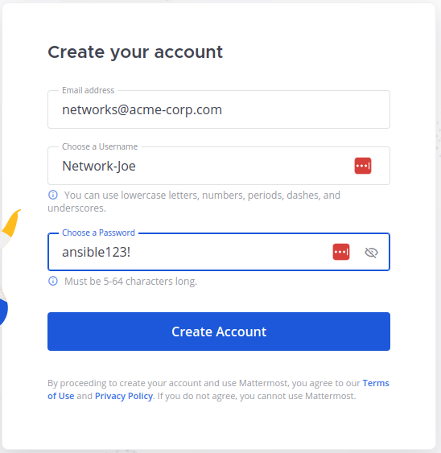

3. Click on **Create a team**.

  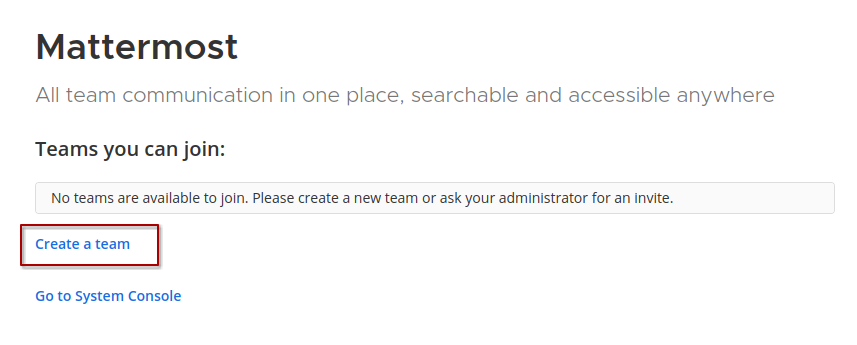

4. Specify `Team Name` as `NetOps`, click on **Next** and **Finish** (keep the Team URL as is).

  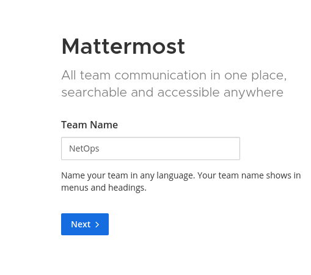

5. Next, we need to configure a webhook API token. In the chat, click on the grid in the top left hand corner and select **Integrations**.

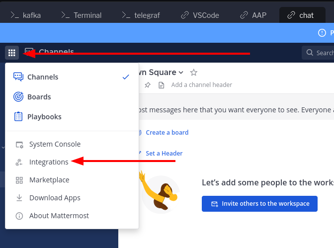

6. Select **Incoming Webhooks** and then click on **Add Incoming Webhook**.

  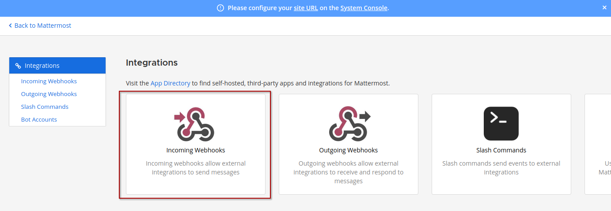

  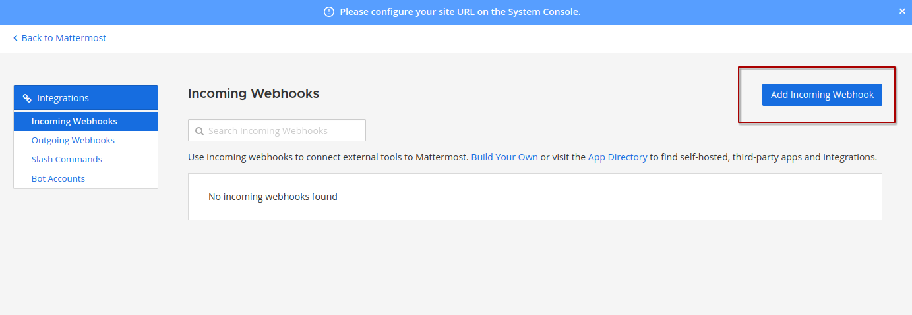

7. Add `Title` as `EDA Notification`, choose `Channel` as `Town Square` and click on **Save**.

  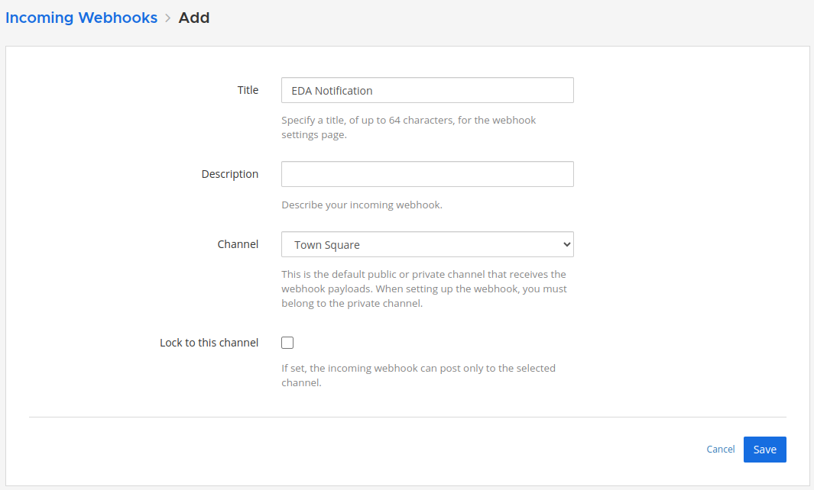

8. You will get a URL as shown in the image below. The part after `/hooks/` is the API token.

  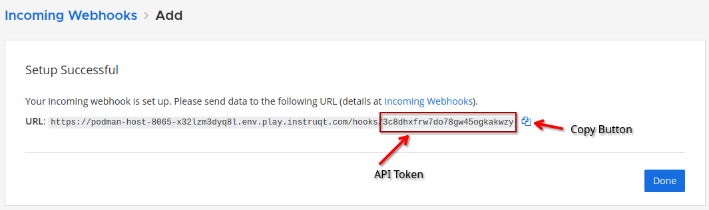

9. Copy the full URL using the copy icon at the end, switch to the [button label="VS Code"](tab-5) tab and paste it into a `chatapi.txt` file in your work dir (/home/rhel/aap_workshop).

> [!IMPORTANT]
> Do not lose the API Token. Make sure you save it so you can use the token later!

☑️ Task 2 - Updating Telegraf to receive telemetry from the cEOS router
===

In this exercise, we will be configuring `Telegraf` to receive BGP telemetry data by connecting to the gNMI server on a Arista cEOS router and then write that data to the `Kafka` topic named `network`, which we used previously. This is all done via `subscriptions`. We need to subscribe to the BGP neighbor states so we can be made aware of possible changes to the neighbor routers.

1. Switch to the [button label="telegraf"](tab-1) tab and open the `/etc/telegraf/telegraf.conf` file.

  ```bash
  sudo vim /etc/telegraf/telegraf.conf
  ```

2. Present `i` to enter insert-mode and add the following section to the file.

```bash
############################################## SWITCH 01  #############################################

[[inputs.gnmi]]
  ## Address and port of the GNMI GRPC server
  addresses = ["podman-host:6031"] ## Container Switch
  name_override = "ceos1"
  ## credentials
  username = "ansible"
  password = "ansible"

[[inputs.gnmi.subscription]]
  ## Name of the measurement that will be emitted
  name = "bgp_neighbor_state_ceos1"
  origin = "openconfig"
  path = "/network-instances/network-instance/protocols/protocol/bgp/neighbors/neighbor/state/session-state"
  subscription_mode = "on_change"
  sample_interval = "1s"
```

3. Save and exit from the **vim** editor by pressing `Esc`, `:wq` (that's a *colon, w, q*, no spaces) and `Enter`.

4. Restart `Telegraf` by running the following command.

  ```bash
  sudo systemctl restart telegraf
  ```

  5. Alright, with that, we are ready to receive any BGP session-state events from `ceos1` router on the `Kafka` topic `network`.

☑️ Task 3 - Verify BGP neighbor status on `ceos1`
===

Unless you have made changes to the `ceos1`, `ceos2` and `ceos3` routers, the three of them should continue to be BGP neighbors.

1. To verify that, switch to the [button label="Terminal"](tab-2) tab and ssh to `ceos1` router and execute the following command. The SSH login password for all three cEOS routers is `ansible`.

  ```bash
  ssh ansible@podman-host -p2001
  ```

  ```bash
  show ip bgp summary vrf all
  ```

  You should be receiving a similar output.

  ```
  ceos1#show ip bgp summary vrf all
  BGP summary information for VRF default
  Router identifier 1.1.1.1, local AS number 64496
  Neighbor Status Codes: m - Under maintenance
    Neighbor         V  AS           MsgRcvd   MsgSent  InQ OutQ  Up/Down State   PfxRcd PfxAcc
    10.0.0.1         4  64497             12        12    0    0 00:06:22 Estab   4      4
    10.0.0.4         4  64498             14        14    0    0 00:06:16 Estab   4      4
  ```

2. You can repeat the same for `ceos2` and `ceos3`. They are accessible on ports `2002` and `2003` respectively on the `podman-host`.

3. If BGP is not configured as expected on any of these, you can go to **AAP** > **Automation Decisions** > **Workflow Templates** and run the `BGP Workflow`. Alternatively, please feel free to reach out to any of the instructors for assistance.

☑️ Task 4 - Are we receiving messages?
===

Let us verify that our `Kafka` topic - `network` is receiving BGP session-state changes.

1. Switch to the [button label="kafka"](tab-3) tab and run the following command.

  ```bash
  /bin/kafka-console-consumer --bootstrap-server localhost:9092 --topic network --from-beginning
  ```

2. Go to the [button label="Terminal"](tab-2) tab and login to the `ceos3` router. We will simulate connectivity loss between `ceos1` and `ceos3`.
> [!NOTE]
> Remember the password for the `ceos` devices is `ansible`.

  ```bash
  ssh ansible@podman-host -p2003
  ```

3. Shutdown the `Ethernet3` interface.

  ```bash
  ceos3>enable
  ceos3#conf ter
  ceos3(config)#interface Ethernet 3
  ceos3(config-if-Et3)#shutdown
  ```

4. Go back to the [button label="kafka"](tab-3) tab and you should see a telemetry message similar to the following.

  ```json
  {"fields":{"session_state":"IDLE"},"name":"ceos1","tags":{"/network-instances/network-instance/protocols/protocol/name":"BGP","host":"control","identifier":"BGP","name":"default","neighbor_address":"10.0.0.4","source":"podman-host"},"timestamp":1730477949}
  ```

5. **Awesome!** We are all set to configure our rulebook activation in EDA and the corresponding action in Automation Controller.

### Before that, let's revert our last changes so we can test the automation

7. Switch to the [button label="Terminal"](tab-2) tab, you should be still logged in the `ceos3` router.

8. Follow the commands below to issue a  `no shutdown` to the `Ethernet 3` interface.

  ```bash
  ceos3(config-if-Et3)#no shutdown
  ceos3(config-if-Et3)#end
  ceos3#exit
  ```

9. In the [button label="Terminal"](tab-2) tab,  SSH to the `ceos1` device


  ```bash
  ssh ansible@podman-host -p2001
  ```

10. Check that both the BGP neighbors of `ceos1` are in `Estab` state.

  ```bash
  ceos1>enable
  ceos1#show ip bgp summary vrf all
  BGP summary information for VRF default
  Router identifier 1.1.1.1, local AS number 64496
  Neighbor Status Codes: m - Under maintenance
    Neighbor         V  AS           MsgRcvd   MsgSent  InQ OutQ  Up/Down State   PfxRcd PfxAcc
    10.0.0.1         4  64497             12        12    0    0 00:06:22 Estab   4      4
    10.0.0.4         4  64498             14        14    0    0 00:06:16 Estab   4      4
  ```

☑️ Task 4 - Setting up our Rulebook
===

Now it's time to setup and activate our rulebook in Event-Driven Ansible.

### Setup the rulebook first:

1. Switch to the  [button label="VS Code"](tab-5)  tab
2. In the `rulebooks` directory, create a file named `bgp-notify-rules-1.yml`
3. Copy and paste the following content into it:

```yaml
---
- name: BGP neighbor state event from Arista
  hosts: localhost
  sources:
   - ansible.eda.kafka:
       host: broker
       port: 9092
       topic: network
  rules:
   - name: BGP neighbor is down
     condition: event.body.fields.session_state == "IDLE"
     actions:
       - run_job_template:
           name: "EDA-Notify-Mattermost"
           organization: "Default"
           job_args:
             extra_vars:
               bgp_state: "{{ event.body.fields.session_state }}"
               bgp_prob_neighbor: "{{ event.body.tags.neighbor_address }}"
               bgp_timestamp: "{{ event.body.timestamp }}"
               bgp_error_type: "{{ event.body.tags.identifier }}"
```
> [!NOTE]
> The run_job_template `EDA-Notify-Mattermost` hasn't been created yet, we will create it in the next step.

4. **Commit changes to Git** in VS Code as before

### Let's import the Rulebook into AAP:

1. Switch to the [button label="AAP"](tab-4) tab and login.
2. Go to the **Automation Decisions** left sidebar menu, click on **Projects** and press the **Sync** arrows for the  `NetOps Rulebooks` project.
> [!WARNING]
> If you forgot to commit to Git in VS Code you won't find the new Rulebook in the Project.
3. In the **Automation Decisions** left sidebar menu, click on **Rulebook Activations**.

  

4. Click on **Create rulebook activation**, fill out the form with the following details and click on **Create rulebook activation**.

  ```
  Name: Arista Telemetry - Notify
  Organization: Default
  Project: NetOps Rulebooks
  Rulebook: bgp-notify-rules-1.yml
  Credential: AAP
  Decision environment: NetOps Decision Environment
  Restart Policy: Always
  Log level: Info
  ```
  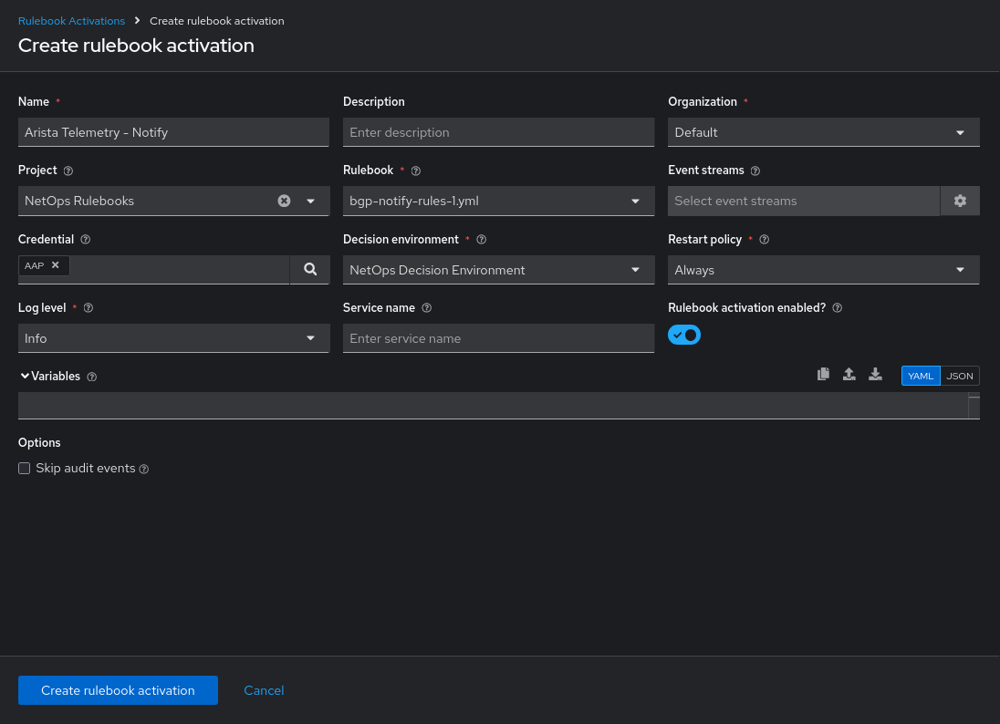

 5. Once saved, you will see that the Rulebook is running.

  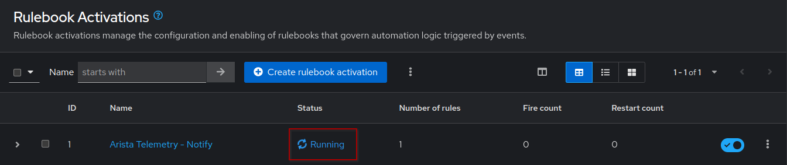

### But what did we create?

The `bgp-notify-rules-1.yml` uses the `ansible.eda.kafka` source plugin to listen for events from the `Kafka` topic called `network`. Telegraf will `dial-in` to the `ceos1` and get telemetry data related to BGP session state (as configured in the `telegraf.conf` file). This data will then be written to the `Kafka` topic - `network` which will then be read by EDA.

This rulebook has a single rule named `Look for BGP neighbor IDLE state and notify` which looks for an event signifying that a BGP neighbor went down. Once this rule is matched, the job template `EDA-Notify-Mattermost` will be launched and EDA will pass the name of the neighbor that went down, the BGP session state, the timestamp and tag/identifier to it. All of these fields are available in the telemetry data and will be a part of the `event` dictionary.


☑️ Task 5 - Setting up our notification action
===

### Setup the playbook first:

1. Switch to the [button label="VS Code"](tab-5) tab
2. Return to the file Explorer in VS Code (first icon on the left sidebar)
3. In the `playbooks` directory, create a file named `notify_mattermost.yml`
4. Copy and paste the following content into it:

```yaml
---
- name: BGP Change Observation
  hosts: localhost
  connection: local
  gather_facts: false
  tasks:
    - name: Send notification message via Mattermost
      delegate_to: localhost
      community.general.mattermost:
       url: http://podman-host:8065
       api_key: "{{ MATTERMOST_API_TOKEN }}"
       attachments:
         - text: "!!!!!! ALERT !!!!!!"
           color: '#ff00dd'
           title: BGP ERROR
           fields:
            - title: Issue Detected
              value: "BGP Session: {{ bgp_state }}"
              short: true
            - title: Potential Problem
              value: "Problematic node/path: {{ bgp_prob_neighbor }}"
              short: true
            - title: Message
              value: "Event detected issue, human intervention is required."
              short: true
```
4. **Commit changes to Git in VS Code**


### Let's import the Playbook into AAP:

1. Switch to the [button label="AAP"](tab-4) tab and login.
2. Go to the **Automation Execution** left sidebar menu, click on **Projects** and press the **Sync** arrows for the  `NetOps Playbooks` project.
3. In the **Automation Execution** left sidebar menu, click on **Templates** > **Create template** > **Create job template**
4. Populate the form with the following details and click on **Create job template**.


```
Name: EDA-Notify-Mattermost
Description: Notify about BGP neighbor IDLE state
Job type: Run
Inventory: NetOps Inventory
Project: NetOps Playbooks
Playbook: playbooks/notify_mattermost.yml
Execution environment: network-ee
Extra variables: Select Prompt on launch
Extra variables:
  MATTERMOST_API_TOKEN: <enter the Mattermost API Token that you saved earlier>
```

  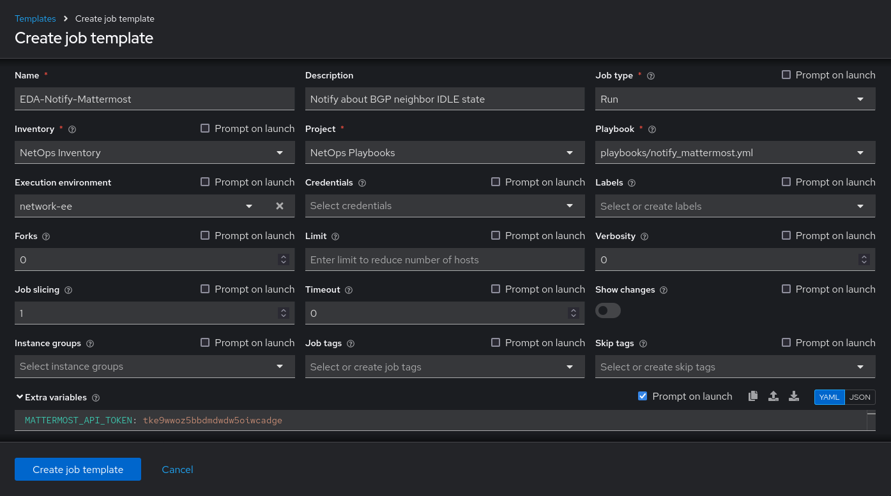

> [!IMPORTANT]
> Make sure the `Prompt on launch` box in `Extra variables` is checked.
> This is to allow Event-Driven Ansible to be able to pass event payload data such as device names/ports etc to the Automation Controller as variables.
> This allows us to work with payload data in our automation.

### But what did we create?

The `notify_mattermost.yml` playbook contains a task that uses the `community.general.mattermost` module. This module sends a notification to the `Mattermost` application which is running on port `8065` of the `podman-host` node in our lab. The task also sets the `api_key` parameter to the variable called `MATTERMOST_API_TOKEN` which we set earlier when creating the `Job Template`. In the `attachments` of the message, it passes the BGP state, the problematic neighbor and a message indicating that something has went wrong and human intervention is required.

Okay, that's it. Now we can simulate a BGP neighbor going down (again!) and see what EDA does.

☑️ Task 6 - Seeing it all in action
===

1. Go to the [button label="Terminal"](tab-2) tab and SSH to the `ceos3` router.

  ```bash
  ssh ansible@podman-host -p2003
  ```

2. Shutdown `Ethernet3` interface like we did before.

  ```bash
  ceos3>enable
  ceos3#conf ter
  ceos3(config)#interface Ethernet 3
  ceos3(config-if-Et3)#shutdown
  ```

3. Switch to the [button label="chat"](tab-0) tab
4. You might need to click **Back to Mattermost** in the top left if you are still in the *Incoming Webhooks* screen
5. You should be in the **Town Square** channel now. In a few moments, a message should show up notifying about the BGP session state becoming `IDLE` for neighbor `10.0.0.4`.
> [!NOTE]
> It might take a few seconds for the message to arrive. Wait for a bit!

  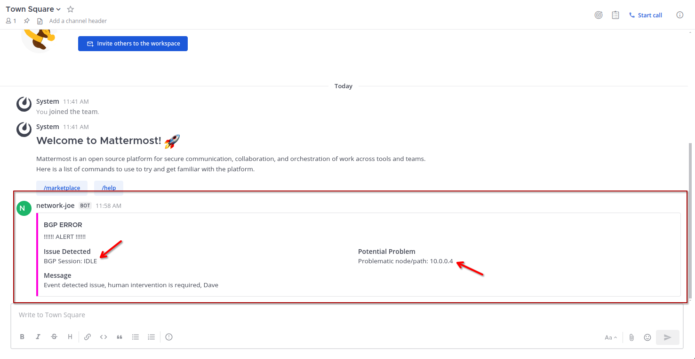

☑️ (Optional) Task 7 - Check Rule Audit
===

1. Switch to the [button label="AAP"](tab-4) tab
2. Go to **Rule Audit** section in the **Automated Decisions** drop-down menu in the left side-bar of **AAP**.

  

2. Click on `Look for BGP neighbor IDLE state and notify`.

3. Go to the `Events` tab and click on `ansible.eda.kafka`.

4. The event details would show up. Once you have gone through it, click on the **Close** button.

  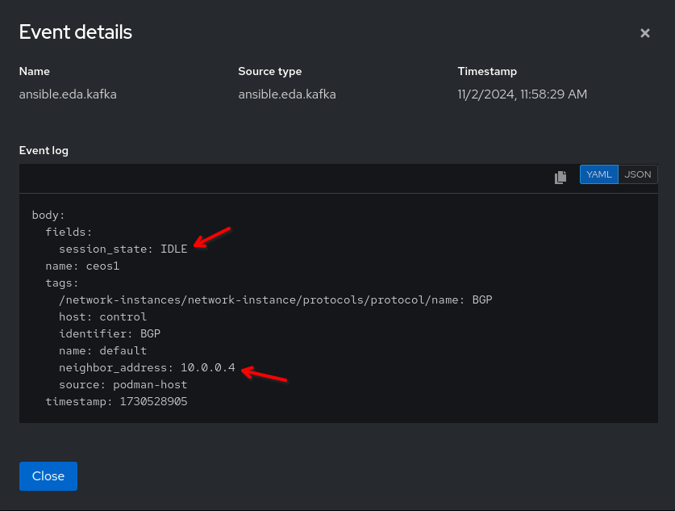

✅ Next Challenge
===

Press the `Next` button below to go to the final challenge of this workshop once you’ve completed the task.
