EDA: ChatOps
===

In this exercise, we will send out a message contain certain trigger words from the `Town Square` channel in our `Mattermost` application and see how Event-Driven Ansible launches a Workflow Template as an action this is event.

We will simulate a BGP neighbor going down - but this time, it will be because of a missing BGP configuration line (instead of an interface going down) on the `ceos1` router that may have been introduced by out-of-band changes. Event-Driven Ansible will first notify in the `Town Square` channel about the BGP session state going `IDLE`, because the rulebook from our previous exercise should still be running. Once the notification is received, we will send out a message containing the words `remediate-bgp`. EDA will detect this message and start the `BGP Workflow` workflow template, that we configured in a previous exercise, which would fix the missing/incorrect configuration line and also validate the operational state of BGP on `ceos1`.

> [!IMPORTANT]
> This exercise assumes that the `BGP Workflow` workflow template is created and verified to be working. If you skipped the `controller-101-workflow` exercise, you would need to go back and complete it. Additionally, this exercise also requires the `eda-controller-notification` exercise to be completed. Please reach out to an instructor if you need any help.

☑️ Task 1 - Setting up outgoing webhooks
===

In the previous exercise, we used incoming webhooks on the chat interface allowing us to communicate to the team on things taking place. This time we are going to reverse that, and have an outgoing webhook to trigger some action using the `ansible.eda.webhook` source plugin for Event-Driven Ansible.

1. Navigate to the [button label="chat"](tab-0) tab, and click on the **GRID** menu and select `System Console`.

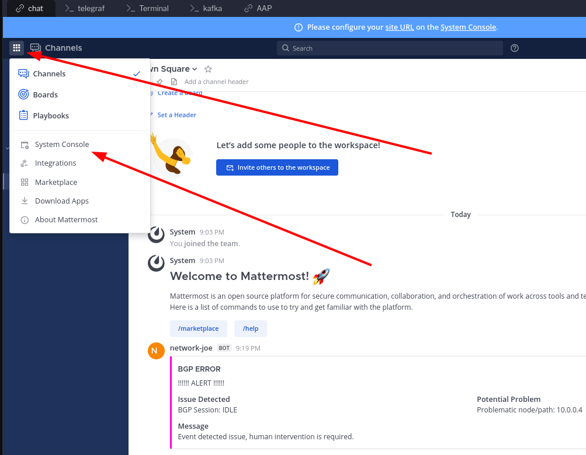

2. From there, you will need to scroll down until you find `Developer` under the **Environment** stack. Click on it.

  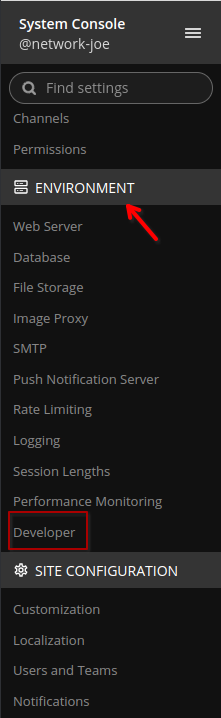

3. In the `Allow untrusted internal connections to:` field, enter `control`
4. Click on **Save**. This allows communication to the lab node running **AAP**.

  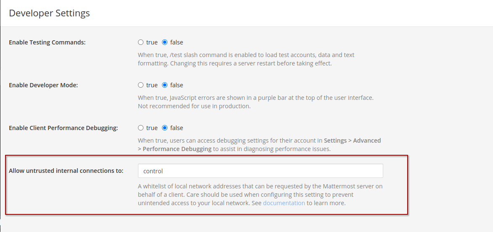

4. Click on **Back to NetOps**.

5. Click on the **GRID** again and select `Integrations`.

  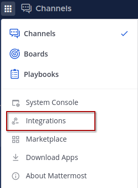

6. Select `Outgoing Webhooks` and click on `Add Outgoing Webhook`.

  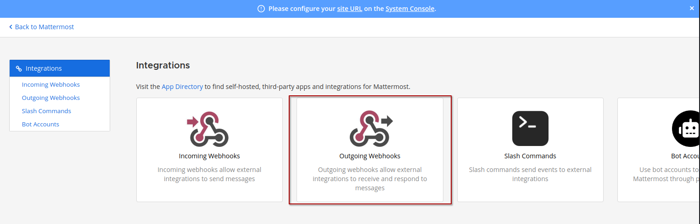

  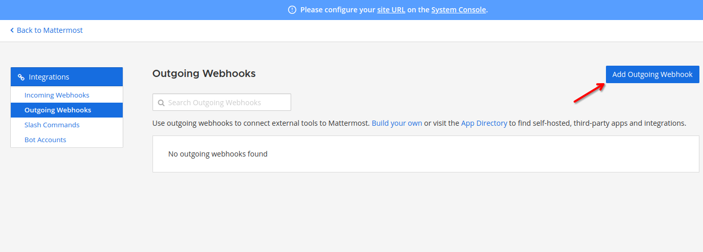

7. Configure the webhook with the following details and click on **Save** and then **Done**.

  ```
  Title: ChatOps with EDA
  Content Type: application/json
  Channel: Town Square
  Trigger words: remediate-bgp
  Callback URL: http://control:5000/endpoint
  ```

  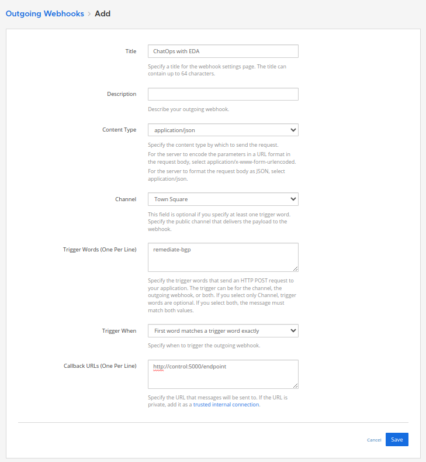

8. Click on `Back to Mattermost`. You should be back to the `Town Square` channel.

☑️ Task 2 - Setting up rulebook
===

### Create the Rulebook
1. Switch to the [button label="VS Code"](tab-5) tab
2. Create a file `bgp-chatops.yml`  in the `rulebooks` directory
3. Copy and paste the following content:

```yaml
---
- name: Listen for Mattermost events on a webhook
  hosts: all
  sources:
    - ansible.eda.webhook:
        host: 0.0.0.0
        port: 5000

  rules:
    - name: Look for a webhook event to remediate BGP
      condition: event.payload.channel_name  == "town-square" and event.payload.trigger_word == "remediate-bgp"
      action:
        run_workflow_template:
          name: "BGP Workflow"
          organization: "Default"
```
4. Commit the changes to Git from VS Code

### Let's use the Rulebook

1. Switch to the [button label="AAP"](tab-4) tab
2. Remember to **Sync** the `NetOps Rulebooks` project to download the latest changes from the repository
3. In the **Automation Decisions** left sidebar menu, click on **Rulebook Activations**.

  

4. Click on **Create rulebook activation**, fill out the form with the following details and click on **Create rulebook activation**.

> [!NOTE]
> If you can't find the `bgp-chatops.yml` rulebook below, make sure you commited to Git in VS Code and synced the NetOps Rulebooks project.

  ```
  Name: Arista Webhook - Chatops
  Organization: Default
  Project: NetOps Rulebooks
  Rulebook: bgp-chatops.yml
  Credential: AAP
  Decision environment: NetOps Decision Environment
  Restart Policy: Always
  Log level: Info
  ```

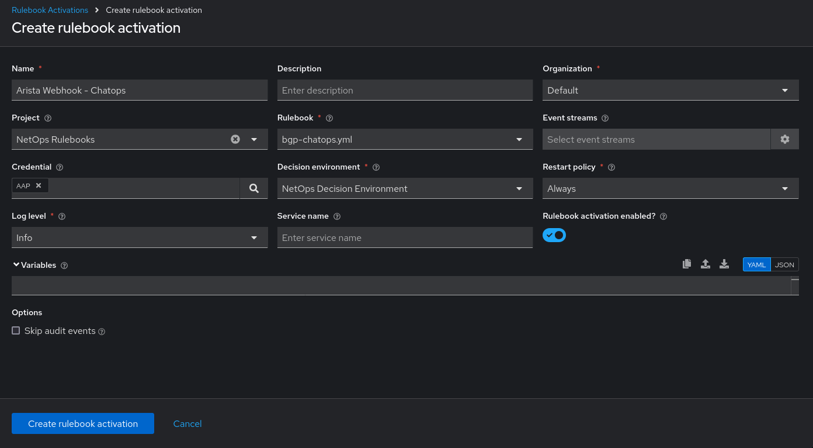

5.  Once saved, you will see that the Rulebook is running.

  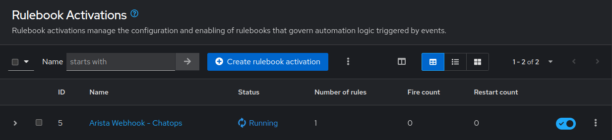

### But what did we create?

The `bgp-chatops.yml` rulebook uses the `ansible.eda.webhook` source plugin. This rulebook contains on rule, that listens for webhook events coming from Mattermost where the payload has the `channel_name` set to `town-square` and the `trigger_word` is `remediate-bgp`. Relate this to `Task 1` of this exercise, where we created an outgoing webhook integration from the `Channel: Town Square` and `Trigger words: remediate-bgp`. Once the rule condition matches, we execute a pre-existing `Workflow Template` called `BGP Workflow` using the `run_workflow_template` action.

> [!NOTE]
> Our remediation `BGP Workflow`  (a Workflow Job Template we created previously) should already exist by the time we reach this exercise.


☑️ Task 3 - Generating events and watching EDA in action
===

1. Navigate to the [button label="Terminal"](tab-2) tab and login to the `ceos3` router.

  ```bash
  ssh ansible@podman-host -p2003
  ```

2. Bring up the `Ethernet 3` interface to re-establish BGP connection with `ceos1`.

  ```bash
  ceos3>enable
  ceos3#conf ter
  ceos3(config)#interface Ethernet 3
  ceos3(config-if-Et3)#no shutdown
  ceos3(config-if-Et3)#end
  ceos3#exit
  ```

3. Login to `ceos1` and verify that BGP session-state is established with both the neighbors.

  ```bash
  ssh ansible@podman-host -p2001
  ```

  ```
  ceos1>enable
  ceos1#show ip bgp summary vrf all
  BGP summary information for VRF default
  Router identifier 1.1.1.1, local AS number 64496
  Neighbor Status Codes: m - Under maintenance
    Neighbor         V  AS           MsgRcvd   MsgSent  InQ OutQ  Up/Down State   PfxRcd PfxAcc
    10.0.0.1         4  64497             12        12    0    0 00:06:22 Estab   4      4
    10.0.0.4         4  64498             14        14    0    0 00:00:15 Estab   4      4
  ```

4. Now, we break BGP by removing a neighbor configuration line from `ceos1`.
5. You should still be logged in the `ceos1` device. Input the following commands (after the `#`)

  ```bash
	ceos3>enable
  ceos3#conf ter
  ceos1(config)#router bgp 64496
  ceos1(config-router-bgp)#no neighbor 10.0.0.4 remote-as 64497
  ceos1(config-router-bgp)#end
  ceos1#exit
  ```

5. Switch to the [button label="chat"](tab-0) tab and you should notice another new notification delivered by the rulebook:
6.  `Arista Telemetry - notify` from the previous exercise regarding the `10.0.0.4` (`ceos3`) neighbor going down.

7. Since we know that this happened because we removed the BGP configuration line for this neighbor from `ceos1`, let us remediate it with the help of EDA. From the `Town Square` channel, click on `Write to Town Square`.

  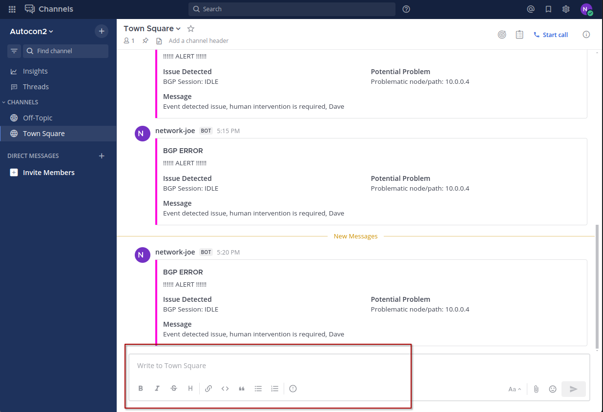

8. Type `remediate-bgp` and hit `Enter` or click on the `Send` arrow button.

  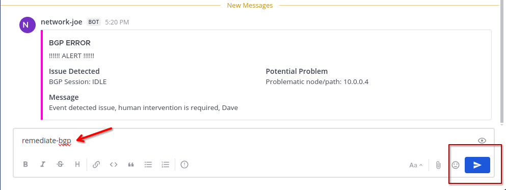

9. Go back to the [button label="AAP"](tab-4) tab.

10. In the **Automation Execution** left sidebar menu, click on **Jobs**. In a few moments, you should see the `BGP Workflow` and the job templates in the workflow - `Configure BGP` and `Validate BGP` running.

  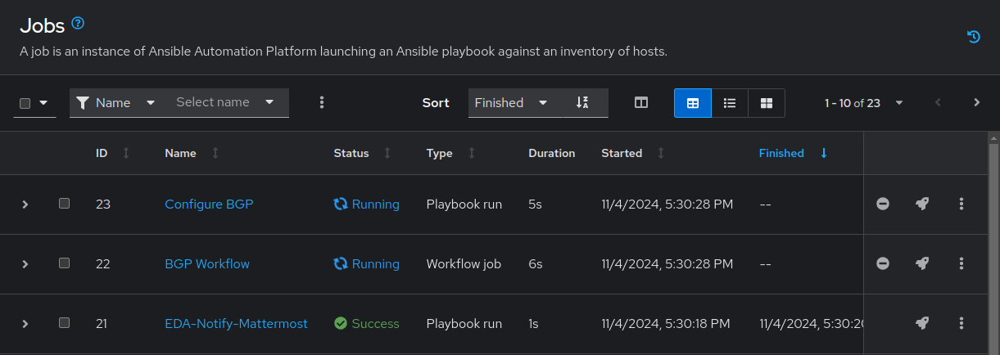

10. Wait for the jobs to complete and click on the `BGP Workflow`.

  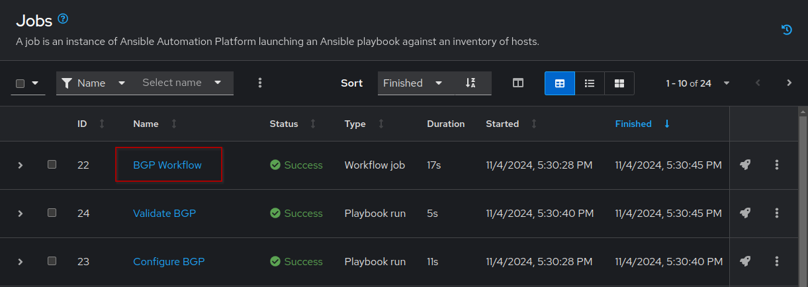

11. Once the workflow visualizer opens up, you would see that both the `arista-configure-bgp` and `arista-validate-bgp` jobs ran since the `BGP Workflow` workflow was triggered by Event-Driven Ansible when it received the webhook event with a payload containing `remediate-bgp`. Click on the jobs individually and verify the runs. Since the `arista-validate-bgp` job ran successfully, it indicates that the BGP neighbor is back up again. You would also notice that _only_ the `ceos1` host reports `changed=True`. This is because we did not make any changes to any other cEOS routers. The missing configuration line was on `ceos1`.

  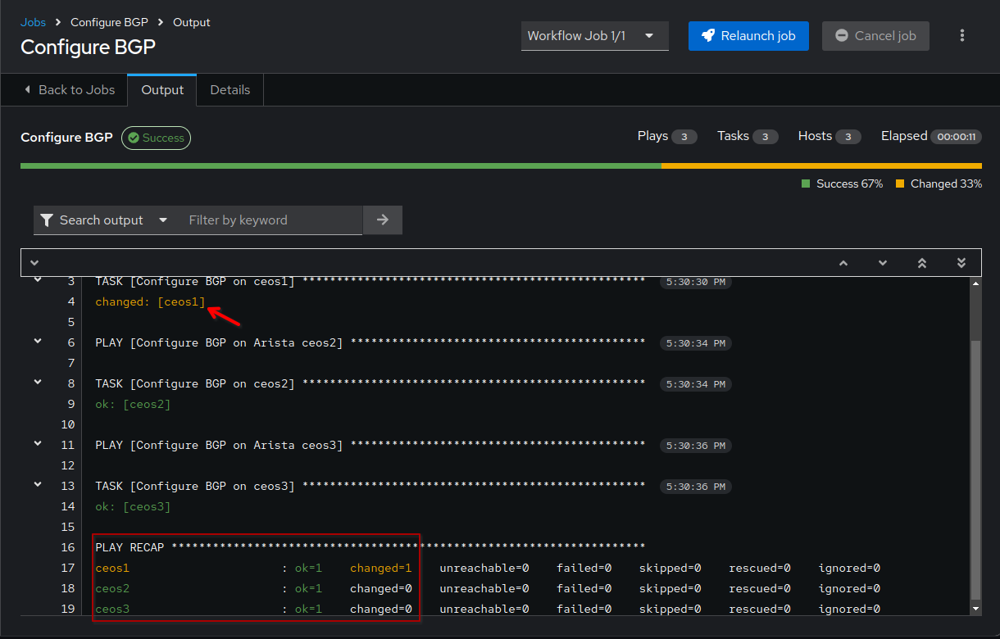

In the stdout pane, if you click on the `changed: [ceos1]` line, it would give you `Host Details`. In that, go to the `Data` tab and you will see the exact commands that were sent to `ceos1`. As you can see, the `arista.eos.eos_bgp_global` Resource Module identified the "configuration drift" and computed the exact set of commands to be sent.

  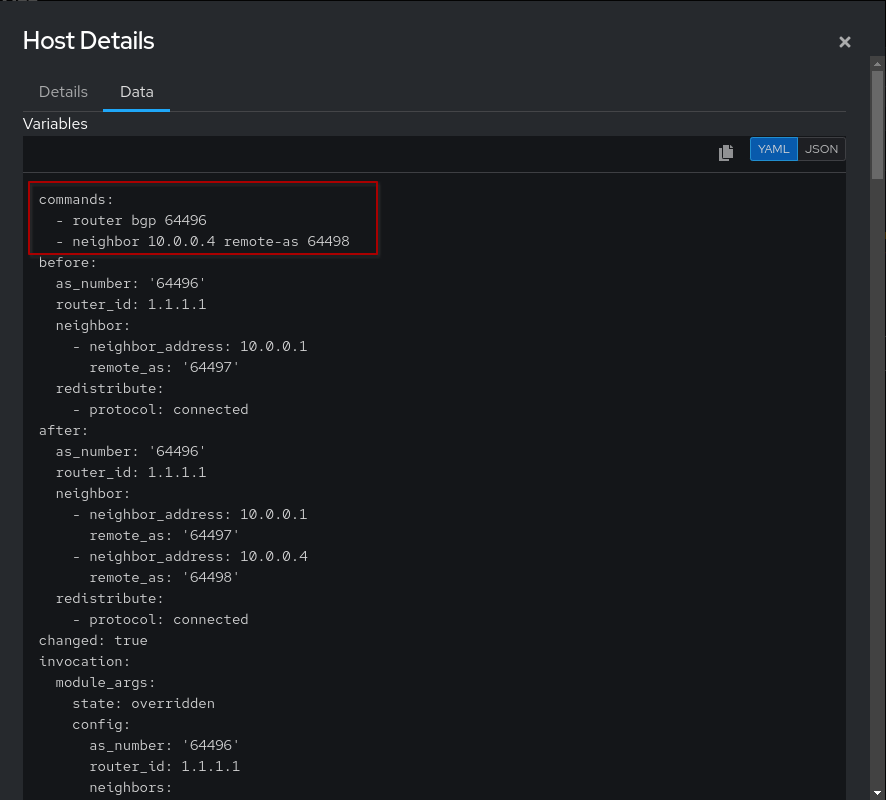

12. Go back to [button label="Terminal"](tab-2) tab and SSH to `ceos1`. Verify the BGP configuration and operational state.

  ```bash
  ssh ansible@podman-host -p2001
  ```

  ```bash
  ceos1>enable
  ceos1#show running-config | section bgp
  router bgp 64496
    router-id 1.1.1.1
    neighbor 10.0.0.1 remote-as 64497
    neighbor 10.0.0.4 remote-as 64498
    redistribute connected
  ```

  ```bash
  ceos1#show ip bgp summary vrf all
  BGP summary information for VRF default
  Router identifier 1.1.1.1, local AS number 64496
  Neighbor Status Codes: m - Under maintenance
    Neighbor         V  AS           MsgRcvd   MsgSent  InQ OutQ  Up/Down State   PfxRcd PfxAcc
    10.0.0.1         4  64497             53        75    0    0 00:47:11 Estab   4      4
    10.0.0.4         4  64498             23        23    0    0 00:15:11 Estab   4      4
  ceos1#
  ```

  As this also confirms, the session-state with `10.0.0.4` (`ceos3`) neighbor is `Established` again! EDA successfully remediated the erroneous changes.

☑️ (Optional) Task 4 - Check the Rule Audit
===

1. Switch to the [button label="AAP"](tab-4) tab
2. Go to **Rule Audit** section in the **Automated Decisions** drop-down menu in the left side-bar.

  

2. Click on `Look for a webhook event to remediate BGP`.

  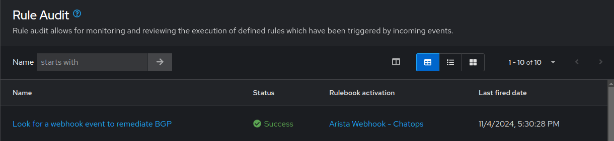

3. Go to the `Events` tab and click on `ansible.eda.webhook`. You will see the event details.

  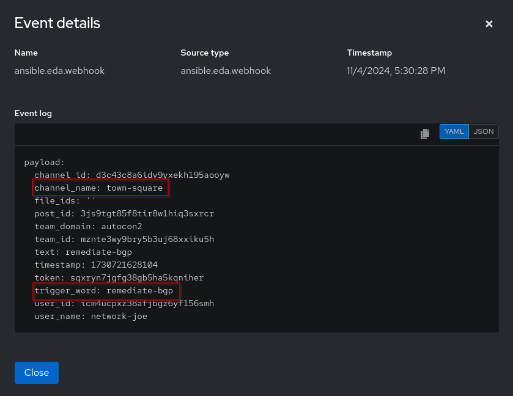

✅ What's Next?
===
Congratulations on finishing the Event Driven-Ansible with Cisco and Arista workshop!

We hope you had a great time going through the exercises and learnt several concepts about Red Hat Ansible Automation Platform!

There is a bonus exercises following after, please press the `Next` button if you would like to go through those. Else, you could end the workshop here.

Thank you for you time! Happy Automating! 🎉
