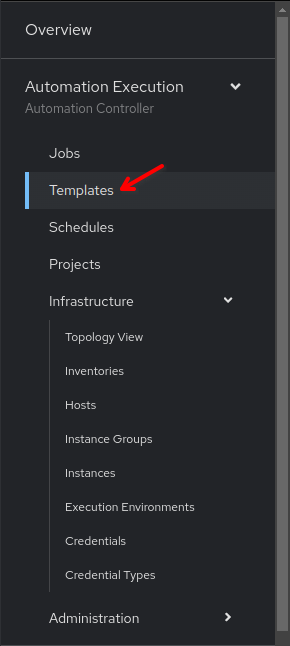
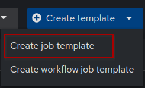
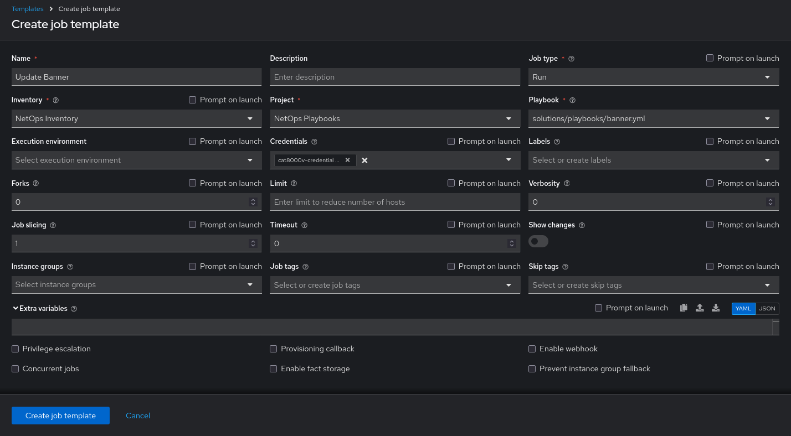
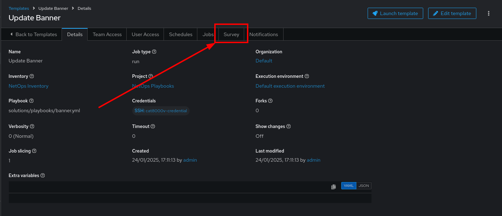
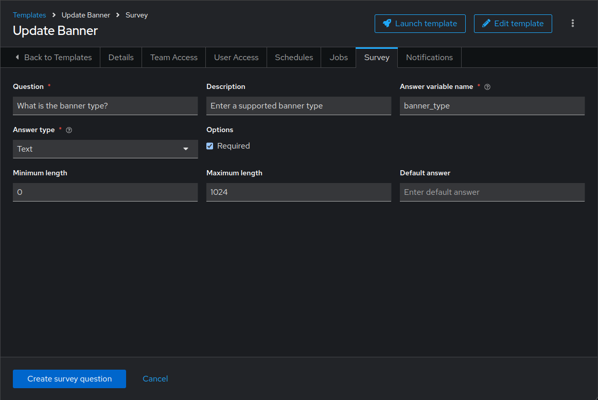
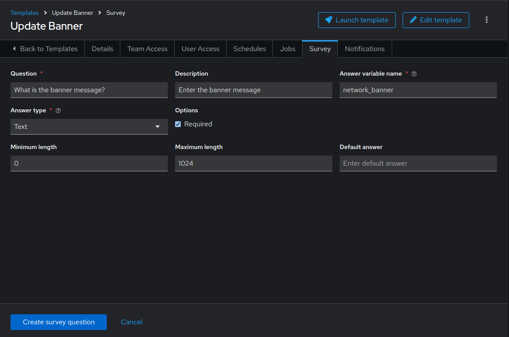
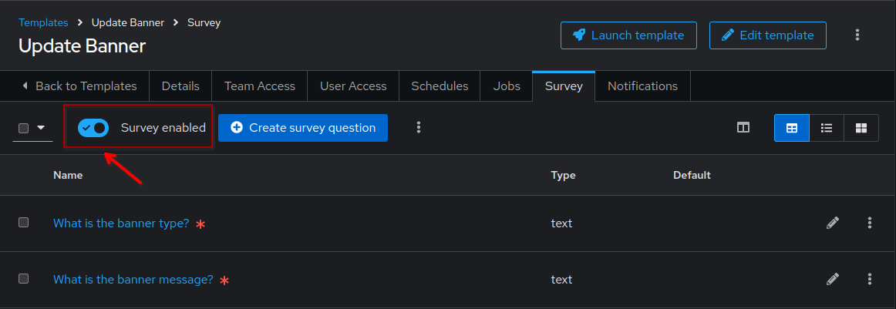
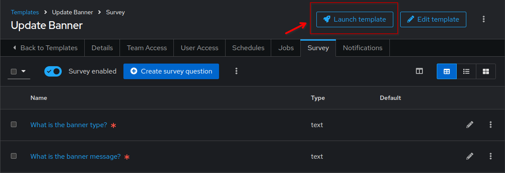
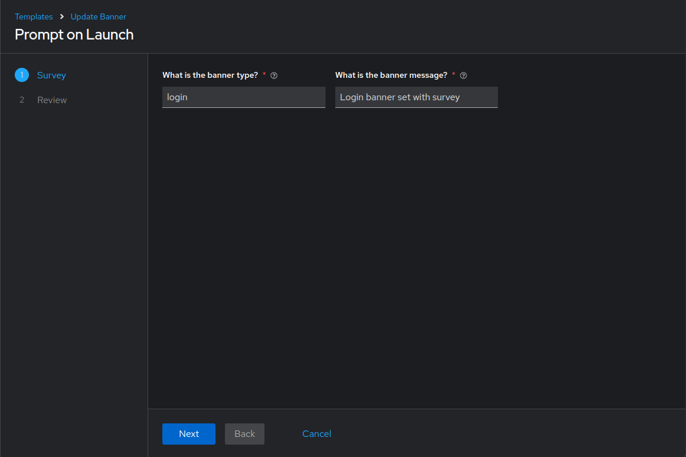
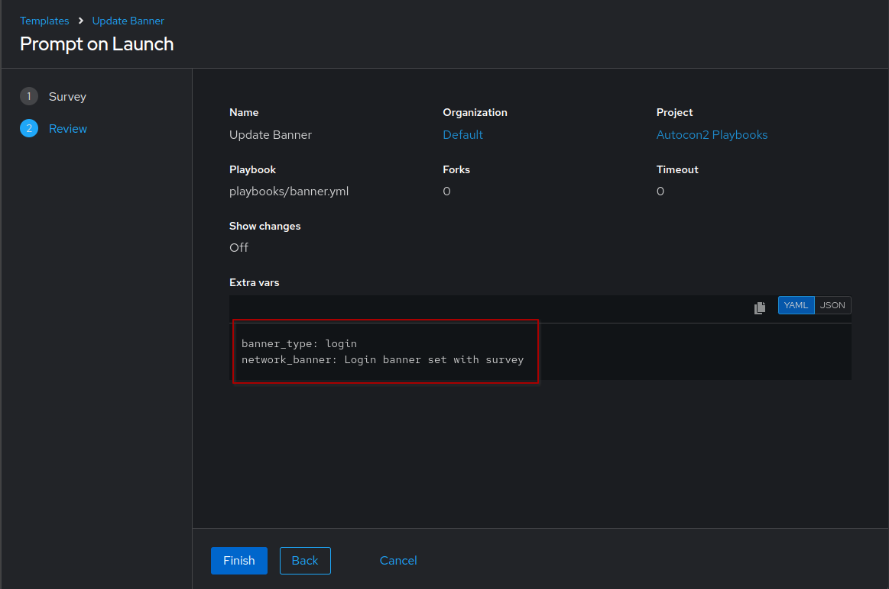

🎉 Success!
===
If you want to try the **Survey** feature of Ansible Automation Platform continue with the tasks below.

> [!IMPORTANT]
> BONUS TRACK!
> This is an ***optional bonus tracks*** for this workshop. If you want to finish right now and skip this challenge, simply press the `Next` button at the bottom.

📑 Bonus track: Job Template with a Survey
===

In this challenge, we will explore the **Survey** feature, which allows us to input a variable at runtime when we execute our **Job Template** (playbook), making it possible to change a parameter or setting at each run. We will be changing the login banner of the Cisco Cat8000v device we set previously in one of the initial exercises using a **Survey**.

☑️ Task 1 - Creating the Job Template
===

1. Go to the [button label="AAP"](tab-2) tab and click the **Templates** link under the **Automation Execution** section of the sidebar.

  

2. Click the **Create template** dropdown button and select **Create job template**. Fill out the form with the following details.

  

3. Fill out the form with the following details and click on **Create job template**.

  ```bash
  Name: Update Banner
  Description: Create or update banner on Cat8000v using Surveys
  Job type: Run
  Inventory: NetOps Inventory
  Project: NetOps Playbooks
  Playbook: solutions/playbooks/banner.yml
  Credentials: cat8000v-credential
  ```



### But what did we import?

The `banner.yml` configures a banner on Cisco devices. The `banner` and the `text` parameters are set to `banner_type` and `network_banner` variables respectively. In the previous exercise involving banners, we populated those variable by loading them from a file. This time, we are going to take these as inputs from a `survey` while launching the job template.

☑️ Task 2 - Adding surveys to the Job Template
===

1. Once the job template is created, go to the `Survey` tab.



2. Click on **Create survey question**.
3. Fill the form with the following details and click on **Create survey question** blue button.

  ```bash
  Question: What is the banner type?
  Description: Enter a supported banner type
  Answer variable name: banner_type
  Answer type: Text
  ```

  

4. Click on **Create survey question** once done.
5. Let's create another question.
6. Click on **Create survey question** again,  and fill the form with the following details this time.

  ```bash
  Question: What is the banner message?
  Description: Enter the banner message
  Answer variable name: network_banner
  Answer type: Text
  ```

  

7. Click on **Create survey question** once done.
8. Now to finish, let's enable the survey for this Job Template.

  

☑️ Task 3 - Executing the Job Template
===

1. Once survey is enabled for this Job Template, launch it by clicking on the **Launch Template** button.

  

2. This will start the survey. Enter answers for the `What is the banner type?` and `What is the banner message?` questions. Click on **Next**.

  ```bash
  What is the banner type? - login
  What is the banner message? - Login banner set with survey
  ```

  

3. Review the `Extra vars` set and click on **Finish**. The job template would start to run. Wait for it to complete.

  

☑️ Task 4 - Verifying the banner
===

1. Go to the [button label="Terminal"](tab-4) tab and ssh to the `cisco` device.

  ```bash
  ssh admin@cisco
  ```

2. As you login to the device, you should already see the new banner message.


✅ What's Next?
===
That's the end of the bonus exercise for this workshop. If you wish to explore more hands-on labs with Ansible, go to [Ansible Interactive Labs](https://red.ht/ansible-labs) page.

For any feedback or for reporting issues around this workshop, please open an issue in the [ansible/instruqt](https://github.com/ansible/instruqt) repository.

Thank you for you time! Happy Automating! 🎉
