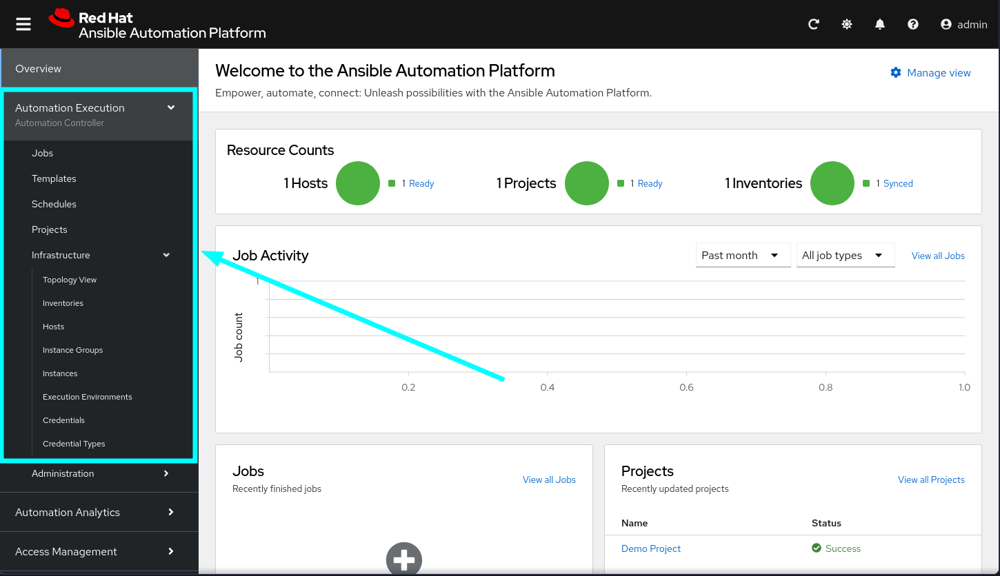
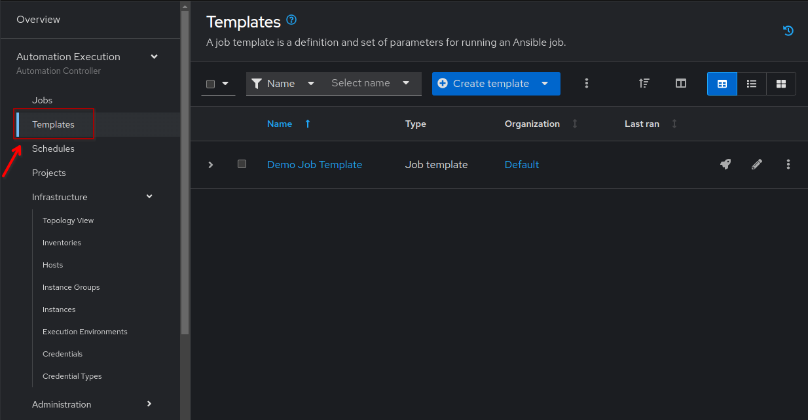

1 - Network Automation and Sources of Truth
===

**Ansible Automation Platform** is a unified solution for strategic automation. It combines the security, features, integrations and flexibility needed to scale automation across domains, orchestrate essential workflows and optimize IT operations to successfully adopt enterprise AI.

**NetBox** is widely deployed in enterprise footprints and is trusted by IT, networking and datacenter teams . Combining the capabilities of DCIM and IPAM into a comprehensive network source of truth, NetBox is the perfect partner to Ansible Automation Platform and your network.

**NetOps** is an approach to network operations that focuses on rapid deployments and agility. It is also referred to as NetOps 2.0 or NetDevOps, and has become the standard operating procedure for digital enterprises working to keep pace with customer expectations. NetOps includes elements of automation, orchestration, and continuous validation to enable agile development and application delivery in modern IT organizations with complex network infrastructure.

In this laboratory we will get started with Network Automation and Sources of Truth using **Ansible Automation Platform 2.5** together with **NetBox**.  We will do hands-on exercises to configure NetBox as a Dynamic Inventory in Ansible Automation Platform using their **Certified Content Collection**, and integrate it with **Event-Driven Ansible** through webhooks to listen to events in your network and take action.


👋 Introduction to Ansible Automation Platform web-UI
===

Welcome to Red Hat Ansible Automation Platform. The new unified web-UI in Ansible Automation Platform 2.5 has integrated all the components into a single control dashboard. We will be exploring the Automation Execution (automation controller) and Automation Decision (event-driven ansible) functionality during this workshop. For this exercise we will focus on the **Automation Execution (Automation controller)** and it's features, highlighted below:



In the following exercises we will  show you how to configure NetBox as your AAP Dynamic Inventory and how to setup Event-Driven Ansible in the web-UI like you would in a corporate environment to run your Ansible automation.

Switch to the  [button label="AAP"](tab-0) tab and you should see the Ansible Automation Platform login screen. Let's explore the unified UI.

Login to it using the following credentials and then continue on to the tasks:

> [!IMPORTANT]
> * Username: `admin`
> * Password: `ansible123!`

☑️ Task 1 - Explore the Overview
===

Explore the **Overview**.  The initial screen will show little information due to the lack of playbooks, hosts, and executions, but take a look now and you will be able to compare it to the end result once you finished the lab.

You will find the following card-like sections in the **Overview** screen:

* **Resource counts**: This section will show a summary of **hosts**, **projects** and **inventories**
* **Job activity**: This section will show a graph with the past month Job runs
* **Jobs**: A list of recently run jobs
* **Projects**: A list of recently updated projects
* **Inventories**: A list of recently updated inventories

If you click any of the titles (or "View all" links) it will take you to the corresponding section. We recommend you take a peek at them.

And at the bottom, check the new card-like section in the Overview screen of Ansible Automation Platform 2.5 that includes the new **Quick Start Guides**, our interactive in-line tutorials:


This new section will prove to be very useful for learning about all the features in AAP right after you install it, as you will get instructions for using them without leaving the interface.

☑️ Task 2 - Explore the Inventories section
===

In the left side-bar, click on the **Automation Execution** drop-down menu to expand it. Go to **Infrastructure** > **Inventories** and explore the **Demo inventory** that comes pre-loaded. For now, just explore the different tabs to familiarize with the fields. You will create your own soon!


An **Inventory** is a collection of hosts against which playbooks may be launched or run against. Basically, the "managed nodes" or devices we are automating. The inventory here is the same as an inventory file you might know from working with Ansible on the command line.

**Inventories** in AAP have several advantages over file based ones, you get all the functionality from the latter ones, with added features and better reusability.

☑️ Task 3 - Explore the Projects section
===

In the sidebar menu, under the **Automation Execution** click on the **Projects** submenu and explore the **Demo project** that comes pre-loaded. You will see all the fields available to use when creating one. Don't forget to look at the tabs!

**Projects** are logical groups of Ansible playbooks in automation controller. These playbooks usually reside in a source code version control system like Git (and platforms as Github or Gitlab). With **Projects** we can reference a repository or directory with one or several playbooks, that we will later use.


☑️ Task 4 - Explore the Templates section
===

In the sidebar menu, under the **Automation Execution** click on the **Templates** submenu and explore the **Demo Job Template** that comes pre-loaded.

A `job template` is a definition and set of parameters for running an Ansible job. Job templates are useful
to run the same job many times. They also encourage the reuse of Ansible Playbook content and
collaboration between teams. Later on in this workshop, we will be creating our own Job Templates.



✅ Next Challenge
===

Press the `Next` button below to go to the next challenge once you’ve completed the tasks.


🐛 Troubleshooting
===

> [!WARNING]
>  - NetBox needs a couple of minutes to get started.
> - In case of problems accessing the NetBox tab, go to the AAP Terminal tab and run the following commands:
> ```
> docker compose --project-directory=/tmp/netbox-docker stop`
> ```
> ```
> docker compose --project-directory=/tmp/netbox-docker up -d netbox netbox-worker`
> ```