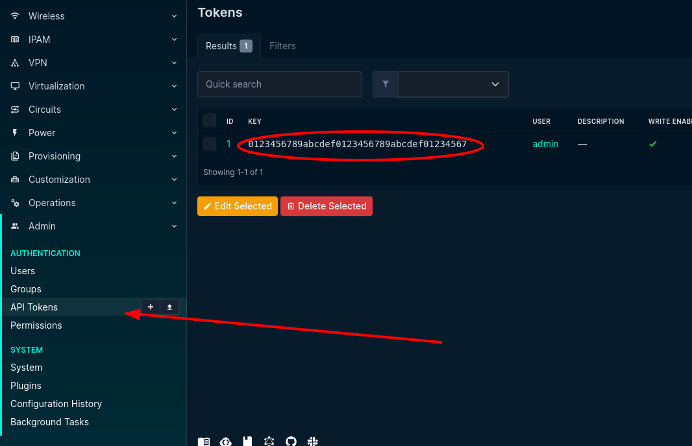
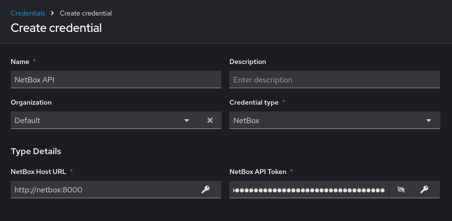
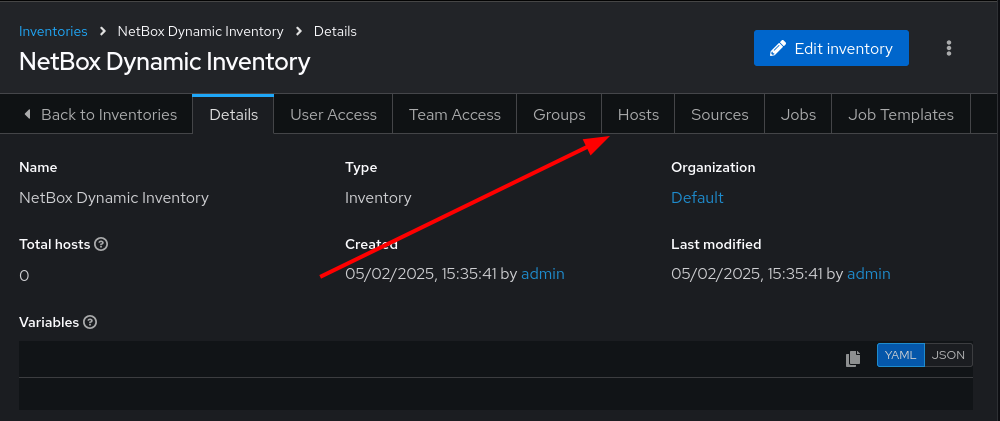
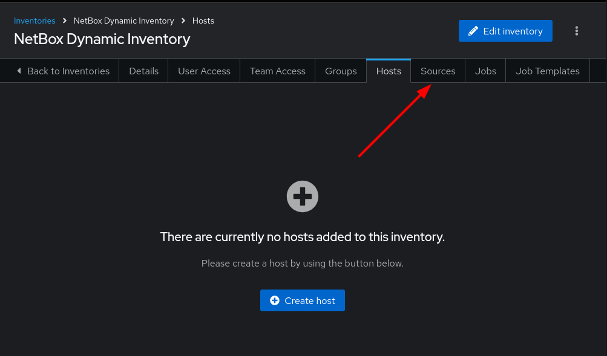
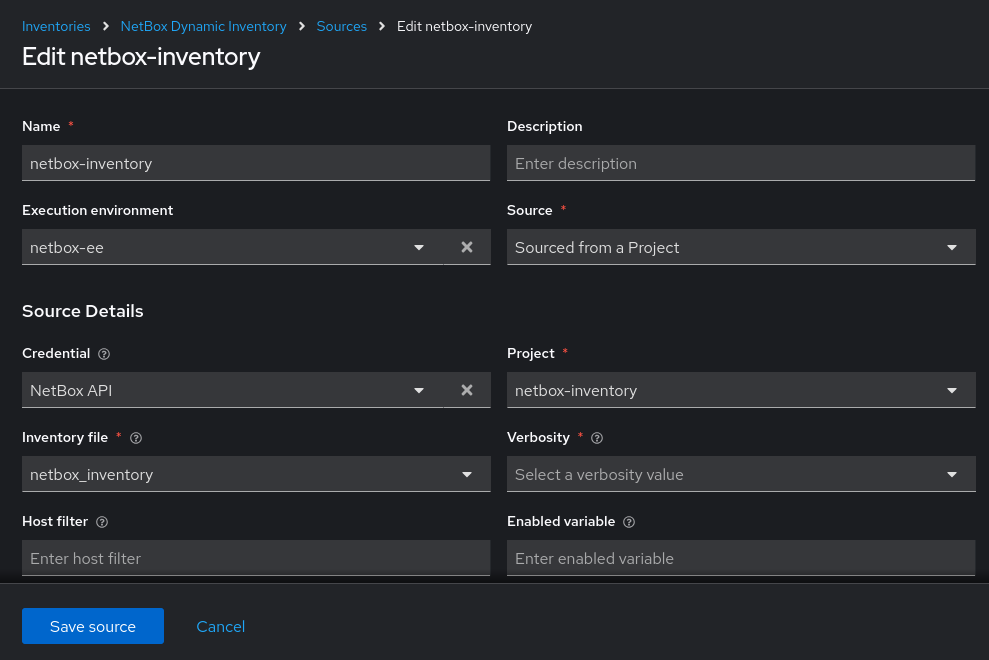
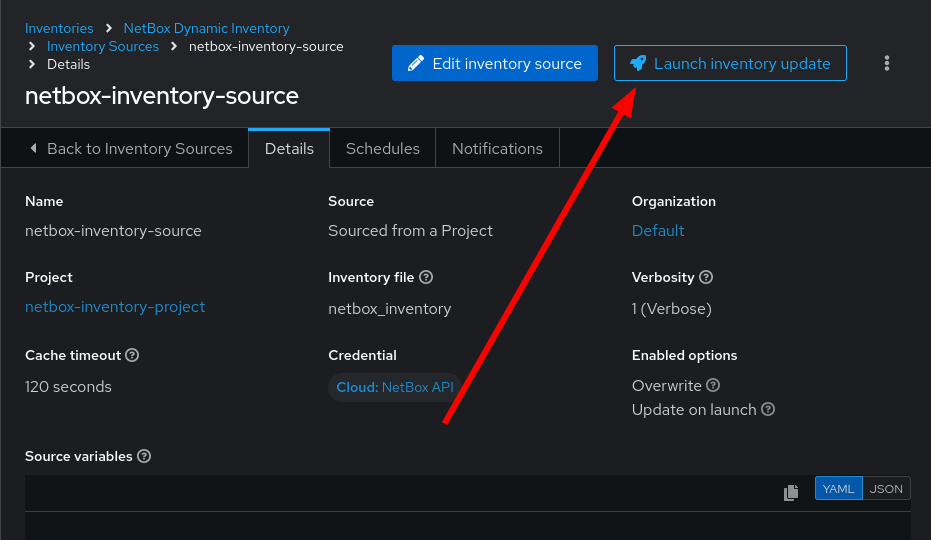
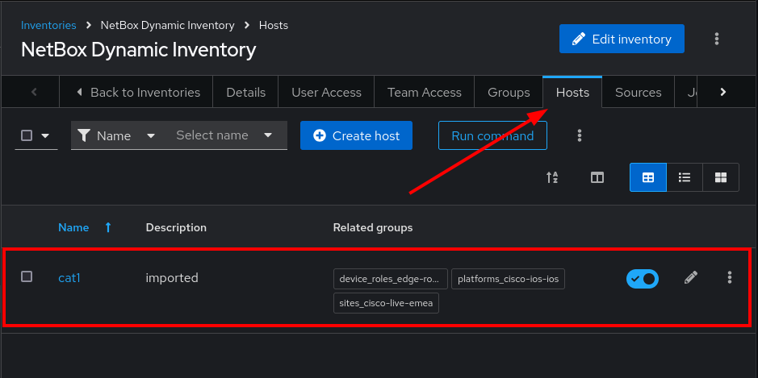

2 - Dynamic Inventory
===

An inventory in **Ansible Automation Platform** is a collection of hosts for running jobs, similar to an Ansible inventory file in the command line. It defines which nodes are managed by the control machine.

If your inventory changes dynamically, static solutions may not be ideal. You might need to track hosts from multiple sources like cloud providers or CMDBs. Dynamic Inventories automate this process.

**Ansible Automation Platform** connects with external inventories using plugins or scripts, with plugins being the preferred option. You can also create custom plugins for additional sources.

### Integrating NetBox with Ansible
NetBox's Certified Ansible Collection includes modules for:
1. Dynamic Inventory: Fetching real-time data.
2. State Definition: Ensuring configurations align with design.
3. Querying Network Data: Extracting details for playbooks.

We’ll explore how Red Hat Ansible Automation Platform syncs with NetBox and integrates with Event-Driven Ansible for real-time network updates.


🔑 Your credentials for the lab
===
> [!NOTE]
> AAP credentials:
> - Username: admin
> - Passowrd: ansible123!

> [!NOTE]
> NetBox credentials:
> - Username: admin
> - Passowrd: netbox

☑️ Task 1 - Inventory project
===

1. We are going to use a **Dynamic Inventory** plugin file, in this case from our parter **NetBox Labs** and their **Certified Collection**.
2. The **NetBox** collection provides the `netbox.netbox.nb_inventory` plugin to connect Ansible Automation Platform to NetBox.
3. In AAP left side-bar, go to **Automation Execution > Projects > Create project**
4. Click **Create project**
5. Fill the form with the following:
```
  Name: netbox-inventory-project
  Organization: Default
  Execution environment: netbox-ee
  Source control type: Git
  Source control URL: https://github.com/leogallego/netbox-inventory.git
```
6. Click the blue **Save project** at the bottom

### What did our inventory project include?
1. To configure NetBox as the **Dynamic Inventory** we are going to use the an inventory plugin file.
2. Within `netbox-inventory-project` we have a `netbox_inventory` file with the settings to configure the module.
3. Look at the content of the `netbox_inventory` file below:

```
plugin: netbox.netbox.nb_inventory
config_context: true
validate_certs: False
group_by:
  - platforms
  - device_roles
  - sites

compose:
  ansible_network_os: platform.name
  ansible_host: custom_fields.host
  ansible_port: custom_fields.port
```


> [!WARNING]
> You might notice there are some pre-loaded Projects, Templates, Execution Environments or other resources. These might have been created as part of supporting the infrastructure for the workshop. Unless we mention them as part of a  task, avoid modifying or changing them.


☑️ Task 2 - NetBox credentials
===

We are going to create a **Custom Credential  Type** in Ansible Automation Platform to safely access NetBox through their API.

### Creating a Credential Type

1. Go to **Automation Execution > Infrastructure > Credential Types > Create credential type**
2. For the **Name** field, input `NetBox`
3. In **Description**: `NetBox API custom credential`
4. In the **Input configuration** field, copy and paste the following:
```
fields:
  - id: NETBOX_API
    type: string
    label: NetBox Host URL
  - id: NETBOX_TOKEN
    type: string
    label: NetBox API Token
    secret: true
required:
  - NETBOX_API
  - NETBOX_TOKEN
```
5. In the **Injector configuration**, copy and paste the following:
```
env:
  NETBOX_API: '{{ NETBOX_API }}'
  NETBOX_TOKEN: '{{ NETBOX_TOKEN }}'
```
6. Click the blue **Create credential type** button at the bottom.

### Getting the NetBox API Token

1. Go to the [button label="NetBox"](tab-1) tab
2. To create our **Credential** we need to get our **NetBox API Token**.
3. Login to **NetBox** using:
    - User: `admin`
    - Password: `netbox`
4. On the left side-bar of **NetBox**, scroll to the bottom and expand the **Admin** menu section
5. Click on the **API Tokens** option in the menu
6. Copy the  **Key Token** to your clipboard
 
> [!IMPORTANT]
> If you have issues getting the API Token from NetBox, don't worry, it's available below!

### Creating the NetBox Credential in AAP

1. Now let's go back to the [button label="AAP"](tab-0) tab and create the credential:
2. Go to **Automation Execution > Infrastructure > Credentials > Create credential** and fill the form with the  following details:
3. **Name**: Enter `NetBox API`
4. **Organization**: Select `Default` from the dropdown
5. **Credential Type**: Select `NetBox` from the dropdown (you can type it to find it faster)
6. **NetBox Host URL**: `http://netbox:8000`
7. **NetBox API Token**: `0123456789abcdef0123456789abcdef01234567`
8. Click **Create credential**




☑️ Task 3 - Creation of the Dynamic Inventory
===

Go to the [button label="AAP"](tab-0) tab.

1. On the left side-bar, click the **Automation Execution** menu option.
2. Now click the **Infrastructure** section to expand it and click on **Inventories**
3. Click on the blue **Create inventory** button
4. Select **Create inventory** from the dropdown.
   
5. Name it `NetBox Dynamic Inventory`.
6. In the **Organization** dropdown, select `Default`
7. Leave all the other fields as they are.
8. Click the blue **Create inventory** button

☑️ Task 4 - Add a Dynamic Source
===

> [!NOTE]
> If you are not in the  `NetBox Dynamic Inventory`, click on it again to edit it.

1. Inside the `NetBox Dynamic Inventory` you will see a tab bar.
2. On the tab bar, click on **Hosts**. You will notice it's empty.
  
4. Now on the same tab bar, click on **Sources**
  
6. Click the blue **Create Source** button
7. In the **Name** text box, enter `netbox-inventory-source`.
8. Click the **Execution Environment** field and select `netbox-ee` from the dropdown.
9. Click the **Source** field and select `Sourced from a project` from the dropdown.
10. A new section titled **Source Details** will expand below
  1. Click the **Credential Field** field and select `NetBox API` from the dropdown
  2. Click the **Project** field and select `netbox-inventory-project`
  3. Click the **Inventory file** field and select `netbox_inventory`
  4. Click the **Verbosity** field and select `(1) Info`
  5. In the **Options** section, tick the checkboxes for
      - `Overwrite` and
      - `Update on launch`.
> [!NOTE]
>     These two options will be useful to save time during our workshop. Check the tooltip to learn more about them!
11. In **Cache timeout (seconds)** enter `120`
12. Click the blue **Create source** button
    
13. Now in the *Details* view of the `netbox-inventory-source` we just created, press the **Launch inventory update** button in the top right to sync the devices.
  
14. Go back to the `NetBox Dynamic Inventory` details and click the **Hosts** tab to verify the Cisco Catalyst 8000v device is there.
  

✅ Next Challenge
===
Press the **Next** button below to go to the next challenge once you’ve completed the task.


🐛 Troubleshooting
===

> [!WARNING]
>  - NetBox needs a couple of minutes to get started.
> - If you can't see the NetBox login screen, go to the `netbox term` tab and run the following commands:
> ```
> docker compose --project-directory=/tmp/netbox-docker stop`
> ```
> ```
> docker compose --project-directory=/tmp/netbox-docker up -d netbox netbox-worker`
> ```

> [!WARNING]
>  - For the Dynamic Inventory to work we need some NetBox pre-loaded content.
> - If you can't see devices in the NetBox tab, run the following commands:
> ```
> su - rhel -c 'cd /home/rhel/netbox-setup; ansible-navigator run /home/rhel/netbox-setup/netbox-setup.yml --mode stdout --penv _SANDBOX_ID'
> ```


