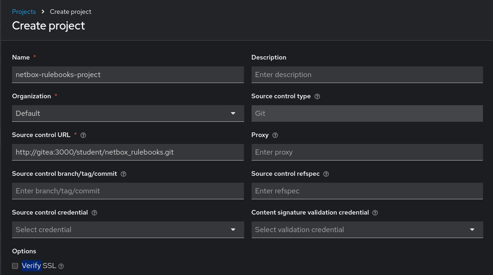
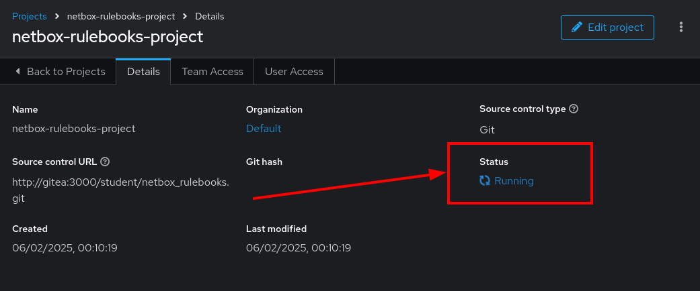
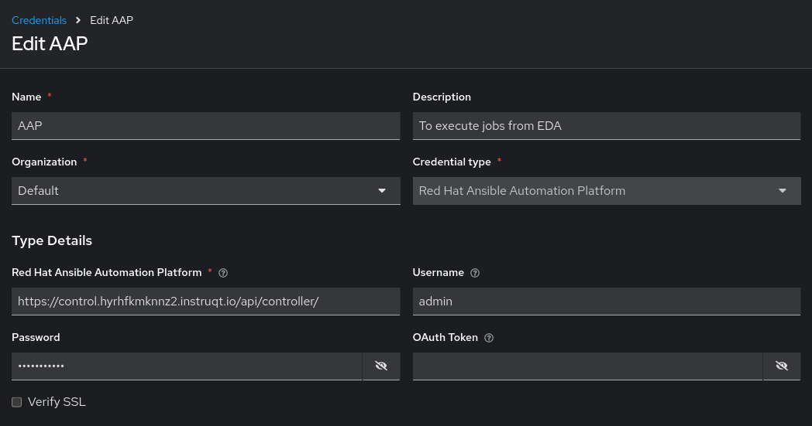
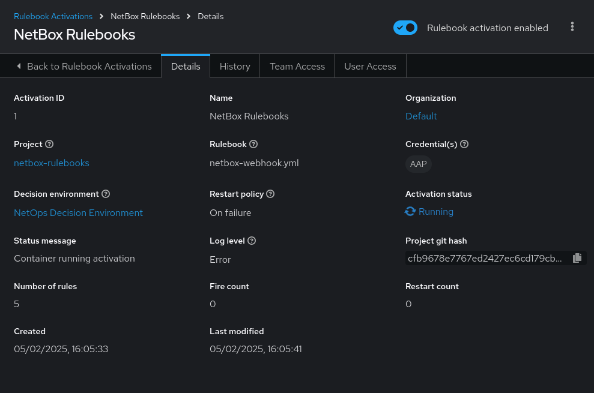

4 - Event-Driven Ansible Rulebooks
===

**Ansible Automation Platform** is a powerful tool for network automation, and integrating it with **NetBox** enhances its capabilities. Ansible uses NetBox as a **Network Source of Truth (NSoT)** to ensure accuracy in managing network devices, connections, and services.

By leveraging **Event-Driven Ansible (EDA)**, Ansible Automation Platform can react to real-time events from NetBox, such as new devices being added or configuration changes being approved. This eliminates the need for manual intervention or scheduled tasks, enabling fully automated, dynamic network management.

🔑 Your credentials for the lab
===
> [!NOTE]
> AAP credentials:
> - Username: admin
> - Passowrd: ansible123!

> [!NOTE]
> NetBox credentials:
> - Username: admin
> - Passowrd: netbox

☑️ Task 1 - Creating the EDA Project:
===
In this excercise, we will create a Rulebook activation and a Job Template that performs remediation when a certain event occurs.

1. In the [button label="AAP"](tab-0) tab, go to **Automation Decisions > Projects** and click on **Create project**.
2. Fill the form with the following:
```
Name: netbox-rulebooks-project
Organization: Default
Source control type: Git
Source control URL: https://github.com/leogallego/aap-netbox-rulebooks-cisco-live.git
```

> [!WARNING]
> Currently, not all fields of an EDA Project can be edited after creation. If there is a mistake in the "Source control URL" for example, you will need to delete and recreate the Project.

3. Click the blue **Create project** button at the bottom.

4. Wait for the project to show a green tick and **Completed**  in the **Status** and then move on to the next step.


☑️ Task 2 - Exploring EDA Credentials
===

This credential allows EDA to run the desired action (Job Template) when a condition is triggered.

1. Go to **Automation Decisions > Infrastructure > Credentials**
2. You will notice there is an `AAP` credential already created.
3. We pre-loaded this as the URL is internal to the workshop platform.
4. Be careful not to change the settings. The form should look like this:

5. Click the **Cancel** button to leave the Credential screen.

☑️ Task 3 - Creating the Rulebook Activation
===

Now we are going to create the **Rulebook Activation**, basically the service that will be listening to our rules in the Rulebook Project we created earlier.

1. Go to **Automation Decisions > Rulebook Activations** and click on **Create rulebook activation**.
2. Fill the form with the following:
```
Name: NetBox Rulebooks
Organization: Default
Project: netbox-rulebooks-project
Rulebook: netbox-webhook.yml
Credentials: AAP
Decision environment: NetOps Decision Environment
Restart policy: Always
Log level: Info
Rulebook activation enabled? Yes
```

> [!WARNING]
> Meke sure to fill everything correctly and pick the `AAP` credential, ***EDA Rulebooks*** currently can't be edited and an error while creating it will require you to delete it and re-create it, just like with ***EDA Projects***.

3. Leave the rest as-is and click the blue **Create rulebook activation** button at the bottom.
4. You will see the details of the Rulebook Activation now and a "*Starting*" in the *Activation status* field that will change to **Running** after a few seconds. Congrats! EDA is listening!



☑️ Task 4 - Exploring our rulebook
===

Below you can check the Rulebook we imported. This rulebook contains 5 rules, those are the conditions we are going to be listening for from NetBox.

```
---
- name: Listen for NetBox events on a webhook
  hosts: all
  sources:
    - ansible.eda.webhook:
        host: 0.0.0.0
        port: 5001

  rules:
  - name: NTP updates
    condition: event.payload.event == "updated" and event.payload.model == "configcontext" and event.payload.data.name == "ntp_servers"
    action:
      run_job_template:
        organization: "Default"
        name: "Configure NTP Servers"

  - name: VLAN created
    condition: event.payload.event == "created" and event.payload.model == "vlan"
    action:
      run_job_template:
        organization: "Default"
        name: "Configure VLANs"

  - name: VLAN deleted
    condition: event.payload.event == "deleted" and event.payload.model == "vlan"
    action:
      run_job_template:
        organization: "Default"
        name: "Configure VLANs"

  - name: Update login banner
    condition: event.payload.event == "updated" and event.payload.model == "updated" and event.payload.data.name == "login_banner"
    action:
      run_job_template:
        organization: "Default"
        name: "Configure Login Banner"

  - name: New Device Added
    condition: event.payload.event == "created" and event.payload.model == "device"
    action:
      run_workflow_template:
        organization: "Default"
        name: "Provision New Device Workflow"
```

### What will this rulebook do?

- This rulebook will use the `ansible.eda.webhook` source plugin to listen for events from the NetBox webhook.
- NetBox will forward the payload, which EDA will receive and classify according to the conditions in each rule. These rules are:
    1. NTP Updates
    2. VLAN Created
    3. VLAN Deleted
    4. Login Banner
    5. New Device Created
- Each rule has it's own set of conditions (what to listen for) and action (what playbook to run). We are going to be checking the payload for 3 matches:
    1. The job status,
    2.  if we are working on a branch and
    3.  the description of the event from NetBox side.
- Once this rule is matched, the associated **Job Template** will be launched

> [!NOTE]
> Ansible Rulebooks operate differently to Ansible Playbooks. A Rulebook Activation is running constantly, while a Job Template is executed on demand.

✅ Next Challenge
===
Press the **Next** button below to go to the next challenge once you’ve completed the task.


🐛 Troubleshooting
===

> [!WARNING]
>  - NetBox needs a couple of minutes to get started.
> - If you can't see the NetBox login screen, go to the `netbox term` tab and run the following commands:
> ```
> docker compose --project-directory=/tmp/netbox-docker stop`
> ```
> ```
> docker compose --project-directory=/tmp/netbox-docker up -d netbox netbox-worker`
> ```

> [!WARNING]
>  - For the Dynamic Inventory to work we need some NetBox pre-loaded content.
> - If you can't see devices in the NetBox tab, run the following commands:
> ```
> su - rhel -c 'cd /home/rhel/netbox-setup; ansible-navigator run /home/rhel/netbox-setup/netbox-setup.yml --mode stdout --penv _SANDBOX_ID'
> ```
