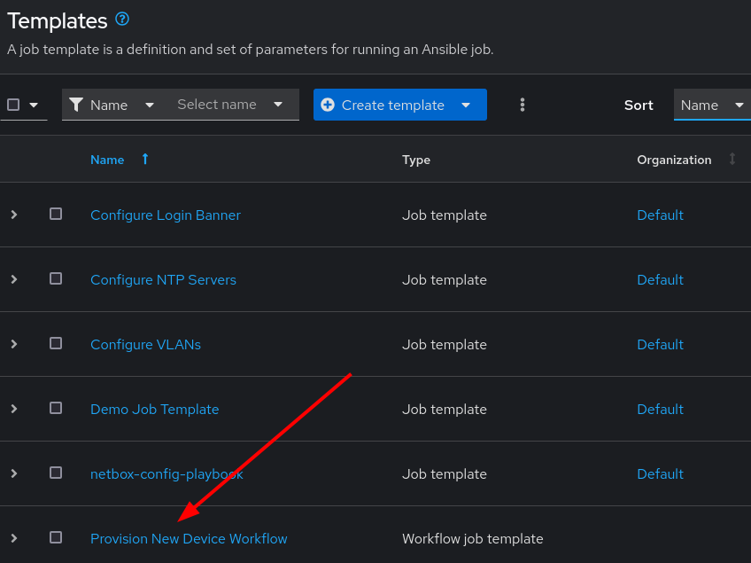
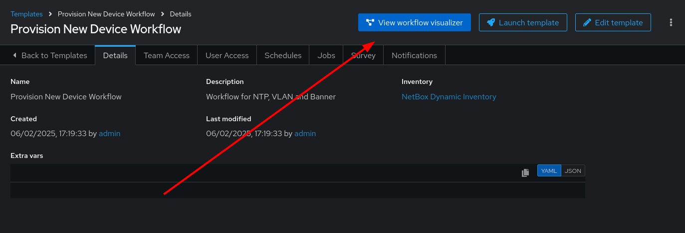
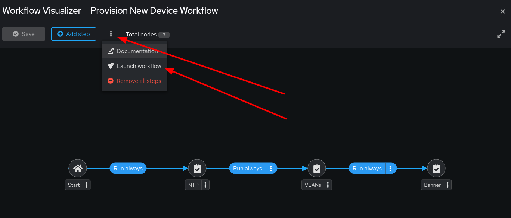
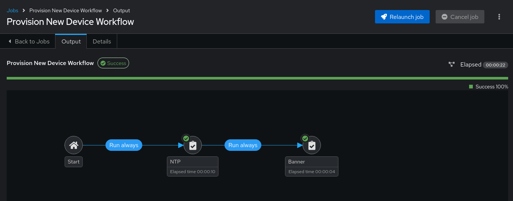

6 - Event-Driven Ansible: Workflow
===

A **Workflow Job Template** is a series of connected **Job Templates** that are executed in a specific order to achieve a desired outcome. Meanwhile, an individual **Job Template** handles tasks in a single *Playbook*. **Workflow job template** are designed to manage more complex automation scenarios involving multiple playbooks  and decision-making processes (success or failure conditions for each).

Only **Workflow Job Templates** have the **Workflow Visualizer** icon (wf-viz-icon) to connect the  **Job Templates** in a Graphical User Interface.

> [!WARNING]
> Remember, do not confuse a **Job Template** with a **Jinja template**, or with a **Workflow Job Template**.  They are 3 separate things!

🔑 Your credentials for the lab
===
> [!NOTE]
> AAP credentials:
> - Username: admin
> - Passowrd: ansible123!

> [!NOTE]
> NetBox credentials:
> - Username: admin
> - Passowrd: netbox

☑️ Task 1 - Job Workflow Template
===

We have already created a Job Workflow Template with the previous Job Templates, to speed things up .
This Workflow will be associated to the Rulebook condition of a `New Device Added`  in `netbox-webhooks.yml`, and will be called `Provision New Device Workflow` just like we specified in the `run_workflow_template` action.

1. Switch to the [button label="AAP"](tab-0) tab, login if required.
2. Click the **Automation Execution** dropdown in the sidebar
3. Click the **Templates** link
4. Look for the **Provision New Device Workflow**, click on it to explore it

5. Once in the **Details** tab of the Workflow, look for the blue **View workflow visualizer** button at the top right and click on it.


☑️ Task 2 - Workflow Visualizer
===

In this view you can see a graphical representation of the relation between the different Job Templates.
You should see a workflow composed of 2 Job Templates:
1. `Configure NTP Servers`, called `NTP` for short
2. `Configure Login Banner`, called `Banner` for short


☑️ Task 3 - Launch the new Workflow
===


1. Within the same **Workflow Visualizer** screen
2. **Click the 3 dots** right below the name at the top left, and select **Launch workflow** from the dropdown.

3. The workflow will run the 2 Job Templates in all existing devices in our `NetBox Dynamic Inventory`

4. In the next excercise we will see how it gets triggered automatically when we add a device to our site in NetBox

✅ Next Challenge
===

Press the `Next` button below to go to the next section once you’ve completed the task to begin exploring Event-Driven Ansible.

🐛 Troubleshooting
====


> [!WARNING]
>  - For the Job Templates to be pre-created in the exercise **5 - Event Driven Ansible Playbooks**, the `NetBox Dynamic Inventory` should exist.
> - If the inventory doesn't exist, first go to the corresponding exercise and create it, then run in the `AAP terminal`:
> ```
> su - rhel -c 'cd /home/rhel; ansible-navigator run /home/rhel/5-eda-playbooks.yml --mode stdout --penv _SANDBOX_ID'
> ```

> [!WARNING]
>  - For the Dynamic Inventory in the exercise **2 - AAP Dynamic Inventory** to work we need some NetBox pre-loaded content.
> - If you can't see devices in the NetBox tab, run the following commands:
> ```
> su - rhel -c 'cd /home/rhel/netbox-setup; ansible-navigator run /home/rhel/netbox-setup/netbox-setup.yml --mode stdout --penv _SANDBOX_ID'
> ```

> [!WARNING]
>  - NetBox needs a couple of minutes to get started.
> - If you can't see the NetBox login screen in the `NetBox` tab, go to the `netbox term` tab and run the following commands:
> ```
> docker compose --project-directory=/tmp/netbox-docker stop`
> ```
> ```
> docker compose --project-directory=/tmp/netbox-docker up -d netbox netbox-worker`
> ```
