7 - 🚀 Event-Driven Ansible and NetBox in Action
===

### Now it's time to see everything in action!

1. Switch to the [button label="NetBox"](tab-0) tab so we can apply changes there
2. **NetBox** has been setup with 1 device called `cat1` and all the dependencies that are required for devices to be created.
3. In the next tasks you will modify a running configuration as well as add a new device.

🔑 Your credentials for the lab
===
> [!NOTE]
> AAP credentials:
> - Username: admin
> - Passowrd: ansible123!

> [!NOTE]
> NetBox credentials:
> - Username: admin
> - Passowrd: netbox

☑️  Task 1 - Reviewing NetBox setup
===

1.  We have configured a **Cisco Catalyst 8000v** called `cat1` with which we will be experimenting. You can check the device in the **Devices > Devices** menu of the sidebar.
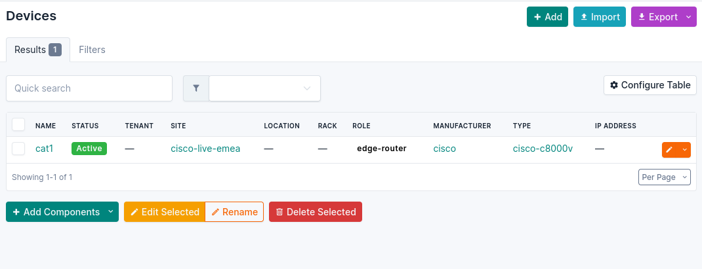
2. You will notice in the screenshot above that the `cat1` device has a few other fields pre-loaded, like **Site**, **Role**, **Manufacturer** and **Type**. These are part of the required fields.
3. Some other data points we had to pre-create were **Custom Fields**, for the `ansible_host` and `ansible_port` variables. You can review these in the **Customization > Custom Fields** menu of the sidebar.
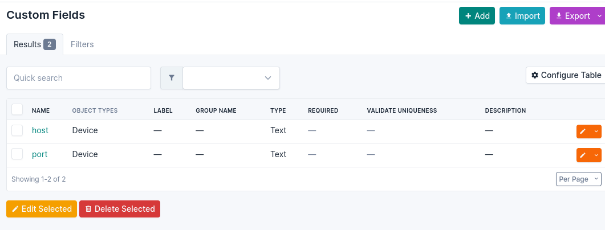
4. Another setting we set in advance are the **Config Contexts** for the custom data we want to store for the `NTP Servers` and `Login Banner`. You can review these in the **Provisioning > Config Contexts** menu of the sidebar.
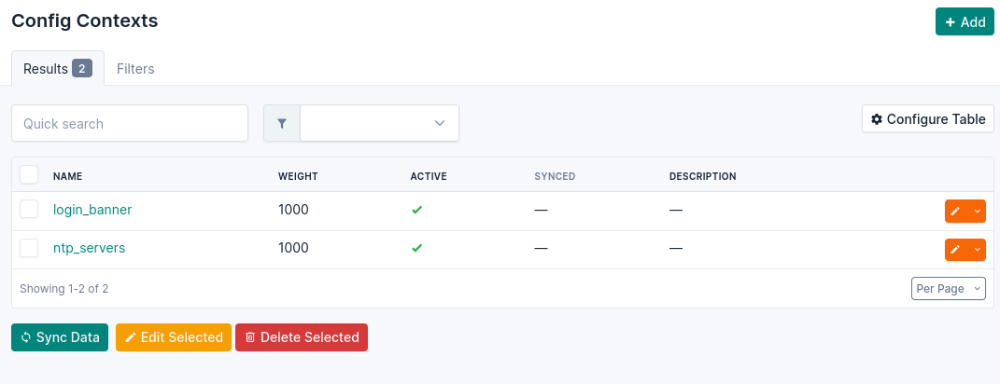


> [!WARNING]
> You might find the *Site* familiar 😜

☑️  Task 2 - NetBox Webhooks
===

To configure NetBox to send a notification to Ansible Automation Platform when an event happens you need to set a few options.
In this task you will finish setting up the connection between NetBox and Event-Driven Ansible.

1. In the NetBox tab, go to the left sidebar, **Operations > Webhooks**. We will create this first, as it is required for the Event Rules.
  1. Once in the **Webhooks** screen, click the *green* **+ Add** button on the top right.
  2. **Name**: `EDA Webhook`
  3. **URL**: `http://control:5001/endpoint`
  4. **SSL**: Disable the checkbox at the bottom.
  5. Leave the other fields as they are.
  6. Click the **Create** button
  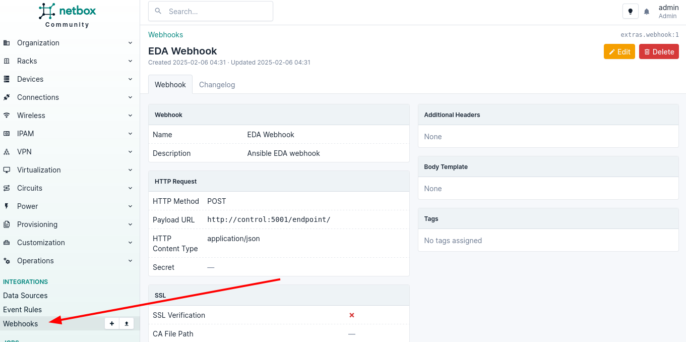

☑️ Task 3 - NetBox Event Rules
===

Now we can go to  **Operations > Event Rules** to create the 3 events we want to forward:

### ntp_servers and login_banner Event Rules

1. Once in the **Event Rules** screen, click the *green* **+ Add** button on the top right.
2. **Name**: `ntp_servers`
3. **Object types**: `Extras > Config Context` (**TIP**: type "context" to filter and auto complete)
4. **Event types**: `Object updated`
5. **Action type**: `Webhook` (leave as is)
6. **Webhook**: `EDA Webhook` (select from the drop down)
7. Leave the other fields as they are.
8. Click the **Create** button
	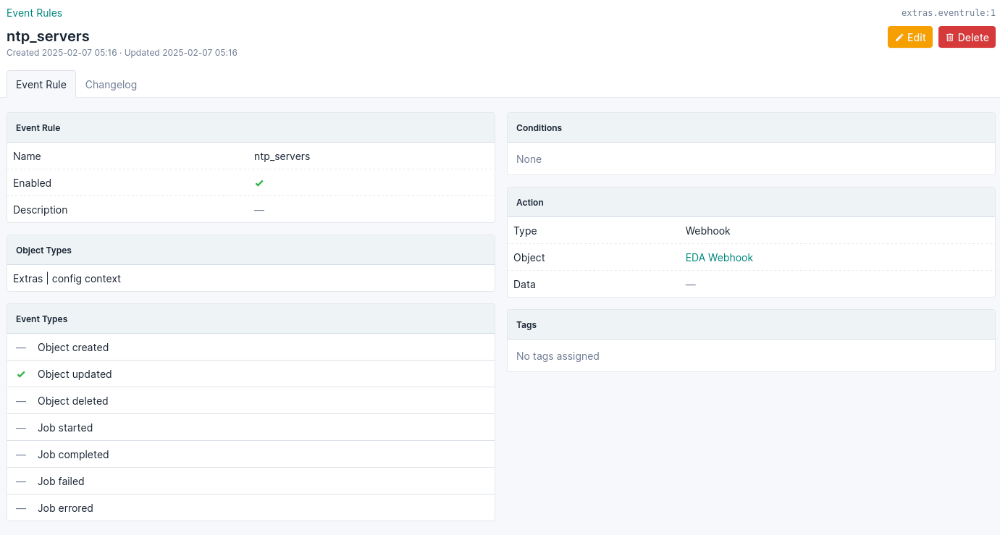
9. Repeat the above steps, but this time for the **Name**: `login_banner` event rule.

### new_device Event Rule
Now we need to create the `new_device` event rule, this one will be different, pay attention to the steps below:

1. Once in the **Event Rules** screen, click the *green* **+ Add** button on the top right.
2. **Name**: `new_device`
3. **Object types**: `DCIM > Device` (**TIP**: type "device" to filter and auto complete)
4. **Event types**: `Object created`
5. **Action type**: `Webhook` (leave as is)
6. **Webhook**: `EDA Webhook` (select from the drop down)
7. Leave the other fields as they are.
8. Click the **Create** button
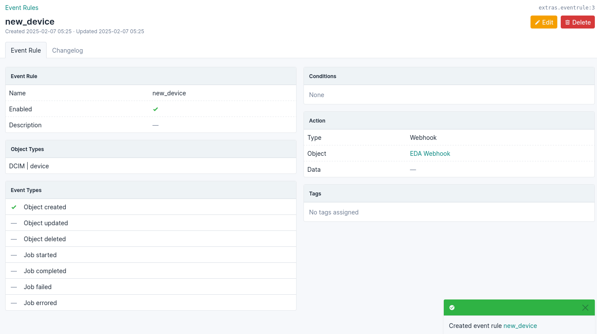

☑️ Task 4 - Let's make magic
===

Now we are going to apply changes on NetBox side and see how they trigger their respective Job Templates.

> [!IMPORTANT]
> - Before we actually apply changes:
> - Did you notice that `cat1` had only 2 NTP servers configured and a default banner?
> - If you want to check, go to:
> - [button label="AAP"](tab-0) tab > Automation Execution > Infrastructure > Inventories > **NetBox Dynamic Inventory** > Hosts > `cat1`
> 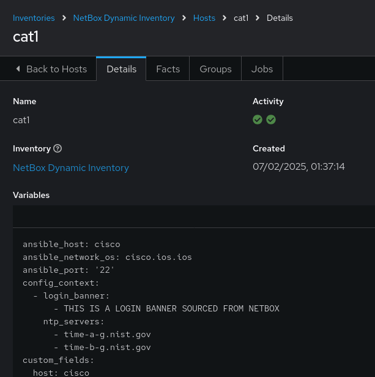

### Let's start with the NTP

1. In the [button label="NetBox"](tab-1) tab, go to the **Provisioning** menu on the left sidebar and click on **Config Contexts**
2. Click on the `ntp_servers` one
3. Click on the *orange* **EDIT** button on the top right
4. Now we are going to modify the **Data** payload.
5. Add a "time-c-g.nist.gov", it should look like this:
```
{
    "ntp_servers": [
        "time-a-g.nist.gov",
        "time-b-g.nist.gov",
        "time-c-g.nist.gov"
    ]
}
```
6. Click the **Save** button
> [!WARNING]
> Pay atention to the commas!


☑️ Task 5 - Event-Driven Ansible in Action
===


1. Switch to the [button label="AAP"](tab-0) tab
2. A quick way to see if an event was triggered it's to check the **Fire count** counter in the **Rulebook Activations** screen within **Automated Decisions**
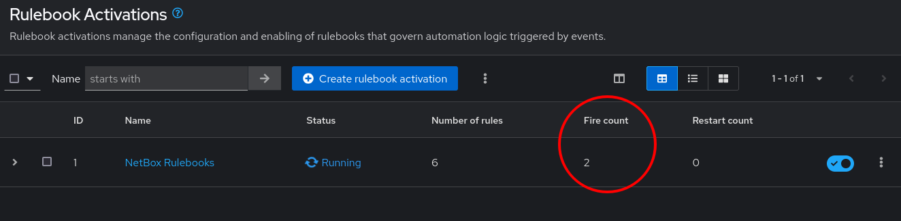
4. For a more detailed output, go to the **Rule Audit** section, there you will see which Job Template was triggered
  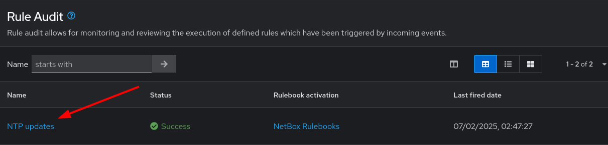
5. Click on the `NTP updates` Job Template to see more details about the Job ruin and then click the **Events** tab
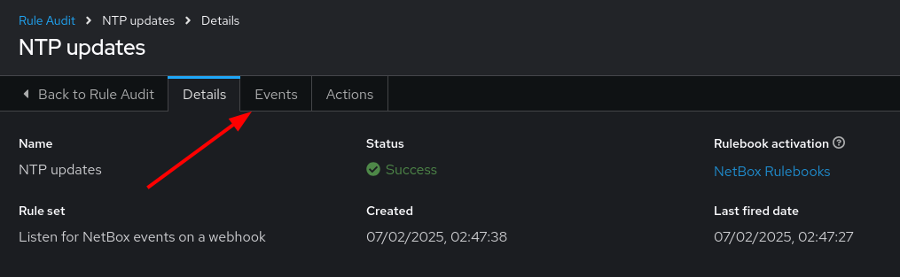
6. Now click on the `ansible.eda.webhook`, you will see a pop-up with the payload that triggered the rule.
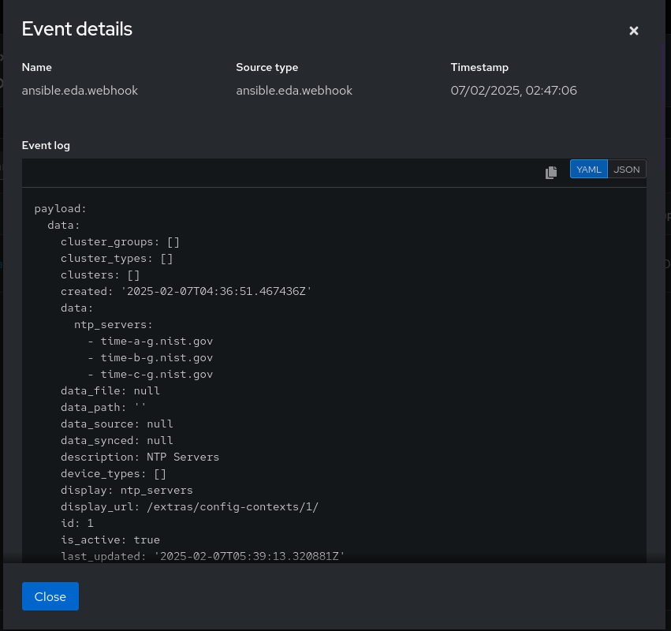
7. If you want to see the actual Job Template output, you can go to **Automation Execution > Jobs** and check the Job queue to see the details.
> [!NOTE]
> It might take a few seconds for the event to trigger. If it's empty, wait  a bit.


☑️ Task 6 - Changing the `login_banner`
===

1. Switch to the [button label="NetBox"](tab-1) tab and try the login_banner by yourself. If in doubt, check the steps above for the `ntp_servers`

☑️ Task 7 - Adding a new device in NetBox
===

### In NetBox

1. In [button label="NetBox"](tab-1)
2. Go to **Devices** in the left sidebar.
3. Click the green **+ Add**  button on the top right. Fill the form with the following:
4. **Name**: `cat2`
5. **Device Role**: `edge-router`  (from dropdown)
6. **Device Type**: `cisco-c8000v` (from dropdown)
7. **Site**: `cisco-live-emea` (from dropdown)
8. **Status**: `Active` (leave as-is)
9. **Platform**: `cisco.ios.ios` (from dropdown)
10. At the bottom in **Custom Fields**:
  - **Host** : `cisco2`
  - **Port**: `22`
  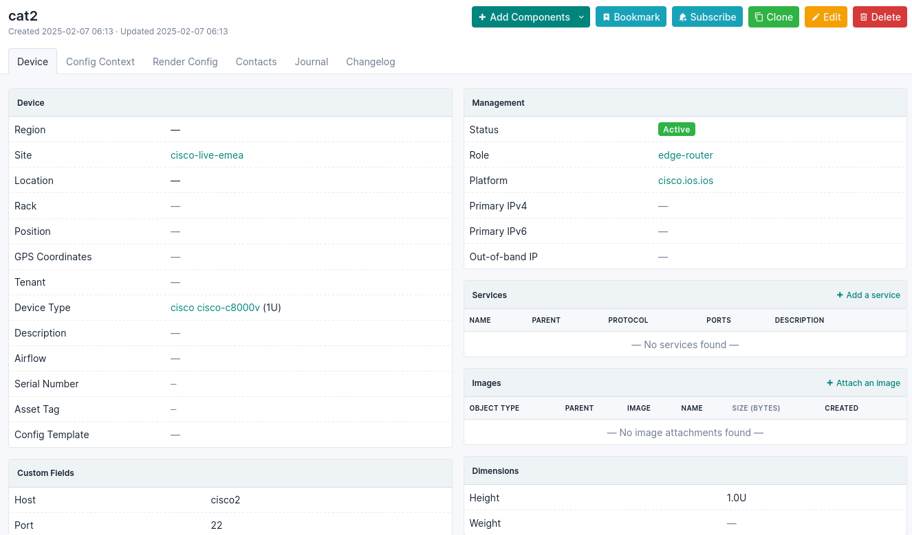

## In AAP
1. In [button label="AAP"](tab-0)
2. Check the **Fire count** in the **Rulebook Activations**
3. Check the output in **Rule Audit** and see if `New Device Added` was executed successfully
4. Go to **Automation Execution > Jobs** and check the `Provision New Device Workflow` Job run was successful
  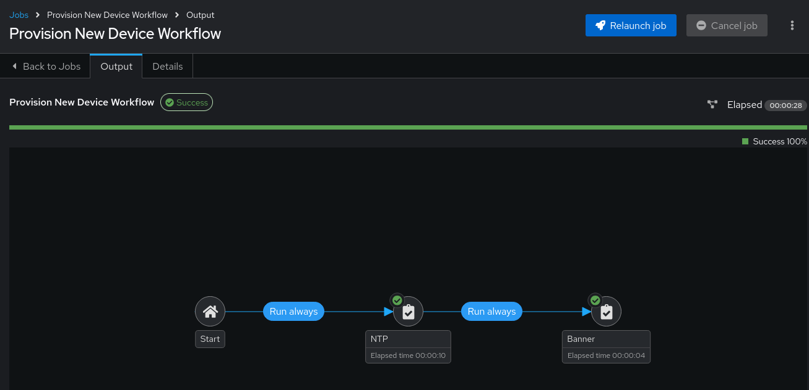
5. To verify you can also check the **NetBox Dynamic Inventory > Hosts** to see both devices listed and check their config by clicking in any of them
  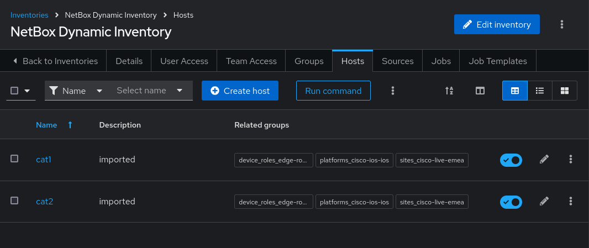

✅ Congratulations!
===

You have finished the Event-Driven Ansible and Network Sources of Truth workshop!


🐛 Troubleshooting
===

> [!WARNING]
>  - For the Job Templates to be pre-created in the exercise **5 - Event Driven Ansible Playbooks**, the `NetBox Dynamic Inventory` should exist.
> - If the inventory doesn't exist, first go to the corresponding exercise and create it, then run in the `AAP terminal`:
> ```
> su - rhel -c 'cd /home/rhel; ansible-navigator run /home/rhel/5-eda-playbooks.yml --mode stdout --penv _SANDBOX_ID'
> ```

> [!WARNING]
>  - For the Dynamic Inventory in the exercise **2 - AAP Dynamic Inventory** to work we need some NetBox pre-loaded content.
> - If you can't see devices in the NetBox tab, run the following commands:
> ```
> su - rhel -c 'cd /home/rhel/netbox-setup; ansible-navigator run /home/rhel/netbox-setup/netbox-setup.yml --mode stdout --penv _SANDBOX_ID'
> ```

> [!WARNING]
>  - NetBox needs a couple of minutes to get started.
> - If you can't see the NetBox login screen in the `NetBox` tab, go to the `netbox term` tab and run the following commands:
> ```
> docker compose --project-directory=/tmp/netbox-docker stop`
> ```
> ```
> docker compose --project-directory=/tmp/netbox-docker up -d netbox netbox-worker`
> ```
