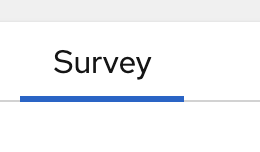
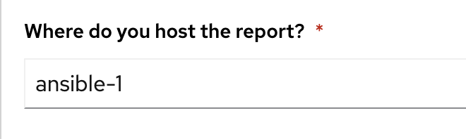

👋 Introduction
===
#### Estimated time to complete: *5 minutes*

Welcome to the third challenge.  For this challenge we will create dynamic documentation.  More specifically we will generated a HTML website using the structured data that we showcased in the previous challenge.

Login to Automation controller with the following credentials

<table>
<tr>
<td>username:</td>
<td><code>admin</code></td>
</tr>
<tr>
<td>password:</td>
<td><code>ansible123!</code></td>
</tr>
</table>

☑️ Task 1 - Create a new Job Template
===

Click the **Templates** link in the left navigation menu underneath the Resources tab.

Click the blue Add button and click `Add job template`

Fill out the following fields:

<table>
<tr><th>Parameter</th><th>Value</th>
</tr>
<tr><td>Name</td><td>Create Report</td>
<tr><td>Job Type</td><td>Run</td>
<tr><td>Inventory</td><td>Demo Inventory</td>
<tr><td>Project</td><td>AWS Demos Project</td>
<tr><td>Execution Environment</td><td>AWS Execution Environment</td>
<tr><td>Playbook</td><td><code>playbooks/cloud_report.yml</code></td>
<tr><td>Credentials</td><td><code>aws_credential</code></td>
</table>

* If you have trouble finding the `aws_credential` make sure you are looking under the Credential Type `Amazon Web Services`

Click the blue **Save** button.

The project we are loading Ansible Playbooks from can be found here [https://github.com/ansible-cloud/aws_demos](https://github.com/ansible-cloud/aws_demos)

☑️ Task 2 - Add a survey
===

For this next step we are going to add a survey so the user can select where they want the HTML report hosted.  This allows the operator to select a Linux host to serve the HTML file for others to view!

Click the Survey tab 

Click the blue Add button 

Fill out the following table:
<table>
<tr><th>Parameter</th><th>Value</th>
</tr>
<tr><td>Name</td><td>Which host should host the report?</td>
	<tr><td>Answer variable name </td><td><code>_hosts</code></td>
<tr><td>Answer type</td><td>Multiple Choice (single select)</td>
	<tr><td>Multiple Choice Options</td><td><code>ansible-1</code></td>
</table>

For lab purposes we are just going to host it on the host <code>ansible-1</code> but we are showing how this can be easily configurable by the administrator to allow you to choose anywhere to host dynamic documentaition.  If you don't select a host we can just use Amazon S3 and host it there.

☑️ Task 3 - Launch the Job Template
===

Click the **Templates** link in the left navigation menu underneath the Resources tab.  You will see your `Create Report` job template.

Click the rocket symbol to `Launch Template`.

Select the host:

Click Next and then Launch.

## Explanation:
##
This playbook has two roles.

1. The first role will retrieve structured data for VPCs, EC2 instances and IGWs as shown in the previous challenge.  A link to the source code can be [found here](https://github.com/ansible-cloud/aws_demos/tree/master/roles/retrieve_info)

2. The 2nd role will create an HTML report.  This will install a web server, copy over CSS and images, and template out the structured data into an HTML website.  A link to the source code can be [found here](https://github.com/ansible-cloud/aws_demos/tree/master/roles/build_report).

When the job completes click the `Dynamic Report` tab at the top of your lab window.  The report will be generated.

**Make sure to refresh the window using the** ⟳

Click on the gray boxes with the caret '>' to expand the tables with additional information.

You will see a report similar to the following:

☑️ Task 4 - Compare Regions
===

A cloud operator can quickly see how many instances are online in that region, and what VPCs they are on, as well as the associated IGW.  This is combining several info modules which correspond to multiple AWS boto3 API calls.  In the cloud report I can quickly gain awareness of my cloud footprint.

Important considerations for a cloud operator:

- How can I identify VPCs in Amazon EC2 that are not in use and can be safely deleted to free up resources for my team to provision additional VPCs?
- Which regions are running instances versus which ones that are empty?
- Which regions have stopped instances that may turn on at any moment?

✅ Finished!
===
Press the `Check` button below to check your work.

🐛 Encountered an issue?
====

If you have encountered an issue or have noticed something not quite right, please [open an issue](https://github.com/ansible/instruqt/issues/new?title=Issue+with+Ansible+Hybrid+Cloud+Automation+-+Infrastructure+visibility&assignees=ipvsean).

