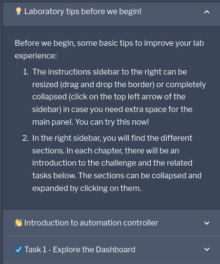

💡 Laboratory tips before we begin!
===

Before we begin, some basic tips to improve your lab experience:

1.  The instructions sidebar to the right can be resized (drag and drop the border) or completely collapsed (click on the top left arrow of the sidebar) in case you need extra space for the main panel. You can try this now!
2. In the right sidebar, you will find the different sections. In each chapter, there will be an introduction to the challenge and the related tasks below. The sections can be collapsed and expanded by clicking on them.

3. When you finish with a challenge (or chapter), you need to click the green **Check** button to move to the next one. This will review the steps. If no review is required the button might be simply labeled **Next**.
4.  You have the option to **Skip** a challenge or chapter, keep in mind this will auto-solve the exercises.
5.  The lab has a 55 minutes limit that can be extended at the end. If you need more time, make sure to accept the popup.
6.  To start with the exercises click the green button labeled **Next**  below.

🐛 Encountered an issue?
====

If you have encountered an issue or have noticed something not quite right, please [open an issue](https://github.com/ansible/instruqt/issues/new?labels=intro-to-controller&title=Issue+with+Intro+to+Controller+slug+ID:+controller-101-intro&assignees=leogallego).

