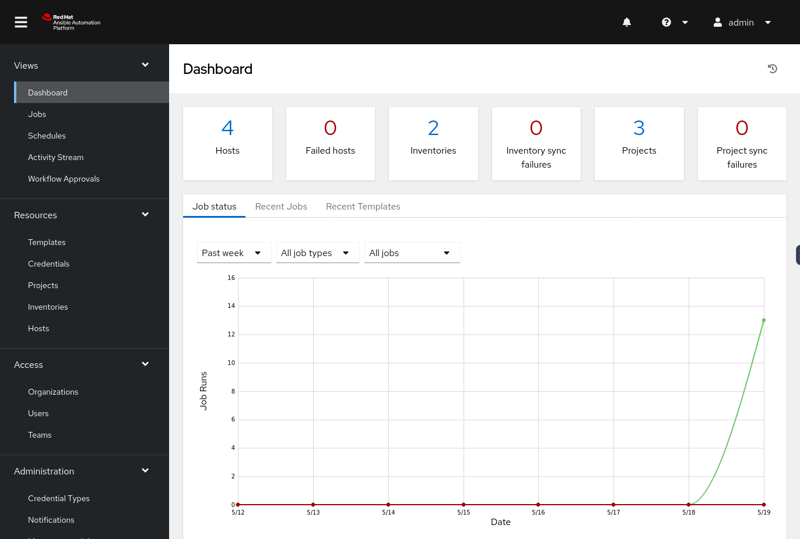
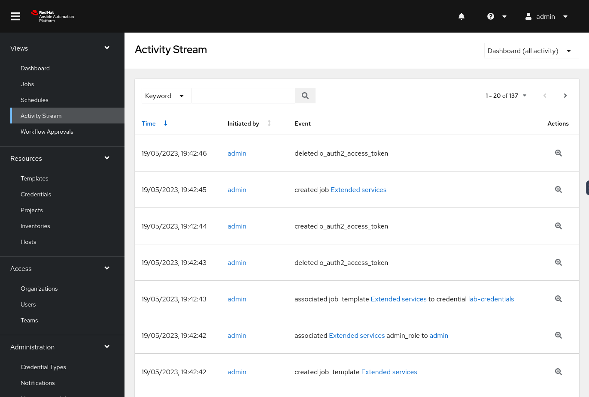

📊 Recap and review
===
#### Estimated time to complete: *5 minutes*

Now that we have created our Inventory, Projects and Job Templates, as well as run a full Workflow, let's get back to the **Views** section and look a bit at the new graphs and data shown in each of them.

☑️ Task 1 - Review the Dashboard view
===

1. Visit the **Dashboard** view and notice the difference when we first started. You should be seeing 4 hosts, 2 inventories and 3 projects. Also, you will notice a green line in the graph, showing the successful executions of our Job Templates.
2. You can dive deeper by clicking on the **Recent Jobs** and **Recent Templates** tabs right above the line graph.

☑️ Task 2 - Review the Jobs view
===

1. Another way to look at the executed jobs is to go to the **Jobs** link in the sidebar, under the **Views** section.
2. Notice they are not only **Playbook runs**, but also **Source control updates**. The **Jobs** view will show everything we **Launched** (rocket icon).

☑️ Task 3 - Review the Activities Stream view
===

1. In the **Activities Stream** view you will see the individual **Events** that are executed as part of our different tasks. You will notice this are more granular and include the user who run them.

🎉 Success!
===

Congratulations on finishing the **Introduction to automation controller** laboratory.

> [!IMPORTANT]
> Please click the green [Next] button at the bottom one last time to complete the lab, and remember to review and leave a comment. We appreciate all feedback!

	🐛 Encountered an issue?
====

If you have encountered an issue or have noticed something not quite right, please [open an issue](https://github.com/ansible/instruqt/issues/new?labels=writing-first-playbook&title=Issue+with+Intro+to+Controller+slug+ID:+recap&assignees=leogallego).

When you are done, we invite  you to find more information about Ansible at [Ansible.com](https://www.ansible.com)

Did you like Ansible automation controller? [Try the full Ansible Automation Platform today!](https://www.redhat.com/en/technologies/management/ansible/trial?)

