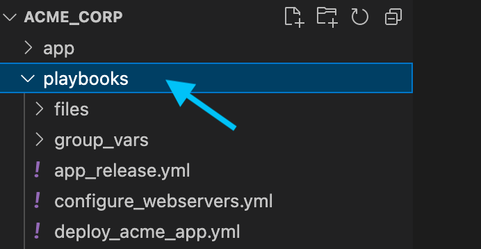
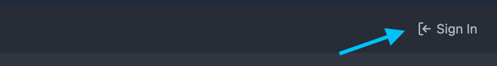
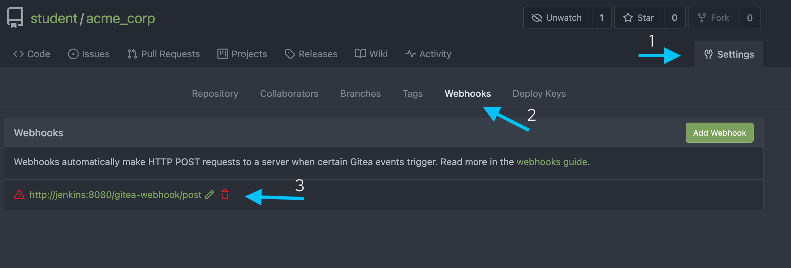
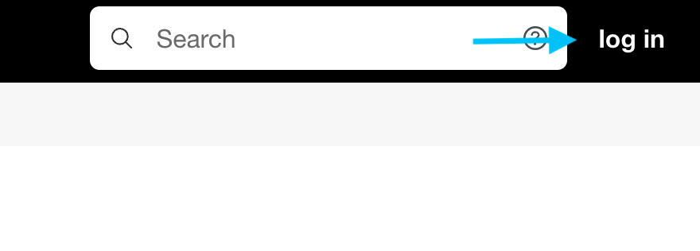
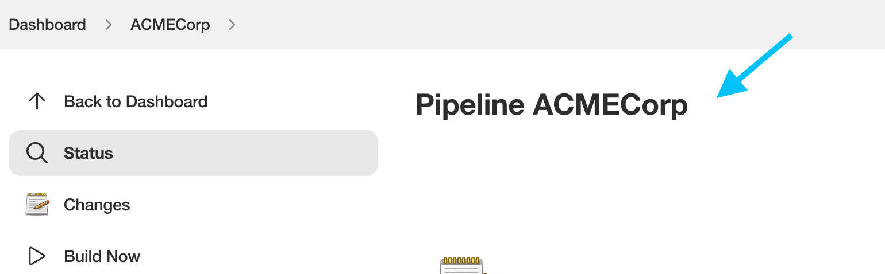
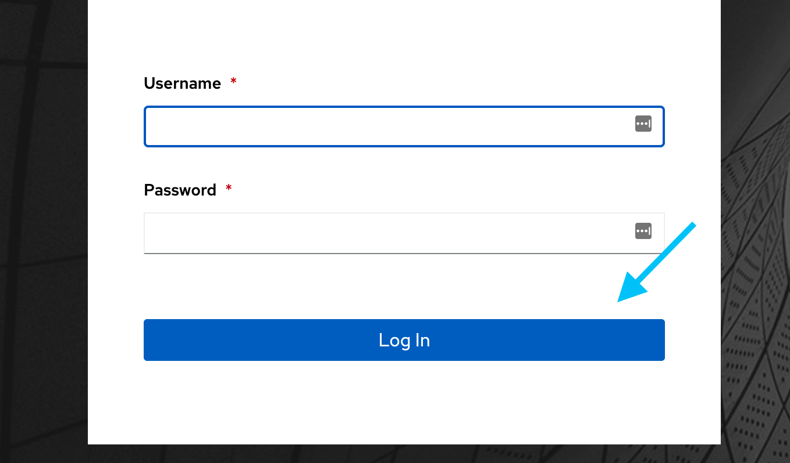
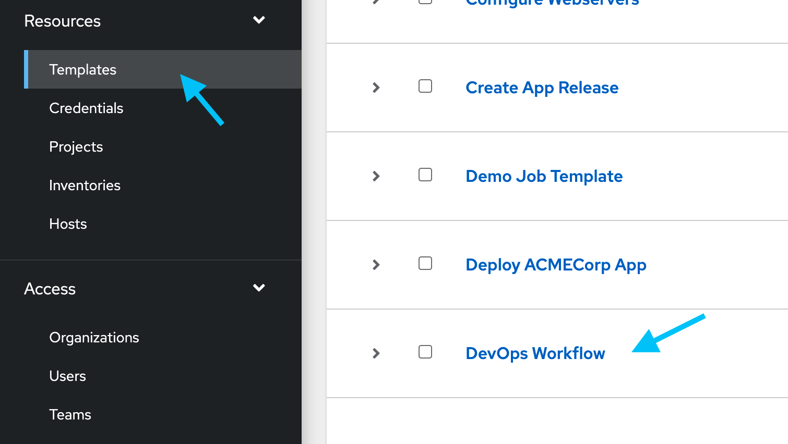
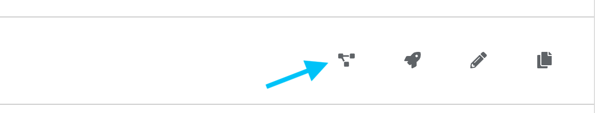
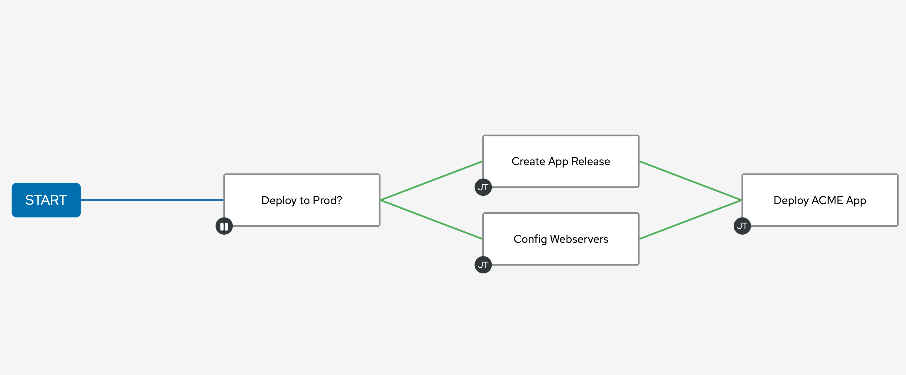

🔐 Login credentials
===
All the logins use the same credentials.

>User: student

>Password: learn_ansible

👋 Introduction
===
#### Estimated time to complete: *5 minutes*

ACME Corp use a variety of tools in their DevOps pipeline. Let's have a look at each of these tools and how they're configured.

☑️ Task 1 - VS Code editor
===

ACME Corp developers use the `VS Code` IDE. Let's explore.
* The *VS Code* tab is open by default.

You'll see two folders under the *acme_corp* folder in the left pane:
  *  The `app` folder contains the *Let's Quiz!* application code.
  *  The `playbooks` folder contains the playbooks we'll use in our lab.

The `playbooks` folder contains the playbooks they use to automate the *Let's Quiz!* application deployment.

*  Click on the `playbooks` folder.

<!--  -->

>### **❗️ Note**
>The *ACME Corp* repository and *git* configuration is already setup for you.

☑️ Task 2 - Gitea
===

ACME Corp uses *Gitea* for source code management and contains the *Let’s Quiz!* application code repository.

* Click on the *Gitea* tab on the top of the browser window.
* Log into *Gitea* by clicking the `Sign in` button in the top right-hand corner and using the provided credentials.

<!--  -->

* On the right-hand side, click on `Settings` and then `Webhooks`

<!--  -->

*Gitea* has a webhook configured to start a Jenkins job when new code is committed to the repository. We'll use this webhook in the following challenges.

☑️ Task 3 - Jenkins
===

ACME Corp uses Jenkins to run a few development tasks on the *Let's Quiz!* application.

* Click on the *Jenkins* tab on the top of the browser window.
* Log into *Jenkins* by clicking the `log in` button in the top right-hand corner and using the provided credentials.

<!--  -->

The `ACMECorp` Jenkins job loads by default. The pipeline performs basic development tasks that we'll cover in more detail in the next exercises.

<!--  -->

☑️ Task 4 - Controller
===

ACME Corp operations use automation controller extensively in the environments.

* Click on the *Controller* tab on the top and log in using the provided credentials.
* Log into *controller* by clicking the using the provided credentials and click on the `Log In` button.

<!--  -->

* Under `Resources`, click on `Templates`. This menu displays the current *Job Templates* configured in controller.

<!--  -->

* Select the `DevOps Workflow` job template by clicking on the checkbox next to it.
* Click on the `Visualizer` button located at the right-hand side of the `DevOps Workflow` job template.

<!--  -->

The *DevOps Workflow* job template unifies multiple tasks into a logical, consistent process. We'll have a look at these tasks in more detail during this lab.

<!--  -->

>### **❗️ Note**

> Automation controller provides capabilities, such as an extensive API, Workflows and Webhooks to orchestrate DevOps tooling and workflows.

✅ Next Challenge
===
Press the `Next` button below to go to the next challenge once you’ve completed the tasks.

🐛 Encountered an issue?
====
If you have encountered an issue or have noticed something not quite right, please [open an issue](https://github.com/ansible/instruqt/issues/new?labels=devops-controller&title=New+DevOps+with+automation+controller+issue+issue:+incident-creation&assignees=craig-br).

