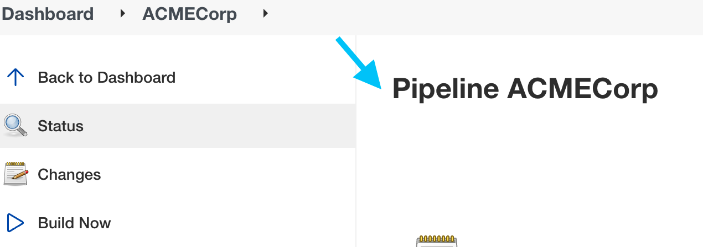
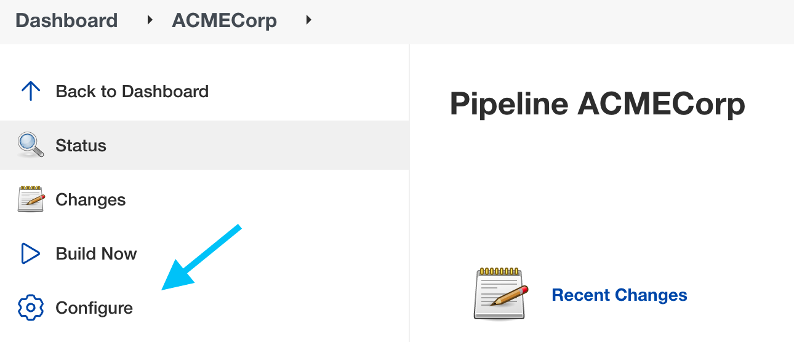
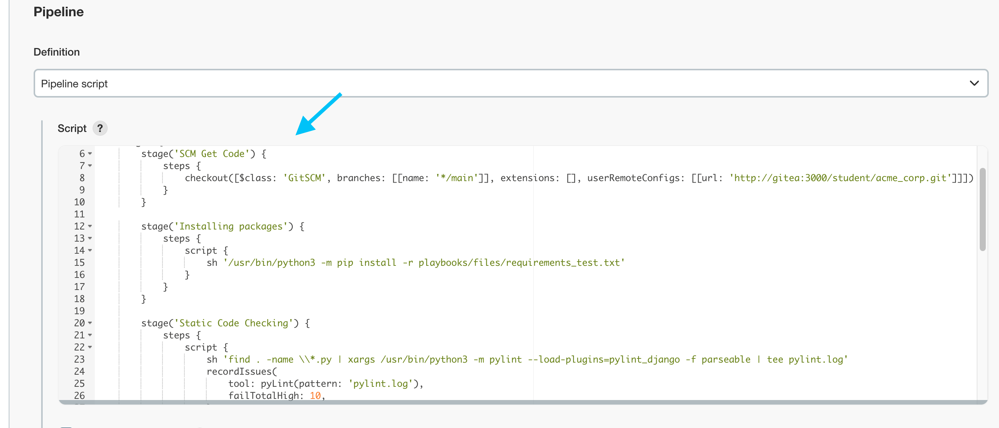
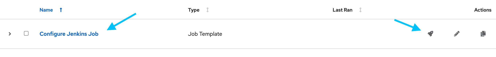
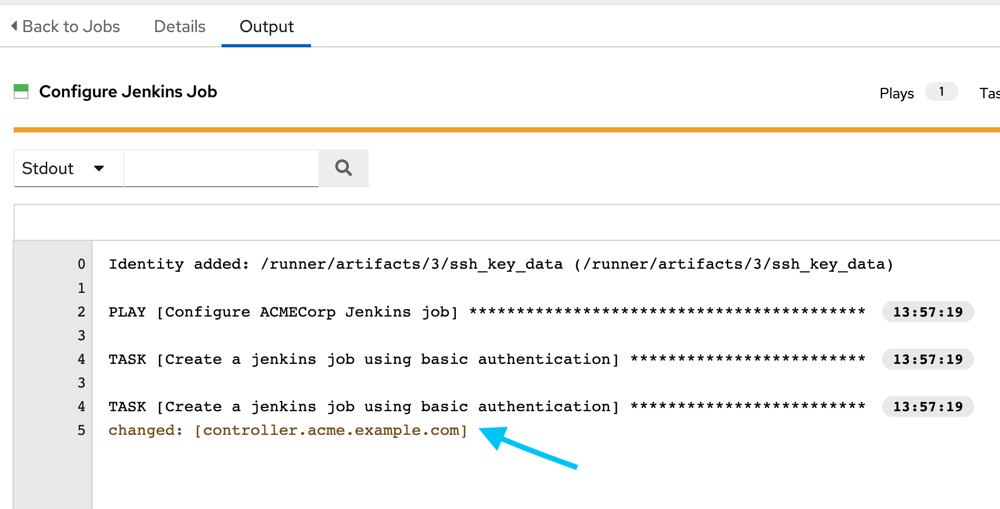
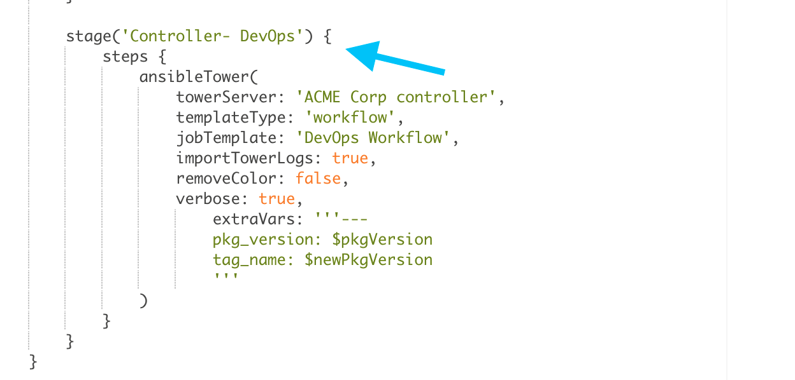

🔐 Login credentials
===
All the logins use the same credentials.

User:

```yaml
student
```

Password:

```yaml
learn_ansible
```

👋 Introduction
===
#### Estimated time to complete: _10 minutes_<p>

ACME Corp uses _Jenkins_ to run basic development tasks and checks before manually handing over the code to operations for deployment.

In this lab, we’ll edit the pipeline to integrate Jenkins into _automation controller_ using a [Job Template](https://docs.ansible.com/automation-controller/latest/html/userguide/job_templates.html).


>### **❗️ Note**
>No need to worry! We will not do any Jenkins pipeline coding in this lab, so there is no need to understand all the details.

☑️ Task 1 - The ACME Corp pipeline
===
Let’s look at the ACMECorp pipeline steps:

* The _Jenkins_ tab is open by default.
* If not already logged in, log in using the provided credentials.
* The default landing page is the `ACME Corp` pipeline.

<!--  -->
<a href="#jenkins_acmecorp_job">
  
</a>

<a href="#" class="lightbox" id="jenkins_acmecorp_job">
  
</a>


* On the left-hand side of the Jenkins UI window, click on `Configure`

<!--  -->
<a href="#jenkins_acmecorp_configure">
  
</a>

<a href="#" class="lightbox" id="jenkins_acmecorp_configure">
  
</a>

* Scroll to the bottom of the page until you get to the *Pipeline* section, which contains _groovy_ code.

<!--  -->
<a href="#jenkins_acme_initial_pipe">
  
</a>

<a href="#" class="lightbox" id="jenkins_acme_initial_pipe">
  
</a>

ACME Corp developers have added the following steps to the pipeline:

* **SCM Get Code** - Pull the latest _Let’s Quiz!_ application code from the _GItea_ repo
* **Installing packages** - Install the packages needed to test the application.
* **Static Code Checking** - Run static code analysis
* **Build and Tag** - Increment the _Let’s Quiz!_ application version and create a git tag. This new tag number will prove useful in the following steps.

☑️ Task 2 - Controller and Jenkins integration
===

The `Configure Jenkins Job` controller job template adds a step to the current pipeline that calls controller’s API to start a controller workflow.

Run the `Configure Jenkins Job` job template:

* Click on the *Controller* tab at the top of the browser window.
* If not already logged in, log in using the provided credentials.
* Under `Resources`, click on `Templates`. This action displays the current _Job Templates_ configured in controller.
* Run `Configure Jenkins Job` by clicking on the  icon on the right-hand side.

<!--  -->
<a href="#controller_jenkins_jt">
  
</a>

<a href="#" class="lightbox" id="controller_jenkins_jt">
  
</a>

In the _Job Output_ window, you’ll see that it successfully *changed* the current ACMECorp pipeline.

<!--  -->
<a href="#controller_jt_jenkins_output">
  
</a>

<a href="#" class="lightbox" id="controller_jt_jenkins_output">
  
</a>


☑️ Task 3 - Updated ACMECorp pipeline
===

**Update the Jenkins pipeline:**

* Click on the _Jenkins_ tab at the top of the browser window.
* Click on `ACME Corp` in the top menu, then click on `Configure`. This action reloads the Jenkins UI with the latest changes.
* Scroll down to the pipeline section.

You’ll see a new `Controller - DevOps` stage in the pipeline code.

<!--  -->
<a href="#jenkins_acme_plugin">
  
</a>

<a href="#" class="lightbox" id="jenkins_acme_plugin">
  
</a>


> **❗️ Note**<p>
>The [Ansible Tower Jenkins plugin](https://plugins.jenkins.io/ansible-tower/) is community-driven and used for demonstration purposes only in this lab.
>
>Although the plugin still refers to _Tower_, it successfully consumed the controller API for this lab task.


The [Ansible Tower Jenkins plugin](https://plugins.jenkins.io/ansible-tower/) uses the automation controller API to run job templates. Let’s look at the configuration.

The name of the configured automation controller in Jenkins - `ACME Corp controller `.
```groovy
towerServer: 'ACME Corp controller',
```
The type of job template to call - `workflow`.
```groovy
templateType: 'workflow',
```
The name of the Workflow Job Template - `DevOps Workflow`.
```groovy
jobTemplate: 'DevOps Workflow',
```

The controller API accepts multiple parameters, including passing extra variables to the API call.
```groovy
extraVars: '''---
pkg_version: $pkgVersion
tag_name: $newPkgVersion
'''
```
ACME Corp will use the `$newPkgVersion` variable created in the previous Jenkins step and pass it to controller as the `tag_name` variable. This information is vital for deploying the application successfully.

✅ Next Challenge
===
Press the `Check` button below to go to the next challenge once you’ve completed the tasks.

🐛 Encountered an issue?
====

If you need to restart the entire workflow, run the `Restart DevOps Workflow` job template in automation controller.

If you have encountered an issue or have noticed something not quite right, please [open an issue](https://github.com/ansible/instruqt/issues/new?labels=devops-controller&title=New+DevOps+with+automation+controller+issue+issue:+incident-creation&assignees=craig-br).

<style type="text/css" rel="stylesheet">
  .lightbox {
    display: none;
    position: fixed;
    justify-content: center;
    align-items: center;
    z-index: 999;
    top: 0;
    left: 0;
    right: 0;
    bottom: 0;
    padding: 1rem;
    background: rgba(0, 0, 0, 0.8);
    margin-left: auto;
    margin-right: auto;
    margin-top: auto;
    margin-bottom: auto;
  }
  .lightbox:target {
    display: flex;
  }
  .lightbox img {
    max-width: 60%;
    max-height: 60%;
  }
  img {
    display: block;
    margin-left: auto;
    margin-right: auto;
  }
  h1 {
    font-size: 18px;
  }
  h2 {
    font-size: 16px;
    font-weight: 600
  }
  h3 {
    font-size: 14px;
    font-weight: 600
  }
  p span {
    font-size: 14px;
  }
  ul li span {
    font-size: 14px
  }
</style>
