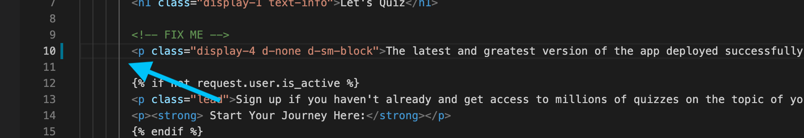

🔐 Login credentials
===
All the logins use the same credentials.

>User: student<p>
>Password: learn_ansible

👋 Introduction
===

#### Estimated time to complete: _10 minutes_<p>

ACME Corp needs to update the _Let’s Quiz!_ application home page. In this challenge, we’ll update the application in VS Code and trigger the Gitea webhook described in the initial _Environment overview_ challenge.

>### **❗️ Note**
> The checks in this challenge might take a few seconds longer due to the  possible variation in the Jenkins pipeline completion time.

☑️ Task 1 - Current Let's Quiz! application status
===

Currently, the *Let's Quiz!* application is not deployed into production. You’ll see the following message in the _Let’s Quiz!_ tab confirming this.

* Click on the _Let’s Quiz!_ tab at the top of the browser window.

<!--  -->
<a href="#app_page_prerelease">
  
</a>

<a href="#" class="lightbox" id="app_page_prerelease">
  
</a>

☑️ Task 2 - Updating the ACME Corp home page
===

**Update the ACME Corp home page.**

* Open the _VS Code_ tab located at the top of the browser window.
* On the VS Code Explorer pane, navigate to `app ⇒ lets_quiz ⇒ templates ⇒ quiz` and click on `home.html`.

<!--  -->
<a href="#vscode_home_edit">
  
</a>

<a href="#" class="lightbox" id="vscode_home_edit">
  
</a>

**Edit the line directly under the  `<!-- FIX ME -->` comment in `home.html`.**

* Copy and paste the below line and replace the existing line directly below the  `<!-- FIX ME -->` comment.

```html
          <p class="display-4 d-none d-sm-block">The latest and greatest version of the app deployed successfully.</p>
```

The new line should look like the below screenshot.

<!--  -->
<a href="#vscode_home_edit_note">
  
</a>

<a href="#" class="lightbox" id="vscode_home_edit_note">
  
</a>

>### **❗️ Note**
> The updated line in `home.html` must have the same indentation as the `<!-- FIX ME -->` comment. The challenge checks will fail if it differs.

* Save the file by either clicking on `File ⇒ Save` on the VS Code menu bar or the relevant keyboard shortcut.


☑️ Task 3 - Commit and push the code to start the pipeline
===

**Commit and push the updated `home.html` file to the _Gitea_ repository.**

> ### **❗️ Need more guidance on committing the code?**<p>
> Please refer to the [Visual Studio Code Version Control documentation](https://code.visualstudio.com/docs/editor/versioncontrol#_commit) for detailed instructions.

* On the left VS Code Explorer pane, click on the `Source Control` Git icon with the number banner. In the image below, the number banner is `1`.
* Click on the + sign located on the right-hand side of the `home.html` file.
* Enter a commit message in the `Message` text input. For example, a commit message could be.

```
Updated home.html
```

* Click on the ☑️ to commit the changes.

<!--  -->
<a href="#vscode_commit">
  
</a>

<a href="#" class="lightbox" id="vscode_commit">
  
</a>

* A new `Sync Changes` button will appear. Click on it to push the code to the ACME Corp repository.

<!--  -->
<a href="#vscode_push">
  
</a>

<a href="#" class="lightbox" id="vscode_push">
  
</a>

>### **❗️ Note**
> If you're receiving any errors using VS Code to sync your repository, please try the following.
> * Open a new terminal in *VS Code* by clicking on `Terminal ==> New Terminal` located at the top menu.
> * Copy and paste the below command into the terminal.
>
> ```bash
> git pull origin main --rebase
> ```
> * Resolve any file conflicts, if any, and run the below command to update the repository.
>  ```bash
> git push origin main --force
> ```

☑️ Task 4 - Check the pipeline status
===

**Check that the *Gitea* webhook started the pipeline.**

* Click on the _Jenkins_ tab at the top of the browser window.
* In the _Pipeline ACMECorp_ window, you’ll see that the _Gitea_ webhook started the pipeline.
* Click on the *number* icon to open the Jenkins build. In the screenshot below, the build number is `1`.

<!--  -->
<a href="#jenkins_acme_job_running">
  
</a>

<a href="#" class="lightbox" id="jenkins_acme_job_running">
  
</a>

* Now, click on the `Console Output` button on the left pane in the new window.

<!--  -->
<a href="#jenkins_acme_console_button">
  
</a>

<a href="#" class="lightbox" id="jenkins_acme_console_button">
  
</a>

The pipeline successfully created the new package version and initiated the automation controller `DevOps Workflow` job template.

<!--  -->
<a href="#jenkins_acme_console_bottom">
  
</a>

<a href="#" class="lightbox" id="jenkins_acme_console_bottom">
  
</a>

The `tag_name` variable contains the latest _Let’s Quiz!_ application version. In the image above, the `tag_name` variable is set to `2.52.0`. We’ll use the `tag_name` variable in controller for the following challenges.

>**❗️ Note**
>The pipeline will not finish at this stage of the lab. We’ll continue with the DevOps workflow in the next challenge.

☑️ Task 5 - Check the ACME Corp repository
===

**Examine the ACME Corp repository hosted in _Gitea_.**

* Click on the _Gitea_ tab at the top of the browser window.
* Refresh the *Gitea* tab window by clicking the ↻ located at the top right hand side of the page or by refreshing the web page using your browser.

<!--  -->
<a href="#gitea_new_tag">
  
</a>

<a href="#" class="lightbox" id="gitea_new_tag">
  
</a>

The Jenkins commit message shows the latest version number. In the screenshot below, the commit message is `Bump version from v2.51.0 to v2.52.0`.

* Click on the `Tags` button in the right-hand corner.

<!--  -->
<a href="#gitea_tag_artifacts">
  
</a>

<a href="#" class="lightbox" id="gitea_tag_artifacts">
  
</a>

_Gitea_ created `ZIP` and `TAR.GZ` files associated with the new tag. In the above screenshot, the tag name is `v2.52.0`.

We’ll use this tag number and artifacts in the next challenge.

✅ Next Challenge
===
Press the `Check` button below to go to the next challenge once you’ve completed the tasks.

🐛 Encountered an issue?
====

If you need to restart the entire workflow, run the `Restart DevOps Workflow` job template in automation controller.

If you have encountered an issue or have noticed something not quite right, please [open an issue](https://github.com/ansible/instruqt/issues/new?labels=devops-controller&title=New+DevOps+with+automation+controller+issue+issue:+incident-creation&assignees=craig-br).

<style type="text/css" rel="stylesheet">
  .lightbox {
    display: none;
    position: fixed;
    justify-content: center;
    align-items: center;
    z-index: 999;
    top: 0;
    left: 0;
    right: 0;
    bottom: 0;
    padding: 1rem;
    background: rgba(0, 0, 0, 0.8);
    margin-left: auto;
    margin-right: auto;
    margin-top: auto;
    margin-bottom: auto;
  }
  .lightbox:target {
    display: flex;
  }
  .lightbox img {
    max-width: 60%;
    max-height: 60%;
  }
  img {
    display: block;
    margin-left: auto;
    margin-right: auto;
  }
  h1 {
    font-size: 18px;
  }
    h2 {
    font-size: 16px;
    font-weight: 600
  }
    h3 {
    font-size: 14px;
    font-weight: 600
  }
  p span {
    font-size: 14px;
  }
  ul li span {
    font-size: 14px
  }
</style>
