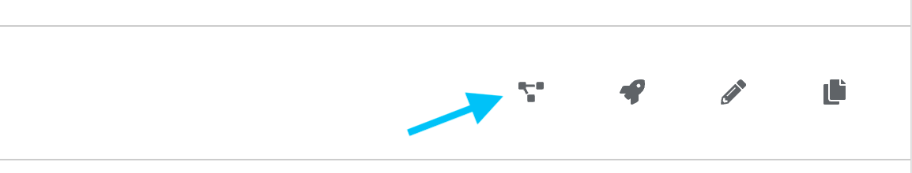

🔐 Login credentials
===
All the logins use the same credentials.

>User: student

>Password: learn_ansible

👋 Introduction
===

#### Estimated time to complete: _10 minutes_

Our last challenge initiated the Jenkins pipeline by editing the **home.html** page. In this challenge, we’ll use automation controller to approve and deploy the _Let’s Quiz!_ application.

>### **❗️ Note**
> The checks in this challenge might take a few seconds longer due to the  possible variation in the Jenkins pipeline completion time.

☑️ Task 1 - Exploring the DevOps Workflow in controller
===

ACME Corp operations created a [controller workflow](https://docs.ansible.com/automation-controller/4.2.0/html/userguide/workflows.html) called `DevOps Workflow`. This workflow combines configuring a web server, creating an application release in the ACMECorp repository, and deploying the application to production into a single process.

**Let’s explore the DevOps Workflow layout using the _visualizer_.**

* The _Controller_ tab should be open by default.
* Please log in using the provided credentials if required.
* Under `Resources`, click on `Templates`. This action displays the `DevOps Workflow` job template configured in controller.

<!--  -->

* Click on the `visualizer` button on the right hand side of the `DevOps Workflow` job template.

<!--  -->

The `DevOps Workflow` job template unifies multiple tasks into a logical, consistent process.

<!--  -->

**Exploring the `DevOps Workflow` job template nodes.**

* **Deploy to Prod?** - This controller [approval node](https://docs.ansible.com/automation-controller/latest/html/userguide/workflow_templates.html#approval-nodes) enables decision-makers to authorize deploying the application into production.
* **Create App Release** - This step, typically performed by developers, creates a new _Let’s Quiz!_ release in _Gitea_ using the `tag_name` variable generated in the _ACMECorp_ pipeline.
* **Config Webservers** - This step, typically performed by operations, configures the web server by installing the required dependencies for the _Let’s Quiz!_ application.
* **Deploy ACME App** - This step installs and runs the latest release of the application.
* Once you’ve reviewed the **DevOps Workflow**, exit the _visualizer_ UI by clicking on the Ｘ button in the top right-hand corner.

☑️ Task 2 - Approving the DevOps Workflow in controller
===

ACME Corp operations added a controller [approval node](https://docs.ansible.com/automation-controller/latest/html/userguide/workflow_templates.html#approval-nodes) called `Deploy to Prod` to the `DevOps Workflow` job template. This step enables ACME Corp decision-makers to perform last checks, such as ensuring enough capacity is available on the target servers for the _Let’s Quiz!_ application.

Currently, the new _Let’s Quiz!_ application is not deployed.

**Approving the _Let’s Quiz!_ application production deployment.**

* If the *Controller* tab is not open, click on the *Controller* tab on the top of the browser window.
* Please log in using the provided credentials if required.
* Click on the _notification_ icon in the top right corner of the controller UI to open the _Workflow Approval_ interface.

<!--  -->

The _Workflow Approval_ interface is where authorized users can approve or deny an automation task.

* Click on the _checkbox_ on the left-hand side next to `Deploy to Prod?`.
* Click on the **Approve** button located at the top of thew *Workflow Approvals* UI.

<!--  -->

☑️ Task 3 - Viewing the DevOps Workflow outcomes
===

Once the `DevOps Workflow` is approved, it will begin configuring the web server, creating a new _Let’s Quiz_ release, and deploying it to production.

**The `DevOps Workflow` controller job.**

* In the _Controller_ tab, click on `Jobs` located under `Views`.
* Click on the `DevOps Workflow` job.

<!--  -->

This action opens up the `DevOps Workflow` _Output_ interface. The green indicates that all the tasks completed successfully.

We can also look more in-depth at the execution outcomes and details in the `DevOps Workflow` _Output_ interface.

* Click on the `Create App Release` node.

<!--  -->

This action displays the `Create App Release`  [controller job](https://docs.ansible.com/automation-controller/latest/html/userguide/job_templates.html#view-completed-jobs) details.

**Let's look at the `Create App Release` controller job in more detail.**
* Note that the *Jenkins* user triggered the build. The controller provides [RBAC](https://docs.ansible.com/automation-controller/latest/html/userguide/users.html) functionality, and ACME Corp created the *Jenkins* user with the minimal privileges necessary to execute the workflow.

<!--  -->

* Under the _Variables_ section, note that the `tag_name` variable was successfully used in the `Create App Release` job template.

<!--  -->

* Click on the `Output` tab located next to the `Details` tab above.

The `Output` interface displays the execution output for the `Create App Release` job template.

<!--  -->

☑️ Task 4 - New Let’s Quiz! release
===

The `Create App Release` job template created a new release in the `acme_corp` _Gitea_ repository.

**Let’s have a look at the latest release.**

* Click on the _Gitea_ tab located at the top of the browser window.
* Log into _Gitea_ using the provided credentials if required.
* Click on the `Releases` tab in the top menu.

<!--  -->

* Note that the new release used the `tag_name` variable value generated in the ACME Corp pipeline.

ACME Corp operations used the associated `TAR.GZ` file to deploy the _Let’s Quiz!_ application into production.

☑️ Task 5 - Review the ACMECorp pipeline
===

**Let's review the ACMECorp pipeline status.**
* Click on the _Jenkins_ tab located at the top of the browser window.
* Log into _Jenkins_ using the provided credentials if required.

<!--  -->

The *ACMECorp pipeline* shows a _green_ status indicating it was completed successfully once the `DevOps Workflow` job template completed all the tasks.

☑️ Task 7 - Visit the Let’s Quiz! home page
===

Last but not least, the _Let’s Quiz!_ application production deployment should be successful!

**Let’s review the home page and look for our changes.**
* Click on the Let’s Quiz! tab located at the top of the browser window.
* Note that the home page has the updated text we added in the previous challenge.

<!--  -->

🎉 Congratulations!
===

**Congratulations on completing the challenges successfully!**

[Automation controller](https://www.ansible.com/products/controller) offers an extensive API, Webhooks, Workflows and many more solutions to integrate with existing technologies and elevate your DevOps practices across the enterprise.

**We covered a few of the enterprise features [Ansible Automation Platform](https://www.redhat.com/en/technologies/management/ansible#:~:text=Ansible%20Automation%20Platform%20provides%20an,to%20security%20and%20network%20teams.) provides:**
* [Workflow job templates](https://docs.ansible.com/automation-controller/latest/html/userguide/workflow_templates.html) enable you to logically chain and re-use smaller pieces of automation to solve more complex use-cases.
* Automation controller offers an extensive [API](https://docs.ansible.com/automation-controller/latest/html/controllerapi/index.html) to augment, integrate and elevate your current DevOps practices to span multiple IT domains and environments.

**In addition, Ansible Automation Platform offers multiple features to enhance your current DevOps practices.**
* [Ansible Content Collections](https://www.ansible.com/products/content-collections) provide pre-built, tested, and certified automation content to lower your barrier of entry to automation and reduce the operational overhead associated with tooling integration.
* [Automation controller webhooks](https://docs.ansible.com/automation-controller/4.2.0/html/userguide/webhooks.html) offer additional options to integrate Ansible Automation Platform with your current CI/CD tools.

✅ Where to go next
===

Whether you are beginning your automation journey or a seasoned veteran, there are a variety of resources to enhance your automation knowledge:

* [Self-paced exercises](https://www.redhat.com/en/engage/redhat-ansible-automation-202108061218) - Explore all our self-paced labs
* [Trial subscription](http://red.ht/try_ansible) - Are you ready to install in your environment? Get your trial subscription for unlimited access to all the components of Ansible Automation Platform.
* [Subscribe to the Red Hat Ansible Automation Platform YouTube channel. ](https://www.youtube.com/ansibleautomation)

✅ Next Challenge - Playground
===

The next challenge is a place for you to explore and play with the remaining time. Feel free to try it out!

Press the `Check` button below to go to the next challenge once you’ve completed the tasks.

🐛 Encountered an issue?
====
If you need to restart the entire workflow, run the `Restart DevOps Workflow` job template in automation controller.

If you have encountered an issue or have noticed something not quite right, please [open an issue](https://github.com/ansible/instruqt/issues/new?labels=devops-controller&title=New+DevOps+with+automation+controller+issue+issue:+incident-creation&assignees=craig-br).

