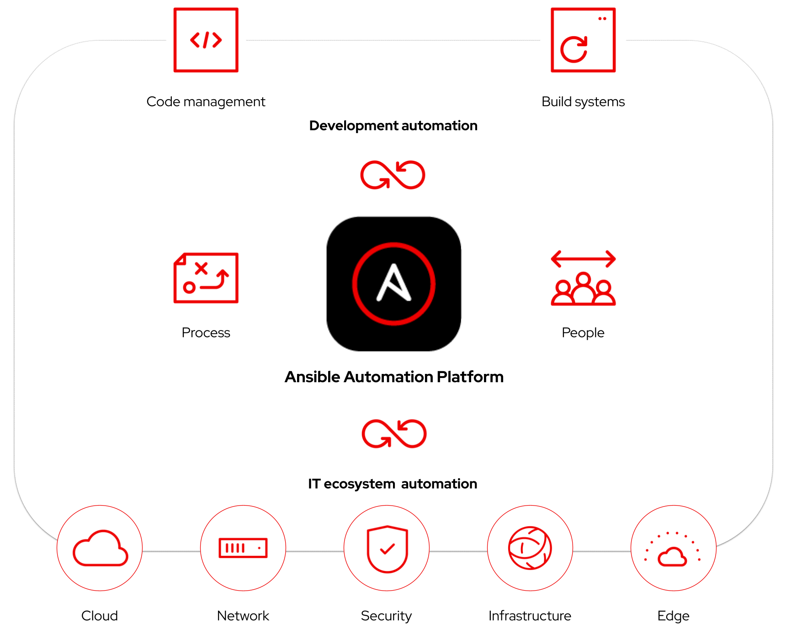

 # DevOps and CI/CD with automation controller

  [Automation controller](https://www.ansible.com/products/controller) offers an extensive API, webhooks and workflows to integrate with existing technologies and elevate your DevOps practices across the enterprise.

  

  ACME Corp, our example company in this lab, needs to deploy their *Let’s Quiz!* application. Currently, their Jenkins pipeline only does basic development tasks, such as static code checking, and deploying it into production is still a manual handover to operations.

  #### This lab covers:

  * Configuring Jenkins using automation controller.
  * Integrating Jenkins into automation controller.
  * Creating a new application release, configuring a web server and deploying the updated *Let’s Quiz!* application with a [controller workflow](https://docs.ansible.com/automation-controller/latest/html/userguide/workflows.html).
  * Using a controller [approval](https://docs.ansible.com/automation-controller/4.2.0/html/userguide/workflow_templates.html#approval-nodes) to allow final checks and sign-off before deploying to production.

## Resources and examples

### Gitea

This lab uses the [Gitea](https://gitea.io/en-us/) for source control management. The Gitea image is configured using an Ansible playbook and environment variables.

* [Gitea container image](https://hub.docker.com/r/gitea/gitea)
* [Gitea configuration documentation](https://docs.gitea.io/en-us/config-cheat-sheet/)
* [Ansible playbook example](./assets/files/gitea/configure_gitea.yml)

### Jenkins

A custom Jenkins image is configured using a Dockerfile and [Jenkins Configuration as Code](https://www.jenkins.io/projects/jcasc/). An Ansible playbook configures a Jenkins pipeline using a configuration file.

* [Dockerfile example](./assets/files/jenkins/Jenkins_dockerfile)
* [Configuration as Code settings](./assets/files/jenkins/src/usr/share/jenkins/ref/jenkins_casc.yml)
* [Jenkins plugins list](./assets/files/jenkins/src/usr/share/jenkins/ref/plugins.txt)
* [Jenkins Job configuration file](./assets/files/jenkins/acme.xml)
* [Ansible Playbook example](./assets/files/jenkins/configure_jenkins.yml)

### Automation controller

An Ansible playbook creates the “DevOps Workflow” [controller workflow](https://docs.ansible.com/automation-controller/latest/html/userguide/workflows.html). This workflow makes an application release, configures the target host and deploys the application. The workflow also contains an approval node named “Deploy to Prod?”. Playbooks used:

* [Create App Release](./assets/files/controller/playbooks/app_release.yml)
* [Config Webservers](./assets/files/controller/playbooks/configure_webservers.yml)
* [Deploy ACME App](./assets/files/controller/playbooks/deploy_acme_app.yml)