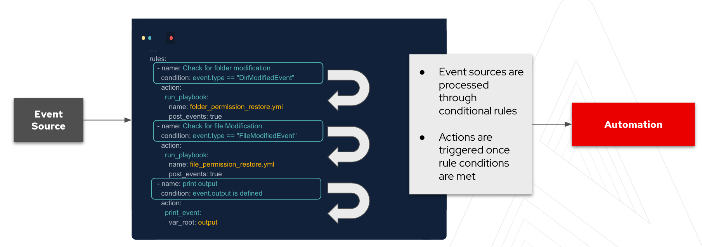

## Greetings!


Event-Driven Ansible has opened many possibilities in automation and the possibility of working from events or telemetry within the network is just one of those use cases. This lab is to introduce you some key concepts on Event-Driven Ansible with networking in mind.


>### **❗️ Note**
>The swiches used for the network are Arista switches,  recently Arista released a Source plugin for their switches which can be found at: https://github.com/arista-netdevops-community/Ansible-Event-Driven-Automation-Examples
>In addition to this they presented a demo at AnsibleFest using Cloudvision and Event-Driven Ansible - This can be viewed at https://github.com/arista-netdevops-community/rhs-eda


☑️ Basics of Event-Driven Ansible and Lab Setup
===


`ansible-rulebook` relies on a few components. These components all come together to allow you to respond to events and decide on the next course of action. The three main components to the rulebooks are as follows:

 - **Source** - The sources of the events come from source plugins. These plugins define what Event-Driven Ansible is listening to for events.
 - **Condition** - The conditional statements in the rulebook allow us to match criteria on which one want to have some kind of response to.
 - **Action** - Lastly, the action is the response once the condition has been met from the event source. This can be to trigger remediation, log a ticket for observation, or generate other events which would need responding to.

Currently, there are a number of source plugins however this list is being developed and as more partners get involved in the project the list will expand.




|Source Plugin|  Description |
|--|--|
|  Azure Service Bus |  An ansible-rulebook event source module for receiving events from an Azure service bus|
|File|An ansible-rulebook event source plugin for loading facts from YAML files initially and when the file changes|
|Kafka|An ansible-rulebook event source plugin for receiving events via a kafka topic|
|Range|An ansible-rulebook event source plugin for generating events with an increasing index i|
|URL Check|An ansible-rulebook event source plugin that polls a set of URLs and sends events with their status|
|Webhook|An ansible-rulebook event source module for receiving events via a webhook|
|Watchdog|An ansible-rulebook event source plugin for watching file system changes|
|Alertmanager|An event source module for receiving events via a webhook from Alertmanager|

In this lab we will be using network telemetry. Streaming Network telemetry allows us to gather real time information about the network and the network devices. In this lab we will focus on working with event-driven telemetry, meaning we will get changes as they happen and not constantly consume events streaming to our message queue.

Our setup uses Telegraf to gather telemetry data by using the gnMi client on the Arista switches. In this scenario we subscribe to components which we want to observe. Telegraf gathers this and then pushes it to Kafka as an output. We will be working with the Kafka source plugin for most of this lab.


☑️ Task 1: One Port at a Time
===
Firstly, navigate to the `_ansible_rulebook` tab. This is where we are running ansible_rulebook and we will be able to process Ansible Rulebooks while we listen for events.

Let's have a look at the rulebook called `port_status.yml` - This rulebook will act an example which we will work on during this challendge.

     ---
    - name: Port State Event from Arista

      hosts: all
      sources:
       - ansible.eda.kafka:
           host: broker
           port: 9092
           topic: network

      rules:
       - name: Port is down
         condition: event.fields.admin_status == "DOWN"
         action:
           run_playbook:
            name: desired_port_state.yml

 - The rule book tells us that we are listening to a Kafka topic
 - The event we are looking for is a "Down" status coming from the Json in the event.
 - Lastly, if the event condition matches then we will trigger a playbook called `desired_port_state.yml`

So, let's see this in action. In your `_ansible_rulebook tab`, type in the following:

    ansible-rulebook --rulebook port_status.yml -i inventory.yaml --print-events

- In this command we `use --print-events` to show us every event that comes in for processing.  This is a great way of understanding your payloads and how you can deal with them.

Now that we have ansible-rulebook listening to the Kafka queue, let's go and trigger an event. Navigate to any of the network switch tabs (ceos1, ceos2, ceos3)

- Currently our Telegraf service is subscribed to listening to events on Ethernet 1 only - So we will work with this port right now.

We will shutdown a port to trigger the event: (run the following commands at the prompt ceos1)

    ceos1# en
    ceos1# conf t
    ceos1(config)# int eth 1
    ceos1(config-if-Et1)# shut
    ceos1(config-if-Et1)#

Once you have issued the shutdown command on the port, go back and have a look at the `_ansible_rulebook` tab. You should see something similar to the following:
Below is the event coming into ansible_rulebook

    {   'fields': {'admin_status': 'DOWN'},
        'meta': {   'received_at': '2023-04-18T18:58:24.269378Z',
                    'source': {   'name': 'ansible.eda.kafka',
                                  'type': 'ansible.eda.kafka'},
                    'uuid': '867eeea1-0a6b-4848-864f-00d8d94e7eae'},
        'name': 'ceos1',
        'tags': {'host': 'podman-host', 'name': 'Ethernet1', 'source': 'localhost'},
        'timestamp': 1681844299}

Once the event is processed, since there is a match on our condition, we execute a playbook.  Notice how the switch you changed is the one that is corrected.


    PLAY [Connecting to Leaf] ******************************************************

    TASK [Correct Interfaces] ******************************************************
    ok: [ceos2]
    ok: [ceos3]
    changed: [ceos1]

    PLAY RECAP *********************************************************************
    ceos1                      : ok=1    changed=1    unreachable=0    failed=0    skipped=0    rescued=0    ignored=0
    ceos2                      : ok=1    changed=0    unreachable=0    failed=0    skipped=0    rescued=0    ignored=0
    ceos3                      : ok=1    changed=0    unreachable=0    failed=0    skipped=0    rescued=0    ignored=0


☑️ Task 2: That was too easy
===

This is great - our first network orientated event-driven automation! But, this is also pretty easy. Remember when we ran our playbook to remediate the port, it ran against all switches. This is because of our inventory and because we didn't isolate the problematic host.

When ansible-rulebook works with a playbook, the event data is available to the playbook with the use of `ansible_eda.event`. Now, let's exit the current rulebook and lets take a look at the playbook  `desired_port_state.yml`

    ---
    - name: Connecting to Leaf
      hosts: switch
      connection: local
      gather_facts: false

      tasks:
        - name: Correct Interfaces
          arista.eos.eos_interfaces:
            config:
             - name: Ethernet1
               enabled: true

This super simple playbook could be expanded, so let's first change which hosts would run the playbook. Remember we want to isolate the host and only really run remediation on the problematic host.  To do this we will access event data in the playbook. Let's change the hosts target in the playbook to:

    hosts: "{{ ansible_eda.event.name }}"
This allows us to reference event data and try to match the name key from the event.
- Start the rulebook again.
In your _ansible_rulebook tab, type in the following:
  `ansible-rulebook --rulebook port_status.yml -i inventory.yaml --print-events`
- This time bring the ethernet 1 port down from another switch (ceos3):

```
    ceos3> en
    ceos3# conf t
    ceos3(config)# int eth 1
    ceos3(config-if-Et1)# shut
    ceos3(config-if-Et1)#
```

And observe your rulebook:

    ansible-rulebook --rulebook port_status.yml -i inventory.yaml --print-events
    {   'fields': {'admin_status': 'DOWN'},
        'meta': {   'received_at': '2023-04-18T19:16:54.460652Z',
                    'source': {   'name': 'ansible.eda.kafka',
                                  'type': 'ansible.eda.kafka'},
                    'uuid': '8b5cd07b-97b9-4f6a-86fc-1613f01d6889'},
        'name': 'ceos3',
        'tags': {'host': 'podman-host', 'name': 'Ethernet1', 'source': 'localhost'},
        'timestamp': 1681845406}

    PLAY [Connecting to Leaf] ******************************************************

    TASK [Correct Interfaces] ******************************************************
    changed: [ceos3]

    PLAY RECAP *********************************************************************
    ceos3                      : ok=1    changed=1    unreachable=0    failed=0    skipped=0    rescued=0    ignored=0

We can see that we have remediated the system with the problem!

☑️ Task 3: Event-Driven Smart hands
===

Let's expand on this example now.

We have been able to show that an event coming from our switches can be used to trigger some kind of automated action.  In this simple example we have worked with the administrative status of ports. We are now going to modify the rulebook but adding a condition for the "up" status of the port.

Navigate to the `ansible_rulebook` tab and lets edit the `port_status.yml`.   Add another rule to the ruleset:

       - name: Port is up
         condition: event.fields.admin_status == "UP"
         action:
           run_playbook:
            name: new_port_config.yml

This will allow us to respond to when the port goes live.  If you have a look at the current port configuration, you will notice there hasn't been anything configured. We can consider a simple use case here, perhaps in an organization all the ports not in use have been disabled, and when a port is brought up we would like to configure that port for what we need in our network.

We can store our desired configurations in a source of truth, for this lab we will use Gitea. If you navigate to the Gitea tab, you should be able to login using the following details:

    Username: student
    Password: learn_ansible

Once you have logged in you will see there is a student/leaf repo. This contains basic configuration files for us to use.  We now need to create a playbook called `new_port_config.yml` in our ansible-rulebook environment.

    ---
    - name: Connecting to Leaf
      hosts: "{{ ansible_eda.event.name }}"
      connection: local
      gather_facts: false

      tasks:

        - name: Download Network Config from Source of Truth
          ansible.builtin.git:
           repo: http://gitea:3000/student/leaf.git
           dest: /tmp/srv
           clone: yes

        - name: Restoring Configuration of Interfaces
          include_vars: /tmp/srv/switch_desired_conf.yml

        - name: Merge Configurations
          arista.eos.eos_l2_interfaces:
           config: "{{ my_sot }}"
           state: merged

Time to listen to the events again and see if we can configure a switch using the event of a port going live.
Now, remember we are still receiving telemtry from the switches, we are not going to modify that yet so we will trigger a port going down like we did before, and when Event-Driven Ansible corrects the port state and brings it back up, we should then get the event we are looking for, to trigger our configuration. So let's get our rulebook running!

    ansible-rulebook --rulebook port_status.yml -i inventory.yaml --print-events

Select a switch - lets have a look at the port config, and then bring it down:


```
ceos1# en
ceos1# conf t
ceos1(config)# sh run int eth 1
interface Ethernet1

ceos1(config)# int eth 1
ceos1(config-if-Et1)# shut
ceos1(config-if-Et1)#
```


We will see the port down event, and the action to remediate that. We will receive a second event now which is what we are after:

    {   'fields': {'admin_status': 'UP'},
        'meta': {   'received_at': '2023-04-27T15:26:49.025208Z',
                    'source': {   'name': 'ansible.eda.kafka',
                                  'type': 'ansible.eda.kafka'},
                    'uuid': '374e0fc9-643f-4616-9d5b-67d5ac287c89'},
        'name': 'ceos1',
        'tags': {'host': 'podman-host', 'name': 'Ethernet1', 'source': 'localhost'},
        'timestamp': 1682609208}

We will see the port down event, and the action to remediate that. We will receive a second event now which is what we are after:

    {   'fields': {'admin_status': 'UP'},
        'meta': {   'received_at': '2023-04-27T15:26:49.025208Z',
                    'source': {   'name': 'ansible.eda.kafka',
                                  'type': 'ansible.eda.kafka'},
                    'uuid': '374e0fc9-643f-4616-9d5b-67d5ac287c89'},
        'name': 'ceos1',
        'tags': {'host': 'podman-host', 'name': 'Ethernet1', 'source': 'localhost'},
        'timestamp': 1682609208}

    PLAY [Connecting to Leaf] ******************************************************

    TASK [Download Network Config from Source of Truth] ****************************
    changed: [ceos1]

    TASK [Restoring Configuration of Interfaces] ***********************************
    ok: [ceos1]

    TASK [Merge Configurations] ****************************************************
    changed: [ceos1]

    PLAY RECAP *********************************************************************
    ceos1                      : ok=3    changed=2    unreachable=0    failed=0    skipped=0    rescued=0    ignored=0

Let's have a look at the port config now:

    ceos1# sh run int eth 1
    interface Ethernet1
       switchport access vlan 30
    ceos1#


That concludes this challenge !

