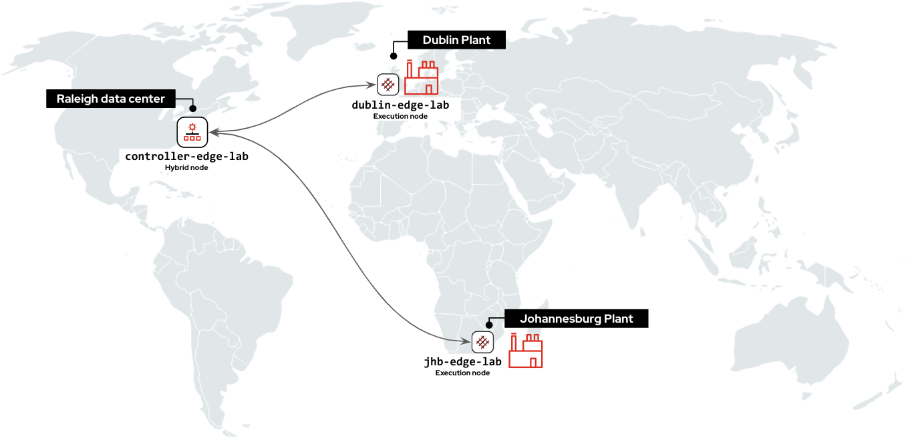
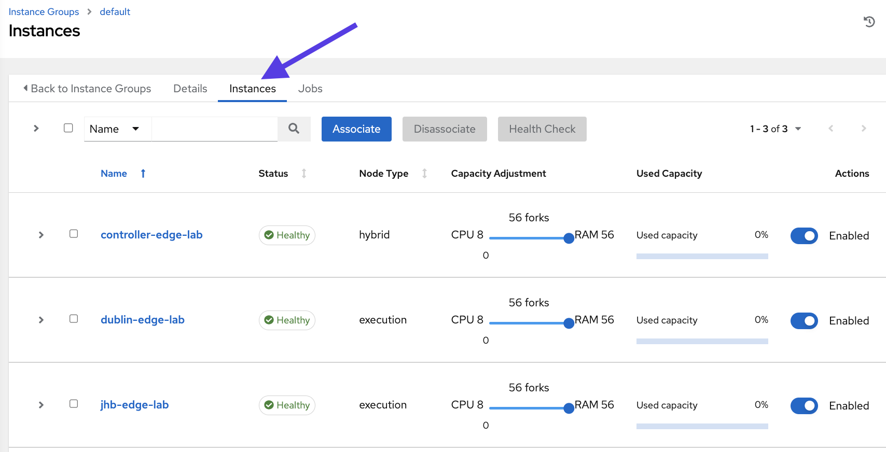
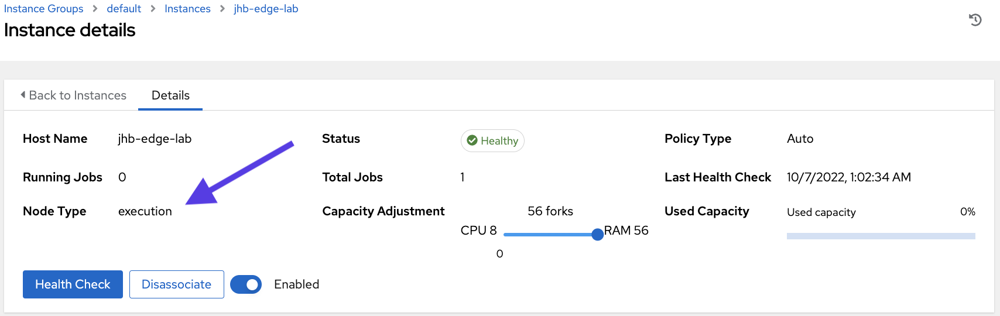
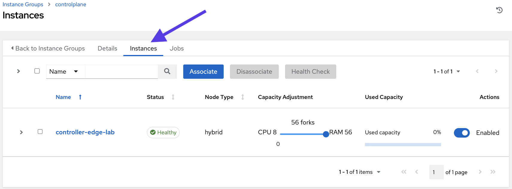
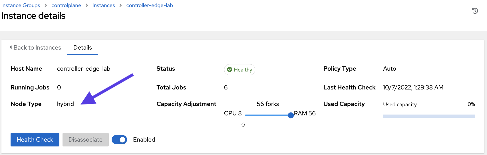
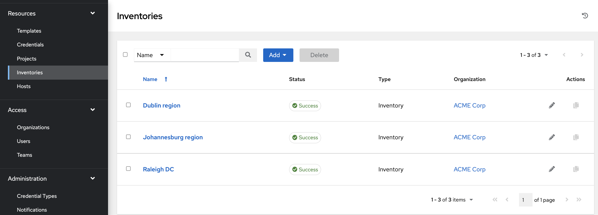
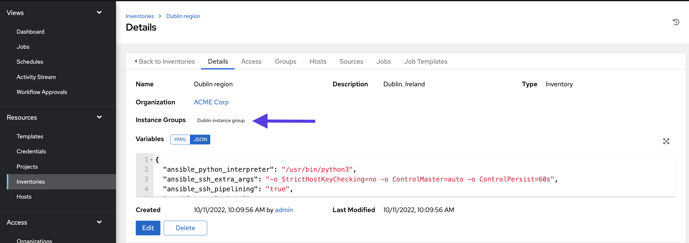
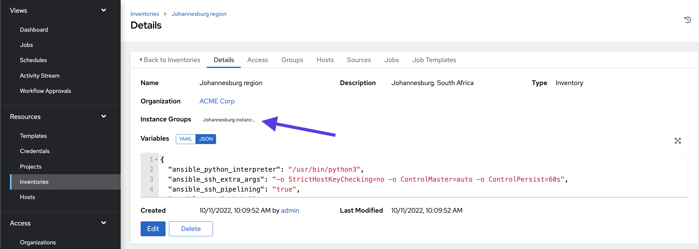
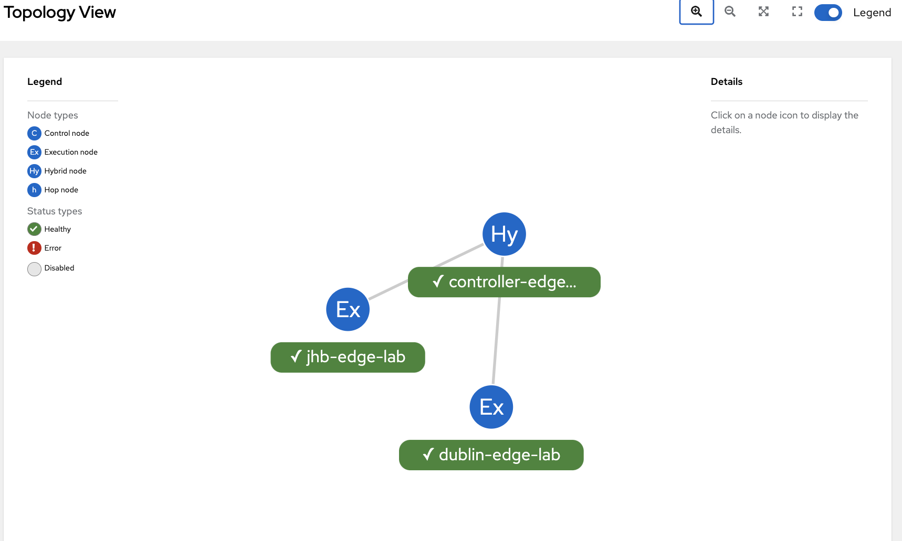
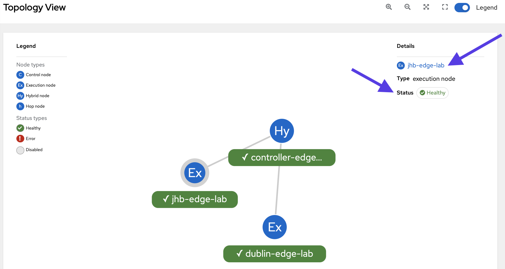

🔐 Login credentials for the mission
===

>**Controller username**:
> ```yaml
>student
>```
>**Controller password**:
>```yaml
>learn_ansible
>```

👋 Introduction
===
### ACME Corp
ACME Corp uses Ansible Automation Platform extensively to manage their edge ecosystem across multiple regions.
In this challenge, we’ll review their installation, learn more about mesh worker node types and explore controller instances and instance groups.

##### ⏰ Estimated time to complete: *10 minutes*

>**❗️ Note**
>
>* Perform all tasks in the _Controller_ tab located at the top-left of your browser.
>* If required, log into automation controller using the provided credentials.
>* You can expand the images by clicking on them for a closer look.

☑️ First task - ACME Corp automation mesh overview
===

<a href="#mesh_nodes">
  
</a>

<a href="#" class="lightbox" id="mesh_nodes">
  
</a>

>ℹ️ Automation mesh creates a network overlay using TLS connections, it is established across different worker node types you can use for [control plane](https://access.redhat.com/documentation/en-us/red_hat_ansible_automation_platform/2.1/html-single/red_hat_ansible_automation_platform_automation_mesh_guide/index#control_plane) and [execution plane](https://access.redhat.com/documentation/en-us/red_hat_ansible_automation_platform/2.1/html-single/red_hat_ansible_automation_platform_automation_mesh_guide/index#execution_plane) tasks.
>* **Hybrid nodes** run control plane tasks, such as management jobs, and can execute automation.
>* **Execution nodes** only execute automation ( running playbooks ) and don’t run automation controller runtime functions, such as project updates.

##### ACME Corp’s automation mesh configuration and worker node types.

* `controller-edge-lab` - Located in the Raleigh headquarters and configured as a *hybrid node*.

* `jhb-edge-lab` - Located in the Johannesburg remote chemical plant and configured as an *execution node*.

* `dublin-edge-lab` - Located in an Irish remote chemical plant and configured as a *execution node*.

>**❗️ Note**\
>Automation mesh also provides: **control** node type which only runs controller runtime tasks, and **hop nodes** which, *like jump hosts*, don’t run any execution or control plane tasks and only route traffic to other execution nodes. These nodes aren’t used in this lab.

☑️ Second task - Controller instances and instance groups overview
===

>ℹ️ [Instance groups](https://docs.ansible.com/automation-controller/latest/html/userguide/instance_groups.html) let you logically group mesh worker nodes, or instances, together and apply policies to determine how they behave.

##### ✏️ Explore automation controller instance groups.

* On the side navigation under the **Administration** section, click on **Instance Groups**.
* Click on the `default` instance group.
* Click on the **Instances** tab on the top. The `default` instance group is the default location for all mesh worker nodes and is always present in automation controller. It's used to execute *Job Templates* if no instance group is specified in their configuration.

<a href="#default_ig">
  
</a>

<a href="#" class="lightbox" id="default_ig">
  
</a>


* Click on the `jhb-edge-lab` instance and look at the *Node Type*. `jhb-edge-lab` is configured as an *execution node*.

<a href="#jhb-exec">
  
</a>

<a href="#" class="lightbox" id="jhb-exec">
  
</a>

* Click on **Instance Groups** under the **Administration** section to return to the main instance group window.
* Click on the `controlplane` instance group.
* Click on the **Instances** tab on the top.

<a href="#control_ig">
  
</a>

<a href="#" class="lightbox" id="control_ig">
  
</a>

>ℹ️ The `controlplane` instance group is the preselected instance group for all mesh worker nodes that run [control plane](https://access.redhat.com/documentation/en-us/red_hat_ansible_automation_platform/2.1/html-single/red_hat_ansible_automation_platform_automation_mesh_guide/index#control_plane) tasks.

* Click on the `controller-edge-lab` instance and look at the *Node Type*. `controller-edge-lab` is configured as a *hybrid node*.

<a href="#hybrid_node">
  
</a>

<a href="#" class="lightbox" id="hybrid_node">
  
</a>

##### ✏️ Let’s view the ACME Corp inventories

* In the **Resources** menu on the left navigation bar, click **Inventories**. And you will see three regions: *Raleigh DC* headquarters, *Dublin region* and *Johannesburg region* which correspond to the two plants located in Europe and Africa.

<a href="#inventories_regions">
  
</a>

<a href="#" class="lightbox" id="inventories_regions">
  
</a>

* Click on *Dublin region* and notice the `Instance Groups` value, which is assigned to the `Dublin instance group`.

<a href="#inventories_dublinregion_instancegroup">
  
</a>

<a href="#" class="lightbox" id="inventories_dublinregion_instancegroup">
  
</a>

* Move back to the **Resources** menu on the left navigation bar, and click **Inventories**. You will be back again in the **Inventories** list.
* Click on *Johannesburg region* and notice the `Instance Groups` value, which is assigned to the `Johannessburg instance group`.

<a href="#inventories_jhbregion_instancegroup">
  
</a>

<a href="#" class="lightbox" id="inventories_jhbregion_instancegroup">
  
</a>

* Move back to the **Resources** menu on the left navigation bar, and click **Inventories**. You will be back again in the **Inventories** list.
* Click on *Raleigh DC* and notice the `Instance Groups` value, which is assigned to the `Raleigh data center` instance group.

☑️ Final task - Using topology viewer
===
>ℹ️ [Topology viewer](https://docs.ansible.com/automation-controller/latest/html/administration/topology_viewer.html) is a visual, interactive dashboard for automation mesh. It provides a view of node types, health,  and details in your mesh topology.

##### ✏️ Let’s view the ACME Corp mesh design in topology viewer.

* In the **Administration** menu on the left navigation bar, click **Topology View**.

<a href="#topology_viewer">
  
</a>

<a href="#" class="lightbox" id="topology_viewer">
  
</a>

* Click on the `jhb-edge-lab` node in the diagram. You can view your instances' health and mesh node type in the top right-hand corner. You can also drill down into the node configuration by clicking on the instance name.

<a href="#jhb_exec_topology">
  
</a>

<a href="#" class="lightbox" id="jhb_exec_topology">
  
</a>

✅ Next Challenge
===
Press the `Next` button below to go to the next challenge once you’ve completed the tasks.

🐛 Encountered an issue?
====
If you have encountered an issue or have noticed something not quite right, please [open an issue](https://github.com/ansible/instruqt/issues/new?labels=getting-started-edge-lab&title=Getting+started+with+Ansible+Automation+Platform+and+edge+issue:+incident-creation&assignees=dafmendo).

<style type="text/css" rel="stylesheet">
  .lightbox {
    display: none;
    position: fixed;
    justify-content: center;
    align-items: center;
    z-index: 999;
    top: 0;
    left: 0;
    right: 0;
    bottom: 0;
    padding: 1rem;
    background: rgba(0, 0, 0, 0.8);
    margin-left: auto;
    margin-right: auto;
    margin-top: auto;
    margin-bottom: auto;
  }
  .lightbox:target {
    display: flex;
  }
  .lightbox img {
    max-width: 60%;
    max-height: 60%;
  }
  img {
    display: block;
    margin-left: auto;
    margin-right: auto;
    width: 100%;
  }
  h1 {
    font-size: 18px;
  }
    h2 {
    font-size: 16px;
    font-weight: 600
  }
    h3 {
    font-size: 14px;
    font-weight: 600
  }
  p span {
    font-size: 14px;
  }
  ul li span {
    font-size: 14px
  }
</style>

