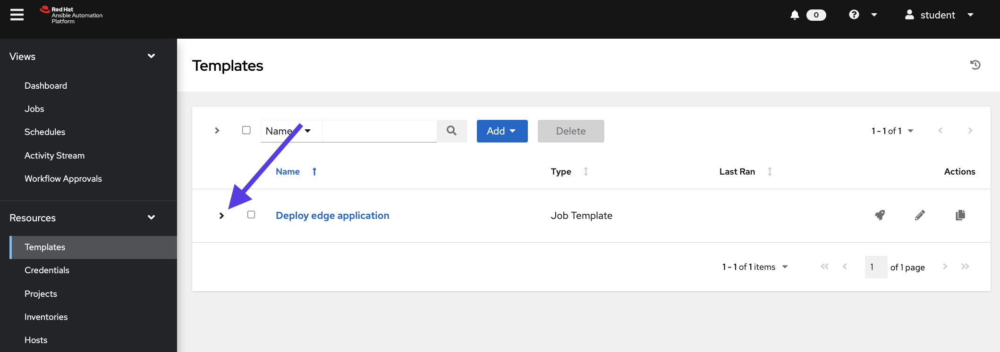
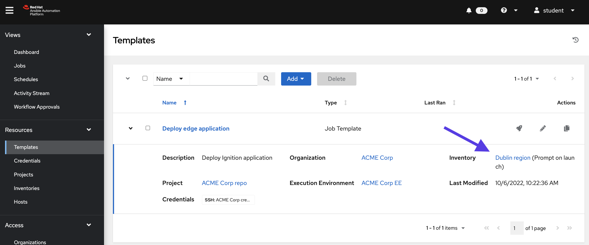
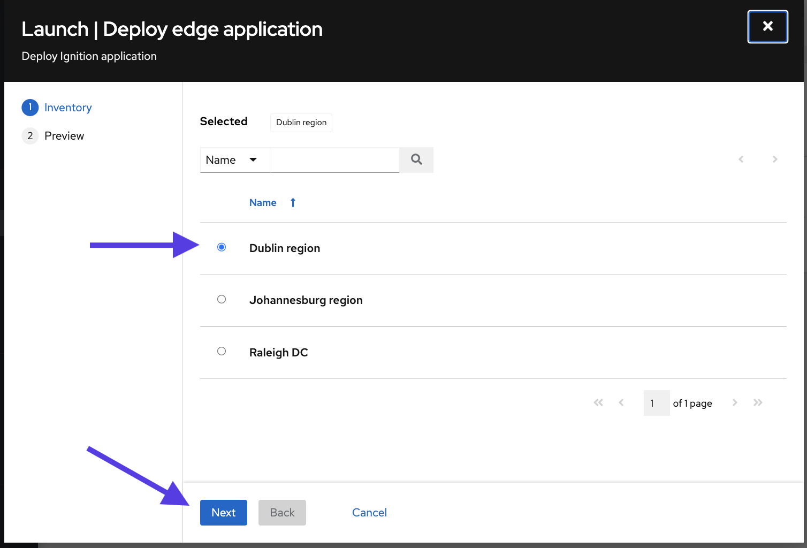
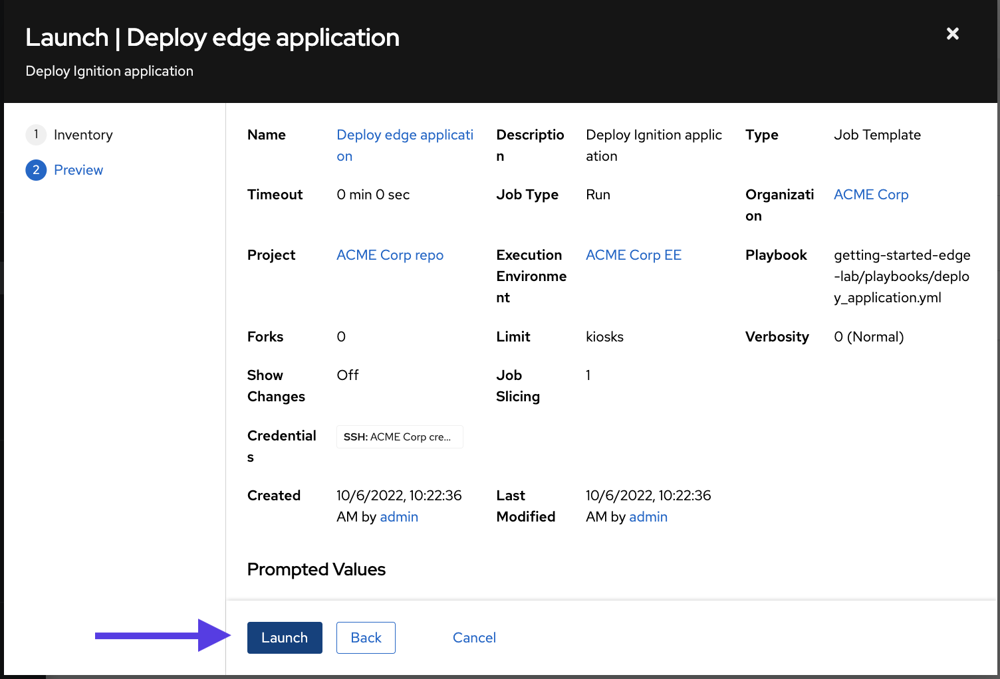
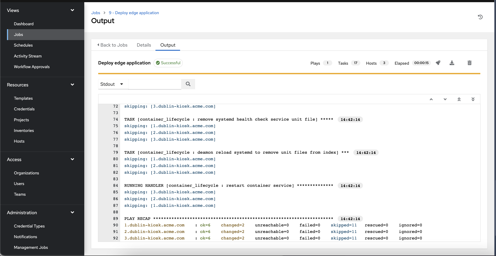
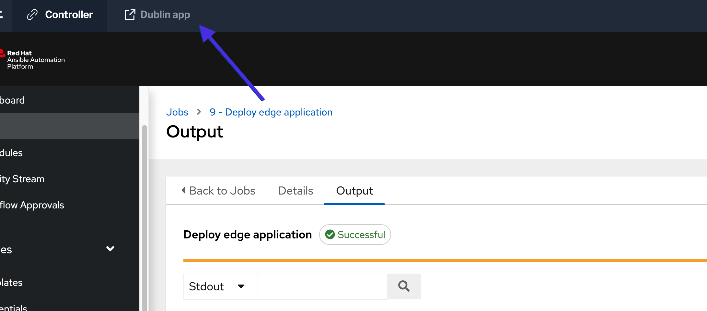
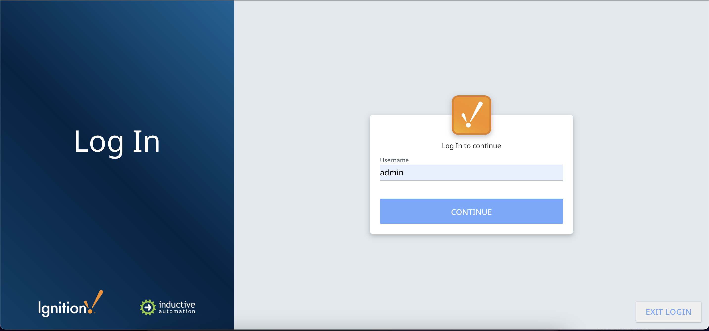
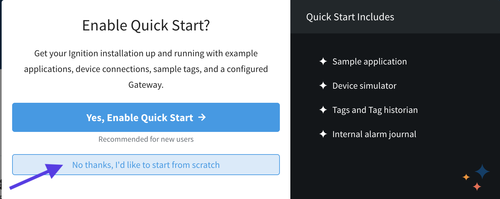

🔐 Login credentials for the mission
===

>**Controller username**:
> ```yaml
>student
>```
>**Controller password**:
>```yaml
>learn_ansible
>```

>**Ignition username**:
> ```yaml
>admin
>```
>**Ignition password**:
>```yaml
>learn_ansible
>```

👋 Introduction
===

### First mission: Deploy the application in a consistent scalable manner into Dublin factory
You will deploy an industrial application into Dublin factory HMI device, via the Dublin execution node.
<a href="#dublin-deployment">
  
</a>

<a href="#" class="lightbox" id="dublin-deployment">
  
</a>

##### ⏰ Estimated time to complete: *10 minutes*

>**❗️ Note**
>
>* If required, log into automation controller using the provided credentials from the _Controller_ tab.
>* You can expand the images by clicking on them for a closer look.
>* Here’s the [link](https://github.com/craig-br/instruqt-track-content/blob/65e9c23585f22e0c725108c1277a4c524bf58513/getting-started-edge-lab/playbooks/deploy_application.yml) to the playbook used in this example.

☑️ First task - Deploy edge application job template
===

>ℹ️ [Job Templates](https://docs.ansible.com/automation-controller/latest/html/userguide/job_templates.html) are useful to execute the same job many times, and comprise a definition and set of parameters for running an Ansible job.

##### ✏️ Explore *Deploy edge application* job template in **automation controller**.

* On the side navigation under the **Resources** section, click on **Templates**.
* Click on the `Deploy edge application` dropdown arrow.

<a href="#deploy_app_template">
  
</a>

<a href="#" class="lightbox" id="deploy_app_template">
  
</a>

The `Deploy edge application` job template uses the *Dublin region* inventory by default, which uses the `Dublin instance group`. And the `Dublin instance group` will use the local `dublin-edge-lab`execution node to run all the automation jobs.

<a href="#deploy_app_template_dublin">
  
</a>

<a href="#" class="lightbox" id="deploy_app_template_dublin">
  
</a>

##### ✏️ Launch *Deploy edge application* job template.

* On the side navigation under the **Resources** section, click on **Templates**.
* Click on the `Deploy edge application`  icon to launch the template.
* Leave the default `Dublin region` selected and click on the `Next` button.
<a href="#Deploy app template region prompt">
  
</a>

<a href="#" class="lightbox" id="Deploy app template region prompt">
  
</a>

* Preview the settings and press the `Launch` button to trigger the automation job.

<a href="#Launch Deploy app template">
  
</a>

<a href="#" class="lightbox" id="Launch Deploy app template">
  
</a>

>ℹ️ The `Deploy app template` will execute multiple tasks including information gathering, templating, pulling the container image, and restarting services. Check all the tasks executed under the **Views** section, inside **Jobs**.

<a href="#View Deploy app template job execution">
  
</a>

<a href="#" class="lightbox" id="View Deploy app template job execution">
  
</a>


☑️ Final task - Login into the Dublin HMI application
===
* Click on _Dublin app_ tab to login into the Ignition application.
<a href="#Dublin App">
  
</a>

<a href="#" class="lightbox" id="Dublin App">
  
</a>

* Please log in the application using the admin credentials above.

<a href="#Ignition Login">
  
</a>

<a href="#" class="lightbox" id="Ignition Login">
  
</a>

* Discard any alert, if you get a Quick Start pop-up, choose the `No thanks`option as we will not configure the industrial application as part of this lab.

<a href="#Ignition Quick Start">
  
</a>

<a href="#" class="lightbox" id="Ignition Quick Start">
  
</a>

✅ Check the Challenge
===
Press the `Check` button below to go to the next challenge once you’ve completed the tasks.

🐛 Encountered an issue?
====
If you have encountered an issue or have noticed something not quite right, please [open an issue](https://github.com/ansible/instruqt/issues/new?labels=getting-started-edge-lab&title=Getting+started+with+Ansible+Automation+Platform+and+edge+issue:+incident-creation&assignees=dafmendo).

<style type="text/css" rel="stylesheet">
  .lightbox {
    display: none;
    position: fixed;
    justify-content: center;
    align-items: center;
    z-index: 999;
    top: 0;
    left: 0;
    right: 0;
    bottom: 0;
    padding: 1rem;
    background: rgba(0, 0, 0, 0.8);
    margin-left: auto;
    margin-right: auto;
    margin-top: auto;
    margin-bottom: auto;
  }
  .lightbox:target {
    display: flex;
  }
  .lightbox img {
    max-width: 60%;
    max-height: 60%;
  }
  img {
    display: block;
    margin-left: auto;
    margin-right: auto;
    width: 100%;
  }
  h1 {
    font-size: 18px;
  }
    h2 {
    font-size: 16px;
    font-weight: 600
  }
    h3 {
    font-size: 14px;
    font-weight: 600
  }
  p span {
    font-size: 14px;
  }
  ul li span {
    font-size: 14px
  }
</style>


