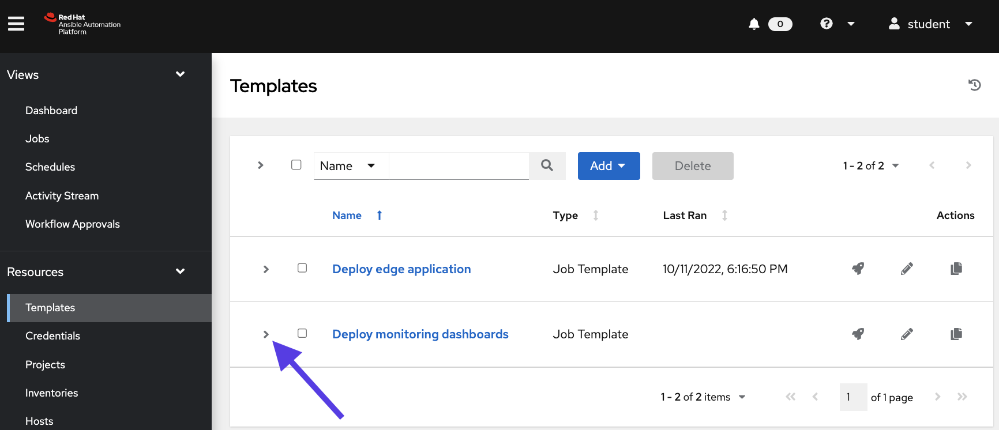
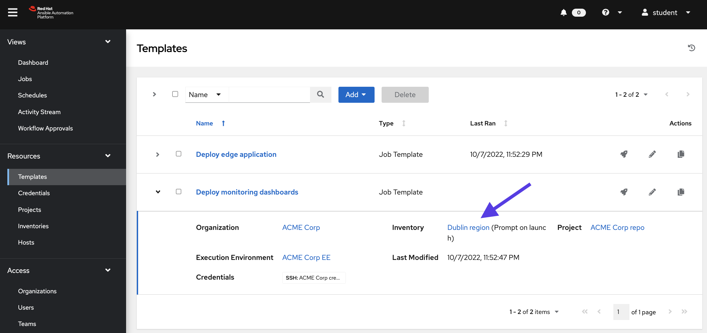
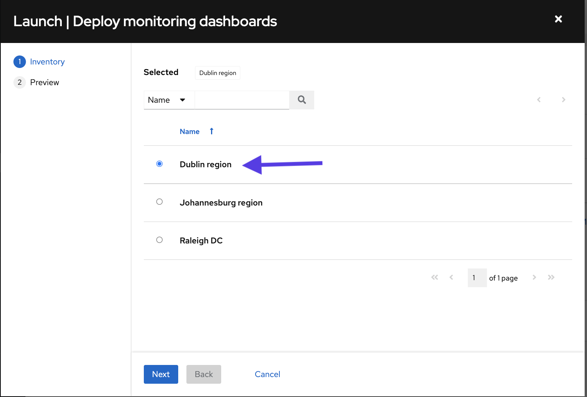
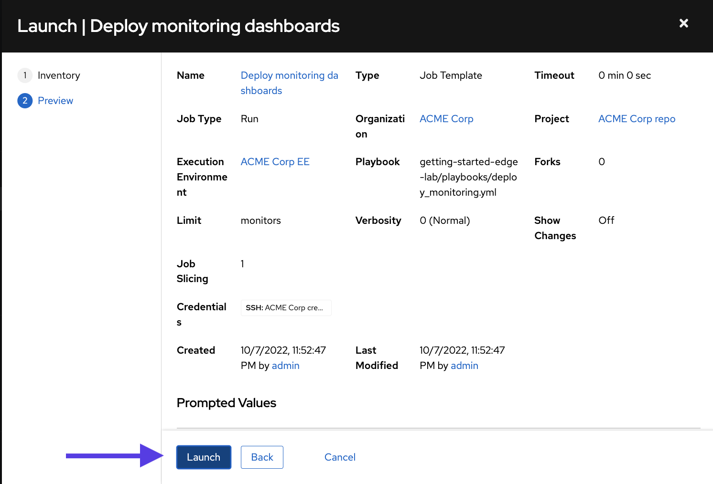
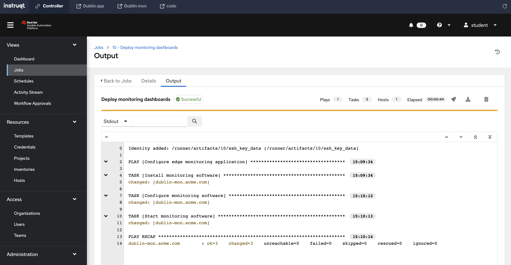
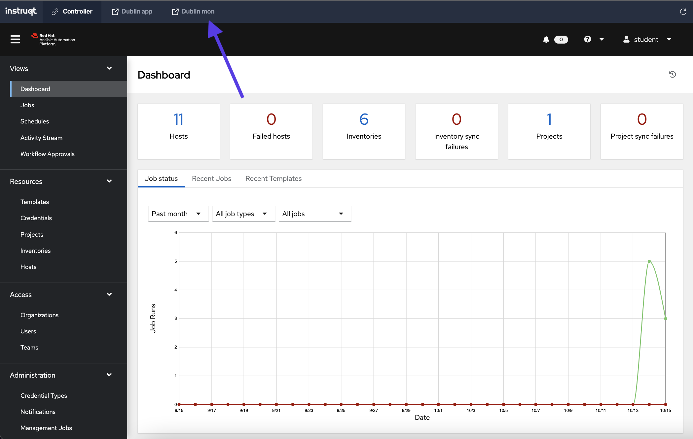
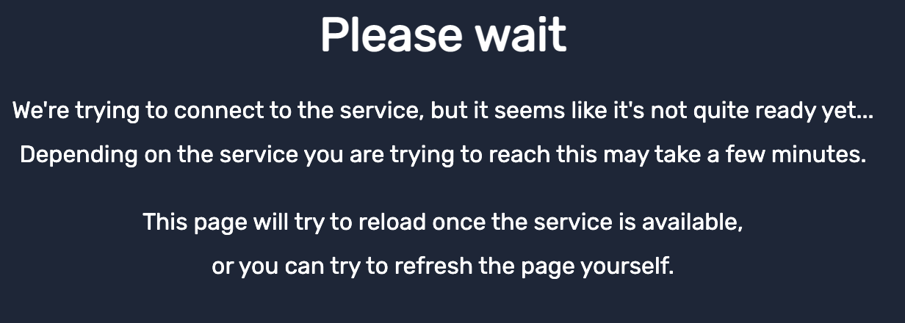

🔐 Login credentials for the mission
===

>**Controller and monitoring username**:
> ```yaml
>student
>```
>**Controller and monitoring password**:
>```yaml
>learn_ansible
>```

👋 Introduction
===

### Second mission: Deploy the monitoring dashboard into Dublin factory
In this challenge, we’ll review how to deploy the monitoring dashboards application into a single remote location using the corresponding instance group.

##### ⏰ Estimated time to complete: *10 minutes*

>**❗️ Note**
>
>* If required, log into automation controller using the provided credentials from the _Controller_ tab.
>* You can expand the images by clicking on them for a closer look.
>* Here’s the [link](https://github.com/craig-br/instruqt-track-content/blob/65e9c23585f22e0c725108c1277a4c524bf58513/getting-started-edge-lab/playbooks/deploy_monitoring.yml) to the playbook used in this example.

☑️ Task - Deploy monitoring dashboards job template
===

##### ✏️ Explore *Deploy monitoring dashboards* job template in **automation controller**.

* On the side navigation under the **Resources** section, click on **Templates**.
* Click on the `Deploy monitoring dashboards` dropdown arrow.

<a href="#deploy_mondash_template">
  
</a>

<a href="#" class="lightbox" id="deploy_mondash_template">
  
</a>

The `Deploy monitoring dashboards` job template uses the `Dublin region` inventory by default. The `dublin-edge-lab`execution node is associated with the `Dublin region` inventory and runs the job template.

<a href="#deploy_mondash_template_dublin">
  
</a>

<a href="#" class="lightbox" id="deploy_mondash_template_dublin">
  
</a>

##### ✏️ Launch *Deploy monitoring dashboards* job template.

* On the side navigation under the **Resources** section, click on **Templates**.
* Click on the `Deploy monitoring dashboards`  icon to launch the template.
* Leave the default `Dublin region` selected in the Inventory prompt and click on the `Next` button.
<a href="#Deploy monitoring dashboards template region prompt">
  
</a>

<a href="#" class="lightbox" id="Deploy monitoring dashboards template region prompt">
  
</a>

* Click the `Launch` button to trigger the automation job.

<a href="#Launch Deploy monitoring dashboards template">
  
</a>

<a href="#" class="lightbox" id="Launch Deploy monitoring dashboards template">
  
</a>

>ℹ️ The `Deploy monitoring dashboards template` will execute multiple tasks including information gathering, templating, pulling the container image, and restarting services. Check all the tasks executed under the **Views** section, inside **Jobs**.

<a href="#View Deploy monitoring dashboards template job execution">
  
</a>

<a href="#" class="lightbox" id="View Deploy monitoring dashboards template job execution">
  
</a>


☑️ Final task - Login into the Dublin monitoring dashboards
===
* Please log in the monitoring dashboards by clicking into `Dublin mon` tab.

<a href="#Dublin monitoring tab">
  
</a>

<a href="#" class="lightbox" id="Dublin monitoring tab">
  
</a>

* The Dublin monitoring dashboard is not available! After some fault-finding, the team realizes that they need to configure the edge firewalls for the new monitoring application.
We’ll configure this in the next challenge.

<a href="#Service not ready yet">
  
</a>

<a href="#" class="lightbox" id="Service not ready yet">
  
</a>

✅ Check the challenge
===
Press the `Check` button below to go to the next challenge once you’ve completed the tasks.

🐛 Encountered an issue?
====
If you have encountered an issue or have noticed something not quite right, please [open an issue](https://github.com/ansible/instruqt/issues/new?labels=getting-started-edge-lab&title=Getting+started+with+Ansible+Automation+Platform+and+edge+issue:+incident-creation&assignees=dafmendo).

<style type="text/css" rel="stylesheet">
  .lightbox {
    display: none;
    position: fixed;
    justify-content: center;
    align-items: center;
    z-index: 999;
    top: 0;
    left: 0;
    right: 0;
    bottom: 0;
    padding: 1rem;
    background: rgba(0, 0, 0, 0.8);
    margin-left: auto;
    margin-right: auto;
    margin-top: auto;
    margin-bottom: auto;
  }
  .lightbox:target {
    display: flex;
  }
  .lightbox img {
    max-width: 60%;
    max-height: 60%;
  }
  img {
    display: block;
    margin-left: auto;
    margin-right: auto;
    width: 100%;
  }
  h1 {
    font-size: 18px;
  }
    h2 {
    font-size: 16px;
    font-weight: 600
  }
    h3 {
    font-size: 14px;
    font-weight: 600
  }
  p span {
    font-size: 14px;
  }
  ul li span {
    font-size: 14px
  }
</style>