🔐 Login credentials for the mission
===

>**Controller and monitoring username**:
> ```yaml
>student
>```
>**Controller and monitoring password**:
>```yaml
>learn_ansible
>```

>**Ignition username**:
> ```yaml
>admin
>```
>**Ignition password**:
>```yaml
>learn_ansible
>```

👋 Introduction
===
# Final mission: Orchestration! Configure the Johannesburg factory
You will deploy the Ignition application, monitoring dashboards and firewall security configuration globally. This now includes the Johannesburg factory HMI devices using automation mesh.
Orchestrate automation by running multiple automation jobs in multiple geographies and following your pre-defined conditions.

##### ⏰ Estimated time to complete: *10 minutes*

>**❗️ Note**
>
>* If required, log into automation controller using the provided credentials from the _Controller_ tab.
>* You can expand the images by clicking on them for a closer look.
>* Here’s the [link](https://github.com/craig-br/instruqt-track-content/tree/devel/getting-started-edge-lab/playbooks) to the playbook used in this example.
* If you want to skip the workflow steps. Under the **Resources** section click **Templates** and you will see a `Job Template`named: `Help! Create edge workflow`. Click the  icon to deploy the workflow configuration.
<a href="#help-wf">
  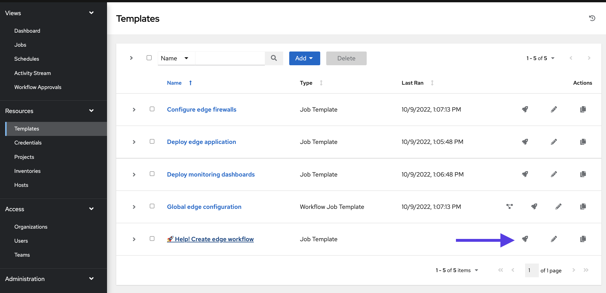
</a>

<a href="#" class="lightbox" id="help-wf">
  
</a>

☑️ First task - Explore the Global smart inventories
===

##### ✏️ Explore *Global* inventories in **automation controller**.

* On the side navigation under the **Resources** section, click **Inventories**.
* Observe there are three `Global` inventories, which are Smart Inventories.

ℹ️Smart Inventories filter devices based on a stored search term. For more information, please visit the [official documentation](https://docs.ansible.com/automation-controller/latest/html/userguide/inventories.html#smart-inventories).
<a href="#global-inventories">
  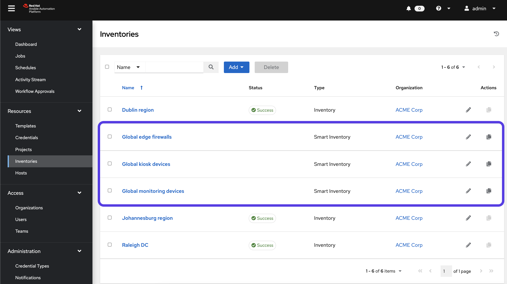
</a>

<a href="#" class="lightbox" id="global-inventories">
  
</a>

* Click the `Global edge firewalls` inventory and note it uses a `Smart host filter` to populate firewall hosts from Dublin and Johannesburg for this inventory.
ℹ️ For more information about `Smart host filters`, please visit the [official documentation](https://docs.ansible.com/automation-controller/latest/html/userguide/inventories.html).

<a href="#global-edge-firewalls">
  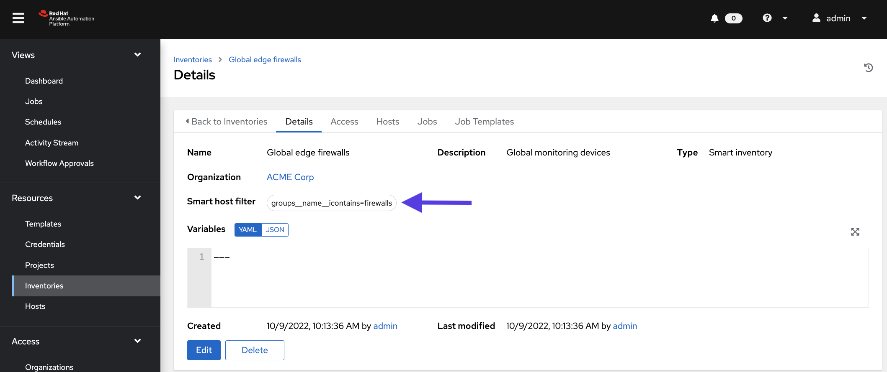
</a>

<a href="#" class="lightbox" id="global-edge-firewalls">
  
</a>

* You can see the filtered hosts that are populated in the **Hosts** tab.

<a href="#global-edge-firewalls-hosts">
  
</a>

<a href="#" class="lightbox" id="global-edge-firewalls-hosts">
  
</a>

Go back to **Inventories** and repeat the same steps for `Global monitoring devices` and `Global kiosk devices`. Note that the inventories are using different Smart filters to group hosts together.

☑️ Second Task - Orchestrate application and monitoring dashboards deployment and security configuration
===
##### ✏️ Create the *Global edge configuration* workflow template.

* On the side navigation under the **Resources** section, click **Templates**.
* Click the `Add` button and select `Add workflow template` from the dropdown menu.

<a href="#add_workflow_template">
  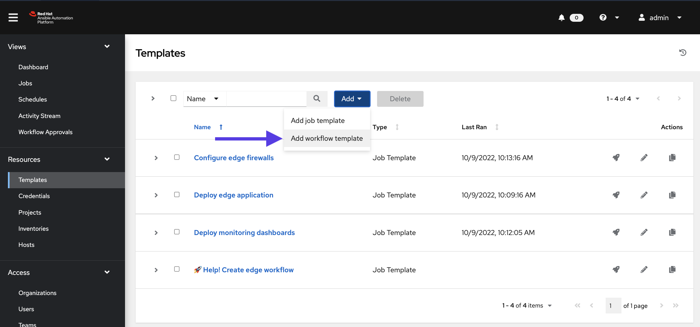
</a>

<a href="#" class="lightbox" id="add_workflow_template">
  
</a>

Use the following settings:
>**Name**:
> ```yaml
>Global edge configuration
>```
>**Organization**:
>```yaml
>ACME Corp
>```

<a href="#wf-settings">
  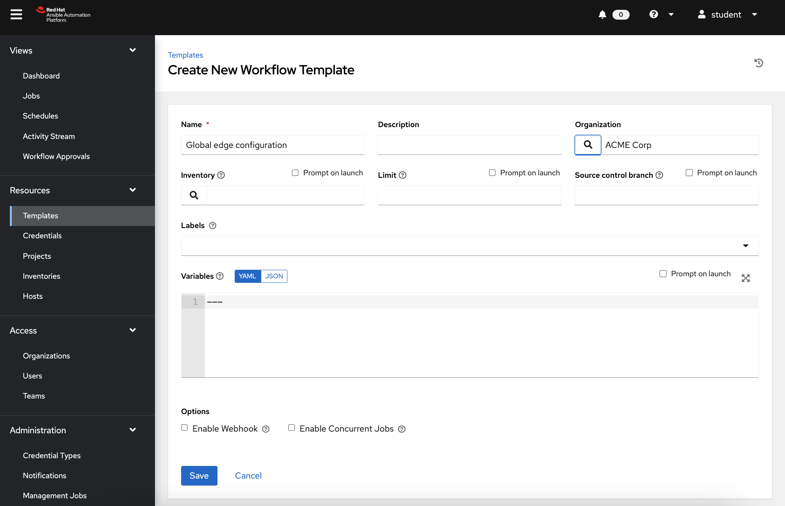
</a>

<a href="#" class="lightbox" id="wf-settings">
  
</a>

Click on `Save` button and the `Visualizer` window will automatically open.

* Click the `Start` button to begin

<a href="#wf-start">
  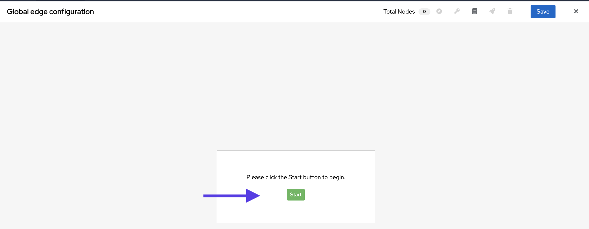
</a>

<a href="#" class="lightbox" id="wf-start">
  
</a>

☑️ 2.1. Add Deploy edge application Node in the workflow
===
* In the`Add Node` window, select the `Deploy edge application` Job Template and click `Next`.

<a href="#add-node-deploy-edge-app">
  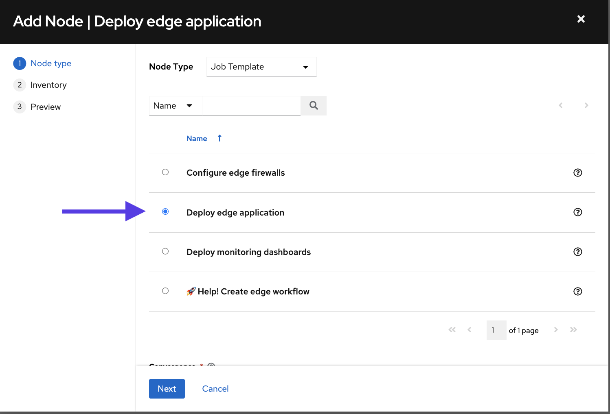
</a>

<a href="#" class="lightbox" id="add-node-deploy-edge-app">
  
</a>

* Choose the `Global kiosk devices` inventory, and click  `Next`.
<a href="#global-kiosk-inventory-wf">
  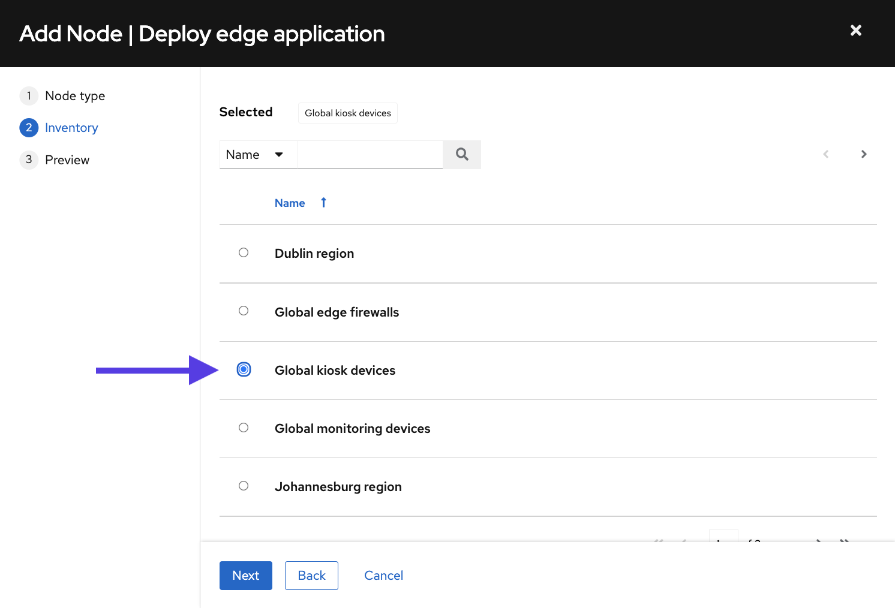
</a>

<a href="#" class="lightbox" id="global-kiosk-inventory-wf">
  
</a>

* Click on `Save`.
<a href="#preview-deployedgeapplication">
  
</a>

<a href="#" class="lightbox" id="preview-deployedgeapplication">
  
</a>


☑️ 2.2. Add Deploy monitoring dashboards Node in the workflow
===
* Once you have clicked on `Save` from the previous step, you will return to the `Visualizer` window. Click on the `+` next to the blue `Start` button.

<a href="#deploy-edge-app-plus">
  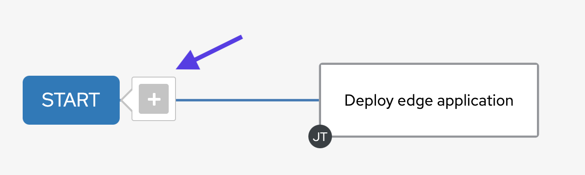
</a>

<a href="#" class="lightbox" id="deploy-edge-app-plus">
  
</a>

* Select the `Deploy monitoring dashboards` job template. Once ready click `Next`.
<a href="#deploy-mondash-wf">
  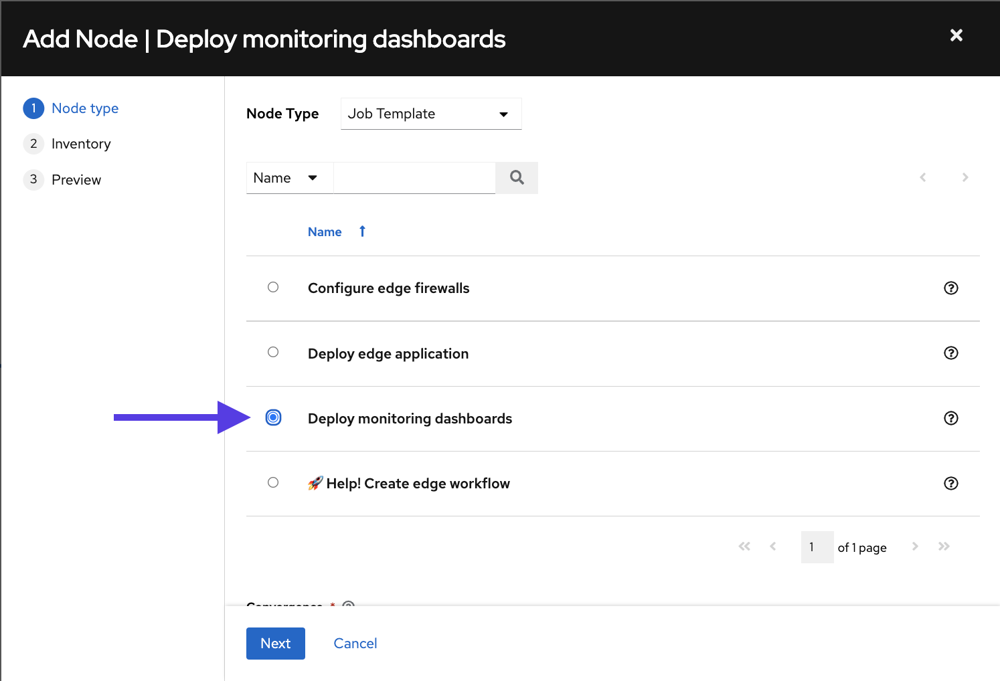
</a>

<a href="#" class="lightbox" id="deploy-mondash-wf">
  
</a>

* Choose the `Global monitoring devices` inventory, and click `Next`.
<a href="#deploy-mondash-inventory-wf">
  
</a>

<a href="#" class="lightbox" id="deploy-mondash-inventory-wf">
  
</a>

* Click on `Save`.
<a href="#deploy-mondash-preview-wf">
  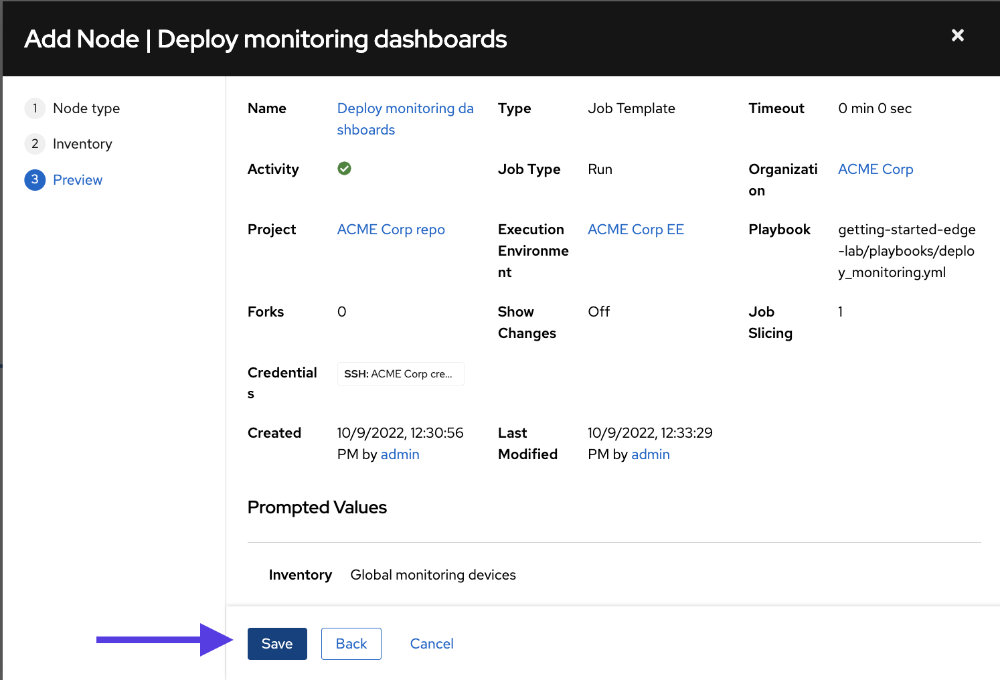
</a>

<a href="#" class="lightbox" id="deploy-mondash-preview-wf">
  
</a>

☑️ 2.3. Add Configure edge firewalls Node in the workflow
===
* From the `Visualizer` click the `Deploy monitoring dashboard` button, and click the `+` icon.
<a href="#deploy-fw-plus">
  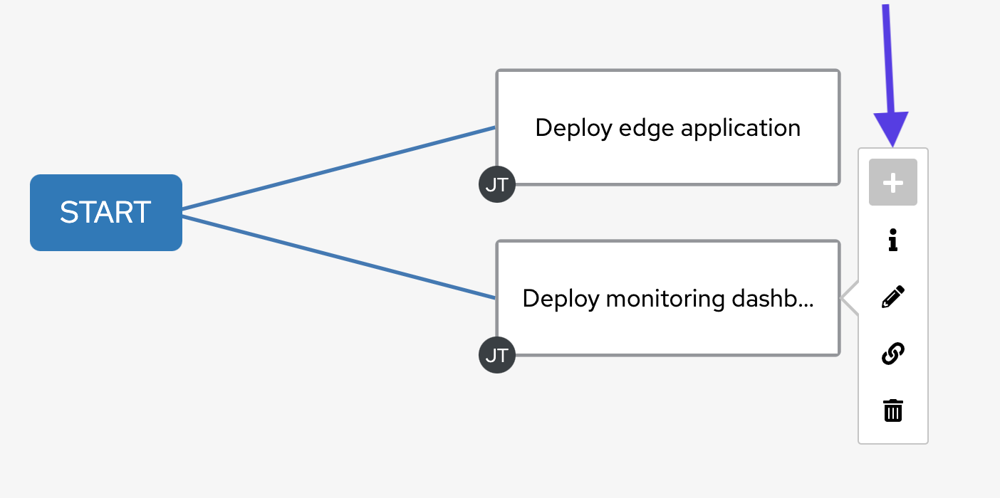
</a>

<a href="#" class="lightbox" id="deploy-fw-plus">
  
</a>

* Select the condition `On Success` and click `Next`.
<a href="#rule-onsuccess">
  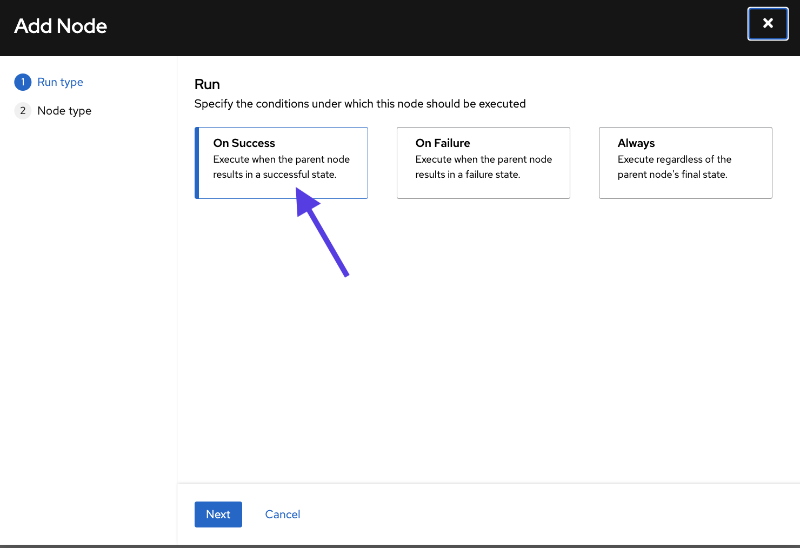
</a>

<a href="#" class="lightbox" id="rule-onsuccess">
  
</a>

* Select the Job Template `Configure edge firewalls` and click `Next`.
<a href="#config_fw_node">
  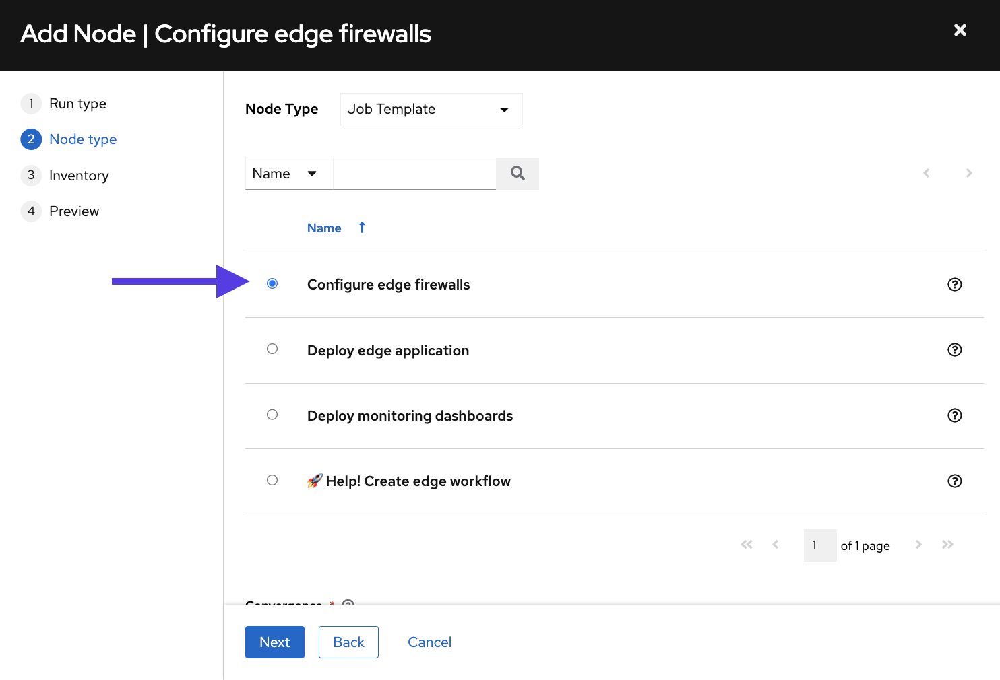
</a>

<a href="#" class="lightbox" id="config_fw_node">
  
</a>

* Choose the `Global edge firewalls` inventory, and click `Next`.
<a href="#config-fw-inventory-wf">
  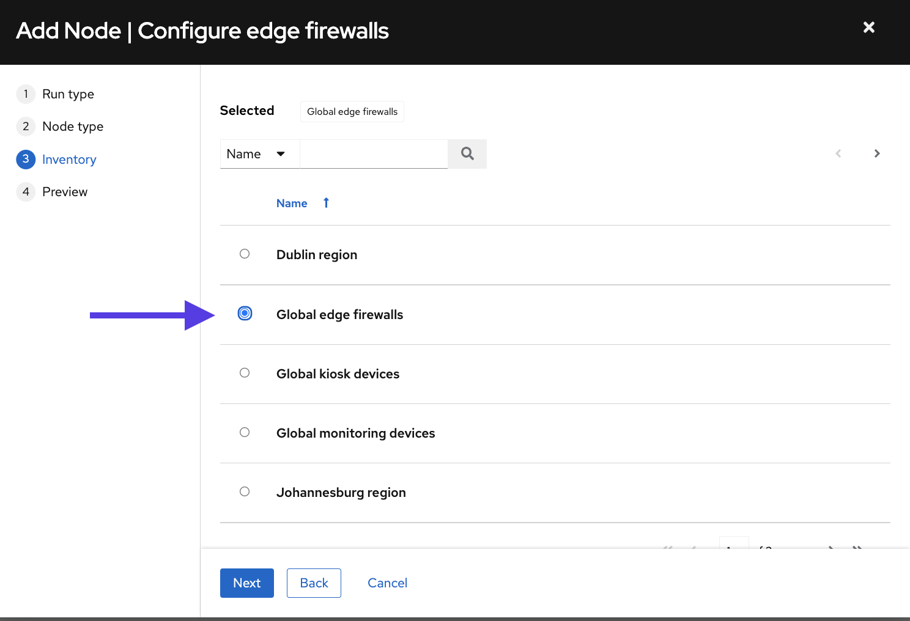
</a>

<a href="#" class="lightbox" id="config-fw-inventory-wf">
  
</a>

* Click on `Save`.
<a href="#config-fw-preview-wf">
  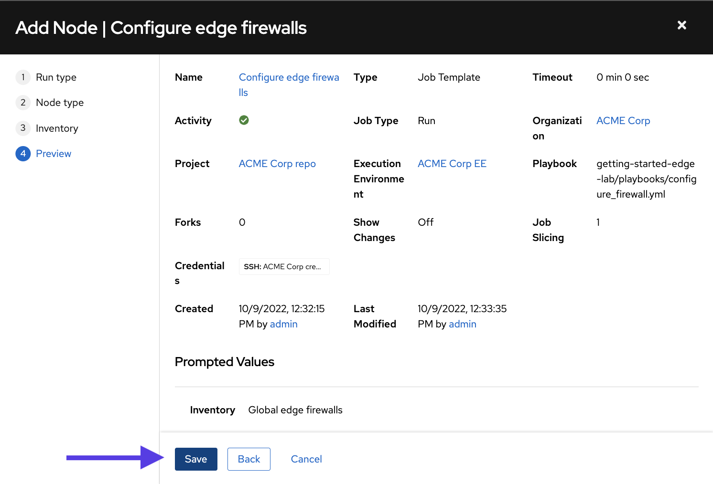
</a>

<a href="#" class="lightbox" id="config-fw-preview-wf">
  
</a>

☑️ 2.4. Save Global edge configuration workflow
===
* From the `Visualizer` click the `Save` button, located at the top corner in the right.
<a href="#wf-save">
  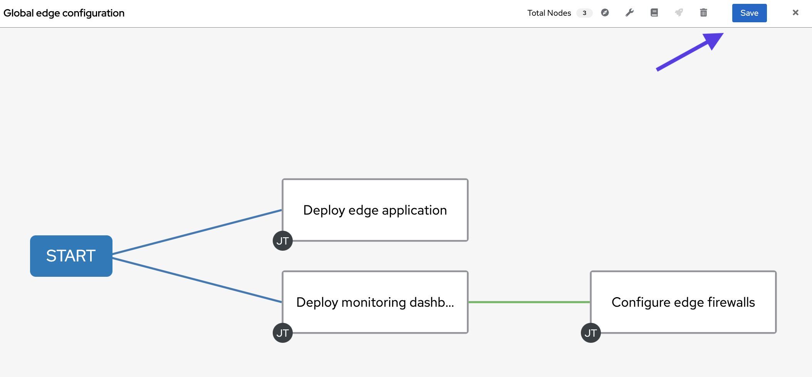
</a>

<a href="#" class="lightbox" id="wf-save">
  
</a>

☑️ Third task - Launch Global edge configuration workflow
===
##### ✏️ Launch *Global edge configuration* workflow template.
* On the side navigation under the **Resources** section, click **Templates**.
* Click the `Global edge configuration`  icon to launch the workflow template.
* The workflow will run automatically and you will be redirected into **Views** - **Jobs** tab to observe the live execution.

<a href="#wf-run">
  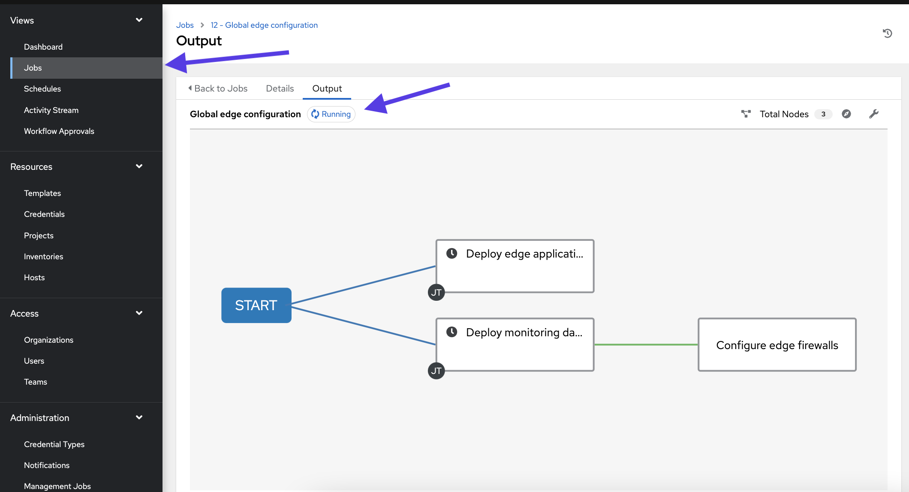
</a>

<a href="#" class="lightbox" id="wf-run">
  
</a>

* When completed, each of the Nodes corresponding to each `Job Template` will be highlighted and show the time it took to run.

<a href="#wf-finalized">
  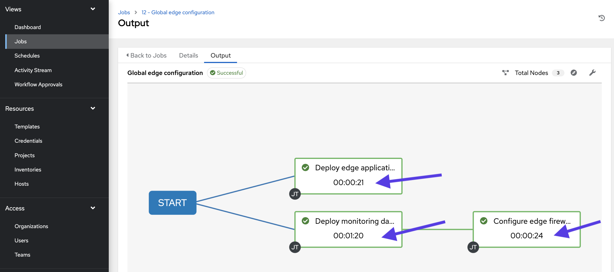
</a>

<a href="#" class="lightbox" id="wf-finalized">
  
</a>

☑️ Final task - Test if it worked!
===
* Please log in the monitoring dashboards and applications by clickling into `Jhb app`, `Jhb mon`,  `Dublin app` and `Dublin mon` tabs.

<a href="#Dublin and Johannessburg tabs">
  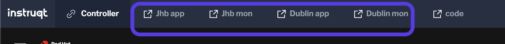
</a>

<a href="#" class="lightbox" id="Dublin and Johannessburg tabs">
  
</a>

* The monitoring dashboards and applications for ALL the locations must be available. Login with the corresponding credentials.

✅ Check the challenge
===
Press the `Check` button below to go to the next challenge once you’ve completed the tasks.

🐛 Encountered an issue?
====
If you have encountered an issue or have noticed something not quite right, please [open an issue](https://github.com/ansible/instruqt/issues/new?labels=getting-started-edge-lab&title=Getting+started+with+Ansible+Automation+Platform+and+edge+issue:+incident-creation&assignees=dafmendo).

<style type="text/css" rel="stylesheet">
  .lightbox {
    display: none;
    position: fixed;
    justify-content: center;
    align-items: center;
    z-index: 999;
    top: 0;
    left: 0;
    right: 0;
    bottom: 0;
    padding: 1rem;
    background: rgba(0, 0, 0, 0.8);
    margin-left: auto;
    margin-right: auto;
    margin-top: auto;
    margin-bottom: auto;
  }
  .lightbox:target {
    display: flex;
  }
  .lightbox img {
    max-width: 60%;
    max-height: 60%;
  }
  img {
    display: block;
    margin-left: auto;
    margin-right: auto;
    width: 100%;
  }
  h1 {
    font-size: 18px;
  }
    h2 {
    font-size: 16px;
    font-weight: 600
  }
    h3 {
    font-size: 14px;
    font-weight: 600
  }
  p span {
    font-size: 14px;
  }
  ul li span {
    font-size: 14px
  }
</style>