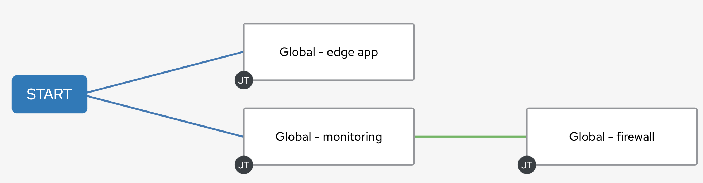

🔐 Login credentials for the mission
===

>**Controller and monitoring username**:
> ```yaml
>student
>```
>**Controller and monitoring password**:
>```yaml
>learn_ansible
>```

>**Ignition username**:
> ```yaml
>admin
>```
>**Ignition password**:
>```yaml
>learn_ansible
>```

👋 Introduction
===
You are free to use this setup as a playground.

##### ⏰ Time to play: *10 minutes*

>**❗️ Note**
>
>* If required, log into automation controller using the provided credentials from the _Controller_ tab.
>* You can expand the images by clicking on them for a closer look.
>* Here’s the [link](https://github.com/craig-br/instruqt-track-content/tree/devel/getting-started-edge-lab/playbooks) to the playbooks used in this example.

* If you want to recreate the workflow check the image as reference:

<a href="#wf">
  
</a>

<a href="#" class="lightbox" id="wf">
  
</a>