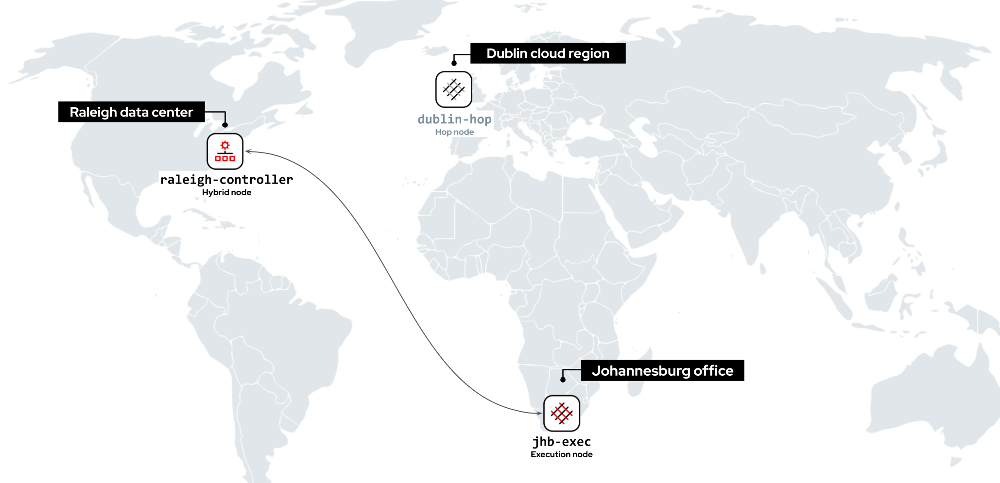
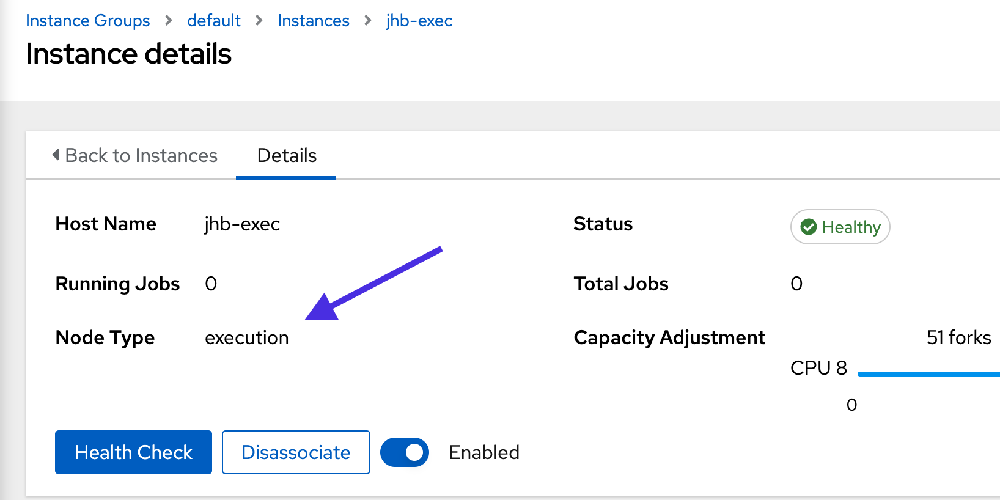
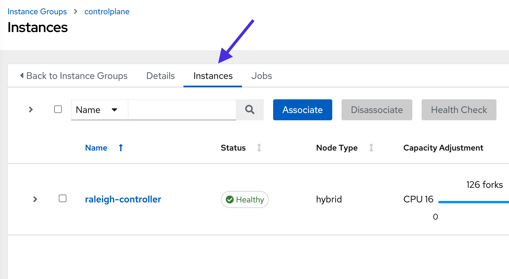
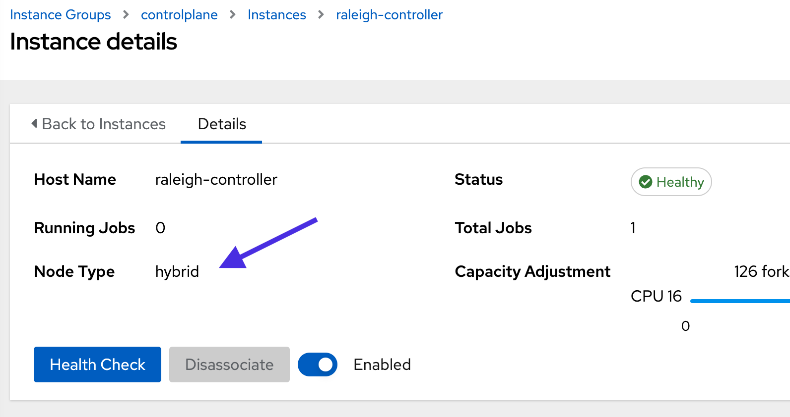
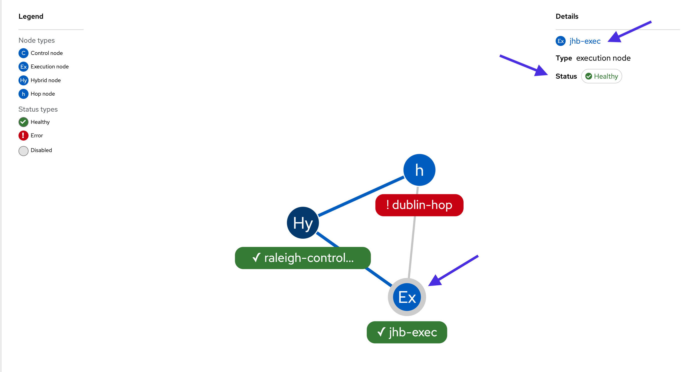

🔐 Login credentials
===
All the logins use the same credentials.

>**Username**:
> ```yaml
>student
>```
>**Password**:
>```yaml
>learn_ansible
>```

👋 Introduction
===

##### ⏰ Estimated time to complete: *5 minutes*

ACME Corp uses Ansible Automation Platform extensively to manage their IT ecosystem across multiple regions.  In this challenge, we’ll review their installation, learn more about mesh worker node types and explore controller instances and instance groups.

>**❗️ Note**
>
>* Perform all tasks in the _Controller_ tab located at the top-left of your browser.
>* If required, log into the automation controller using the provided credentials.
>* You can expand the images by clicking on them for a closer look.

☑️ Task - ACME Corp mesh overview
===

<a href="#mesh_nodes">
  
</a>

<a href="#" class="lightbox" id="mesh_nodes">
  
</a>

>ℹ️ Automation mesh provides different worker node types you can use for [control plane](https://access.redhat.com/documentation/en-us/red_hat_ansible_automation_platform/2.1/html-single/red_hat_ansible_automation_platform_automation_mesh_guide/index#control_plane) and [execution plane](https://access.redhat.com/documentation/en-us/red_hat_ansible_automation_platform/2.1/html-single/red_hat_ansible_automation_platform_automation_mesh_guide/index#execution_plane) tasks.
>* **Hybrid nodes** run control plane tasks, such as management jobs, and can execute automation.
>* **Execution nodes** only execute automation ( i.e.. running playbooks ) and don’t run automation controller runtime functions, such as project updates.
>* Like jump hosts, **hop nodes** don’t run any execution or control plane tasks. They only route traffic to other execution nodes.

##### ACME Corp’s mesh configuration and automation mesh worker node types.

* `raleigh-controller` - Located in the Raleigh data center and configured as a **hybrid node**.

* `jhb-exec` - Located in the Johannesburg remote office and configured as an **execution node**.

* `dublin-hop` - Located in an Irish public cloud region and configured as a **hop node**. `dublin-hop` is *inactive* and is only enabled when a backup worker node is needed. We'll explore this in later tasks.

>**❗️ Note**\
>Automation mesh also provides a **control** node type which only runs controller runtime tasks. Automation execution is disabled. These nodes aren’t used in this lab.

☑️ Task - Controller instances and instance groups
===

>ℹ️ [Instance groups](https://docs.ansible.com/automation-controller/latest/html/userguide/instance_groups.html) let you logically group mesh worker nodes, or instances, together and apply policies to determine how they behave.

##### ✏️ Explore automation controller instance groups.

* Please log in to automation controller using the provided credentials.
* On the side navigation under the **Administration** section, click on **Instance Groups**.
* Click on the `default` instance group.
* Click on the **Instances** tab on the top.

<a href="#default_ig">
  
</a>

<a href="#" class="lightbox" id="default_ig">
  
</a>

The `default` instance group is the default location for all mesh worker nodes and is always present in automation controller. It's used to execute *Job Templates* if no instance group is specified in their configuration.

>**❗️ Note**\
>**Hop nodes** don't run automation jobs and aren’t assigned to instance groups.

* Click on the `jhb-exec` instance and look at the `Node Type`. `jhb-exec` is configured as an **execution node**.

<a href="#jhb-exec">
  
</a>

<a href="#" class="lightbox" id="jhb-exec">
  
</a>

* Click on **Instance Groups** under the **Administration** section to return to the main instance group window.
* Click on the `controlplane` instance group.
* Click on the `Instances` tab on the top.

<a href="#control_ig">
  
</a>

<a href="#" class="lightbox" id="control_ig">
  
</a>

>ℹ️ The `controlplane` instance group is the preselected instance group for all mesh worker nodes that run [control plane](https://access.redhat.com/documentation/en-us/red_hat_ansible_automation_platform/2.1/html-single/red_hat_ansible_automation_platform_automation_mesh_guide/index#control_plane) tasks.

* Click on the `raleigh-controller` instance and look at the **Node Type**. `raleigh-controller` is configured as a **hybrid node**.

<a href="#hybrid_node">
  
</a>

<a href="#" class="lightbox" id="hybrid_node">
  
</a>

☑️ Task - Using topology viewer
===
>ℹ️ [Topology viewer](https://docs.ansible.com/automation-controller/latest/html/administration/topology_viewer.html) is a visual, interactive dashboard for automation mesh. It provides a view of node types, health,  and details in your mesh topology.

##### ✏️ Let’s view the ACME Corp mesh design in topology viewer.

* In the **Administration** menu on the left navigation bar, click **Topology View**.

<a href="#topology_viewer">
  
</a>

<a href="#" class="lightbox" id="topology_viewer">
  
</a>

>**❗️ Note**\
>The `dublin-hop` node is currently showing an error status.
>ACME Corp intentionally leaves `dublin-hop` *inactive* as it’s only used as a backup. We’ll explore this feature later in this lab.

* Click on the `jhb-exec` node in the diagram.

<a href="#jhb_exec_topology">
  
</a>

<a href="#" class="lightbox" id="jhb_exec_topology">
  
</a>

Topology viewer is an easy way to view the health status of your instances. You can view your instances' health and mesh node type in the top right-hand corner.

You can also drill down into the node configuration by clicking on the instance name.

✅ Next Challenge
===
Press the `Next` button below to go to the next challenge once you’ve completed the tasks.

🐛 Encountered an issue?
====
If you have encountered an issue or have noticed something not quite right, please [open an issue](https://github.com/ansible/instruqt/issues/new?labels=getting-started-mesh&title=Getting+started+with+automation+mesh+issue&assignees=craig-br).

<style type="text/css" rel="stylesheet">
  .lightbox {
    display: none;
    position: fixed;
    justify-content: center;
    align-items: center;
    z-index: 999;
    top: 0;
    left: 0;
    right: 0;
    bottom: 0;
    padding: 1rem;
    background: rgba(0, 0, 0, 0.8);
    margin-left: auto;
    margin-right: auto;
    margin-top: auto;
    margin-bottom: auto;
  }
  .lightbox:target {
    display: flex;
  }
  .lightbox img {
    max-width: 60%;
    max-height: 60%;
  }
  img {
    display: block;
    margin-left: auto;
    margin-right: auto;
    width: 100%;
  }
  h1 {
    font-size: 18px;
  }
    h2 {
    font-size: 16px;
    font-weight: 600
  }
    h3 {
    font-size: 14px;
    font-weight: 600
  }
  p span {
    font-size: 14px;
  }
  ul li span {
    font-size: 14px
  }
</style>
