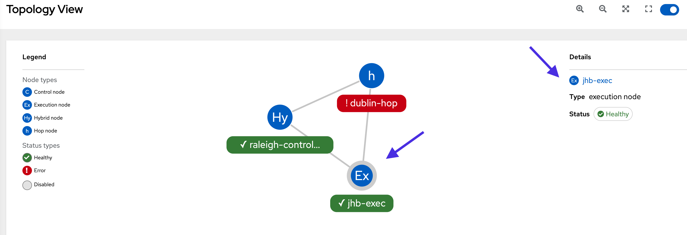
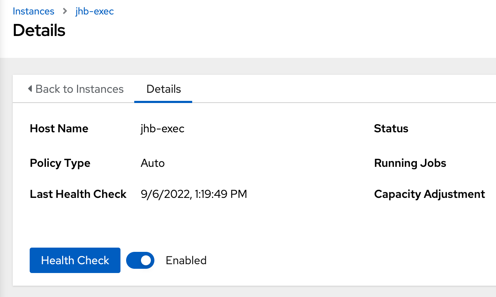

🔐 Login credentials
===
All the logins use the same credentials.

>**Username**:
> ```yaml
>student
>```
>**Password**:
>```yaml
>learn_ansible
>```

👋 Introduction
===

#### ⏰ Estimated time to complete: 10 minutes

We covered the different mesh node types, instances and instance groups, and **topology viewer** in the last challenge.

In this challenge, we’ll help ACME Corp create new instance groups for Raleigh and Johannesburg and assign instances to these groups.

>**❗️ Note**
>
> * Perform all tasks in the _Controller_ tab located at the top-left of your browser.
> * If required, log into the automation controller using the provided credentials.
> * You can expand the images by clicking on them for a closer look.

☑️ Task - Creating and configuring instance groups
===

>ℹ️ [Instance groups](https://docs.ansible.com/automation-controller/latest/html/administration/containers_instance_groups.html) logically group mesh nodes together and can be assigned to different controller objects, such as _inventories_, _organizations_ and job _templates_.

ACME Corp must associate the correct instances to the Raleigh and Johannesburg locations to ensure the closest mesh worker node executes the automation.

>**❗️ Note**\
>In this challenge, we’ll create instance groups and associate instances. In the next challenge, we’ll complete the final step by assigning instance groups to the correct controller _inventories_ to run _job templates_.

##### ✏️ Let’s create a new instance group for the Raleigh data center.

* On the side navigation under the **Administration** section, click on **Instance Groups.**
* Click on **Add** and select **Add instance group.**
* Create a new instance group and name it

  ```text
  Raleigh data center
  ```

* Click on **Save**.

<a href="#mesh_raleigh_ig_create">
  
</a>

<a href="#" class="lightbox" id="mesh_raleigh_ig_create">
  
</a>

##### ✏️ Next, we’ll associate the `raleigh-controller` instance with the `Raleigh data center` instance group.

* Click on **Instances** on the top menu.
* Click on **Associate**.
* Select the `raleigh-controller` instance and click on **Save.**

<a href="#mesh_raleigh_associate_instance">
  
</a>

<a href="#" class="lightbox" id="mesh_raleigh_associate_instance">
  
</a>

##### ✏️ Let’s create a new instance group for the Johannesburg data center.

* On the side navigation under the **Administration** section, click on **Instance Groups**.
* Click on **Add** and select **Add instance group**.
* Create a new instance group and name it

  ```text
  Johannesburg data center
  ```

* Click on **Save**.

<a href="#mesh_jhb_ig_create">
  
</a>

<a href="#" class="lightbox" id="mesh_jhb_ig_create">
  
</a>

### ✏️ Next, we'll Associate the `jhb-exec` instance with the `Johannesburg data center` instance group.

* Click on **Instances** on the top menu.
* Click on **Associate**.
* Select the `jhb-exec` instance and click on **Save**.

<a href="#jhb_exec_associate">
  
</a>

<a href="#" class="lightbox" id="jhb_exec_associate">
  
</a>

☑️ Task - Instance health checks
===

Automation mesh performs health checks on mesh nodes to determine the optimal route and automation job allocation.

##### ✏️ Let's run a health check on `jhb-exec` in Johannesburg.

* On the side navigation under the **Administration** section, click on **Topology View**.
* Click on the `jhb-exec` node in the topology.
* Under the *Details* section at the top right-hand corner, click on the `jhb-exec` link.

<a href="#jhb_exec_topology_click">
  
</a>

<a href="#" class="lightbox" id="jhb_exec_topology_click">
  
</a>

* Click on **Run health check** and then *Reload* in the dialog box.

<a href="#jhb_exec_health_check">
  
</a>

<a href="#" class="lightbox" id="jhb_exec_health_check">
  
</a>

Note the *Last Health Check* date and time.

✅ Next Challenge
===
Press the `Check` button below to go to the next challenge once you’ve completed the tasks.

🐛 Encountered an issue?
====
If you have encountered an issue or have noticed something not quite right, please [open an issue](https://github.com/ansible/instruqt/issues/new?labels=getting-started-mesh&title=Getting+started+with+automation+mesh+issue&assignees=craig-br).

<style type="text/css" rel="stylesheet">
  .lightbox {
    display: none;
    position: fixed;
    justify-content: center;
    align-items: center;
    z-index: 999;
    top: 0;
    left: 0;
    right: 0;
    bottom: 0;
    padding: 1rem;
    background: rgba(0, 0, 0, 0.8);
    margin-left: auto;
    margin-right: auto;
    margin-top: auto;
    margin-bottom: auto;
  }
  .lightbox:target {
    display: flex;
  }
  .lightbox img {
    max-width: 60%;
    max-height: 60%;
  }
  html {
    font-size: 14px;
  }
  img {
    display: block;
    margin-left: auto;
    margin-right: auto;
    width: 100%;
  }
  h1 {
    font-size: 18px;
  }
  h2 {
    font-size: 16px;
    font-weight: 600
  }
  h3 {
    font-size: 14px;
    font-weight: 600
  }
  p {
    font-size: 14px;
  }
  p span {
    font-size: 14px;
  }
  ul li span {
    font-size: 14px
  }
</style>
