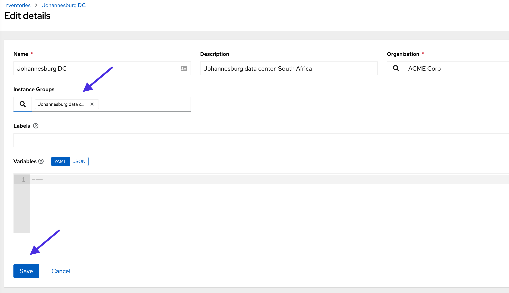
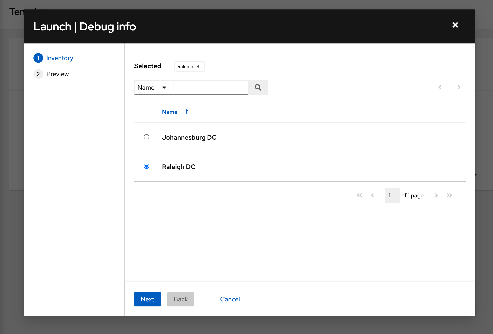
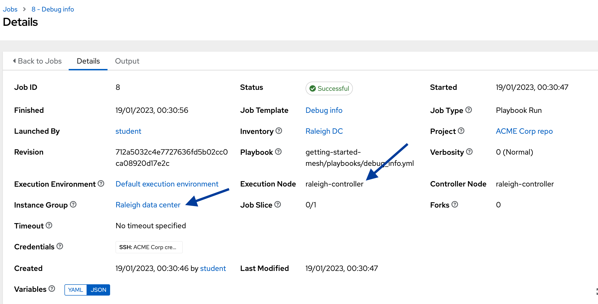
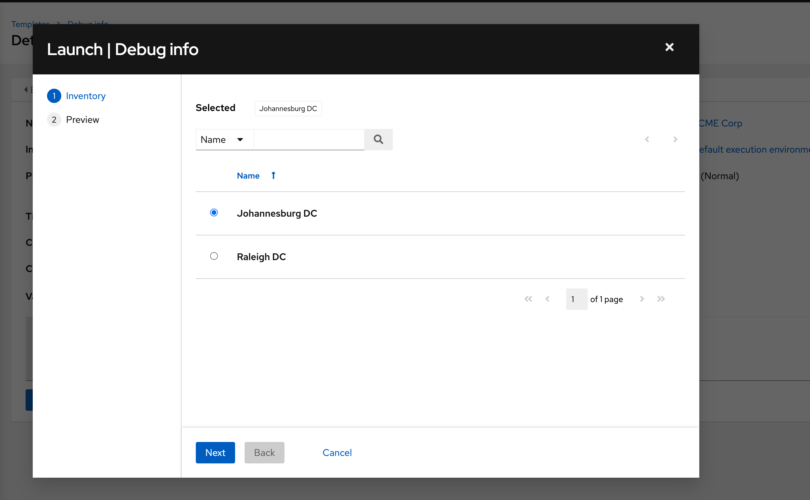
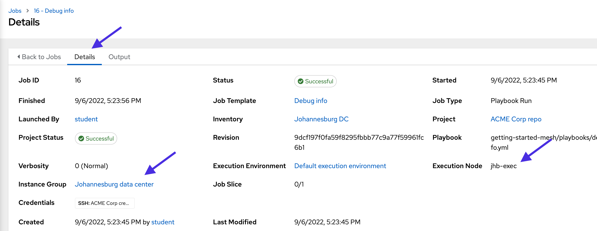
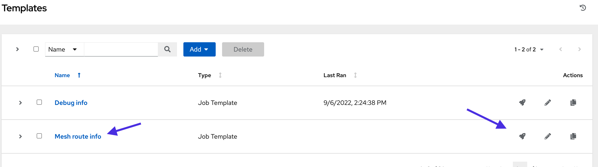
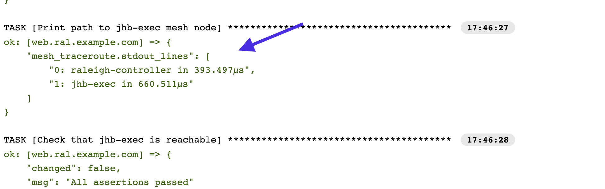
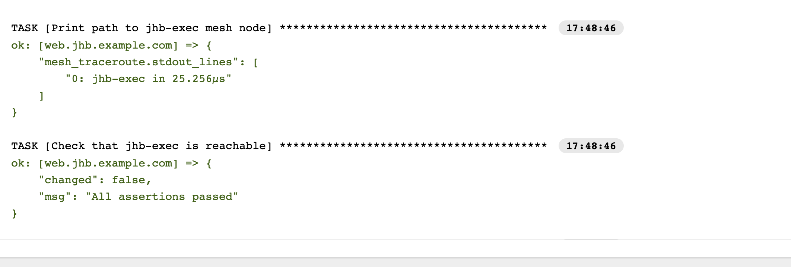

🔐 Login credentials
===
All the logins use the same credentials.

>**Username**:
> ```yaml
>student
>```
>**Password**:
>```yaml
>learn_ansible
>```

👋 Introduction
===

#### ⏰ Estimated time to complete: 10 minutes

Now that we’ve created instance groups for the Raleigh and Johannesburg regions and associated the corresponding instances, we can assign these instance groups to the appropriate ACME Corp controller [inventories](https://docs.ansible.com/automation-controller/latest/html/userguide/inventories.html).

>**❗️ Note**
>* Perform all tasks in the _Controller_ tab located at the top-left of your browser.
>* If required, log into the automation controller using the provided credentials.
>* You can expand the images by clicking on them for a closer look.

☑️ Task - Assign instance groups to inventories
===

>ℹ️ Instance groups and the associated mesh worker nodes are assigned to automation controller objects, such as _organizations_, _inventories_, and _job templates_.

ACME Corp must assign the correct instance groups to the Johannesburg and Raleigh locations to ensure the closest mesh worker node executes the automation in the respective environments.

##### ✏️ Let’s associate the `Raleigh data center` instance group with the `Raleigh DC` inventory.

* On the side navigation under the **Resources** section, click on **Inventories**.
* Click on the `Raleigh DC` inventor`.
* Click on **Edit**.
* Click on the magnifying glass button under **Instance Groups**.
* Check the box next to **Raleigh data center**.
* Click on **Select**.
* Click on **Save** in the **Edit Details** window.

<a href="#raleigh_inv_ig">
  
</a>

<a href="#" class="lightbox" id="raleigh_inv_ig">
  
</a>

##### ✏️ Let’s do the same for the `Johannesburg data center` instance group and `Johannesburg DC` inventory.

* On the side navigation under the **Resources** section, click on **Inventories**.
* Click on the `Johannesburg DC` inventory.
* Click on **Edit**.
* Click on the _magnifying glass button_ under **Instance Groups**.
* Check the box next to **Johannesburg data center**.
* Click on **Select**.
* Click on **Save** in the **Edit Details** window.

<a href="#jhb_inv_ig">
  
</a>

<a href="#" class="lightbox" id="jhb_inv_ig">
  
</a>

☑️ Task - Selecting where to run your automation
===

ACME Corp IT received reports of slow website response times. They must gather system information from Red Hat Enterprise Linux (RHEL) instances in the Johannesburg remote office and Raleigh data center.

They’ll use the pre-created `Debug info` [job template](https://docs.ansible.com/automation-controller/latest/html/userguide/job_templates.html) to gather information and fault find.

##### ✏️ Let’s execute the `Debug info` job template in the Raleigh data center.

* On the side navigation under the **Resources** section, click on **Templates**.
* Click on the  icon under the **Actions** column on the `Debug info` job template row. This will open a new window.

<a href="#debug_info_raleigh">
  
</a>

<a href="#" class="lightbox" id="debug_info_raleigh">
  
</a>

>**❗️ Note**
>
>The `Debug info` job template is configured to ask which inventory to use before launching. Job templates provide the ability to prompt user input for specific parameters before execution. This is useful as we need to run the automation on multiple ACME Corp inventories.

* Keep the `Raleigh DC` inventory as the selection.
* Click on **Next** and then click on **Launch**. This opens the *Job Output* window.

<a href="#debug_info_raleigh_details">
  
</a>

<a href="#" class="lightbox" id="debug_info_raleigh_details">
  
</a>

* Click on the **Details** tab on the top of the window

Note that it used the `Raleigh data center` instance group and `raleigh-controller` instance to run the job.

##### ✏️ Next, we’ll run the `Debug info` job template in the Johannesburg region.

* On the side navigation under the **Resources** section, click on **Templates**.
* Click on the  icon under the _Actions_ column on the `Debug info` job template row. This will open a new window.

<a href="#debug_info_jhb_inv">
  
</a>

<a href="#" class="lightbox" id="debug_info_jhb_inv">
  
</a>

* Select the `Johannesburg DC` inventory.
* Click on **Next** and then click on **Launch**. This will open the *Job Output* window.
* As we did in the previous steps, click on the **Details** tab at the top of the window.

<a href="#debug_info_jhb_details">
  
</a>

<a href="#" class="lightbox" id="debug_info_jhb_details">
  
</a>

Note that it used the `Johannesburg data center` instance group and the `jhb-exec` instance to run the job.

☑️ Task - Looking under the covers - mesh overlay network
===

Let's look at the route automation mesh used to reach the remote worker nodes and run the `Debug info` job template.

The `Mesh route info` job template uses the automation mesh `receptorctl` command line tool to return the status of the `jhb-exec` worker node in the Johannesburg remote office. The job template also displays the path the automation job took to gather the information.

##### ✏️ Let’s look at the route from the Raleigh data center to `jhb-exec` using the `Mesh route info` job template.

* On the side navigation under the **Resources section**, click on **Templates**.
* Click on the  icon under the _Actions_ column in the `Mesh route info` job template row.

<a href="#route_info_launch">
  
</a>

<a href="#" class="lightbox" id="route_info_launch">
  
</a>

* This will open a new window. Keep the `Raleigh DC` inventory as the selection.
* Click on **Next** and then click on **Launch**.

Verify in the `Output` window that all the tasks succeeded.

<a href="#mesh_route_raleigh_path">
  
</a>

<a href="#" class="lightbox" id="mesh_route_raleigh_path">
  
</a>

Under the _Print_ path to mesh node task, note that the first hop in the path is `raleigh-controller` before reaching `jhb-exec`. This indicates that the job was initiated in Raleigh and used the `raleigh-controller` hybrid node to contact the `jhb-exec` execution node.

##### ✏️ Next, run the `Mesh route info` job template using the `Johannesburg DC` inventory.

* Follow the above steps to run the `Mesh route info` job template.
* This time, select the `Johannesburg DC` inventory.
* Click on **Next** and then click on **Launch**.

<a href="#mesh_route_jhb_path">
  
</a>

<a href="#" class="lightbox" id="mesh_route_jhb_path">
  
</a>

Under the _Print_ path to mesh node task, note that no extra hops were required to reach `jhb-exec` as we initiated the automation in the Johannesburg remote office.

✅ Next Challenge
===
Press the `Check` button below to go to the next challenge once you’ve completed the tasks.

🐛 Encountered an issue?
====
If you have encountered an issue or have noticed something not quite right, please [open an issue](https://github.com/ansible/instruqt/issues/new?labels=getting-started-mesh&title=Getting+started+with+automation+mesh+issue&assignees=craig-br).

<style type="text/css" rel="stylesheet">
  .lightbox {
    display: none;
    position: fixed;
    justify-content: center;
    align-items: center;
    z-index: 999;
    top: 0;
    left: 0;
    right: 0;
    bottom: 0;
    padding: 1rem;
    background: rgba(0, 0, 0, 0.8);
    margin-left: auto;
    margin-right: auto;
    margin-top: auto;
    margin-bottom: auto;
  }
  .lightbox:target {
    display: flex;
  }
  .lightbox img {
    max-width: 60%;
    max-height: 60%;
  }
  html {
    font-size: 14px;
  }
  img {
    display: block;
    margin-left: auto;
    margin-right: auto;
    width: 100%;
  }
  h1 {
    font-size: 18px;
  }
  h2 {
    font-size: 16px;
    font-weight: 600
  }
  h3 {
    font-size: 14px;
    font-weight: 600
  }
  p {
    font-size: 14px;
  }
  p span {
    font-size: 14px;
  }
  ul li span {
    font-size: 14px
  }
</style>
