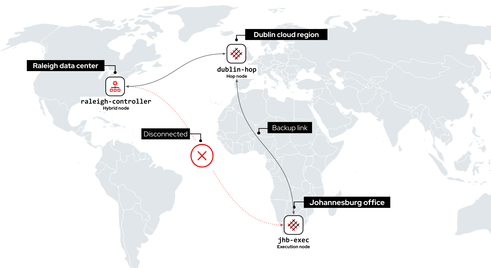
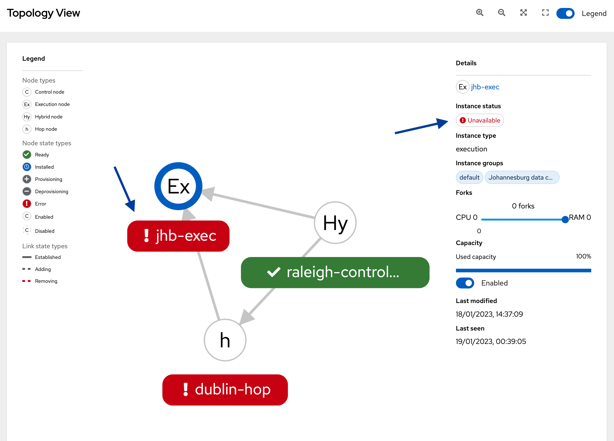
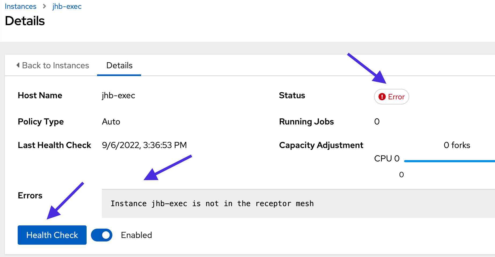
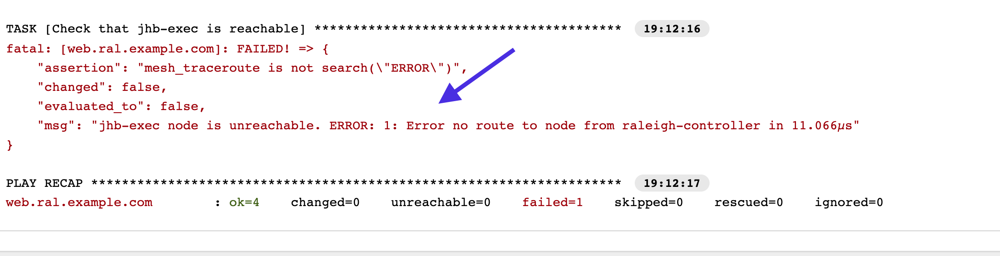
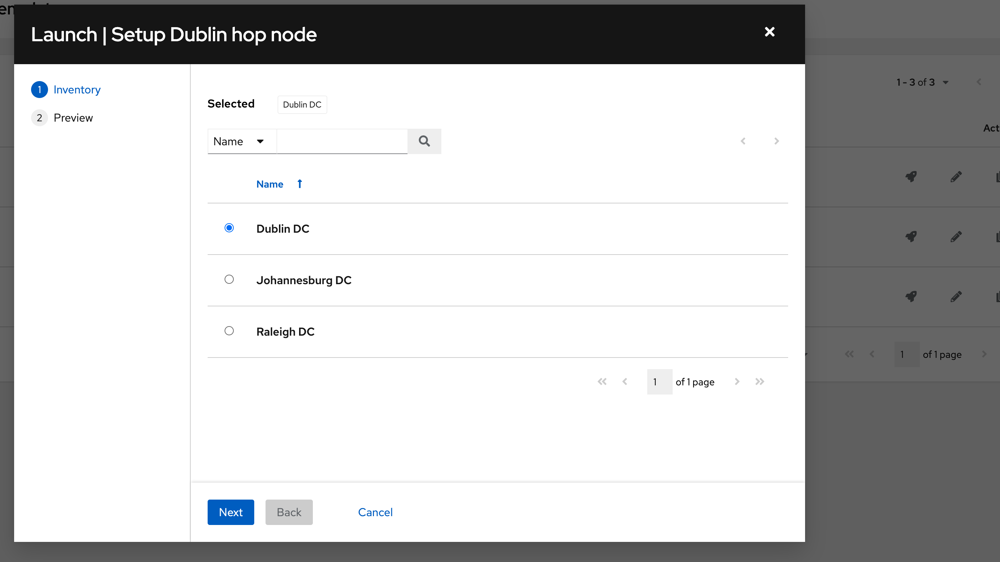
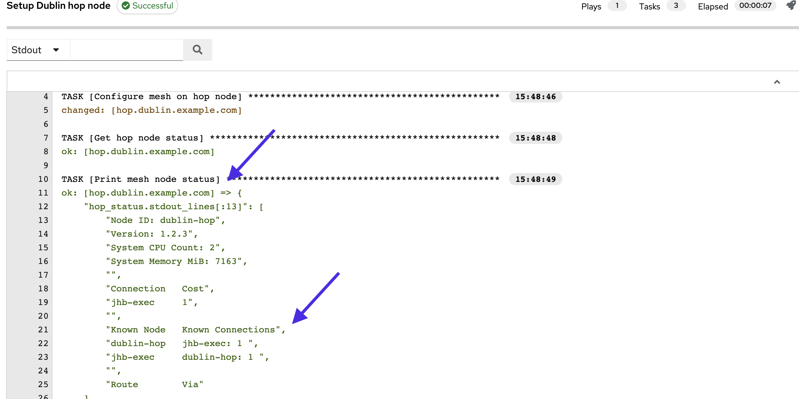
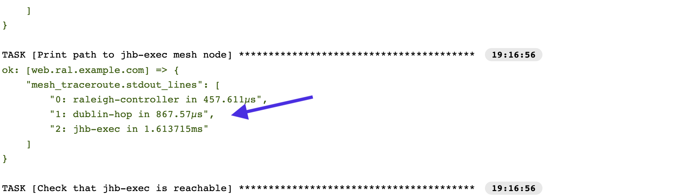
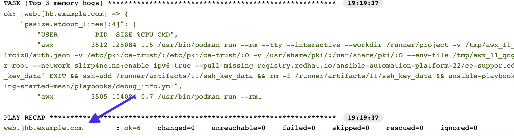

🔐 Login credentials
===
All the logins use the same credentials.

>**Username**:
> ```yaml
>student
>```
>**Password**:
>```yaml
>learn_ansible
>```

👋 Introduction
===

#### ⏰ Estimated time to complete: 10 minutes

ACME Corp is experiencing a network outage between the Raleigh data center and Johannesburg remote office. A backup link exists between Raleigh and Johannesburg via Dublin.

<a href="#disconnected">
  
</a>

<a href="#" class="lightbox" id="disconnected">
  
</a>

In this challenge, we’ll use the Dublin Hop node to connect the Raleigh automation controller to the Johannesburg remote office.

>**❗️ Note**
>
>* Perform all tasks in the _Controller_ tab located at the top-left of your browser.
>* If required, log into the automation controller using the provided credentials.
>* You can expand the images by clicking on them for a closer look.
>* Task checks might take a few seconds longer in this challenge.

☑️ Task - Perform an instance health check
===

Automation mesh performs periodic health checks on worker nodes. These health checks can be triggered via the controller WebUI or API.

>**❗️ Note**
>
>* Depending on the controller view, you might encounter the same mesh worker nodes showing different health *Status* information in this demo environment.
>* In supported installation designs, this will not occur.
>* For more information on supported patterns, please read the [official documentation](https://access.redhat.com/documentation/en-us/red_hat_ansible_automation_platform/2.0-ea/html/red_hat_ansible_automation_platform_installation_guide/index).


##### ✏️ Let’s perform a health check on the Johannesburg execution node.

* On the side navigation under the **Administration** section, click on **Topology view**.

<a href="#jhb_exec_topology_unhealthy">
  
</a>

<a href="#" class="lightbox" id="jhb_exec_topology_unhealthy">
  
</a>

Note that `jhb-exec` is showing an _Error_ status.

* Click on the `jhb-exec` node in the topology.
* Under *Details*  on the top right-hand corner of the window, click on the `jhb-exec` link. This opens a new window
* Click on the **Health Check** button to confirm the _Error_ status. This takes a few seconds to complete.

<a href="#jhb_exec_unhealthy">
  
</a>

<a href="#" class="lightbox" id="jhb_exec_unhealthy">
  
</a>

Note the message in *Errors* box. The `jhb-exec` node is unreachable from automation controller.

☑️ Task - Run the Mesh route info job template
===

The `Mesh route info` job template displays the path mesh uses to run automation jobs in Johannesburg.

##### ✏️ Let's confirm the `jhb-exec` instance is unreachable using the `Mesh route info` job template.

* On the side navigation under the **Resources** section, click on **Templates**.
* Click on the  icon next to the `Mesh route info` job template to launch it.

<a href="#route_info_launch">
  
</a>

<a href="#" class="lightbox" id="route_info_launch">
  
</a>

* A new window will prompt you to choose an inventory. Keep the default selection of `Raleigh DC`.
* Click **Next** and then click **Launch**.

<a href="#route_info_raleigh_fail">
  
</a>

<a href="#" class="lightbox" id="route_info_raleigh_fail">
  
</a>

Note the `Mesh route info` job template output.

```text
Error no route to node from raleigh-controller
```

☑️ Task - Configure the dublin-hop node
===

ACME Corp must enable the `dublin-hop` hop node to route automation traffic between Raleigh and Johannesburg. They’ve created the `Setup Dublin hop node` job template and a new `Dublin DC` inventory in automation controller to perform the configuration.

>**❗️ Note**
>
>The `Setup Dublin hop node` job template is a simple example to demonstrate automation mesh resiliency. Please visit the [official documentation](https://access.redhat.com/documentation/en-us/red_hat_ansible_automation_platform/2.2) for supported architectures and best practices.

##### ✏️ Let’s run the `Setup Dublin hop node` job template to enable the `dublin-hop` node.

* On the side navigation under the **Resources** section, click on **Templates**.
* Click on the  icon next to the `Setup Dublin hop node` job template to launch it.

<a href="#setup_dublin_inv">
  
</a>

<a href="#" class="lightbox" id="setup_dublin_inv">
  
</a>

* A new window will prompt you to choose an inventory. Keep the default selection of `Dublin DC`.
* Click **Next** and then click **Launch**.

<a href="#setup_dublin_output">
  
</a>

<a href="#" class="lightbox" id="setup_dublin_output">
  
</a>

The job template displays the current status of `dublin-hop`. Note that automation mesh dynamically added `dublin-hop` to the routing table.

☑️ Task - Confirm Johannesburg is reachable
===

>ℹ️ Automation mesh dynamically peered the Dublin hop, Johannesburg execution and the Raleigh hybrid nodes and updated the mesh routing table.

##### ✏️ Let's confirm the new route to the Johannesburg data center.

* On the side navigation under the **Resources** section, click on **Templates**.
* Click on the  icon next to the `Mesh route info` job template to launch it.
* A new window will prompt you to choose an inventory. Keep the default selection of `Raleigh DC`.
* Click **Next** and then click **Launch**.

<a href="#route_info_raleigh_hop">
  
</a>

<a href="#" class="lightbox" id="route_info_raleigh_hop">
  
</a>

Note that `dublin-hop` is used to reach `jhb-exec`.

☑️ Task - Check jhb-exec health status
===

>**❗️ Note**
>
>* Depending on the controller view, you might encounter the same mesh worker nodes showing different health *Status* information in this demo environment.
>* In supported installation designs, this will not occur.
>* For more information on supported patterns, please read the [official documentation](https://access.redhat.com/documentation/en-us/red_hat_ansible_automation_platform/2.0-ea/html/red_hat_ansible_automation_platform_installation_guide/index).

**Let’s confirm `jhb-exec` is in a healthy state.**

* On the side navigation under the **Administration** section, click on **Topology View**.
* Click on the `jhb-exec` node in the topology.
* Under the *Details* section at the top right-hand corner, click on the `jhb-exec` link.
* Click on the **Health Check** button. This takes a few seconds to complete.

<a href="#jhb_exec_healthy_check">
  
</a>

<a href="#" class="lightbox" id="jhb_exec_healthy_check">
  
</a>

Note that `jhb-exec` is now showing a healthy status.

☑️ Task - Run automation in the Johannesburg remote office
===

##### ✏️ Let's confirm we can run automation in Johannesburg using the `Debug info` job template.

* On the side navigation under the **Resources** section, click on **Templates**.
* Click on the  icon under the Actions column to launch the job template.
* Select the `Johannesburg DC` inventory.
* Click **Next** and then click on **Launch**.

<a href="#debug_info_jhb_output">
  
</a>

<a href="#" class="lightbox" id="debug_info_jhb_output">
  
</a>

The `Debug info` job template was executed successfully!

🎉 Congratulations!
===

**Well done on completing the lab!**

We covered a few features of [automation mesh](https://www.ansible.com/products/automation-mesh) in this lab. However, it offers so much more.

**Simplified operations -** Removes the dependency on ancillary tools such as jump hosts and SSH proxies.

**Flexible design options -** From single-site deployments to platform installations spanning the globe.

**Scale reliably -** Native fault tolerance and redundancy and new features, such as hop nodes with resiliency to connection disruptions and network latency.

**Scale securely** Transport Layer Security (TLS) encryption and centrally managed via controller to leverage features, such as [RBAC (Role-Based Access Control)](https://docs.ansible.com/automation-controller/latest/html/userguide/security.html#role-based-access-controls).

✅ Where to go next
===
Whether you are beginning your automation journey or a seasoned veteran, there are a variety of resources to enhance your automation knowledge:

* [Self-paced exercises](https://www.redhat.com/en/engage/redhat-ansible-automation-202108061218) - Explore all our self-paced labs
* [Trial subscription](http://red.ht/try_ansible) - Are you ready to install in your environment? Get your trial subscription for unlimited access to all the components of Ansible Automation Platform.
* [Subscribe to the Red Hat Ansible Automation Platform YouTube channel. ](https://www.youtube.com/ansibleautomation)

✅ Next Challenge - Playground
===

The next challenge is a place for you to explore and play with the remaining time. Feel free to try it out!\
Press the `Check` button below to go to the next challenge once you’ve completed the tasks.

🐛 Encountered an issue?
====

If you have encountered an issue or have noticed something not quite right, please [open an issue](https://github.com/ansible/instruqt/issues/new?labels=getting-started-mesh&title=Getting+started+with+automation+mesh+issue&assignees=craig-br).

<style type="text/css" rel="stylesheet">
  .lightbox {
    display: none;
    position: fixed;
    justify-content: center;
    align-items: center;
    z-index: 999;
    top: 0;
    left: 0;
    right: 0;
    bottom: 0;
    padding: 1rem;
    background: rgba(0, 0, 0, 0.8);
    margin-left: auto;
    margin-right: auto;
    margin-top: auto;
    margin-bottom: auto;
  }
  .lightbox:target {
    display: flex;
  }
  .lightbox img {
    /* max-height: 100% */
    max-width: 60%;
    max-height: 60%;
  }
  img {
    display: block;
    margin-left: auto;
    margin-right: auto;
    width: 100%;
  }
  h1 {
    font-size: 18px;
  }
    h2 {
    font-size: 16px;
    font-weight: 600
  }
    h3 {
    font-size: 14px;
    font-weight: 600
  }
  p span {
    font-size: 14px;
  }
  ul li span {
    font-size: 14px
  }
</style>
