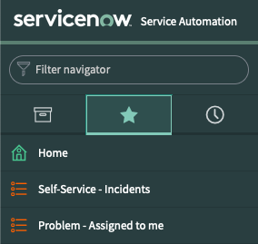

In ITIL, an incident refers to an unplanned outage or reduction in quality of an IT service or application. ServiceNow implements technology mapped to ITIL terminology and is accepted as an industry standard for incident management.

The servicenow.itsm certified collection allows organizations to leverage incident management within Ansible Automation Platform workflows.

A playbook as been created in the `VS Code` tab called `incident-create.yml`.
- Inspect this playbook and review the in-line comments to understand how the collection is being leveraged.
---

- Next, use the login credentials supplied in `readme.md` to access the Automation Controller tab.

- Navigate to `Resources > Templates` and press the rocket icon to launch the `Create incident (incident-create.yml)` job.

---

If the previous step completed successfully, you should see a new incident has been created. To verify that this is the case:
- Use the ServiceNow credentials from `readme.md` to access ServiceNow from the `ServiceNow` tab.

- In ServiceNow, click the star icon to access pre-configured favorites:

You should see a new Incident has been created! To verify this was done by you, your unique username for this environment should be shown in the Incident description. The incident number should also match the incident number displayed in the job execution output within Automation Controller.

Move onto the next section by selecting the green "Next" button below.