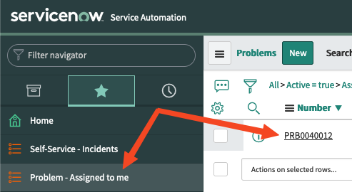

👋 Introduction
====
A problem in ServiceNow represents the cause of one or more incidents. The root cause of the problem may not be known at the time of creation and may require root cause analysis through the problem management process.

Another playbook has been added to your working directory in VS Code and a template has been created to attach a problem to the incident previously created.

- First, inspect the playbook called `problem-attach.yml` in the `VS Code` tab.

> Notice that this playbook will first query for existing incident numbers that you have created and will use the value returned in the task that creates the problem.

▶️ Attach a problem
====
- Next, navigate to `Resources > Templates` and execute the new job template from automation controller by pressing the rocket icon next to the template `2 - Attach problem (problem-attach.yml)`.

🔍 Inspect results
====
That should have completed successfully! Go back to ServiceNow and check under your assigned problems for a new problem number:

You can also check to see if the status of the incident has been updated by selecting your incident number under `Self-service - Incidents`. There should now also be a problem referenced on the incident page.

Move onto the next section by selecting the green "Next" button below.

🐛 Encountered an issue?
====
If you have encountered an issue or have noticed something not quite right, please [open an issue](https://github.com/ansible/instruqt/issues/new?labels=getting-started-servicenow-automation&title=New+servicenow+issue:+attach-problem+(Sandbox+id:+[[ Instruqt-Var key="SANDBOX" hostname="controller" ]])&assignees=cloin).