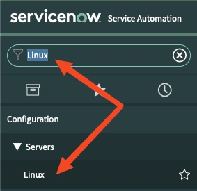

👋 Introduction
====
In ITIL, a configuration management database (CMDB) is a database that an organization uses to track hardware and software assets. ServiceNow CMDB is typically a critical service within an organization and is often seen as the single source of truth for tracking IT assets.

Ansible Automation Platform is able to leverage modules within the `servicenow.itsm` collection to both query and update configuration items within ServiceNow's CMDB.

For this challenge, two Red Hat Enterprise Linux (RHEL) servers have automatically been provisioned and added to an inventory on automation controller. Their hostnames are `node1` and `node2`. Two additional playbooks have been created in the `VS Code` tab.
- `collect-node-info.yml` gathers information about these two new RHEL nodes
- `create-update-config-items.yml` uses the collected data to create or update two new configuration items in the CMDB

View the current group of linux configuration items by typing "Linux" in the ServiceNow filter navigator box and click on `Configuration -> Servers -> Linux` to view a list of configuration items in the Linux server group.

▶️ Query nodes and create/update CMDB
====
The two new playbooks have been combined into a single Workflow Job Template in automation controller called: `4.0 - Query node info and update CMDB (multiple job templates)`
- This new Workflow Job Template line also has a new button that, when clicked, shows a visualization of the tasks being performed displayed as nodes in a map.
- Launch the new Workflow Job Template
- As the Workflow is running, clicking on any of the nodes should bring you to the corresponding job that was launched for each of the nodes in the visualizer.

🔍 Inspect results
====
- View the updated group of linux configuration items by typing "Linux" in the ServiceNow filter navigator box and click on `Configuration -> Servers -> Linux` to view a list of configuration items in the Linux server group.
- Notice that two new configuration items have been created and the IP address fields have been attached the the configuration items

Move onto the next section by selecting the green "Next" button below.

🐛 Encountered an issue?
====
If you have encountered an issue or have noticed something not quite right, please [open an issue](https://github.com/ansible/instruqt/issues/new?labels=getting-started-servicenow-automation&title=New+servicenow+issue:+configuration-items&assignees=cloin).