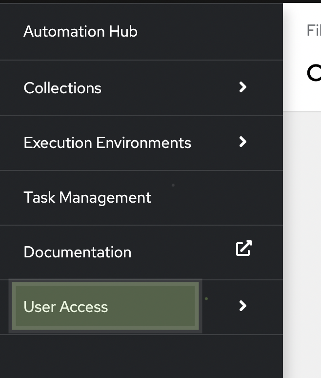
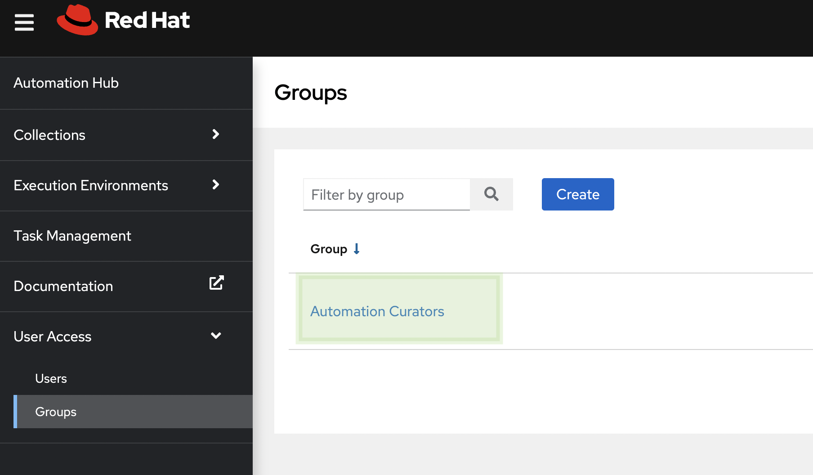
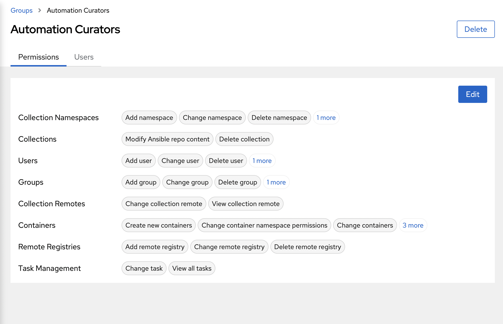
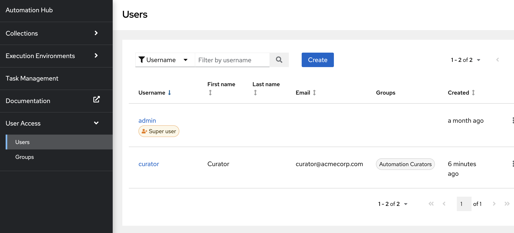

👋 Introduction
===
#### Estimated time to complete: *5 minutes*<p>
ACME Corp relies heavily on Ansible to automate the workflows across their organization. They have a private automation hub instance that they use as the library of their Ansible content collections and automation execution environments. Different groups in the organization use the collections and execution environments from this private automation hub instance to test their automation.

As the private automation hub instance serves as the automation content library across the organization, ACME Corp wants to only publish content collections to the private automation hub instance after testing and approval. Once approved, provide access to only certain groups within the organization to push content collections to private automation hub.

☑️ Task 1 - Understand the lab premise
===

ACME Corp has three main groups of users:
1. Automation Curators - This group is responsible for setting up upload testing and managing access to private automation hub
2. Cloud Automation- This group creates ansible content collections that automation the cloud workflows for the organization. Example Automate, manage and create cloud instances from Amazon Web Services (AWS), Microsoft Azure and Google Cloud Platform (GCP).
3. Network Automation - This group creates content collections that can automate the network workflows for the organization. For example, automate and manage switches and routers from multiple vendors (e.g Cisco, Juniper)

* The Curator is part of the Automation Curators group and he has been given the responsibility to setup upload policies for Ansible Content Collections and setup access for user Bob and Marie who belong to network and cloud groups respectively.

* Marie is a cloud automation expert for ACME Corp and she wants to push cloud automation collections to private automation hub.

* Bob is the go-to network automation expert for ACME Corp and he knows how to build Ansible Content Collections that automate different network devices used across ACME Corp. He wants to push network collections to private automation hub


☑️ Task 2 - Login to private automation hub using the curator user and check permissions
===

* *automationhub-web* tab is open and you will see a login screen by default, use the below credentials to login as the curator user in private automation hub

🔐 Login credentials

>User: curator<p>
>Password: learn_ansible

* Once logged In, click on "User Access" and select the "Groups" option. Note that only one group exists labeled "Automation Curators". Click on this group to see permission assigned.
<!--  -->
<a href="#user_access_tab">
  
</a>
<a href="#" class="lightbox" id="user_access_tab">
  
</a>

* In "User Access" click on the "Groups" option to check the groups that exist, note that only one group exists there called "Automation Curators", click on this group to see permission assigned.
<!--  -->
<a href="#user_access_groups">
  
</a>
<a href="#" class="lightbox" id="user_access_groups">
  
</a>

* You should be able to see the permissions assigned to the "Automation Curators" group, Mr. Curator is part of this group and he has the permissions to add groups and users to the private automation hub.
<!--  -->
<a href="#curator_group_permissions">
  
</a>
<a href="#" class="lightbox" id="curator_group_permissions">
  
</a>

* Now click on the "Users" option on the left pane under "User Access", you will see two users here:
  * **admin** - This is a super user that gets created by default and it has all the permissions and is the owner of all the objects related to private automation hub. *admin* user was used to create the curator user as part of the lab pre-configuration.
  * **curator** - Mr. Curator is part of the "Automation Curators" group and is responsible for managing this private automation hub instance.
  <!--  -->
<a href="#curator_user">
  
<a href="#" class="lightbox" id="curator_user">
  
</a>

☑️ Task 3 - Setup content upload policies on the private automation hub backend
===
* *automationhub-terminal* tab is open, click on the tab and go through the next steps to check how upload policies have been setup.
* Run the following command on the terminal
  <br>
  ```
  cat /etc/galaxy-importer/galaxy-importer.cfg
  ```
  <br>
  You will see that there are two options setup:
  * RUN_ANSIBLE_TEST - Set this to True if you want to run ansible-test on each collection upload, this is set to False for this lab, as running `ansible-test` is out of scope.
  * CHECK_REQUIRED_TAGS - This option signifies that any collections that get uploaded needs to have atleast one tag specifying the type of the Ansible Content Collection.

As a curator, you can decide the content upload policies after editing the `galaxy-importer.cfg`, for more options visit the [Galaxy Importer Repository](https://github.com/ansible/galaxy-importer#configuration).

**NOTE** This private automation hub instance is setup to require approval before anything is published, and the curator user has the permissions to give content approval.

☑️ Summary
===
* Mr. Curator is part of the "Automation Curator" group and he has the permission to approve the content for publishing to private automation hub.
* Ansible Content Collections that get uploaded go through a set of policies setup in `galaxy-importer.cfg` file.

✅ Next Challenge
===
Press the `Next` button below to go to the next challenge once you’ve completed the tasks.

🐛 Encountered an issue?
====
If you have encountered an issue or have noticed something not quite right, please [open an issue](https://github.com/ansible/instruqt/issues/new).

<style type="text/css" rel="stylesheet">
  .lightbox {
    display: none;
    position: fixed;
    justify-content: center;
    align-items: center;
    z-index: 999;
    top: 0;
    left: 0;
    right: 0;
    bottom: 0;
    padding: 1rem;
    background: rgba(0, 0, 0, 0.8);
    margin-left: auto;
    margin-right: auto;
    margin-top: auto;
    margin-bottom: auto;
  }
  .lightbox:target {
    display: flex;
  }
  .lightbox img {
    /* max-height: 100% */
    max-width: 60%;
    max-height: 60%;
  }
  img {
    display: block;
    margin-left: auto;
    margin-right: auto;
    width: 100%;
  }
  h1 {
    font-size: 18px;
  }
    h2 {
    font-size: 16px;
    font-weight: 600
  }
    h3 {
    font-size: 14px;
    font-weight: 600
  }
  p span {
    font-size: 14px;
  }
  ul li span {
    font-size: 14px
  }
</style>
