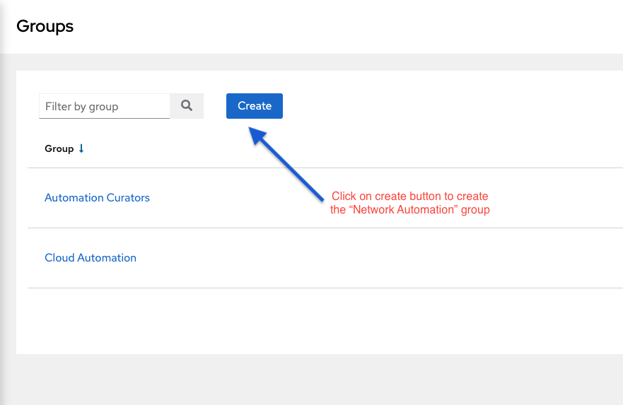
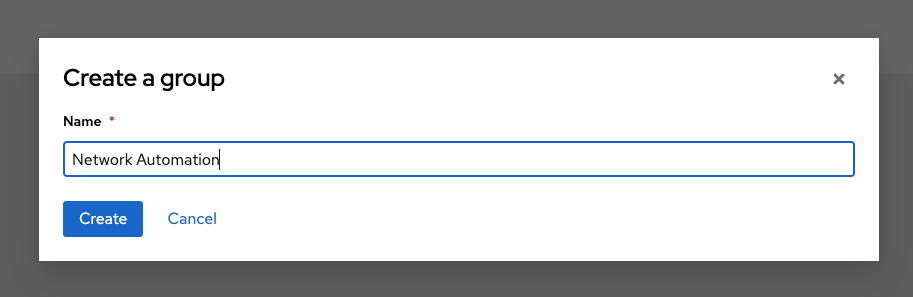
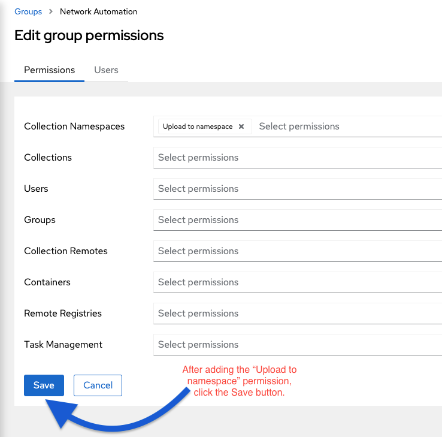
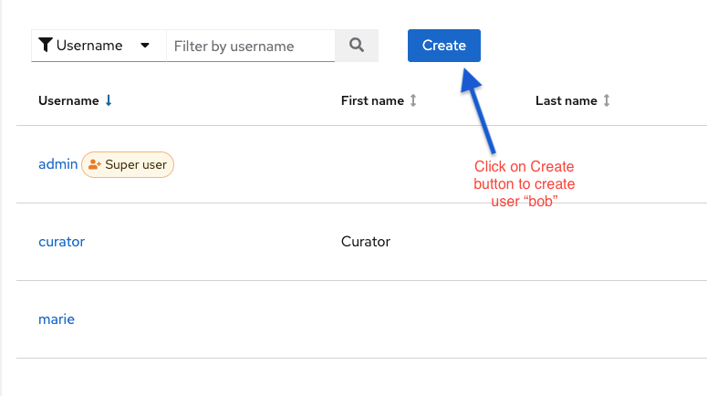
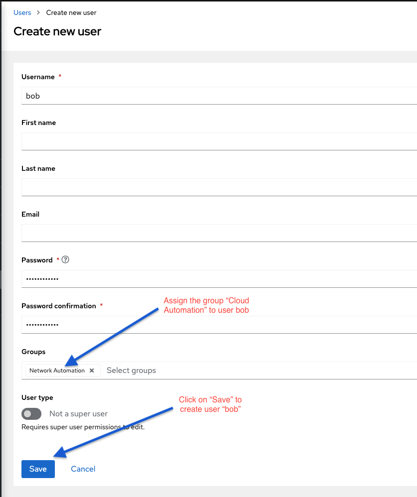
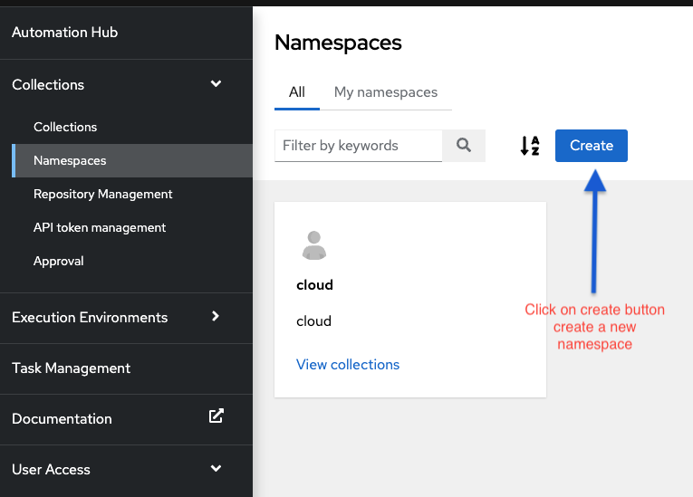
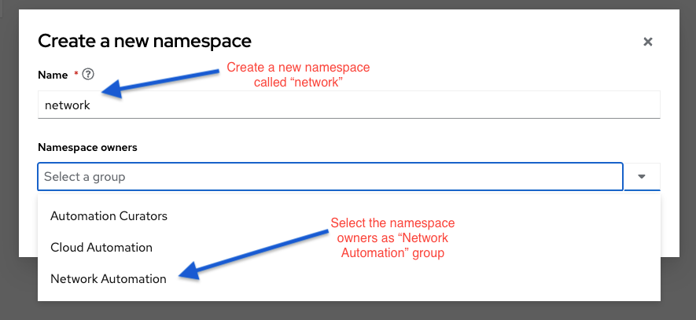
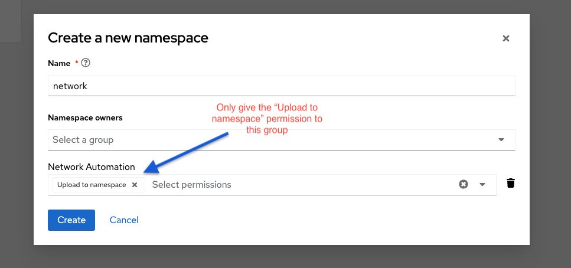
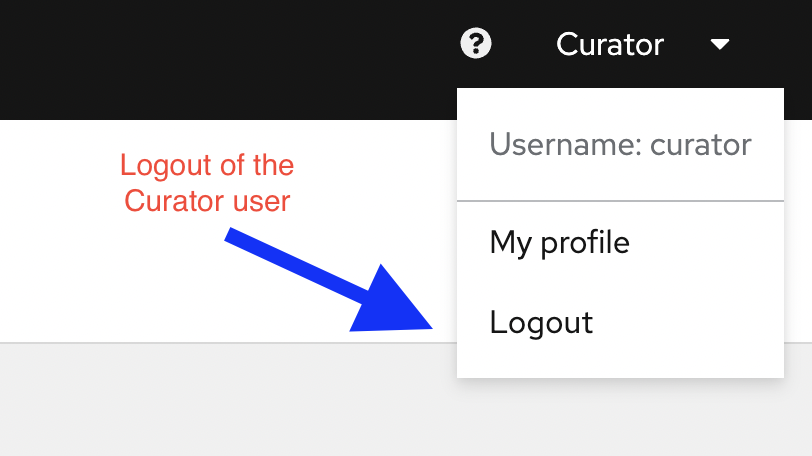
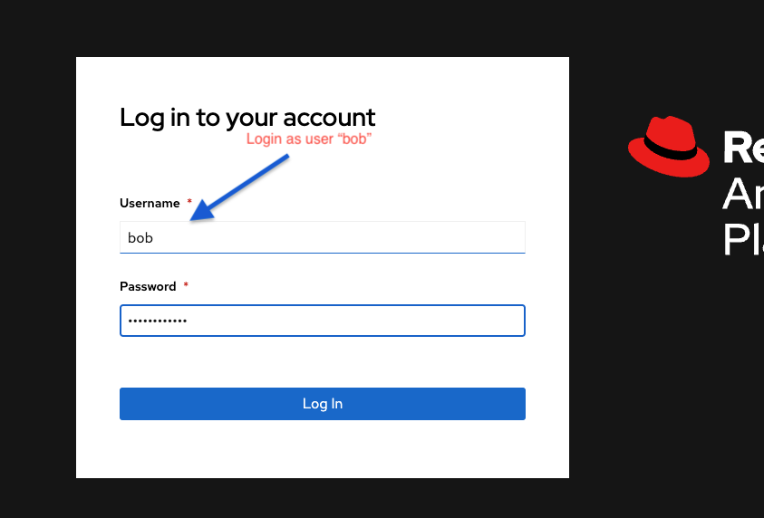

🔐 Login credentials

>User: curator

>Password: learn_ansible

This challenge is very similar to the last challenge, but in this one we will create a different group, user and namespace, below are the details:
1. Group Name - **Network Automation**
2. User name - **bob**
3. Namespace - **network**

☑️ Task 1 - Create a network user group
===

The Curator wants to create a user group called *Network Automation* for the network automation team. He needs to make sure that cloud user group has the permission to upload collections to the **network** namespace only.

Please go through the below steps to create a **Network Automation** user group.

1. Ensure you are already logged in as as the *curator* user in automationhub-web tab.
2. Click on "User Access" > Groups in the left pane after login.
3. Click on "Create" button.
<!--  -->

4. Type "Network Automation" in the name of the group  and then click on Create button.
<!--  -->

5. After you create the group, you will see a permissions page where you can assign permissions. Click "Edit". Edit permissions to add the "Upload to namespace" permission to the group here. Click on Save.
<!--  -->

☑️ Task 2 - Create a user bob in network group
===
1. On the left pane click on "User Access" > "Users"
<!--  -->

2. Set the username field as "bob" and password field as "learn_ansible", assign the group as the "Network Automation" group to the user bob.
<!--  -->

☑️ Task 3 - Create a network namespace
===
1. On the left-pane click on "Collections" > "Namespaces" to go in the namespace menu.
<!--  -->

2. Click on "Create" button to create a new namespace
<!--  -->

3. In the Dialog, set the namespace name as "network" and set the owners of the namespace to the "Network Automation" group.
<!--  -->

4. Change the default permissions by removing "Change Namespace" permission and only keeping the "Upload to Namespace" permission for Network Automation group and the click on Create button.
<!--  -->

5. Logout from the curator user.
<!--  -->

☑️ Task 4 - Login as network group user bob
===
Login as user "bob" from Network Automation group in private automation hub instance.
🔐 Login credentials

>User: bob

>Password: learn_ansible
<!--  -->

* Notice that the user "bob" doesn't have access to "User Access" option in left pane and cannot edit user or groups.

☑️ Task 5 - Logout as user bob.
===
* Make sure you are logged out from the user "bob" before moving on to the next challenge.

☑️ Summary
===
* We created the "Network Automation" group and a user "bob" in that group.
* This group has the permissions to Change namespace and Upload to namespace.
* This group is the owner of the cloud namespace on private automation hub.

✅ Next Challenge
===
Press the `Next` button below to go to the next challenge once you’ve completed the tasks.

🐛 Encountered an issue?
====
If you have encountered an issue or have noticed something not quite right, please [open an issue](https://github.com/ansible/instruqt/issues/new).

