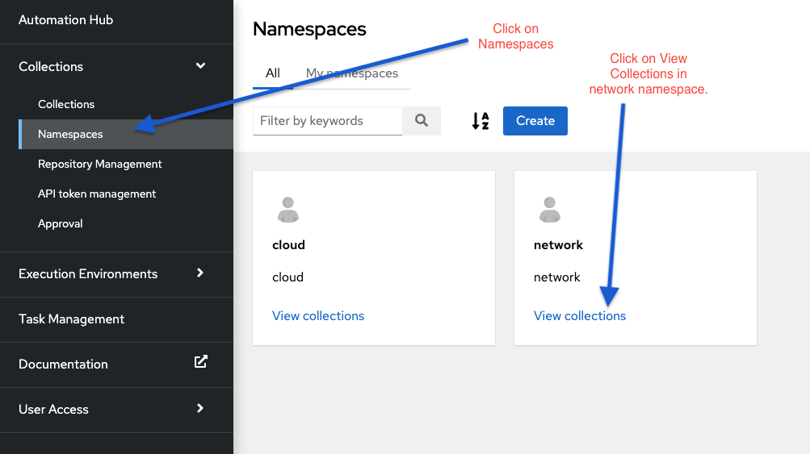
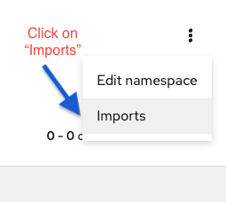
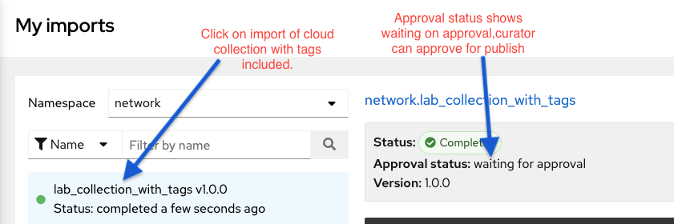

🔐 Login credentials

>User: bob<p>
>Password: learn_ansible

This challenge will work on the policies setup in previous challenges, a quick recap:
1. User `bob` can only publish to the network namespace in private automation hub.
2. Policy has been setup in `/etc/galaxy/galaxy-importer.cfg` explained in challenge 1 to only accept collections with tags.

We have provided the `ansible.cfg` with token of network automation group user `bob`, as a student you will pushing the collections to private automation hub as `bob` user.

We have also included some collection artifacts to show how policies will work if we try to push collections.

**NOTE**: Building a collection using `ansible-galaxy` is out of scope for this lab, but if you want to read up on how to build ansible content collections, please visit the [developing ansible content collections page](https://docs.ansible.com/ansible/latest/dev_guide/developing_collections.html) and the [Collection Galaxy metadata structure](https://docs.ansible.com/ansible/latest/dev_guide/collections_galaxy_meta.html#collections-galaxy-meta) page on Ansible documentation.

☑️ Task 1 - Pushing a collection to cloud namespace.
===

In this task, user `bob` from network automation group will try to publish a collection to `cloud` namespace.
As we know from the policies we have setup in previous challenges, a user from **Network Automation** group can only publish collections to the **network** namespace. Let's try to publish a collection to **cloud** namespace and see if it fails.

Run the following command on the **automationhub-terminal** tab:
```
ansible-galaxy collection publish cloud-test_collection-1.0.0.tar.gz
```
You will encounter an error that says:
`You do not have permission to perform this action.`

This is intentional, as we have setup the policies in the previous exercises so that a user from the **Network Automation** group can only publish collection to the **network** namespace.

☑️ Task 2 - Pushing a collection to network namespace.
===
We will now try to publish collections to the **network** namespace. As a user of the **Network Automation** group we should be able to publish collections to **network** namespace in private automation hub.

Run the following commands:

```
ansible-galaxy collection publish network-lab_collection_without_tags-1.0.0.tar.gz
```

From the name of the above collection, you can observe that this collection doesn't include any tags and hence based on the policy it should fail.

The collection metadata for this collection(`galaxy.yml`), does not include any tags:
```
tags: []
```

You will see the following error after running the above command.

`ERROR! Galaxy import process failed: Invalid collection metadata. At least one tag required from tag list: application, cloud, database, infrastructure, linux, monitoring, networking, security, storage, tools, windows (Code: UNKNOWN)`


Now run the below command which pushes the collection with tags and this command should be successful.

```
ansible-galaxy collection publish network-lab_collection_with_tags-1.0.0.tar.gz
```
The collection metadata for this collection(`galaxy.yml`), includes a tag called `networking` to signify this is a network collection:
```
tags: [networking]
```

☑️ Task 3 - Check your imports in Automation Hub.
===
Login as user `bob` in `automationhub-web` tab.

🔐 Login credentials

>User: bob<p>
>Password: learn_ansible

As a network automation group user, you can now check in private automation hub UI the collection you have published to the namespace.

**NOTE** The collections will **not** show up under the namespace directly as the user from curator group has to first approve the collection in order for it to show up under the namespace directly.

In the next screenshots, you can follow along on how you can see the imports you have done and the see the logs attached to the import.

**Login as user bob in automationhub-web tab of the lab**

<!--  -->
<a href="#network_collection_view">
  
</a>
<a href="#" class="lightbox" id="network_collection_view">
  
</a>

<!--  -->
<a href="#collection_import_button">
  
</a>
<a href="#" class="lightbox" id="collection_import_button">
  
</a>

<!--  -->
<a href="#network_collection_import_view">
  
</a>
<a href="#" class="lightbox" id="network_collection_import_view">
  
</a>

☑️ Task 4 - Logout as user bob.
===
* Make sure you are logged out from the user "bob" before moving on to the next challenge.

☑️ Summary
===
* We tested if a network automation group user can publish collection to cloud namespace.
* We checked if the policy setup by the curator on importer works, through importing collection with and without tags
* We checked the imports as a network automation group user and saw the status as "Waiting for Approval", which means curator needs to approve a collection before it can be published.

✅ Next Challenge
===
Press the `Next` button below to go to the next challenge once you’ve completed the tasks.

🐛 Encountered an issue?
====
If you have encountered an issue or have noticed something not quite right, please [open an issue](https://github.com/ansible/instruqt/issues/new).

<style type="text/css" rel="stylesheet">
  .lightbox {
    display: none;
    position: fixed;
    justify-content: center;
    align-items: center;
    z-index: 999;
    top: 0;
    left: 0;
    right: 0;
    bottom: 0;
    padding: 1rem;
    background: rgba(0, 0, 0, 0.8);
    margin-left: auto;
    margin-right: auto;
    margin-top: auto;
    margin-bottom: auto;
  }
  .lightbox:target {
    display: flex;
  }
  .lightbox img {
    /* max-height: 100% */
    max-width: 60%;
    max-height: 60%;
  }
  img {
    display: block;
    margin-left: auto;
    margin-right: auto;
    width: 100%;
  }
  h1 {
    font-size: 18px;
  }
    h2 {
    font-size: 16px;
    font-weight: 600
  }
    h3 {
    font-size: 14px;
    font-weight: 600
  }
  p span {
    font-size: 14px;
  }
  ul li span {
    font-size: 14px
  }
</style>