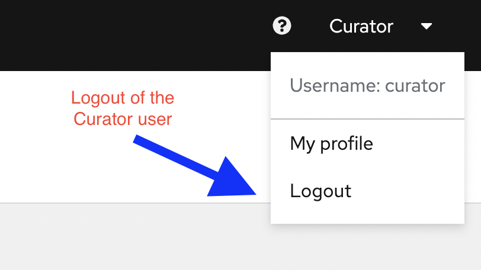

🔐 Login credentials

>User: curator

>Password: learn_ansible

In this challenge, we will login as **curator** user to approve and publish the pushed collections from the previous challenges.

☑️ Task 1 - Approve collections as the curator user
===

* Login to the `automationhub-web` tab as **curator** user.
* Go through the below screenshots to understand how a curator can check import logs and approve or reject a collection.

<!--  -->

<!--  -->

* Logout as **curator** once collections are approved.

<!--  -->

☑️ Task 2 - Login as marie/bob user to see if collections are published.
===

* Logout as curator user.
* Login as **marie** use to check if collections are published, check screenshots below.

<!--  -->

☑️ Summary
===
* Curator can approve or reject collections based on their import logs.
* Once a collection is published, any user should be able to view and download collections from private automation hub.

✅ The End
===
This marks the end of this lab. We hope that you enjoyed learning about private automation hub.

🐛 Encountered an issue?
====
If you have encountered an issue or have noticed something not quite right, please [open an issue](https://github.com/ansible/instruqt/issues/new).

