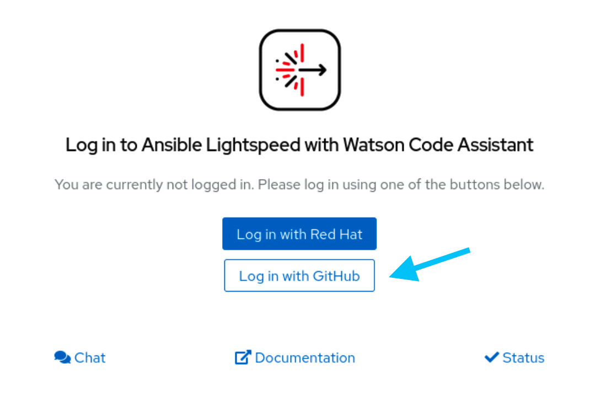

👋 Introduction
===

>### **❗️ Note**
>You'll need a GitHub account for this lab. If you don't have an account yet,  please create one [here](https://github.com/join) .
- On the top left hand-side of the window, you'll see the `Controller` and `RHEL` tabs.
- The `Controller` tab in the lab browser window connects you to [automation controller](https://https://www.ansible.com/products/controller) (previously known as Ansible Tower).
- We'll use automation controller in later challenges.


- Click on the `RHEL` tab. This opens a new browser tab called `srv01` and provides access to a Red Hat Enterprise Linux system with Visual Studio Code installed.

- If prompted, allow clipboard access to your RHEL instance.

	


- The login credentials for controller and Cockpit, which we'll use later in the lab, are below:

>**Username**:
> ```yaml
>student
>```
>**Password**:
>```yaml
>learn_ansible
>```

ℹ️ Need help?
===

* You can expand the images by clicking on them for a closer look.

### I cannot type in Visual Studio Code for some reason. How do I solve that?

- It is possible that the `RHEL` tab loses focus and nothing happens when you type in Visual Studio Code.
- To fix this, switch to any other tab and back to the `RHEL` tab.

<a href="#screen_focus">
  
</a>

### How do I skip this challenge?

Click the `Skip` button located at the bottom right-hand side of the screen to move to the next challenge.

<a href="#skip_challenge">
  
</a>
<a href="#" class="lightbox" id="#solution_playbooks">
  

☑️ Task - Enable Ansible Lightspeed
===

- Navigate to your RHEL instannce external tab.
- Follow the screenshot instructions below to enable Ansible Lightspeed and Ansible Lint in Visual Studio Code.


>**❗️Note!**
>
>Please ensure you configure the settings in the Visual Studio Code `Workspace` settings.
>

- Double-click on the Visual Studio Code icon on the desktop.


- Navigate to the Ansible Visual Studio Code extension settings.


- We are configuring the Ansible Visual Studio Code extension in the `Workspace` section. Workspace settings are specific to the folder you have opened in Visual Studio Code.


- Scroll down to find the Lightspeed settings and enable them:


- Scroll down further and enable `Ansible Lint`, which checks your Ansible Playbook for best practices and more as you type.


☑️ Task - Log into the Ansible Lightspeed service
===

Next, you'll log into the Ansible Lightspeed service using your GitHub credentials.

>### **❗️ Note**
>
>This lab environment is ephemeral and will be deleted as soon the time limit is reached.
> No credentials are stored after the lab environment is removed.

>**ℹ️  Enable Ansible Lightspeed before signing into the service.**
>
> You'll first need to enable Ansible Lightspeed in Visual Studio Code before you can log into the service.

- Follow the screenshots below to authenticate to the Ansible Lightspeed service.


- This will open a Firefox browser and ask you to login to your GitHub account, please follow through the screenshots below:




- Once you have logged in and authorized the Ansible Lightspeed service, you'll see `Logged in as <GitHub Username>` on the Visual Studio Code extension.


>**❗️Note!**
>
>- If you receive a timeout warning as below, you're OK!
>- Click on `Connect` in the Ansible Visual Studio Code extension again.
>- Click on `Authorize` in Firefox. You won't need to re-authenticate with your GitHub credentials.
>

✅ Next Challenge
===
Press the `Check` button below to go to the next challenge once you’ve completed the tasks.

✅ Additional resources
===

[More information](https://www.redhat.com/en/engage/project-wisdom) on Ansible Lightspeed Tech Preview.

Explore free resources to get you started:

* [Self-paced exercises](https://www.redhat.com/en/engage/redhat-ansible-automation-202108061218) - Explore all our self-paced labs
* [Trial subscription](http://red.ht/try_ansible) - Are you ready to install in your environment? Get your trial subscription for unlimited access to all the components of Ansible Automation Platform.
* Subscribe to the Red Hat Ansible Automation Platform YouTube channel.

🐛 Encountered an issue?
====
If you have encountered an issue or have noticed something not quite right, please [open an issue](https://github.com/ansible/instruqt/issues/new?labels=devops-controller&title=New+DevOps+with+automation+controller+issue+issue:+incident-creation&assignees=craig-br).

<style type="text/css" rel="stylesheet">
  .lightbox {
    display: none;
    position: fixed;
    justify-content: center;
    align-items: center;
    z-index: 999;
    top: 0;
    left: 0;
    right: 0;
    bottom: 0;
    padding: 1rem;
    background: rgba(0, 0, 0, 0.8);
    margin-left: auto;
    margin-right: auto;
    margin-top: auto;
    margin-bottom: auto;
  }
  .lightbox:target {
    display: flex;
  }
  .lightbox img {
    /* max-height: 100% */
    max-width: 60%;
    max-height: 60%;
  }
  img {
    display: block;
    margin-left: auto;
    margin-right: auto;
  }
  h1 {
    font-size: 18px;
  }
  h2 {
    font-size: 16px;
    font-weight: 600
  }
  h3 {
    font-size: 14px;
    font-weight: 600
  }
  p span {
    font-size: 14px;
  }
  ul li span {
    font-size: 14px
  }
</style>
