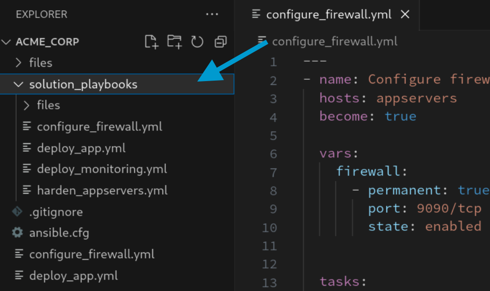
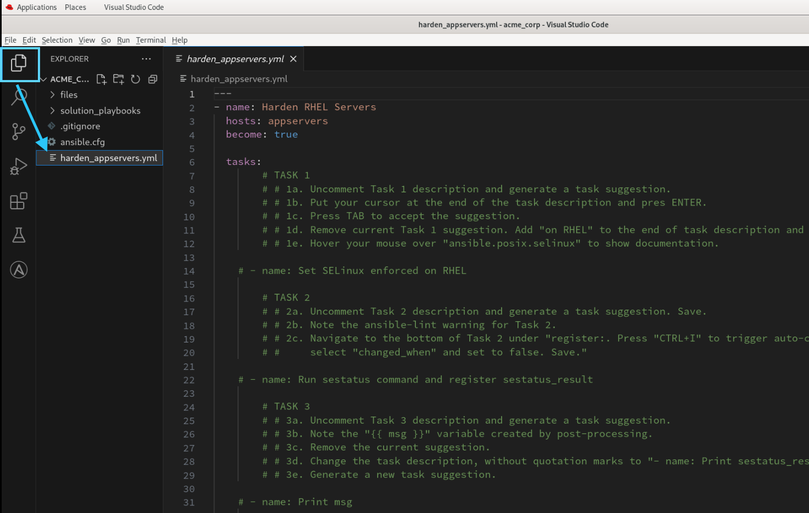
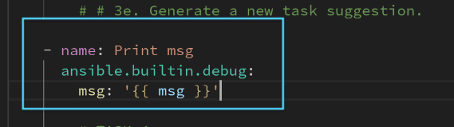
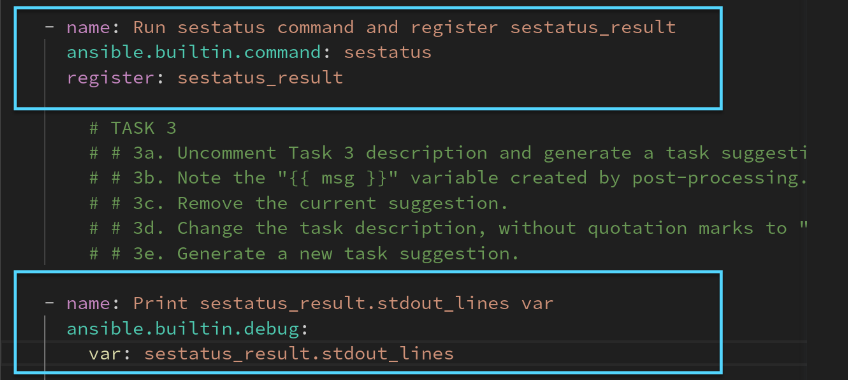
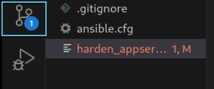
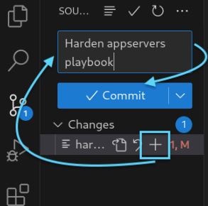
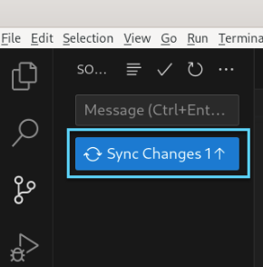
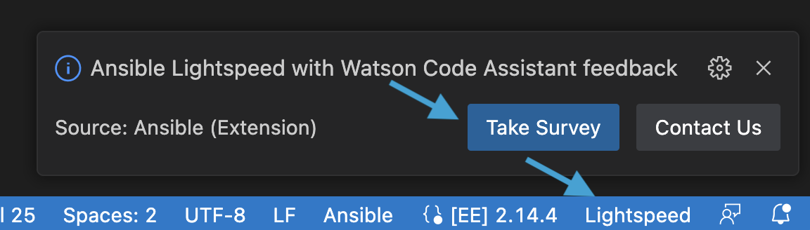

🔐 Login credentials
===
All the logins use the same credentials.

>**Username**:
> ```yaml
>student
>```
>**Password**:
>```yaml
>learn_ansible
>```

👋 Introduction
===

ACME Corp, a fictitious company, wants to automate the deployment of a Chat application. To do so, they'll need to do the following:

* Harden the application servers.
* Deploy the chat application on one of the servers.
* Deploy the monitoring application to look over the chat servers.

# 🎯 Your mission: Help ACME Corp harden their app servers.

In this challenge, we’ll help ACME Corp harden their app servers by creating a Playbook using Ansible Lightspeed that performs the following:

- Set SELinux to enforced state.
- Run sestatus command and check if selinux is enforced.
- Install openssh-server on hosts.
- Disable password auth on hosts.
- Restart the ssh service.

>**👀 Remember to follow the instructions in the Playbook too!**
>
>* The Playbooks also contain instructions you need to follow as you complete the challenge.

ℹ️ Need help?
===

* You can expand the images by clicking on them for a closer look.
* Working Playbooks are available in the **solution_playbooks** folder in Visual Studio Code. If you are having any issues, use the corresponding solution Playbook as a guide to complete the challenge.

<a href="#solution_playbooks">
  
</a>
<a href="#" class="lightbox" id="#solution_playbooks">
  
</a>

### How do I generate Ansible Lightspeed suggestions?

- Navigate to the end of the Ansible task description line.
* Uncomment the task description line by manually removing the `#`, or press `Ctrl + /`.
- At the end of the Ansible task description, press `ENTER` and once a suggestion is generated, press `TAB` to accept it.


☑️ Task 1 - Explore the `harden_appservers.yml` Playbook
===

* Open the **srv01** external browser tab that has your RHEL instance.
* If needed, open Visual Studio Code.
* Follow the instructions outlined in the screenshots below to open `harden_appservers.yml`.



* Note the below in the `harden_appservers.yml` Playbook. The `hosts: appservers` entry means this Playbook will run on the `appservers` Inventory group in automation controller

```yaml
hosts: appservers
```
☑️ Task 2 - Generate `harden_appservers.yml` Playbook tasks
===

### ℹ️ Generating *harden_appservers.yml* content.

* The `harden_appservers.yml` Playbook has predefined task descriptions to automate the following tasks:
  - Set SELinux to enforced state
  - Run sestatus command and check if selinux is enforced
  - Install openssh-server on hosts
  - Disable password auth on hosts
  - Restart the ssh service

>### ℹ️ Ansible Lightspeed features
>
>* Ansible Lightspeed saves you time by generating contextually accurate Ansible tasks based on natural, easy-to-understand language.
>* No need to switch contexts, copy and paste code snippets, or Google which module to use.

* In this task you'll note how Ansible Lightspeed used context to generate tasks to print variables.




* Open your RHEL instance tab and, if needed, open Visual Studio Code.
* Click on `harden_appservers.yml` in the Visual Studio Code Explorer to open `harden_appservers.yml`.
* Use the comments in `harden_appservers.yml` to guide you creating Ansible tasks.
* Once you've completed the tasks, save `harden_appservers.yml` by navigating to `File` and clicking on `Save` or by pressing `CTRL+S`.

☑️ Task 3 - Commit and push `harden_appservers.yml` playbook to the repository
===
>❗️ **Note**
>
>The lab repository is hosted locally in the lab and no content is pushed to your GitHub account.

* In Visual Studio Code, please follow the screenshots below to commit the changes to the repository.





☑️ Task 4 - Run the Job Template in the automation controller
===

* Go to the **Controller** tab and login using the credentials provided above if necessary.
* Click **Templates** under the **Resources** section in the Navigation Pane on the left hand side.
* Click the  icon on the right-hand side of the `Harden app servers` Job Template column.


This will launch the Playbook and execute on the `appservers` Inventory group.

* Note the `Harden app servers` Job completed successfully!
* Open the **Jobs** tab in controller to view the Playbook output.

### 👌 Pat yourself on the back!

You've created an Ansible Playbook to harden the app servers using Ansible Lightspeed and ran it  in controller!

✏️ We love your feedback!
===

* Please take the [Ansible Lightspeed sentiment survey](https://red.ht/ansible-ai-feedback).
* Reach out to us at <ansible-content-ai@redhat.com>.

You can also use the *Take Survey* or *Contact Us* buttons by clicking on Lightspeed at the bottom right of the Visual Studio Code window at any time.

<a href="#vscode_survey">
  
</a>

<a href="#" class="lightbox" id="#vscode_survey">
  
</a>

✅ Next Challenge
===

Press the `Check` button below to go to the next challenge once you’ve completed the tasks.

✅ Additional resources
===

[More information](https://www.redhat.com/en/engage/project-wisdom) on Ansible Lightspeed Tech Preview.

Explore free resources to get you started:

* [Self-paced exercises](https://www.redhat.com/en/engage/redhat-ansible-automation-202108061218) - Explore all our self-paced labs
* [Trial subscription](http://red.ht/try_ansible) - Are you ready to install in your environment? Get your trial subscription for unlimited access to all the components of Ansible Automation Platform.
* Subscribe to the Red Hat Ansible Automation Platform YouTube channel.

🐛 Encountered an issue?
====

If you have encountered an issue or have noticed something not quite right, please [open an issue](https://github.com/ansible/instruqt/issues/new?labels=getting-started-mesh&title=Getting+started+with+Ansible+Lightspeed+-+issue&assignees=craig-br).

<style type="text/css" rel="stylesheet">
  .lightbox {
    display: none;
    position: fixed;
    justify-content: center;
    align-items: center;
    z-index: 999;
    top: 0;
    left: 0;
    right: 0;
    bottom: 0;
    padding: 1rem;
    background: rgba(0, 0, 0, 0.8);
    margin-left: auto;
    margin-right: auto;
    margin-top: auto;
    margin-bottom: auto;
  }
  .lightbox:target {
    display: flex;
  }
  .lightbox img {
    max-width: 60%;
    max-height: 60%;
  }
  html {
    font-size: 14px;
  }
  img {
    display: block;
    margin-left: auto;
    margin-right: auto;
  }
  h1 {
    font-size: 18px;
  }
  h2 {
    font-size: 16px;
    font-weight: 600
  }
  h3 {
    font-size: 14px;
    font-weight: 600
  }
  p {
    font-size: 14px;
  }
  p span {
    font-size: 14px;
  }
  ul li span {
    font-size: 14px
  }
</style>
