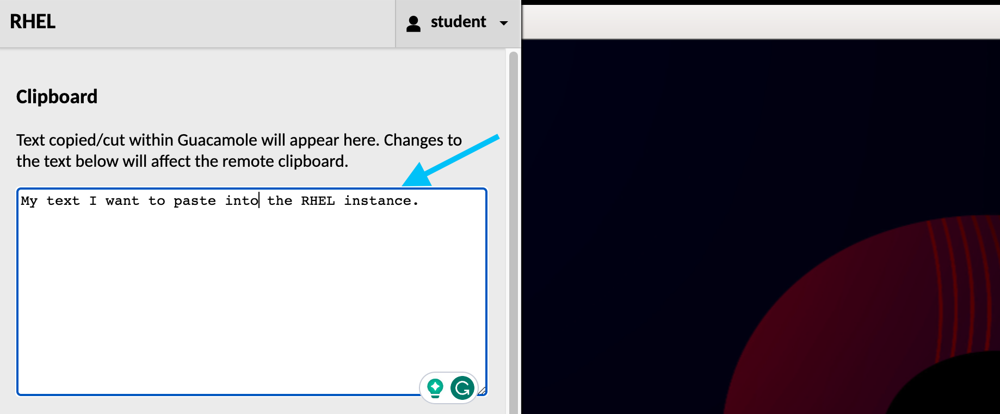

🔐 Login credentials
===
All the logins use the same credentials.

>**Username**:
> ```yaml
>student
>```
>**Password**:
>```yaml
>learn_ansible
>```

❗️ Copy and paste to **RHEL** instance
===

## **RHEL browser tab copy and paste**

Certain browsers, such as Firefox and Safari,  don't allow clipboard related features (copy, paste, etc.) in the **RHEL** VNC browser tab by default.

You can use the **VNC Clipboard utility** to copy and paste to and from your local machine and the lab **RHEL** instance.

>### **❗️ Note**
>The **Chrome** browser supports standard copy and paste features by default.

Follow these steps to open the **VNC Clipboard utility**:
-  On a Windows device with an external keyboard, the press `CTRL+ALT+SHIFT`.
-  On a Mac device with an external keyboard, press `CTRL+COMMAND+SHIFT`.
- The **Clipboard** text area functions as an interface between the remote clipboard and local clipboard.

- You can close the **VNC Clipboard utility** by pressing `CTRL+ALT+SHIFT` for Windows, or  `CTRL+COMMAND+SHIFT` for Mac.

👋 Introduction
===

# 🎯 Your mission - Install and configure Cockpit.

In this challenge, we'll use Ansible Lightspeed to generate an Ansible Playbook that automates the following tasks:

* Install the `cockpit` package.
* Copy a custom configuration file to the target host.
* Start and enable  the `cockpit` service.
* Wait for the service to start.

The examples used in this lab are available in the [Ansible Lightspeed Demo repository](https://github.com/craig-br/lightspeed-demos).

ℹ️ Need help?
===

## **Solution Playbook**

* The `solution_install_cockpit.yml` is a tested Playbook you can use as a guide to complete the challenge.


## **How do I generate Ansible Lightspeed suggestions?**

* Navigate to the end of the Ansible task description line.
* Uncomment the task description line by manually removing the `#`, or press `Ctrl + /`.
* At the end of the Ansible task description, press `ENTER` and once a suggestion is generated, press `TAB` to accept it.

## **Solution videos**

* One or more solution videos available under the `Solution videos` section of the instructions.

## **How do I skip this challenge?**

Click the `Skip` button located at the bottom right-hand side of the screen to move to the next challenge.

<a href="#skip_challenge">
  
</a>

🚀 Ansible Lightspeed challenge highlights
===

Let's cover the task generation steps and Ansible Lightspeed features we'll use. `demo_install_cockpit.yml`.

## Step 1 - Uncomment and generate task **- name: Install cockpit package**

* Ansible Lightspeed uses your natural language prompt to generate syntactically correct Ansible Playbook task.
* Suggestion incorporates Ansible best practices and used [Fully Qualified Collection Name (FQCN)](https://docs.ansible.com/ansible/latest/collections_guide/collections_using_playbooks.html#using-collections-in-a-playbook).

## Step 2 - Uncomment and generate task **- name: Copy cockpit.conf.j2 to /etc/cockpit**

* Ansible Lightspeed uses the `ansible.builtin.template` module based on the `.j2` file extension.
* The suggestion sets the file permissions (`0644`), owner, and group based on Ansible best practices.

## Step 3 - Uncomment and generate task **- name: Start and enable service**

* Ansible Lightspeed uses the generic `Start and enable service` prompt and the full Playbook context to infer you want to start the `cockpit` service.

## Step 4 - Uncomment and generate task **- name: Wait 15 seconds port 9090**

* Ansible Lightspeed uses the specific values ( `15 seconds`, `port 9090`) requested in the prompt.

## Step 5 - Uncomment the module_defaults section at the top of the Playbook


## Step 6 - Clear current task and request updated suggestion for **- name: Start and enable service**

* Ansible Lightspeed uses the full Playbook context and evaluates the `module_defaults` section when generating a suggestion.
* You'll note that the suggestion no longer includes `enabled: true` and `state: started` as it's already declared in the `module_defaults` section.


☑️ Task - Generate Playbook tasks
===

* Open the **RHEL** external browser tab that has your RHEL instance and open Visual Studio Code.
* The `acme_corp` folder is open by default.
* In the VS Code Side Bar, open the `demo_install_cockpit.yml` file.


Follow the instructions in the `demo_install_cockpit.yml` Playbook to generate tasks:
- Uncomment the line by removing the `#` symbol manually or pressing `CTRL+/` for each task description.
- Move your cursor to the end of the task description lines and press `ENTER` to generate a suggestion and `TAB` to accept it.
- Once you've completed the tasks, save the Playbook by navigating to `File` and clicking on `Save` or by pressing `CTRL+S`.
-
☑️ Task - Ansible Lightspeed training matches
===

One of Ansible Lightspeed's key differentiators is providing information on the potential training data used to generate task suggestions.

- Open the **RHEL** external browser tab.
- Navigate to the completed `demo_install_cockpit.yml` Playbook.


>**😅 Known Technical Preview Issue: Visual Studio Code extension requires Window reload**
>* The Ansible Visual Studio Code extension **Training Matches** view requires a once-off reload of the Visual Studio Code Window.
>* Please perform the following steps:
>   - Click on `View` located in the Visual Studio Code menu bar and select `Command Palette...`. Alternatively, press `CTRL+SHIFT+P`.
>  
>   - Type `reload` in the Command Palette prompt and select `Developer: Reload Window`.
>   

- Open the View menu by clicking on `View ==> Open View`.

- Search for **Lightspeed** and select **Lightspeed Training Matches**.

- Choose any task description and regenerate a suggestion.
- Click on any potential training match entry. Your output may differ from the example below.

- Note that the information provided includes details of the License, Ansible content type, and the source URL.

☑️ Task - Run the Playbook
===

You can can choose to run the `demo_install_cockpit.yml` Playbook using `ansible-navigator` or **automation controller**.

# **Using automation controller**

>❗️ **Note**
>
>The lab repository is hosted locally in the lab and no content is pushed to your GitHub account.

### Commit and push Playbook to repository

- In Visual Studio Code, click on the **Source Control** icon.

- Click on the **plus** icon next to the Playbook name.

- Add a commit message. For example:

```yaml
Install Cockpit
```

- Click on the **Commit** button.

- Click on the **Sync Changes** button to push the Playbook to the repo.


### Run the `Deploy monitoring` Job template

- Go to the **Controller** tab and login using the credentials provided above if necessary.
- Click **Templates** under the **Resources** section in the Navigation Pane on the left hand side.
- Click the  icon on the right-hand side of the `Deploy monitoring` Job Template column.

- Note the `Deploy monitoring` Job completed successfully!


# **OR using ansible-navigator**

- Open a terminal in VS Code by clicking on `Terminal` and `New Terminal`.


- In the terminal window, navigate to the `playbooks/infra/install_cockpit/` folder.

```bash
cd playbooks/infra/install_cockpit
```

- Run the ansible-navigator command in the terminal

```bash
ansible-navigator run demo_install_cockpit.yml
```


- Press the `ESC` key to return to the prompt.


☑️ Task - Verify the monitoring and chat applications are accessible.
===

- Open the **Monitoring** tab on the top left-hand of the window.
- If the `demo_install_cockpit.yml` Playbook completed successfully, you should see the user interface in the tab.
>❗️ **Note**
>* If necessary, click on the refresh button to reload the **Monitoring** tab to display the UI.
>
- Log into the **Cockpit**  user interface using the credentials provided above.

👀 Solution videos
===

## **Generating the Playbook**


## **Commit and push to the repository**


## **Run the automtion in controller**


## **Run the automation using `ansible-navigator`**


✏️ We love your feedback!
===

- Please provide your feedback, or report technical preview bugs using the **Ansible Lightspeed Feedback** section located in the VS Code Side Bar.


👏 Complete the lab
===

## 👌 Pat yourself on the back!

You've created an Ansible Playbook using Ansible Lightspeed to deploy Cockpit!

Press the `Check` button to see if you've successfully completed the lab.

✅ Additional resources
===

[More information](https://www.redhat.com/en/engage/project-wisdom) on Ansible Lightspeed Technical Preview.

Explore resources to get you started:

* [Self-paced exercises](https://www.redhat.com/en/engage/redhat-ansible-automation-202108061218) - Explore all our self-paced labs
* [Trial subscription](http://red.ht/try_ansible) - Are you ready to install in your environment? Get your trial subscription for unlimited access to all the components of Ansible Automation Platform.
* Subscribe to the Red Hat Ansible Automation Platform YouTube channel.

🐛 Encountered an issue?
====

If you have encountered an issue or have noticed something not quite right, please [open an issue](https://github.com/ansible/instruqt/issues/new?labels=lightspeed-101&title=New+Intro+to+Lightspeed+issue:+monitoring&assignees=craig-br).

<style type="text/css" rel="stylesheet">
  .lightbox {
    display: none;
    position: fixed;
    justify-content: center;
    align-items: center;
    z-index: 999;
    top: 0;
    left: 0;
    right: 0;
    bottom: 0;
    padding: 1rem;
    background: rgba(0, 0, 0, 0.8);
    margin-left: auto;
    margin-right: auto;
    margin-top: auto;
    margin-bottom: auto;
  }
  .lightbox:target {
    display: flex;
  }
  .lightbox img {
    max-width: 80%;
    max-height: 80%;
  }
  html {
    font-size: 14px;
  }
  img {
    display: block;
    margin-left: auto;
    margin-right: auto;
  }
  h1 {
    font-size: 18px;
  }
  h2 {
    font-size: 16px;
    font-weight: 600
  }
  h3 {
    font-size: 14px;
    font-weight: 600
  }
  p {
    font-size: 14px;
  }
  p span {
    font-size: 14px;
  }
  ul li span {
    font-size: 14px
  }
</style>
