🔐 Login credentials
===
All the logins use the same credentials.

>**Username**:
> ```yaml
>student
>```
>**Password**:
>```yaml
>learn_ansible
>```


👋 Introduction
===

# 🎯 Your mission: Help ACME Corp deploy the app and monitoring service.

In this challenge, we’ll help ACME Corp deploy the app on one of the `appservers` Inventory group hosts, and a monitoring application on the `Monitoring` Inventory group.
We'll use Ansible Lightspeed to generate the following Playbooks:

### Create *deploy_app.yml* Playbook:

* Deploy the application using the `mattermost_app` variable defined in the Playbook.

### Create *deploy_monitoring.yml* Playbook:

* Install the monitoring application
* Change the settings for the monitoring application

>**👀 Remember to follow the instructions in the Playbook too!**
>
>* The Playbooks also contain instructions you need to follow as you complete the challenge.

ℹ️ Need help?
===

* You can expand the images by clicking on them for a closer look.
* Working Playbooks are available in the **solution_playbooks** folder in Visual Studio Code. If you are having any issues, use the corresponding solution Playbook as a guide to complete the challenge.

<a href="#solution_playbooks">
  
</a>
<a href="#" class="lightbox" id="#solution_playbooks">
  
</a>

### How do I generate Ansible Lightspeed suggestions?

- Navigate to the end of the Ansible task description line.
* Uncomment the task description line by manually removing the `#`, or press `Ctrl + /`.
- At the end of the Ansible task description, press `ENTER` and once a suggestion is generated, press `TAB` to accept it.

### How do I skip this challenge?

Click the `Skip` button located at the bottom right-hand side of the screen to move to the next challenge.

<a href="#skip_challenge">
  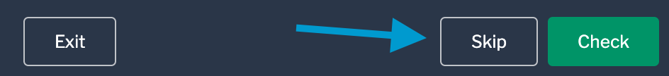
</a>
<a href="#" class="lightbox" id="#solution_playbooks">
  

☑️ Task - Exploring `deploy_app.yml` Playbook
===

ACME Corp defined the `mattermost_app` variable in the `vars:` section.

* Navigate to Visual Studio Code in your RHEL instance in the `srv01`  tab.
* Click on the `deploy_app.yml` Playbook.

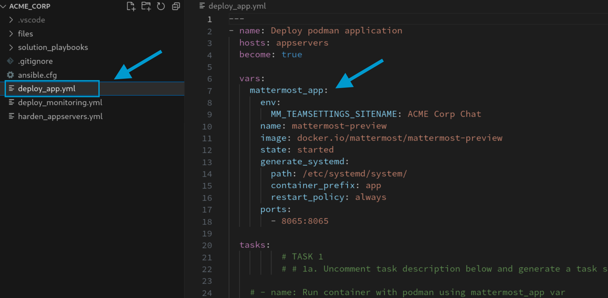


☑️ Task - Generate `deploy_app.yml` Playbook tasks
===

### ℹ️ *Run container with podman using mattermost_app var* task.

* Ansible Lightspeed will use the `mattermost_app` variable in the suggestion. Ansible Lightspeed uses Playbook context to generate applicable Playbook tasks.

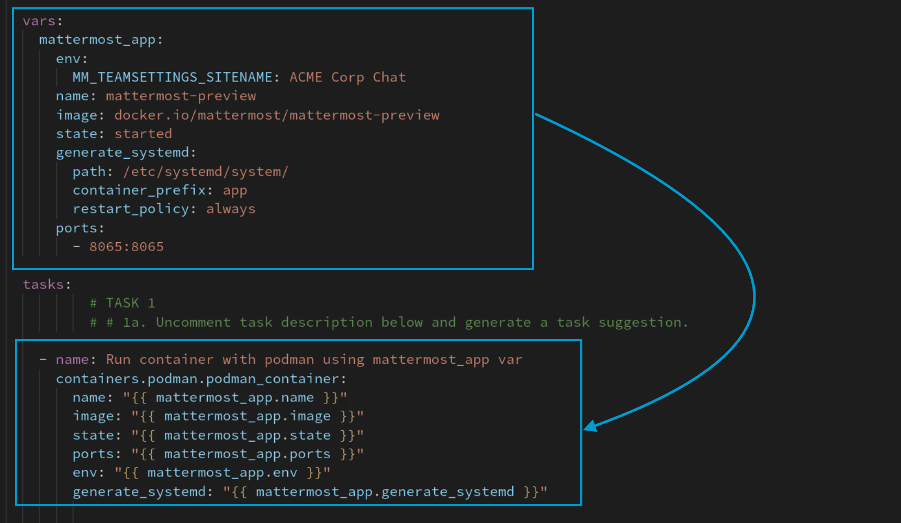

* Follow the instructions in the `deploy_app.yml` Playbook to generate tasks.
* Fix any issues highlighted by **Ansible Lint**.
* Save the Playbook by clicking on `File` and then `Save`, or by pressing `CTRL+S`.

☑️ Task - Ansible Lightspeed training matches
===

One of Ansible Lightspeed's key differentiators is providing information on the potential training data used to generate task suggestions.

>**😅 Known Closed Beta Issue: Visual Studio Code extension requires Window reload**
>* The Ansible Visual Studio Code extension `Training Matches` view requires a once-off reload of the Visual Studio Code Window.
>* Please perform the following steps:
>   * Click on `View` located in the Visual Studio Code menu bar and select `Command Palette...`. Alternatively, press `CTRL+SHIFT+P`.
>  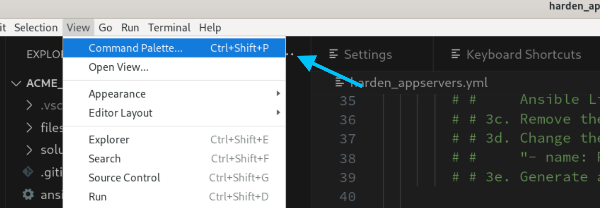
>   * Type `reload` in the Command Palette prompt and select `Developer: Reload Window`.
>   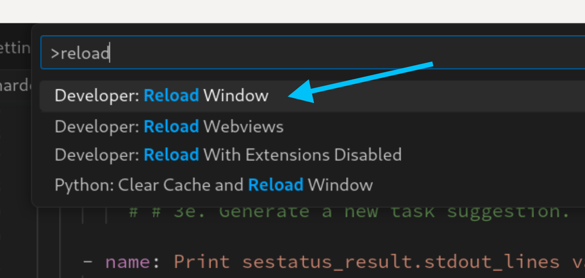

- Click on `View` in the Visual Studio Code menu bar and then on `Open View...`.

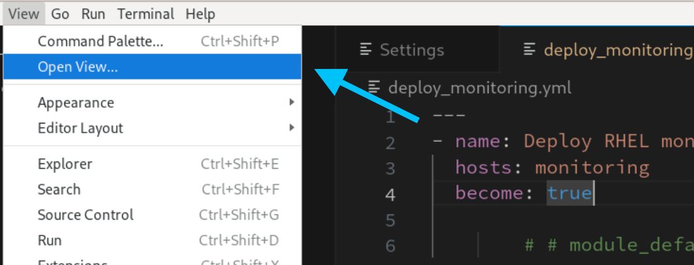

- Scroll down and click on `Lightspeed Training Matches`.

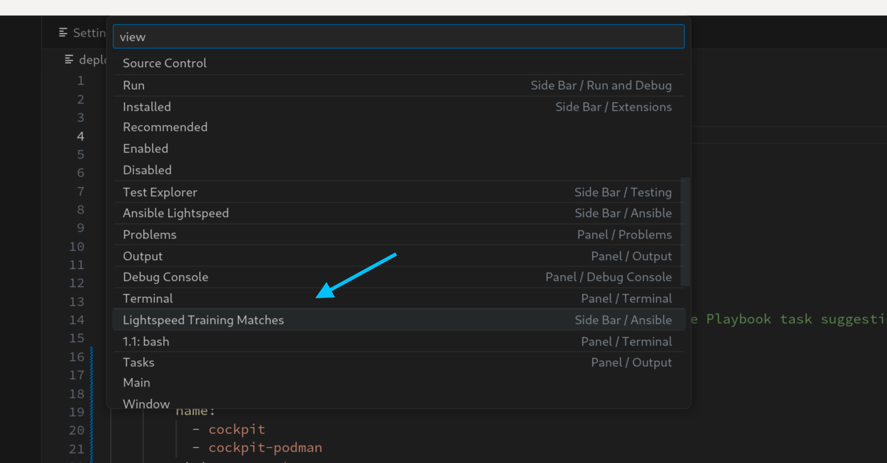

- After generating a suggestion,  click on any potential training match entry.

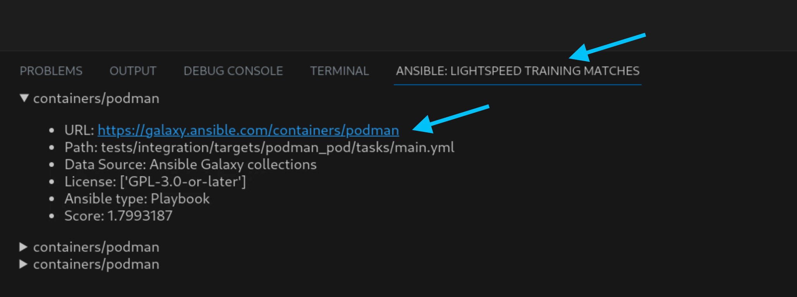

- Note that the information provided includes details of the License, Ansible content type, and the source URL.


☑️ Task - Generate deploy_monitoring.yml Playbook tasks
===

We'll configure `module_defaults` in the Playbook and see how it affects Ansible Lightspeed suggestions.

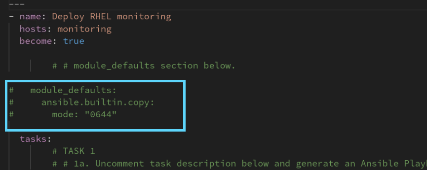


### ℹ️ *Copy ./files/cockpit.conf to /etc/cockpit/* task.

* When you generate a task suggestion for Task 2 with `module_defaults:` commented out, you'll note that Ansible Lightspeed includes a `mode:` argument for the `ansible.builtin.copy` module.

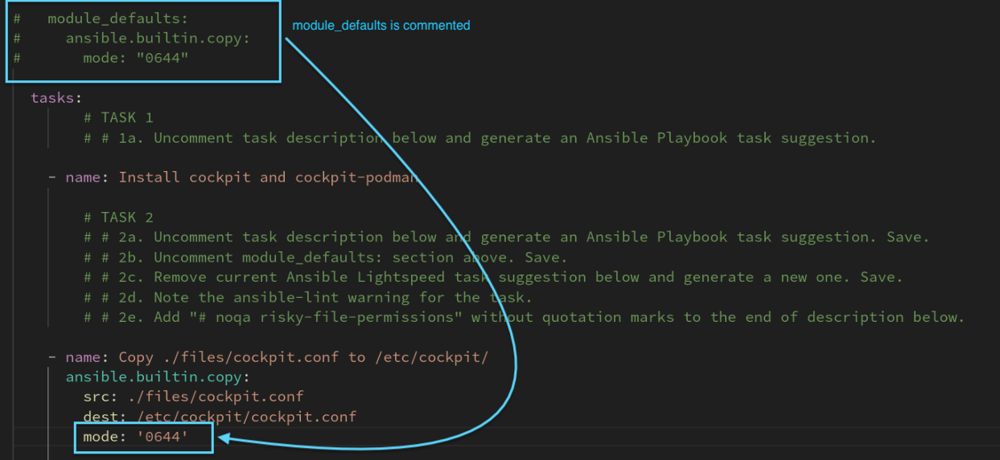

* When you generate the same task suggestion after `module_defaults:` is uncommented, Ansible Lightspeed is aware of the permissions to use and will not provide those in the suggestion.

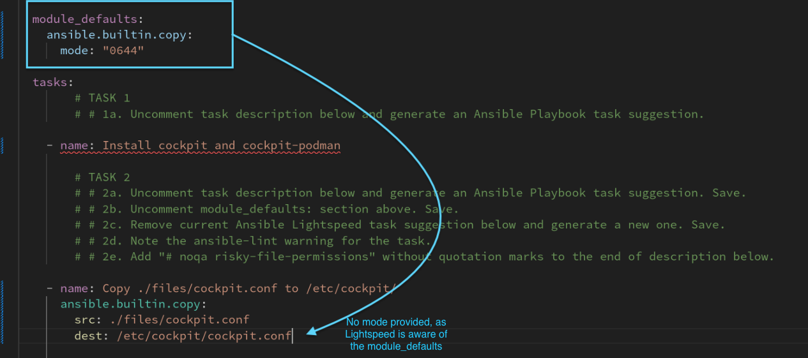

* In Visual Studio Code, click on the `deploy_monitoring.yml` Playbook.

Follow the instructions in the `deploy_monitoring.yml` Playbook to generate tasks:
- Uncomment the line by removing the `#` symbol manually or pressing `CTRL+/`.
- Move your cursor to the end of the task description lines and press `ENTER` to generate a suggestion.

Complete all other tasks in the Playbook.
- Remember to add `# noqa risky-file-permissions` to the end of the second task to fix the issues highlighted by **Ansible Lint**.
- Save the Playbook by clicking on `File` and then `Save`, or by pressing `CTRL+S`.

☑️ Task - Commit and push both Playbooks to the repository
===

* Click the `Source Control` icon in the Visual Studio Code Activity bar on the left-hand side.
* Click on the + icon next to `deploy_app.yml` and `deploy_monitoring.yml` to stage the changes.

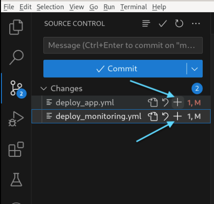

* Add a Commit message in the text box. For example:

```yaml
Deploy app and monitoring service
```

* Click on `Commit`.

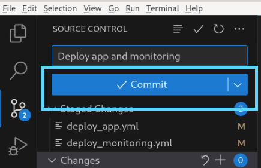

* Click on `Sync Changes`.

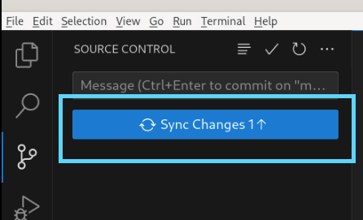

☑️ Task - Run the Job Templates in automation controller
===

* Open the **Controller** tab on the top left hand-side of the lab browser window.
* If required, log into automation controller using the credentials provided above.

### Run the *Deploy ACME Corp app* Job Template:

* Click **Templates** under the **Resources** section in the Navigation Pane on the left hand-side.
* Click the  icon on the right-hand side of the `Deploy ACME Corp app` Job Template column.

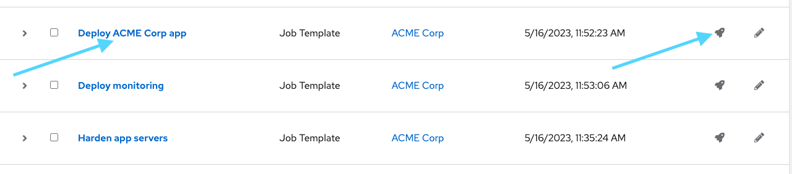

* Note the `Deploy ACME Corp app` Job completed successfully!

### Run the *Deploy monitoring* Job Template:

- Click **Templates** under the **Resources** section in the Navigation Pane on the left hand-side again.
- Click the  icon on the right hand-side of the `Deploy monitoring` Job Template column.


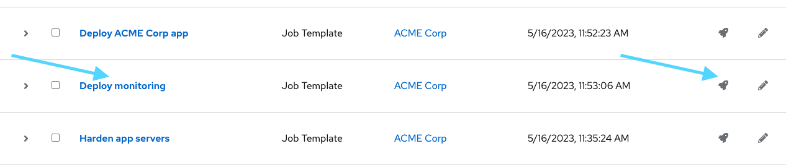

* Note the `Deploy monitoring` Job completed successfully! (This may take a minute to complete.)
* View the **App** and **Monitoring** tabs in the lab, let's see if the application and monitoring service is accessible.

<a href="#firewall_config_monitor_broken">
  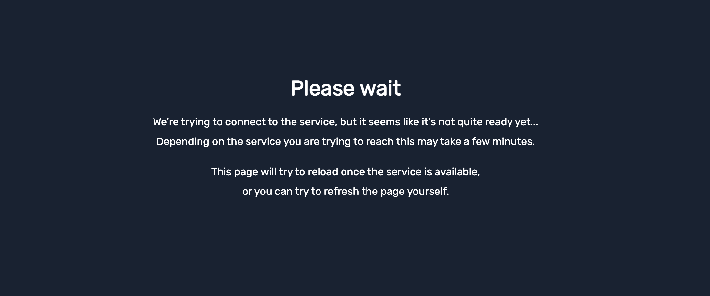
</a>

<a href="#" class="lightbox" id="#firewall_config_monitor_broken">
  
</a>

😱 Oh No!! Something went wrong!
===
* The application and monitoring service aren't working. **This is expected behavior in the lab**.
* Let's try to fix it in the the next challenge.

✅ Next Challenge
===

Press the `Check` button below to go to the next challenge once you’ve completed the tasks.

✏️ We love your feedback!
===

* Please take the [Ansible Lightspeed Beta sentiment survey](https://red.ht/ansible-ai-feedback).
* Reach out to us at <ansible-content-ai@redhat.com>.

You can also use the *Take Survey* or *Contact Us* buttons by clicking on Lightspeed at the bottom right of the Visual Studio Code window at any time.

<a href="#vscode_survey">
  
</a>

<a href="#" class="lightbox" id="#vscode_survey">
  
</a>

✅ Additional resources
===

[More information](https://www.redhat.com/en/engage/project-wisdom) on Ansible Lightspeed Tech Preview.

Explore free resources to get you started:

* [Self-paced exercises](https://www.redhat.com/en/engage/redhat-ansible-automation-202108061218) - Explore all our self-paced labs
* [Trial subscription](http://red.ht/try_ansible) - Are you ready to install in your environment? Get your trial subscription for unlimited access to all the components of Ansible Automation Platform.
* Subscribe to the Red Hat Ansible Automation Platform YouTube channel.

🐛 Encountered an issue?
====

If you have encountered an issue or have noticed something not quite right, please [open an issue](https://github.com/ansible/instruqt/issues/new?labels=getting-started-mesh&title=Getting+started+with+Ansible+Lightspeed+-+issue&assignees=craig-br).

<style type="text/css" rel="stylesheet">
  .lightbox {
    display: none;
    position: fixed;
    justify-content: center;
    align-items: center;
    z-index: 999;
    top: 0;
    left: 0;
    right: 0;
    bottom: 0;
    padding: 1rem;
    background: rgba(0, 0, 0, 0.8);
    margin-left: auto;
    margin-right: auto;
    margin-top: auto;
    margin-bottom: auto;
  }
  .lightbox:target {
    display: flex;
  }
  .lightbox img {
    max-width: 60%;
    max-height: 60%;
  }
  html {
    font-size: 14px;
  }
  img {
    display: block;
    margin-left: auto;
    margin-right: auto;
  }
  h1 {
    font-size: 18px;
  }
  h2 {
    font-size: 16px;
    font-weight: 600
  }
  h3 {
    font-size: 14px;
    font-weight: 600
  }
  p {
    font-size: 14px;
  }
  p span {
    font-size: 14px;
  }
  ul li span {
    font-size: 14px
  }
</style>
