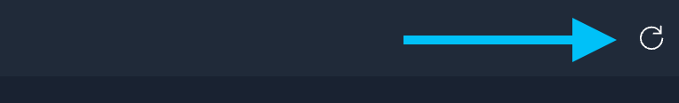

🔐 Login credentials
===
All the logins use the same credentials.

>**Username**:
> ```yaml
>student
>```
>**Password**:
>```yaml
>learn_ansible
>```

👋 Introduction
===

# 🎯 Your mission: Help ACME Corp configure the firewall

In this challenge, we’ll help ACME Corp configure the firewall to permit **Cockpit** and **Mattermost** traffic using the **Red Hat Enterprise Linux System Roles Ansible Collection**.

We'll use Ansible Lightspeed to generate Playbook tasks to do the following:

* Include the `redhat.rhel_system_roles.firewall` role.
* Reload the Podman application network.

>**👀 Remember to follow the instructions in the Playbook too!**
>
>* The Playbooks also contain instructions you need to follow as you complete the challenge.

>**ℹ️ Info**
>
> [Ansible Certified Content Collections](https://www.ansible.com/products/content-collections) provide fully supported automation content developed and tested with our partner ecosystem.
> Certified Content Collections are provided as part of the [Ansible Automation Platform subscription](https://access.redhat.com/articles/6057451).

ℹ️ Need help?
===

* You can expand the images by clicking on them for a closer look.
* Working Playbooks are available in the **solution_playbooks** folder in Visual Studio Code. If you are having any issues, use the corresponding solution Playbook as a guide to complete the challenge.

<a href="#solution_playbooks">
  
</a>
<a href="#" class="lightbox" id="#solution_playbooks">
  
</a>

### How do I generate Ansible Lightspeed suggestions?

- Navigate to the end of the Ansible task description line.
* Uncomment the task description line by manually removing the `#`, or press `Ctrl + /`.
- At the end of the Ansible task description, press `ENTER` and once a suggestion is generated, press `TAB` to accept it.

### How do I skip this challenge?

Click the `Skip` button located at the bottom right-hand side of the screen to move to the next challenge.

<a href="#skip_challenge">
  
</a>
<a href="#" class="lightbox" id="#solution_playbooks">
  

☑️ Task - Confirm the sites are inaccessible
===

* Open the **Monitoring** and **App** tabs on the top of the screen.
* Note that both are not accessible.

<a href="#firewall_config_monitor_broken">
  
</a>

<a href="#" class="lightbox" id="#firewall_config_monitor_broken">
  
</a>

☑️ Task - Generate `configure_firewall.yml` Playbook tasks.
===

In this task , ACME Corp defined the **firewall** variable in the **vars:** section.
	We'll use the Red Hat Enterprise Linux System Roles Ansible Collection and the **firewall** variable to rectify the inaccessible apps.

<a href="#config_firewall_vars">
  
</a>

<a href="#" class="lightbox" id="#config_firewall_vars">
  
</a>

### ℹ️ *Include redhat.rhel_system_roles.firewall* task.

* You'll note that Ansible Lightspeed realizes the `redhat.rhel_system_roles.firewall` should only target Red Hat Enterprise Linux systems.
* The task suggestion will include  `when: ansible_os_family == "RedHat"` to ensure the Role executes as intended.

<a href="#config_firewall_role">
  
</a>

<a href="#" class="lightbox" id="#config_firewall_role">
  
</a>

### ℹ️ *Run podman network reload mattermost-preview command* task.

* This task suggestion will include `changed_when: false`. Reloading the podman network, however, does make changes. Let’s fix it!

<a href="#config_firewall_network">
  
</a>

<a href="#" class="lightbox" id="#config_firewall_network">
  
</a>

<a href="#config_firewall_changed_true">
  
</a>

<a href="#" class="lightbox" id="#config_firewall_changed_true">
  
</a>

* Open the **srv01** browser tab and open Visual Studio Code if necessary.
* Click on the `configure_firewall.yml` Playbook to open it.

<a href="#config_firewall_open">
  
</a>

<a href="#" class="lightbox" id="#config_firewall_open">
  
</a>

Follow the instructions in the `configure_firewall.yml` Playbook to generate tasks:
* Uncomment the line by removing the `#` symbol manually or pressing `CTRL+/` for each task description.
* Move your cursor to the end of the task description lines and press `ENTER` to generate a suggestion and `TAB` to accept it.
* Fix any issues highlighted by **Ansible Lint**.
* Save the Playbook by clicking on `File` and then `Save`, or by pressing `CTRL+S`.

☑️ Task - Commit and push `config_firewall.yml` Playbook to the repository.
===

* Click the `Source Control` icon in the Visual Studio Code Activity bar on the left-hand side.
* Click on the + icon next to `config_firewall.yml` to stage the changes.

<a href="#config_firewall_repo_add">
  
</a>

<a href="#" class="lightbox" id="#config_firewall_repo_add">
  
</a>

* Add a Commit message in the text box. For example:

```yaml
Firewall configuration
```

* Click on `Commit`.

<a href="#config_firewall_repo_commit">
  
</a>

<a href="#" class="lightbox" id="#config_firewall_repo_commit">
  
</a>

* Click on `Sync Changes`.

<a href="#repo_all_sync_changes">
  
</a>

<a href="#" class="lightbox" id="#repo_all_sync_changes">
  
</a>

☑️ Task - Run the `Configure firewall` controller Job Template.
===

* Open the **Controller** tab on the top left-hand side of the window.
* If required, log into automation controller using the credentials provided above.
* Click **Templates** under the **Resources** section in the Navigation Pane on the left hand-side.
* Click the  icon on the right-hand side of the `Configure firewall` Job Template column.

<a href="#jt_configure_firewall_run">
  
</a>

<a href="#" class="lightbox" id="#jt_configure_firewall_run">
  
</a>

* Note the `Configure firewall` Job completed successfully!

<a href="#config_firewall_output">
  
</a>

<a href="#" class="lightbox" id="#config_firewall_output">
  
</a>

☑️ Task - Verify the monitoring and chat applications are accessible.
===

>❗️**Refresh the `App` and `Monitoring` tabs**.
>
>* Please click on the App` and `Monitoring` tab refresh buttons after running the `Configure firewall` controller Job Template to verify the automation worked.
>

* Open the **Monitoring** and **App** tab on the top left-hand of the window.
* If the `Configure firewall` Job Template completed successfully, you should see the user interfaces in the tabs.
* Open the **Cockpit** tab and log into the user interface using the credentials provided above.


<a href="#config_firewall_monitoring_ui">
  
</a>

<a href="#" class="lightbox" id="#config_firewall_monitoring_ui">
  
</a>

<a href="#config_firewall_app_working">
  
</a>

<a href="#" class="lightbox" id="#config_firewall_app_working">
  
</a>

### 👌 You did it!

You've created an Ansible Playbook that used the`redhat.rhel_system_roles.firewall` role to configure the firewall using Ansible Lightspeed and ran it in controller!

✏️ We love your feedback!
===

* Please take the [Ansible Lightspeed Beta sentiment survey](https://red.ht/ansible-ai-feedback).
* Reach out to us at <ansible-content-ai@redhat.com>.

You can also use the *Take Survey* or *Contact Us* buttons by clicking on Lightspeed at the bottom right of the Visual Studio Code window at any time.

<a href="#vscode_survey">
  
</a>

<a href="#" class="lightbox" id="#vscode_survey">
  
</a>

✅ Next Challenge
===

Press the `Check` button below to go to the next challenge once you’ve completed the tasks.

✅ Additional resources
===

[More information](https://www.redhat.com/en/engage/project-wisdom) on Ansible Lightspeed Tech Preview.

Explore free resources to get you started:

* [Self-paced exercises](https://www.redhat.com/en/engage/redhat-ansible-automation-202108061218) - Explore all our self-paced labs
* [Trial subscription](http://red.ht/try_ansible) - Are you ready to install in your environment? Get your trial subscription for unlimited access to all the components of Ansible Automation Platform.
* Subscribe to the Red Hat Ansible Automation Platform YouTube channel.

🐛 Encountered an issue?
====

If you have encountered an issue or have noticed something not quite right, please [open an issue](https://github.com/ansible/instruqt/issues/new?labels=getting-started-mesh&title=Getting+started+with+Ansible+Lightspeed+-+issue&assignees=craig-br).

<style type="text/css" rel="stylesheet">
  .lightbox {
    display: none;
    position: fixed;
    justify-content: center;
    align-items: center;
    z-index: 999;
    top: 0;
    left: 0;
    right: 0;
    bottom: 0;
    padding: 1rem;
    background: rgba(0, 0, 0, 0.8);
    margin-left: auto;
    margin-right: auto;
    margin-top: auto;
    margin-bottom: auto;
  }
  .lightbox:target {
    display: flex;
  }
  .lightbox img {
    max-width: 60%;
    max-height: 60%;
  }
  html {
    font-size: 14px;
  }
  img {
    display: block;
    margin-left: auto;
    margin-right: auto;
  }
  h1 {
    font-size: 18px;
  }
  h2 {
    font-size: 16px;
    font-weight: 600
  }
  h3 {
    font-size: 14px;
    font-weight: 600
  }
  p {
    font-size: 14px;
  }
  p span {
    font-size: 14px;
  }
  ul li span {
    font-size: 14px
  }
</style>
