🔐 Login credentials
===
All the logins use the same credentials.

>**Username**:
> ```yaml
>student
>```
>**Password**:
>```yaml
>learn_ansible
>```

👋 Introduction
===

# Final mission: Orchestration!

In this challenge, we’ll help ACME Corp create an [automation controller workflow](https://docs.ansible.com/automation-controller/latest/html/userguide/workflows.html) to streamline delivering the ACME Corp chat application.

>**ℹ️ Info**
>
> [Controller workflows](https://docs.ansible.com/automation-controller/latest/html/userguide/workflows.html) allow you to logically connect disparate Job Templates together to solve more complex automation challenges and orchestrate processes.

ℹ️ Need help?
===

* You can expand the images by clicking on them for a closer look.
* If you need help creating the controller Workflow, you can run the `🚀 Solve - Create workflow`  at any time for help.

☑️ Task - Create *Deploy app workflow*.
===

* The **Controller** tab is open by default.
* On the side navigation under the **Resources** section, click **Templates**.
* Click on `Add` and select `Add workflow template` from the drop-down menu.

<a href="#workflow_add_workflow">
  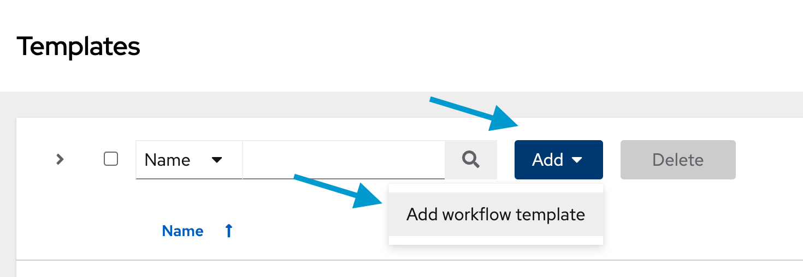
</a>

<a href="#" class="lightbox" id="#workflow_add_workflow">
  
</a>

- In the **name** section, use:

```yaml
Deploy app workflow
```

* In the **Organization** section, click on the 🔍 icon and select the `ACME Corp`organization.
* Click on `Save`. This should open the **Deploy app workflow Visualizer** window.

<a href="#workflow_create">
  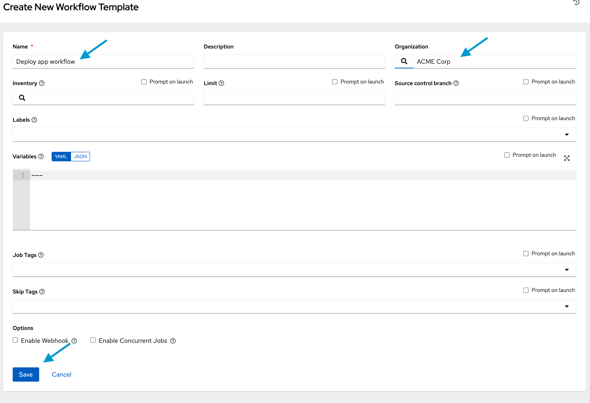
</a>

<a href="#" class="lightbox" id="#workflow_create">
  
</a>

☑️ Task - Create *Deploy app workflow* nodes.
===

>**❗️ Can't find the Visualizer window?**
>
> * If you're not in the **Deploy app workflow Visualizer** window, click on **Templates** under the **Resources** section in the navigation pane.
> * Click the `Visualizer` button on the right-hand side of the **Deploy app workflow** column.
><a href="#workflow_visualizer">
>  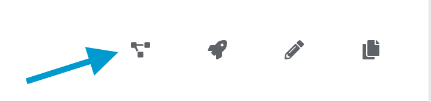
> </a>
><a href="#" class="lightbox" id="#workflow_complete">
>  
></a>

### ***Harden app servers* node**

- Click on `Start`, located in the center of the **Visualizer** screen.

<a href="#workflow_visualizer_start">
  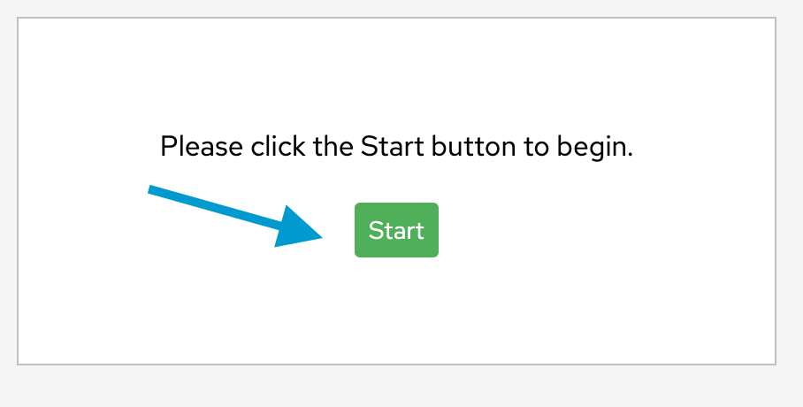
</a>

<a href="#" class="lightbox" id="#workflow_visualizer_start">
  
</a>

- Select `Harden app servers`
- Set the `Node Alias`  to:

	```yaml
	Harden
	```
* Click on `Save`.

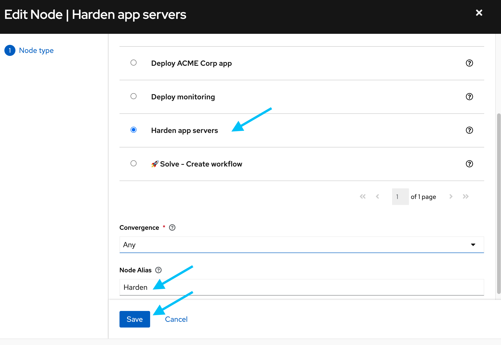

### ***Configure firewall* node**

* Hover your mouse over the **Harden** box and click on the + icon.

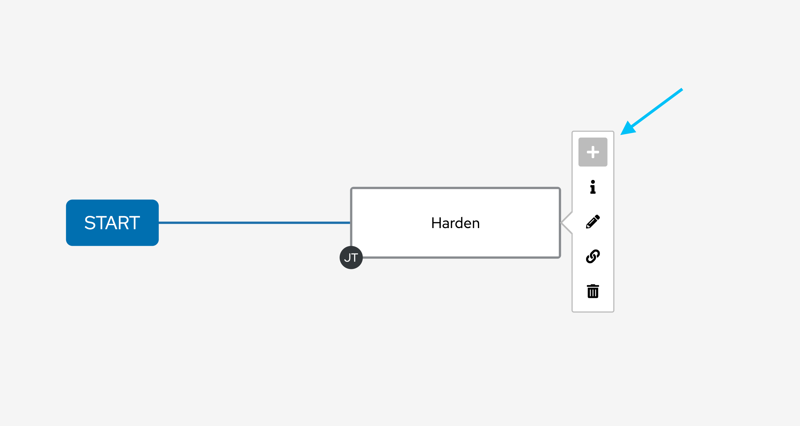

* Keep `On Success` selected at the top and click on `Next`.

<a href="#workflow_firewall_add_success">
  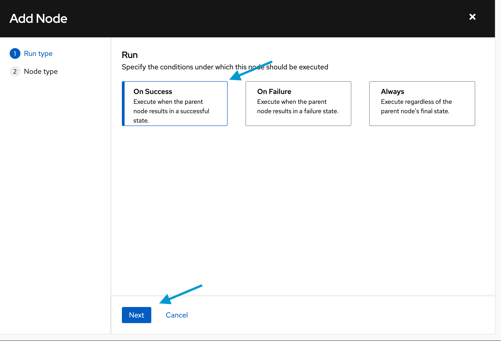
</a>

<a href="#" class="lightbox" id="#workflow_firewall_add_success">
  
</a>

- Select `Configure firewall`.
- Set the `Node Alias`  to:
	```yaml
	Firewall
	```
- Click on `Save`.

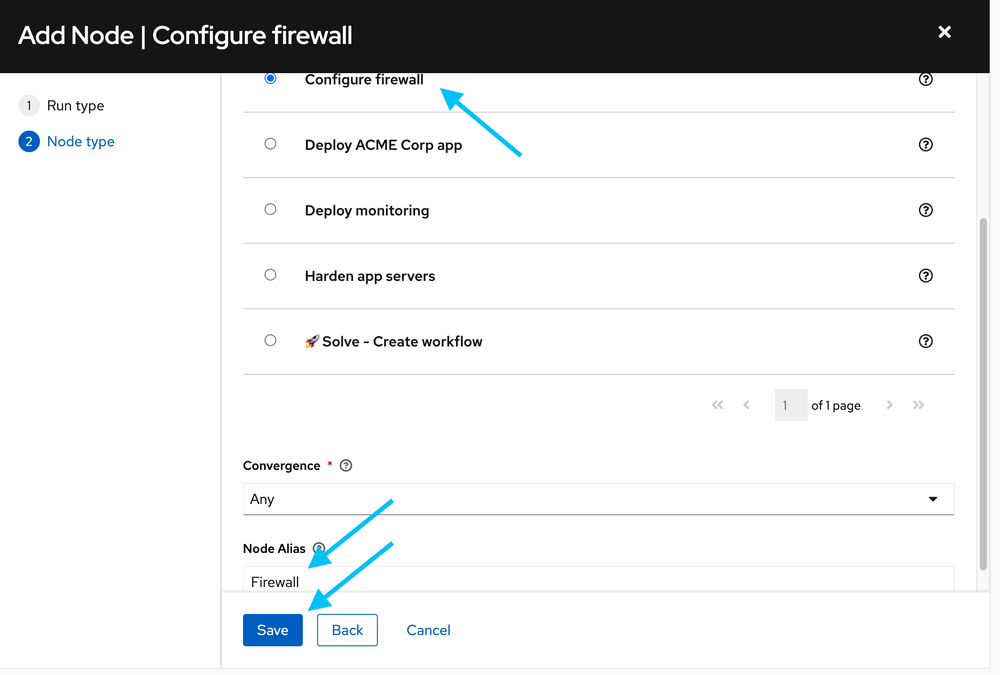

### ***Deploy monitoring* node**

- Hover your mouse over the **Firewall** box and click on the + icon.

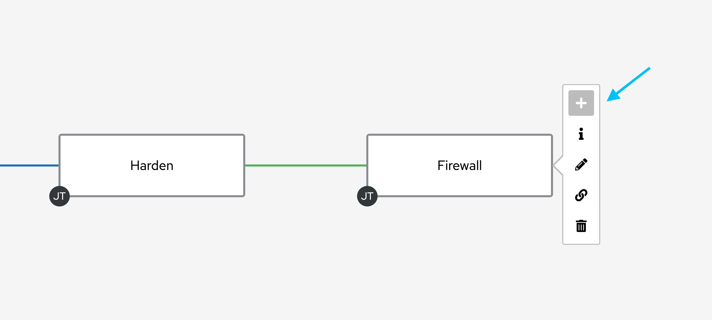

- Keep `On Success` selected at the top and click on `Next`.
- Select `Deploy monitoring`.
- Set the `Node Alias`  to:

	```yaml
	Monitoring
	```
* Click on `Save`.

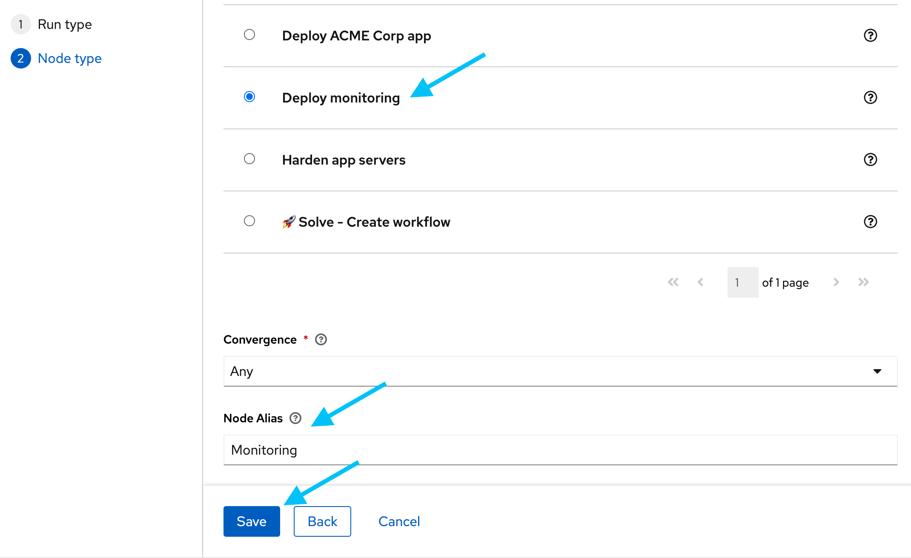

### ***Deploy ACME Corp app* node**

- Again, hover your mouse over the `Firewall` box and click on the + icon.

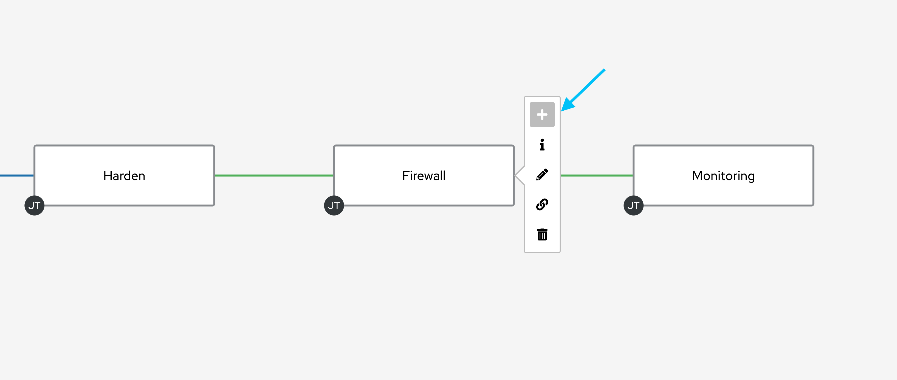

- Keep `On Success` selected at the top and click on `Next`.
- Select `Deploy ACME Corp app`.
- Set the `Node Alias`  to:

	```yaml
	App
	```

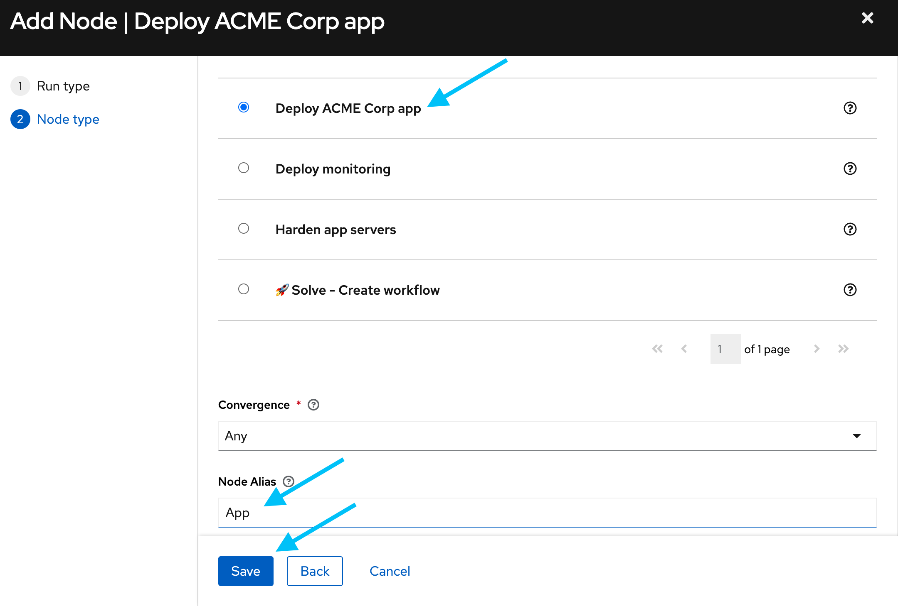

### **Completed *Deploy app workflow*:**

Your completed *Deploy app workflow* should match the image below:


* Once completed, click `Save` at the top right-hand corner to return to the **Templates** window.

<a href="#workflow_save">
  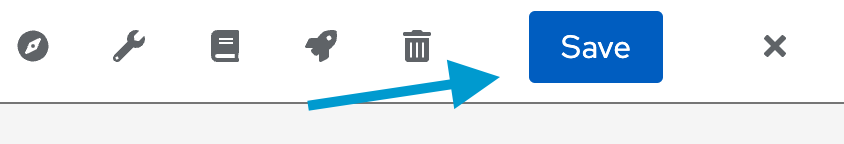
</a>

<a href="#" class="lightbox" id="#workflow_deploy_app_add">
  
</a>


☑️ Task - Run *Deploy app workflow*.
===

- Saving will return you to the `Deploy app workflow` Details window.
- Click on `Launch`

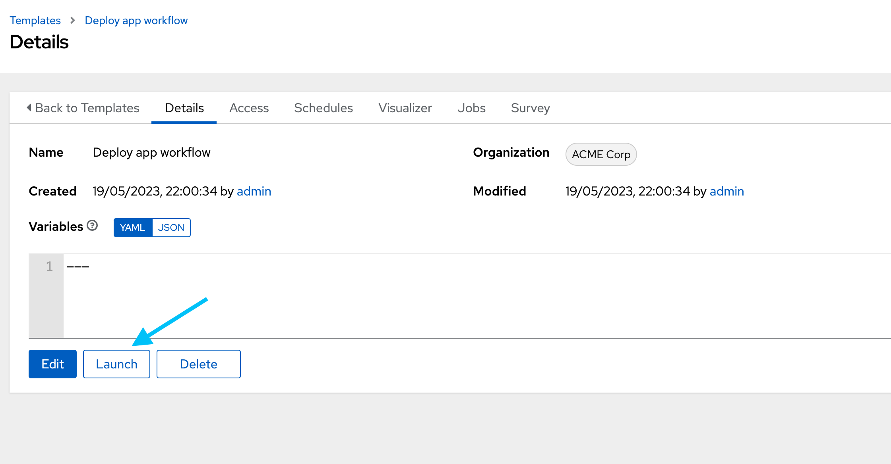

>**ℹ️ Launching `Deploy app workflow` from the *Templates* Window**
>- You can also launch `Deploy app workflow` by clicking on  **Templates** under the **Resources** section in the navigation pane on the left.
>- Click on the  icon on the right-hand side of the **Deploy app workflow**** column.
><a href="#workflow_run">
>  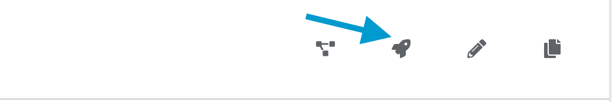
></a>
><a href="#" class="lightbox" id="#workflow_run">
>  
></a>

* **Green is good!** If all tasks complete successfully, you should see the output below.

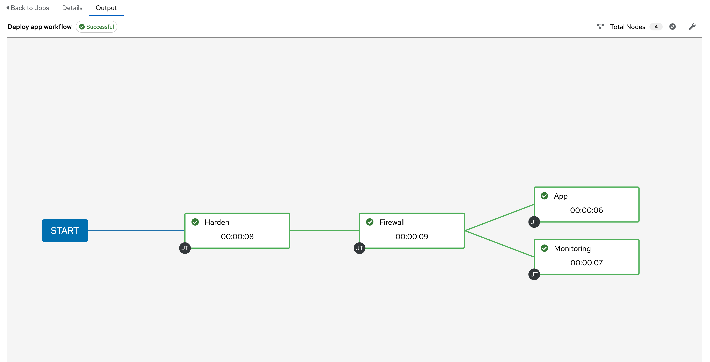

### 🎉 **Congratulations! You've completed the lab. Feel free to explore the Playground

✏️ Feedback
===

**We would love your feedback!**

* Please take the [Ansible Lightspeed Beta sentiment survey](https://red.ht/ansible-ai-feedback).
* Reach out to us at <ansible-content-ai@redhat.com>.

You can also use the *Take Survey* or *Contact Us* buttons by clicking on Lightspeed at the bottom right of the Visual Studio Code window at any time.

<a href="#vscode_survey">
  
</a>

<a href="#" class="lightbox" id="#vscode_survey">
  
</a>

🎉 Next - Playground
===

### 🎉 Congratulations! You've completed the lab. Feel free to explore the Playground by clicking on `Check`.

✅ Additional resources
===

[More information](https://www.redhat.com/en/engage/project-wisdom) on Ansible Lightspeed Tech Preview.

Explore free resources to get you started:

* [Self-paced exercises](https://www.redhat.com/en/engage/redhat-ansible-automation-202108061218) - Explore all our self-paced labs
* [Trial subscription](http://red.ht/try_ansible) - Are you ready to install in your environment? Get your trial subscription for unlimited access to all the components of Ansible Automation Platform.
* Subscribe to the Red Hat Ansible Automation Platform YouTube channel.

🐛 Encountered an issue?
====

If you have encountered an issue or have noticed something not quite right, please [open an issue](https://github.com/ansible/instruqt/issues/new?labels=getting-started-mesh&title=Getting+started+with+Ansible+Lightspeed+-+issue&assignees=craig-br).

<style type="text/css" rel="stylesheet">
  .lightbox {
    display: none;
    position: fixed;
    justify-content: center;
    align-items: center;
    z-index: 999;
    top: 0;
    left: 0;
    right: 0;
    bottom: 0;
    padding: 1rem;
    background: rgba(0, 0, 0, 0.8);
    margin-left: auto;
    margin-right: auto;
    margin-top: auto;
    margin-bottom: auto;
  }
  .lightbox:target {
    display: flex;
  }
  .lightbox img {
    max-width: 60%;
    max-height: 60%;
  }
  html {
    font-size: 14px;
  }
  img {
    display: block;
    margin-left: auto;
    margin-right: auto;
  }
  h1 {
    font-size: 18px;
  }
  h2 {
    font-size: 16px;
    font-weight: 600
  }
  h3 {
    font-size: 14px;
    font-weight: 600
  }
  p {
    font-size: 14px;
  }
  p span {
    font-size: 14px;
  }
  ul li span {
    font-size: 14px
  }
</style>
